## Overview

KAITO is a tool designed to automate AI/ML model inference and tuning workloads within Kubernetes clusters, focusing on popular large models like that can be found on [Hugging Face](https://huggingface.co/) like Falcon, Phi-3, and more. Key features include managing large model files using container images, providing preset configurations for different GPU hardware, and supporting popular open-source inference runtimes such as vLLM and transformers.

KAITO simplifies the deployment of AI inference models by automating the provisioning of GPU nodes based on specific model requirements and hosting large model images in public registries when permissible.

This workshop will guide you through deploying and developing and developing with AI inference workloads on Azure Kubernetes Service (AKS) using [Kubernetes AI Toolchain Operator (KAITO)](https://github.com/kaito-project/kaito). KAITO is an open-source operator for Kubernetes that simplifies the deployment and management of AI/ML workloads on AKS.

## Objectives

After completing this workshop, you will be able to:

- Install the KAITO add-on for AKS
- Deploy a KAITO preset workspace with a custom VM size
- Build inference applications using the KAITO workspace
- Test KAITO's vLLM endpoint using the OpenAI API
- Monitor the performance of the KAITO workspace and GPU nodes using Azure Managed Prometheus and Grafana

## Pre-requisites

Before you begin, make sure you have the following:

- [Azure subscription](https://azure.microsoft.com/pricing/purchase-options/pay-as-you-go) with sufficient quota for GPU nodes
- [Visual Studio Code (VS Code)](https://code.visualstudio.com/) with the following extensions:
  - [AKS](https://marketplace.visualstudio.com/items?itemName=ms-kubernetes-tools.vscode-aks-tools) for managing AKS clusters
  - [Kubernetes](https://marketplace.visualstudio.com/items?itemName=ms-kubernetes-tools.vscode-kubernetes-tools) for managing Kubernetes resources
  - [Python](https://marketplace.visualstudio.com/items?itemName=ms-python.python) for Python development
  - [Python Debugger](https://marketplace.visualstudio.com/items?itemName=ms-python.debugpy) for debugging Python code
  - [REST Client](https://marketplace.visualstudio.com/items?itemName=humao.rest-client) for testing REST APIs
- [Azure CLI](https://learn.microsoft.com/cli/azure/what-is-azure-cli) with the following extensions:
  - [AKS](https://learn.microsoft.com/cli/azure/aks?view=azure-cli-latest) for managing AKS clusters
  - [Grafana](https://learn.microsoft.com/en-us/cli/azure/grafana?view=azure-cli-latest) for managing Azure Managed Grafana
- [kubectl](https://kubernetes.io/docs/tasks/tools/) for interacting with Kubernetes API server via CLI
- [Headlamp](https://headlamp.dev/) for managing Kubernetes resources via GUI
- [uv](https://docs.astral.sh/uv/getting-started/installation/) for managing Python package dependencies and projects
- [jq](https://jqlang.org/) for parsing JSON data
- [Python 3.13 or later](https://www.python.org/downloads/) for Python development
- POSIX-compliant shell (i.e. bash, zsh, etc.) -- all instructions in this workshop are written for bash

> [!knowledge]
> In this lab, all the tooling listed above are included in your lab environment. To keep focus on workshop objectives, we will not cover provisioning some of the Azure services. These have been pre-provisioned for you. You can find the name of the resource group in the **Resources** tab of the lab environment, then log into the Azure portal to view the resources in the resource group.

## Getting started

Start by opening VS Code then open its integrated **Terminal**.

> [!hint]
> In the menu, click **Terminal** then **New Terminal** or press `Ctrl + Shift + `` to open the terminal in VS Code.

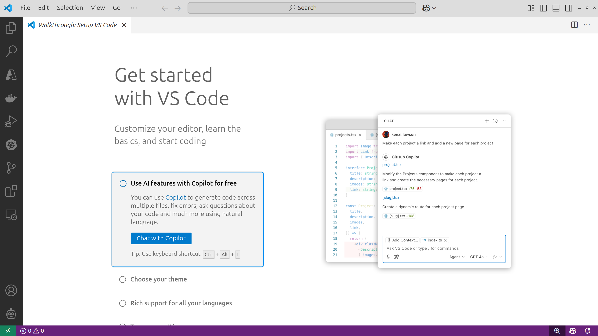

In the terminal, run the following command to log into your Azure account.

```bash
az login
```

You will need to run Azure CLI commands to add/edit resources in your Azure subscription. So you will need to have some environment variables set in your terminal.

Run the following command to export a environment variables needed to complete the tasks in this workshop.

```bash
export RG_NAME=@lab.CloudResourceGroup(ResourceGroup1).Name
export AKS_NAME=$(az aks list -g $RG_NAME --query "[0].name" -o tsv)
export GRAFANA_NAME=$(az grafana list -g $RG_NAME --query "[0].name" -o tsv)
```

> [!important]
> If you open a new terminal window, you will need to run the above command again to set the environment variables.

Next, connect to the AKS cluster using the Azure CLI.

```bash
az aks get-credentials -g $RG_NAME -n $AKS_NAME
```

Close the terminal for now. You will be using the terminal later in the workshop.

### Deployment options

KAITO can be deployed in two ways on AKS:

1. **AKS add-on**: This is the easiest way to deploy KAITO on AKS however you will be limited in terms of getting the latest features and updates as soon as they are available upstream. This feature can be enabled using Azure CLI or the Visual Studio Code (VS Code) extension.
1. **Open source**: This requires more steps to deploy but you will have access to the latest features and updates as soon as they are available. To deploy open-source KAITO on AKS, you can follow this [guide](https://github.com/kaito-project/kaito/tree/main/terraform) to deploy with Terraform or use this [guide](https://github.com/kaito-project/kaito/blob/main/docs/installation.md) to deploy with Azure CLI.

## Install the AKS add-on

In this workshop, you will be using the AKS add-on to deploy KAITO on AKS. This is the easiest way to deploy the add-on is by using the [AKS extension for VS Code](https://marketplace.visualstudio.com/items?itemName=ms-kubernetes-tools.vscode-aks-tools).

> [!knowledge]
> To learn more about the AKS add-on and VS Code extension for KAITO, check out this [video](https://youtu.be/zGQiLeJwLiQ?si=2Qrg45w-7t9pir-D).

### Install with Visual Studio Code

In VS Code, click on the Kubernetes extension icon in the left sidebar.

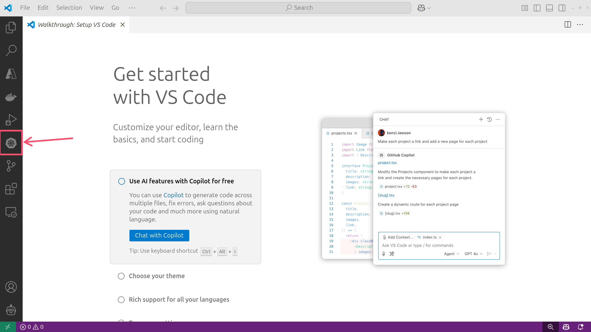

In the **Clouds** section, expand the **Azure** section, then click on **Sign in to Azure**.

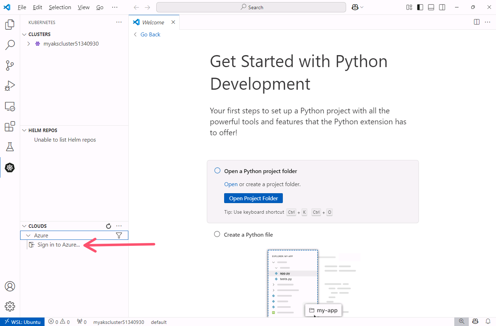

You will see a pop-up windows indicating the **Azure Kubernetes Service extension wants to sign in**. Click the **Allow** button then sign in with your Azure account.

> [!hint]
> After logging in, you may be asked to "Automatically sign in to all desktop apps and websites on this device?" If so, click the **No, this app only** button.
>
> 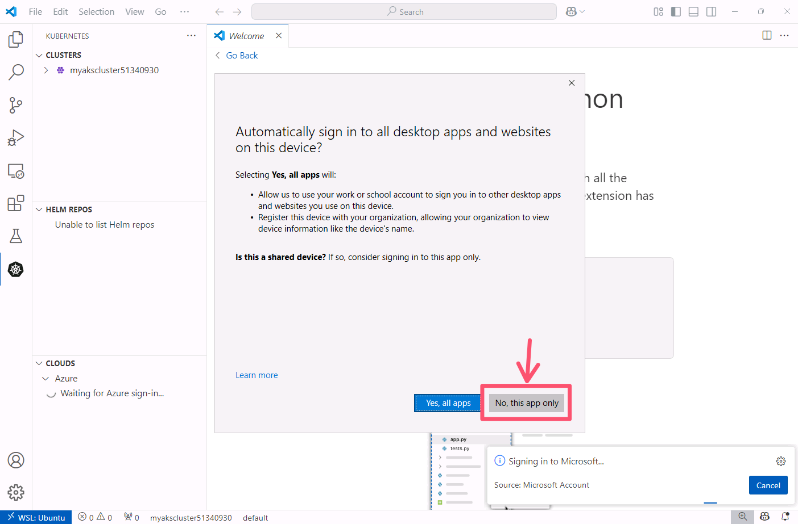
>
> Also, if your Azure account is tied to multiple tenants, you will be prompted to select a tenant. Select the tenant that contains your AKS cluster.

You should see a list of your Azure subscriptions. Expand the subscription that contains your AKS cluster and locate your AKS cluster.

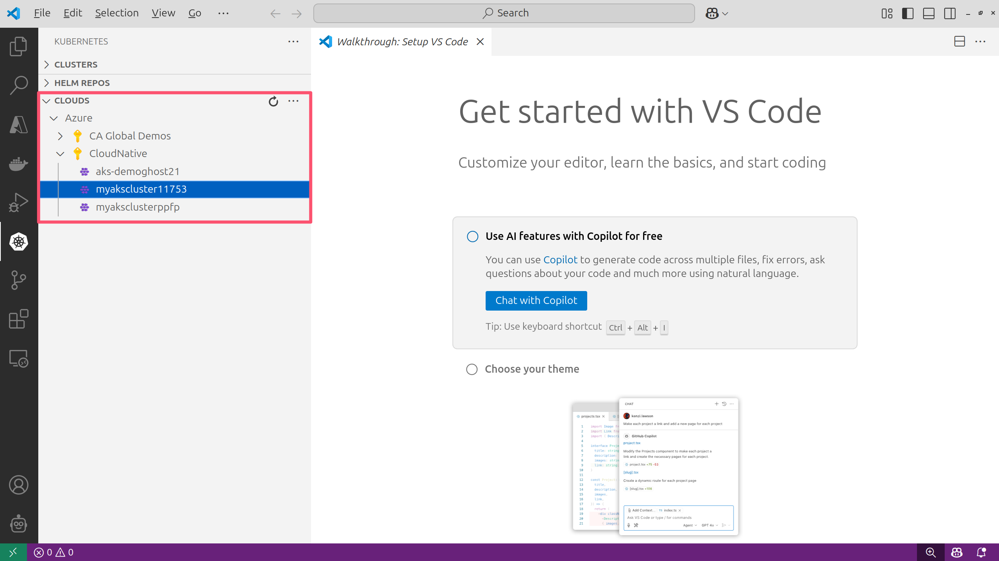

Right-click your AKS cluster, select **Deploy a LLM with KAITO** and click **Install KAITO**.

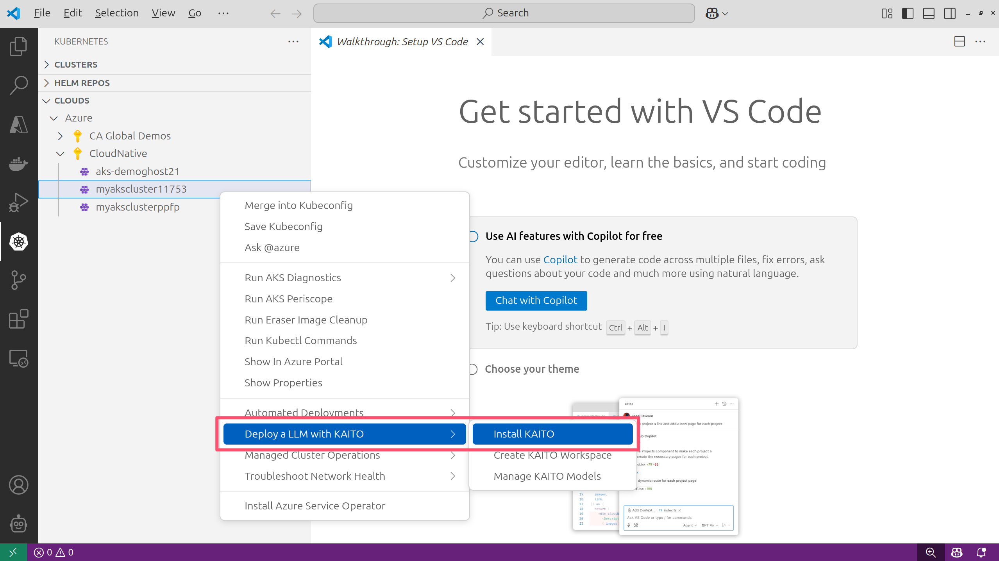

The **Install KAITO** tab will open. Click the **Install KAITO** button at the bottom of the tab.

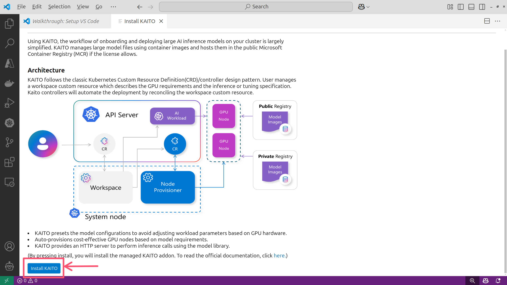

Installing KAITO will take up to 10 minutes to complete. Once the installation is complete, you will see a message at the bottom of the tab indicating that KAITO has been installed successfully.

While you wait for the installation to complete, move on to the next section to learn about the KAITO architecture.

### KAITO Architecture

The architecture of KAITO follows the [Kubernetes operator design pattern](https://kubernetes.io/docs/concepts/extend-kubernetes/operator/), where users manage custom workspace resources to describe GPU needs and specifications. The workspace controller creates machine custom resources to trigger node provisioning and deploys the inference workload. The GPU provisioner controller interacts with the AKS APIs to add new GPU nodes to the AKS cluster.

Once the GPU nodes are provisioned, the KAITO workspace controller deploys the inference workload using the specified model and configuration. The inference workload is exposed via a Kubernetes service, allowing users to access it through a REST API.

By default, KAITO uses the [vLLM inference runtime](https://docs.vllm.ai/en/latest/index.html), which is a high-performance inference engine for large language models. It also supports other runtimes like HuggingFace Transformers, but generally, you'll want to use vLLM for its performance, efficiency, compatibility with the OpenAI API, and support for metrics out-of-the-box.

### Deploy workspace with Headlamp

With the KAITO add-on installed, you can now deploy a Workspace by clicking on the **Generate Workspace** button.

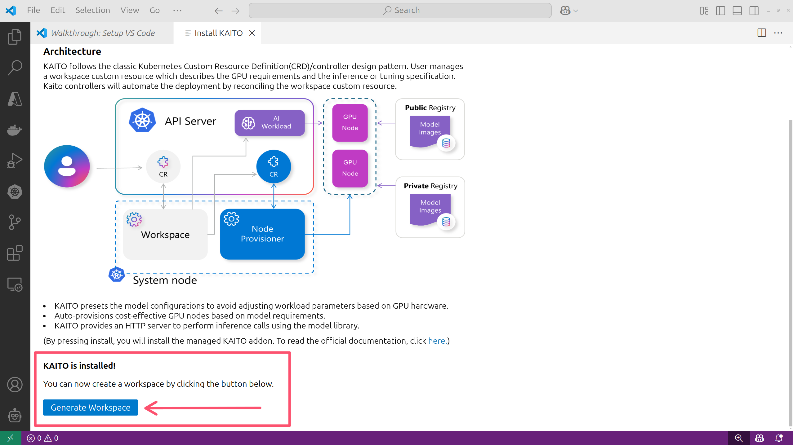

This will open a new tab where you will be presented with a list of available workspace presets. These are the available models that you can deploy with KAITO.

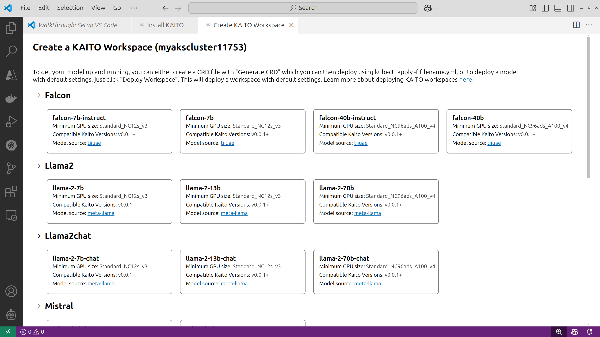

Expand the **Qwen** family of models and select **qwen-2-5-coder-7b-instruct**.

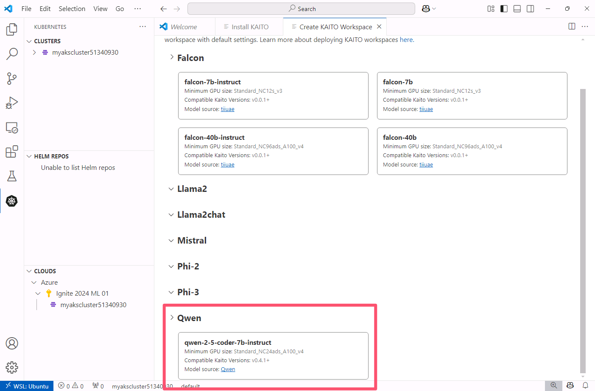

In the panel that opens to the right, you will have the option to deploy the default workspace or a customized workspace.

The default workspace may be configured for a specific VM size that you may not have sufficient quota for. If you have an alternative VM size that you would like to use, you can click on the **Customize workspace CRD** button to modify the YAML manifest and change the VM size. Otherwise, you can click on the **Deploy default workspace CRD** button to deploy the default workspace.

Let's customize this workspace. Click on the **Customize workspace CRD** button.

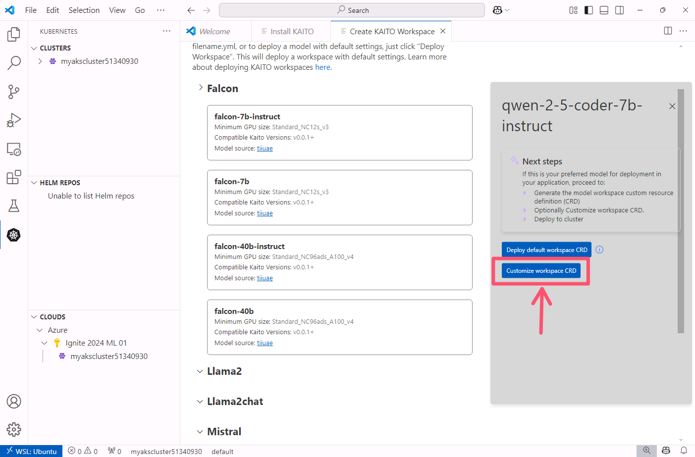

If you click on the **Customize workspace CRD** button, the YAML manifest will be displayed in a new tab. You can modify the YAML manifest to customize the workspace deployment then apply the manifest using the **kubectl apply** command.

A new tab will open with the YAML manifest for the workspace. Here you can add in the alternative VM size that you want to use. Update the **instanceType** to use the **Standard_NC40ads_H100_v5** VM SKU.

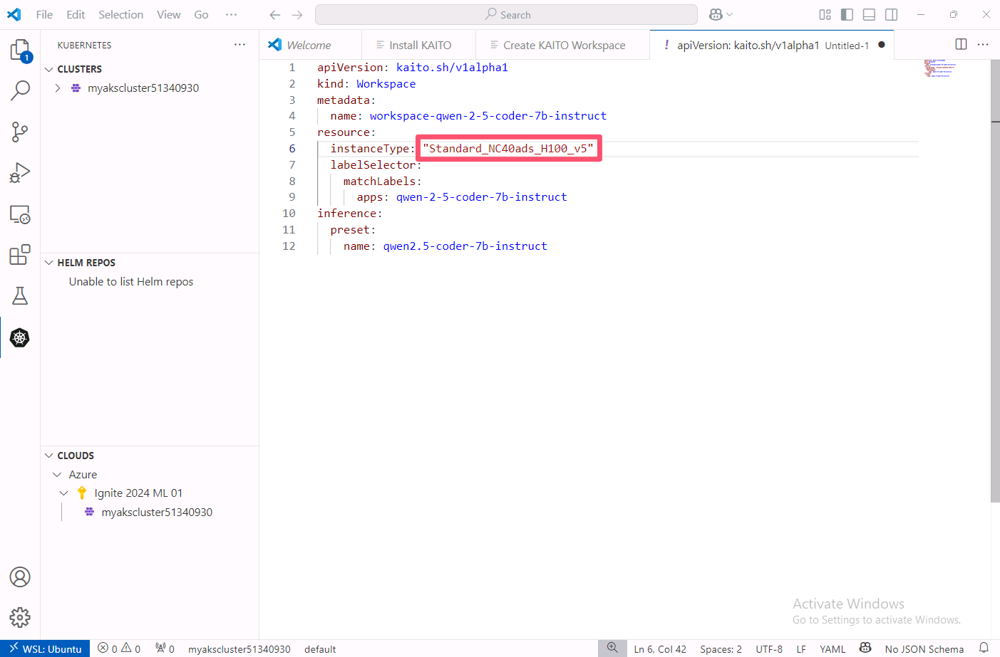

> [!help]
> If you don't have the **Standard_NC40ads_H100_v5** VM SKU available, change it to any VM size that you have quota for.

Typically you would save the YAML manifest to a file and apply it using the **kubectl apply** command in the terminal. However, in this case, let's use [Headlamp](https://headlamp.dev/) to apply the manifest directly on the cluster. Headlamp is a Kubernetes Dashboard application that provides a graphical interface for managing Kubernetes resources. It is developed as an open-source project by Microsoft and has [recently been accepted into the core Kubernetes project](https://github.com/kubernetes-sigs/headlamp) within the [Kubernetes SIG UI](https://github.com/kubernetes/community/blob/master/sig-ui/README.md).

> [!knowledge]
> To learn more about Headlamp, check out this [video](https://learn.microsoft.com/shows/open-at-microsoft/headlamp-your-kubernetes-ui-focused-on-extensibility).

Open the **Headlamp** application then click the **Load cluster** button.

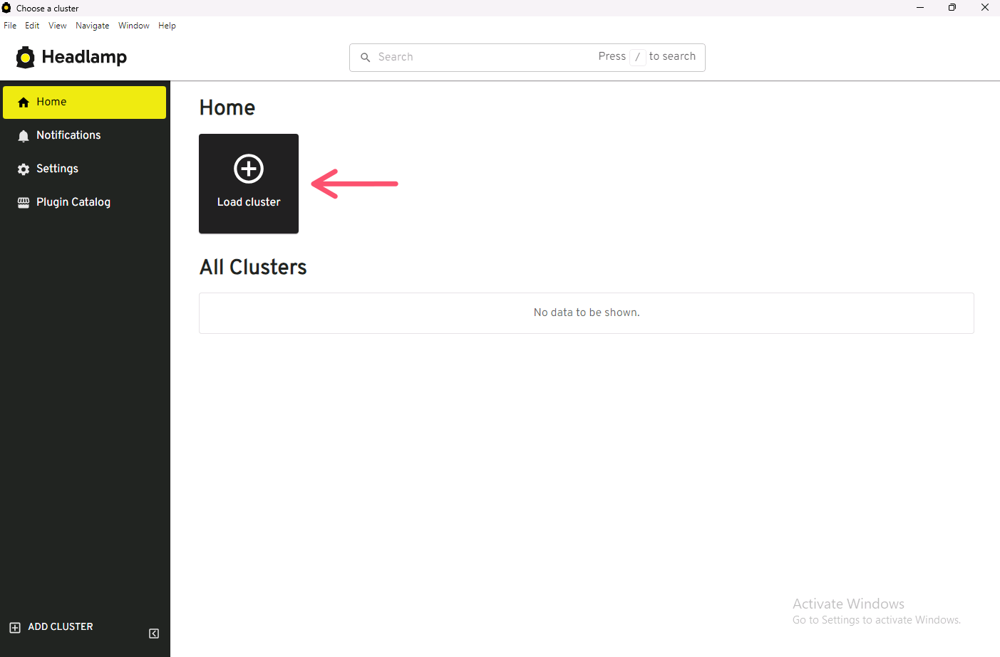

Click the **LOAD FROM KUBECONFIG** button.

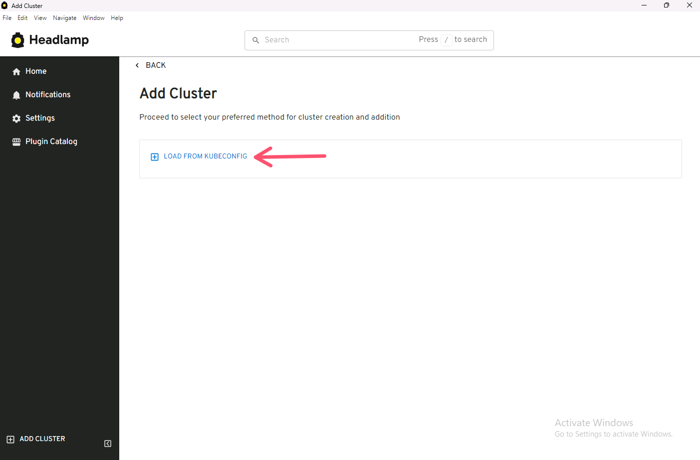

Click the **CHOOSE FILE** button and select your kubeconfig file. This file is located in the **~/.kube/config** directory on your local machine.

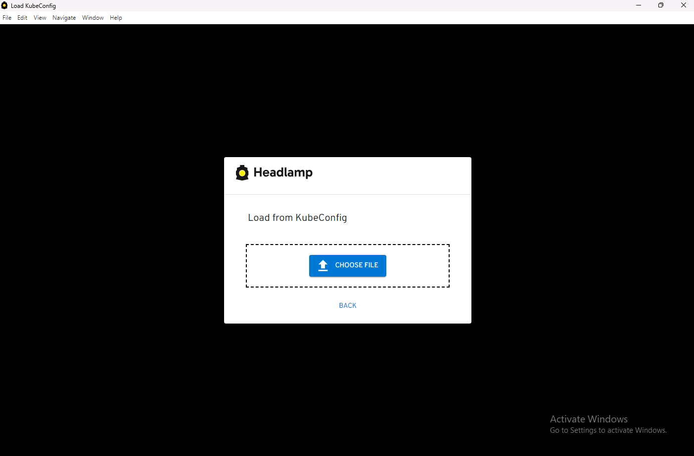

> [!hint]
> If you are using WSL (Ubuntu) with Headlamp installed on Windows, you can find the kubeconfig file in the `\\wsl.localhost\Ubuntu\home\labuser\.kube` directory. Note the **labuser** name should be replaced with your WSL username.

With the kubeconfig file selected, click the **NEXT** button.

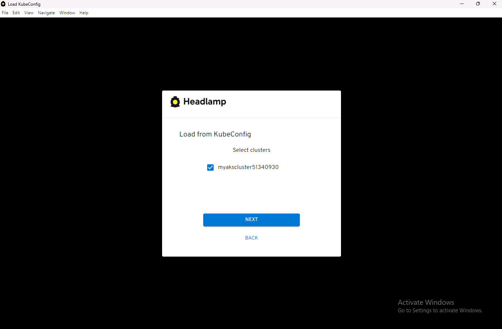

Finally, click the **FINISH** button to complete the cluster loading process.

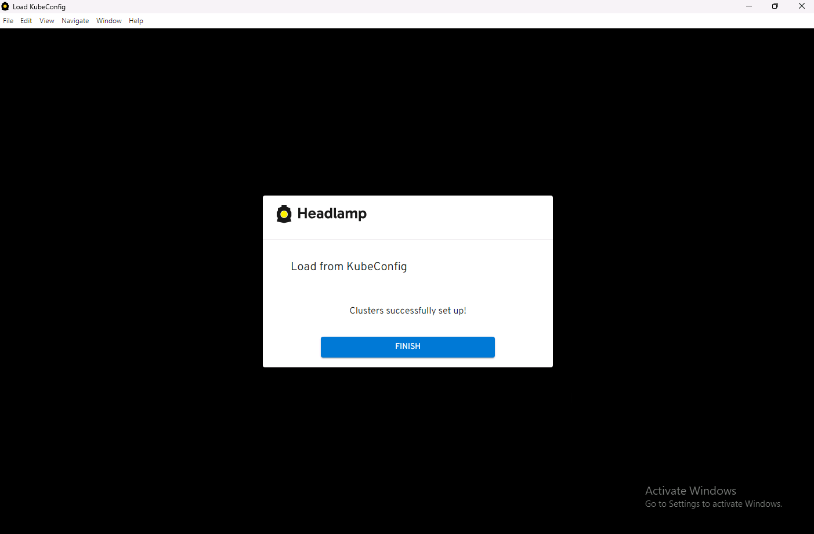

In the Headlamp home page, click on your AKS cluster.

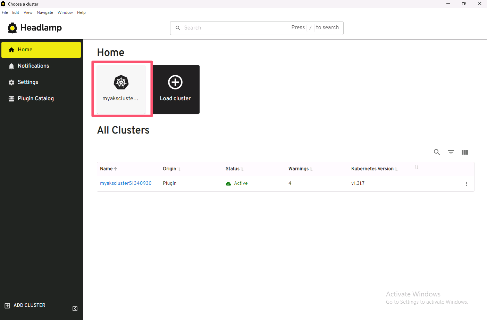

In the cluster overview page, click on the **CREATE** button in the bottom left corner.

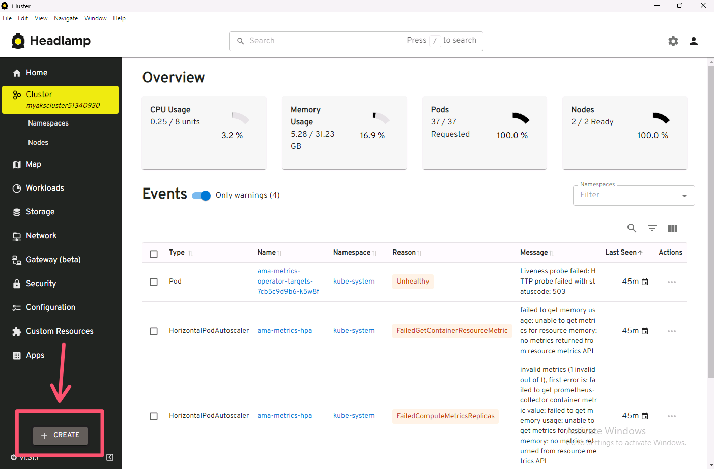

This will open a a blank YAML editor. Copy the workspace YAML manifest from VS Code and paste it into the YAML editor in Headlamp then click **APPLY**.

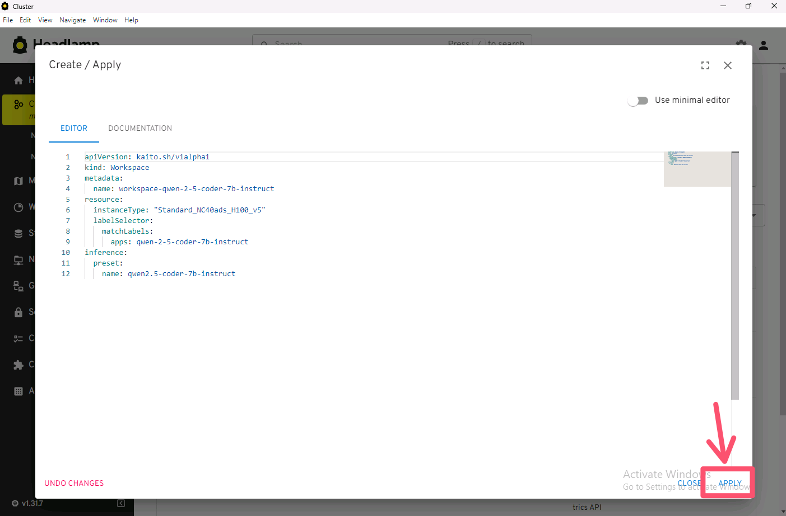

You will see a message in the bottom left indicating that the workspace has been created successfully. Leave the Headlamp application open for now and head back to VS Code.

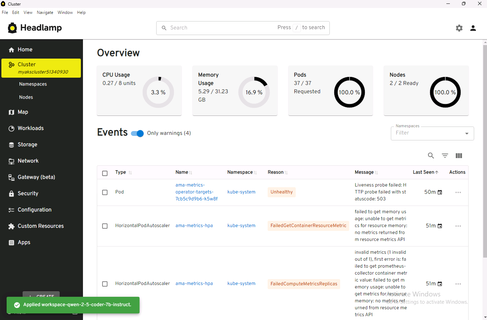

In VS Code, make sure the **Kubernetes** extension is selected in the left sidebar. Right-click on your AKS cluster, select **Deploy a LLM with KAITO** and click **Manage KAITO** Models**. You will see the workspace deployment progress. Keep an eye on the **Resource Ready**, **Inference Ready**, and **Workspace Ready** statuses. The workspace deployment can take up to 15 minutes to complete.

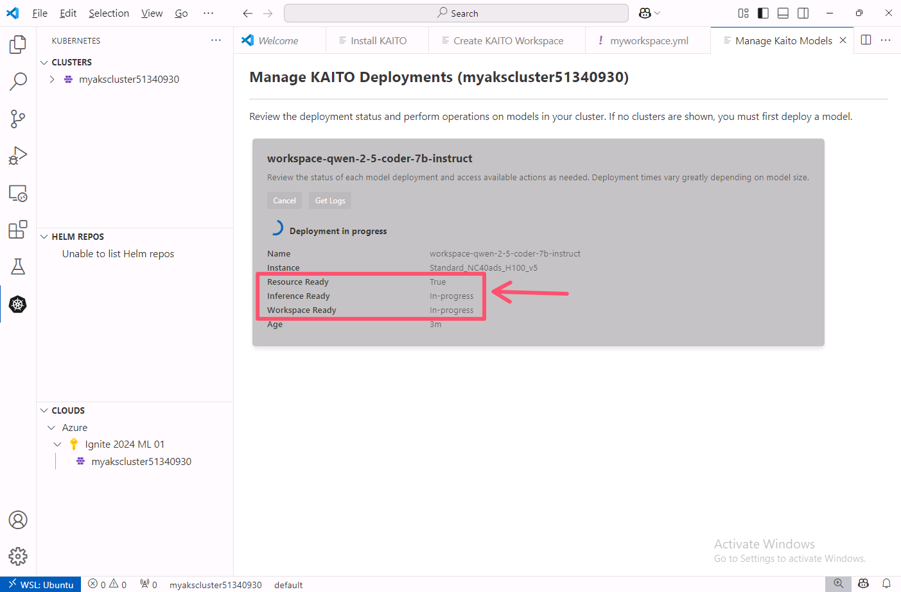

### Test workspace with VS Code

Once the workspace is ready, you will see a **Test** button appear in the workspace panel. This is a panel that allows you to test the inference endpoint, view the workspace logs, and delete the workspace when you are done with it. Click the **Test** button to test the inference endpoint.

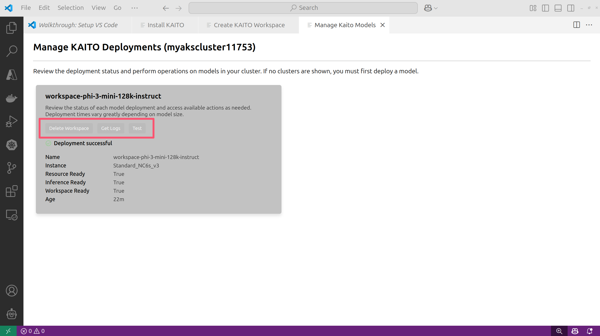

Here you can enter a prompt and configure the following prompt parameters

- **Temperature** for controlling the randomness of the output
- **Top P** for controlling the diversity of the output
- **Top K** for controlling the number of tokens to sample from
- **Repetition Penalty** for controlling the penalty for repeating tokens
- **Max Length** for controlling the maximum length of the output

Adjust the prompt parameters as needed then type a prompt into the textbox, then click the **Submit Prompt** button to send the prompt to model's inference endpoint.

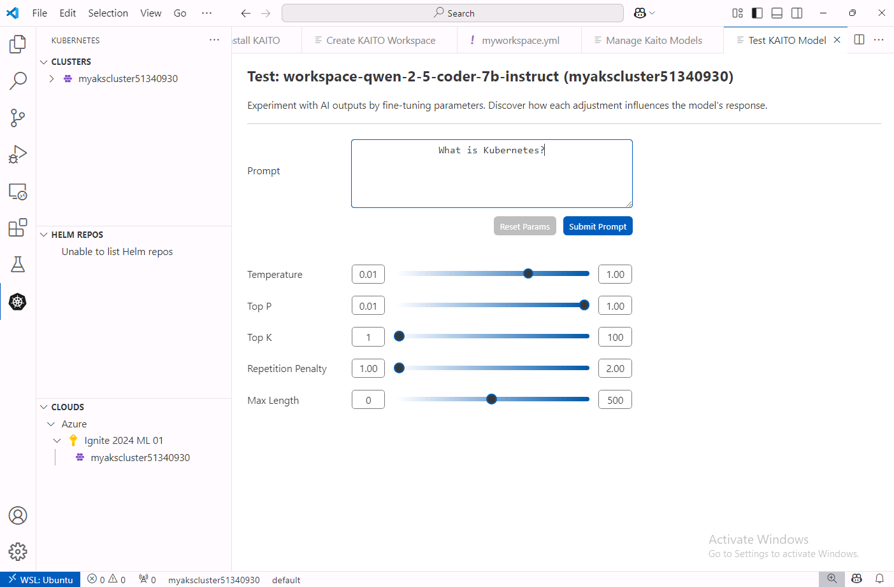

The response will be displayed to the right of the prompt.

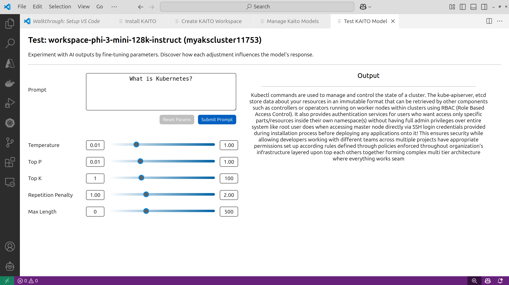

## Developing with KAITO

With a workspace deployed, you can now start developing an AI application by interacting with the KAITO workspace endpoint using raw HTTP requests or using a library that supports the OpenAI API.

Rather than writing code from scratch, let's download a small sample Python app that uses the [Chainlit](https://chainlit.io/) library to create a simple web UI for interacting with the KAITO workspace.

### Download sample code

[Chainlit](https://pypi.org/project/chainlit/) is a Python library that allows you to create interactive web applications for interacting with models. It allows you to quickly build chatbot prototypes and test using a web browser.

Open the VS Code terminal then run the following command to create a new directory for the project.

```bash
mkdir kaitodemo
cd kaitodemo
```

Download the sample code.

```bash
curl -o main.py https://raw.githubusercontent.com/kaito-project/kaito/refs/heads/main/demo/inferenceUI/chainlit_openai.py
```

Run the following command to open the `main.py` file.

```bash
code main.py
```

> [!help]
> Since we downloaded the file from the internet, you may be presented with a warning message indicating that the file is untrusted. The file can be trusted 😉 so click the **Open** button to open the file.
>
>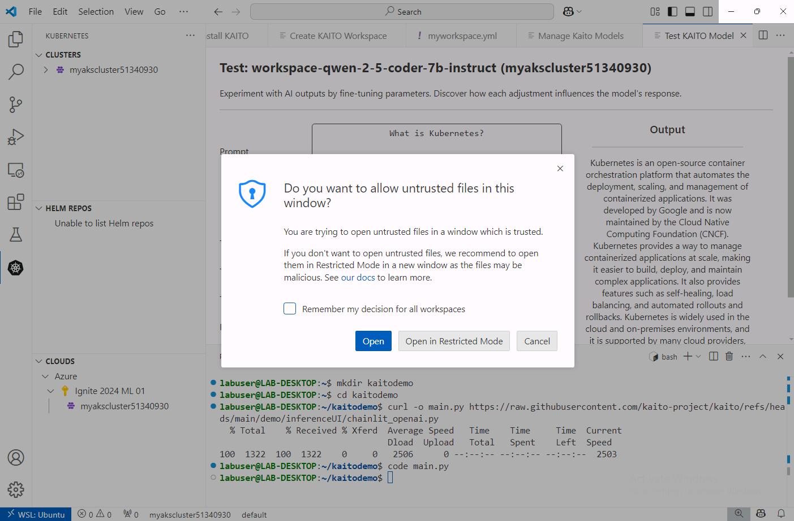

The sample code uses the [OpenAI Python API library](https://pypi.org/project/openai/) to send requests to the model inference endpoint and displays the response in the web UI.

### Port-forward the workspace service

Near the top of the file, you can see it relies on the **WORKSPACE_SERVICE_URL** environment variable to connect KAITO workspace. This value is the URL of the Kubernetes services that exposes the KAITO workspace. The service runs as an internal service via ClusterIP which means it is not accessible from outside the cluster. But you can access it from your local machine via [Kubernetes port forwarding](https://kubernetes.io/docs/tasks/access-application-cluster/port-forward-access-application-cluster/).

Run the following command to port forward the workspace service to your local machine.

```bash
kubectl port-forward service/workspace-qwen-2-5-coder-7b-instruct 8080:80
```

On your keyboard, press **Ctrl + z** to suspend the process, press **bg**, then press **Enter** to resume the process in the background.

Move the process to the background by pressing `Ctrl + z`, then press `bg`, and press `Enter`.

### Configure the environment variable

Remember, the code looks for the **WORKSPACE_SERVICE_URL** environment variable to connect to the KAITO workspace.

To set the `WORKSPACE_SERVICE_URL` as an environment variable, you can set the name and value within a **.env** file.

Run the following command to create a **.env** file and set the **WORKSPACE_SERVICE_URL** to point to the IP and port that was displayed in the Headlamp application.

```bash
echo "WORKSPACE_SERVICE_URL=http://localhost:8080/" > .env
```

### Install dependencies

We can install dependencies and run the code using [**uv**](https://docs.astral.sh/uv/) which is a command line tool for managing Python package dependencies and projects.

Run the following command to initialize a new **uv** project.

```bash
uv init
```

The code requires some dependencies to run. We can install them using **uv**.

```bash
uv add chainlit pydantic==2.11.3 requests openai
```

As mentioned above, the **chainlit** package is used to create the web UI, **pydantic** is used for data validation, **requests** is used to make HTTP requests, and **openai** is used to interact with the KAITO workspace which is serving the model on a vLLM server which supports the OpenAI API.

Run the following command to run the Chainlit app and pass in the **.env** file to set the environment variables.

```bash
uv run --env-file=.env chainlit run main.py
```

This will start a local web server that you can access in your browser at [http://localhost:8000](http://localhost:8000).

Enter a prompt in the text box and click the submit button to send the prompt to the KAITO workspace. The response will be displayed in the web UI.

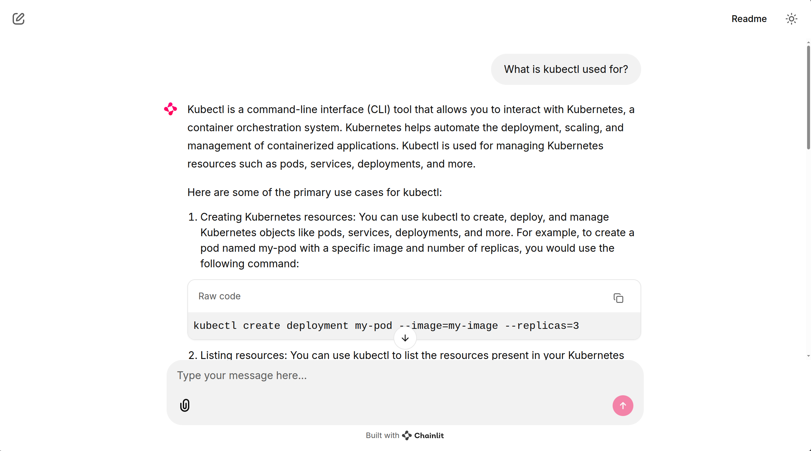

As you can see, developing against the KAITO workspace is relatively simple. Using the OpenAI library to send requests makes it compatible with any existing codebase that uses the OpenAI API.

Press **Ctrl + C** to stop the Chainlit app.

## Monitoring KAITO workspaces

With workspaces being served using the vLLM runtime, you can monitor the performance of the KAITO workspace using the metrics emitted by the vLLM server. The vLLM server emits metrics in the Prometheus format which can be scraped by Prometheus and visualized in Grafana.

To view the metrics that is emitted by the vLLM server, browse to the **/metrics** endpoint of the workspace service which is [http://localhost:8080/metrics](http://localhost:8080/metrics).

### Scrape metrics with Prometheus

To scrape the metrics emitted by the vLLM server, you need to have Prometheus installed in your AKS cluster. This lab environment has Azure Managed Prometheus and Azure Managed Grafana configured for monitoring.

With monitoring enabled on the AKS cluster, the Prometheus ServiceMonitor and PodMonitor CRDs are installed. You could use either custom resource, but ServiceMonitor would be the preferred option because you can configure it at a higher level and it is easier to manage.

Before you deploy the ServiceMonitor, you will need to label the workspace's service so that the ServiceMonitor can identify the service to scrape metrics from.

Open a new terminal tab in VS Code and run the following command to label the workspace service.

```bash
kubectl label service workspace-qwen-2-5-coder-7b-instruct kaito.sh/workspace=workspace-qwen-2-5-coder-7b-instruct
```

Next, deploy a ServiceMonitor to monitor the service and configure it to scrape from the **/metrics** endpoint of the service that has the label **kaito.sh/workspace=workspace-phi-3-mini-128k-instruct**.

```bash
kubectl apply -f - <<EOF
apiVersion: azmonitoring.coreos.com/v1
kind: ServiceMonitor
metadata:
  name: workspace-qwen-2-5-coder-7b-instruct-monitor
spec:
  selector:
    matchLabels:
      kaito.sh/workspace: workspace-qwen-2-5-coder-7b-instruct
  endpoints:
  - port: http
    path: /metrics
    interval: 30s
    scheme: http
EOF
```

### Import vLLM Grafana dashboard

vLLM provides a [sample Grafana dashboard](https://docs.vllm.ai/en/latest/getting_started/examples/prometheus_grafana.html#example-materials) that you can use to monitor the performance of the KAITO workspace. You can import this dashboard into Azure Managed Grafana.

Run the following command to download the sample Grafana dashboard JSON file.

```bash
curl -s -o grafana.json https://raw.githubusercontent.com/vllm-project/vllm/refs/heads/main/examples/online_serving/prometheus_grafana/grafana.json
```

Update the JSON file to use the correct model name. This is just for convenience so you don't have to change the model name in the Grafana dashboard UI.

```bash
sed -i 's^/share/datasets/public_models/Meta-Llama-3-8B-Instruct^qwen2.5-coder-7b-instruct^g' grafana.json
```

Create a folder in Azure Managed Grafana to store the dashboard.

```bash
az grafana folder create \
-n $GRAFANA_NAME \
-g $RG_NAME \
--title "KAITO"
```

> [!note]
> Make sure you have the **$GRAFANA_NAME** and **$RG_NAME** environment variables set. If they are not set, run the commands at the beginning of this guide to reset them.

Import the JSON file into Azure Managed Grafana.

```bash
az grafana dashboard create \
-n $GRAFANA_NAME \
-g $RG_NAME \
--title "vLLM" \
--folder "KAITO" \
--definition "$(cat grafana.json)"
```

> [!knowledge]
> You can also import the dashboard JSON file directly into Azure Managed Grafana using the Azure portal. To do this, navigate to the **Dashboards** tab in Azure Managed Grafana, click on the **Import** button, and paste the JSON file contents into the text box. We used the CLI to import the dashboard JSON file for convenience.

### Generate more metrics

To generate some metrics, you can run some inference requests using the Chainlit app again, but to show how you can use the OpenAI API to send HTTP requests, let's use the **REST Client** extension in VS Code to send a request to the KAITO workspace.

Create a new file named **test.http** in the **kaitodemo** directory.

```bash
code test.http
```

In the **test.http** file, add the following code to send a request to the KAITO workspace.

```http
### Ask the model a question
POST /v1/chat/completions
Host: localhost:8080
Content-Type: application/json

{
    "model": "qwen2.5-coder-7b-instruct",
    "messages": [
        {
            "role": "user",
            "content": "What is Kubernetes?"
        }
    ],
    "temperature": 0.7,
    "max_tokens": 500,
    "top_p": 1,
    "frequency_penalty": 0,
    "presence_penalty": 0
}
```

This is a simple request to the vLLM server to ask the model a question. The request is in the OpenAI API format which is documented [here](https://platform.openai.com/docs/api-reference/chat/create).

Save the file then click on the **Send Request** link above the request to send the request to the KAITO workspace.

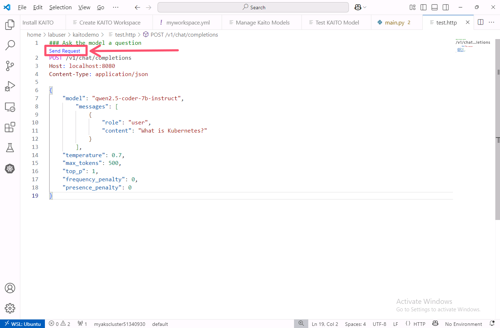

You should see a response from the KAITO workspace in the right pane.

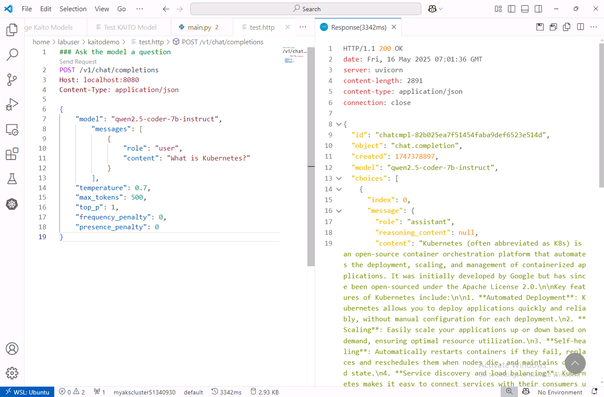

Click on the **Send Request** link a few more times to generate some metrics. You can also modify the request to ask different questions or change the parameters.

### View metrics in Grafana

Now that you have generated some metrics, you can view them in Azure Managed Grafana.

In the web browser, navigate to [https://portal.azure.com](https://portal.azure.com) and 
in the search bar, type **Grafana** and select **Azure Managed Grafana**.

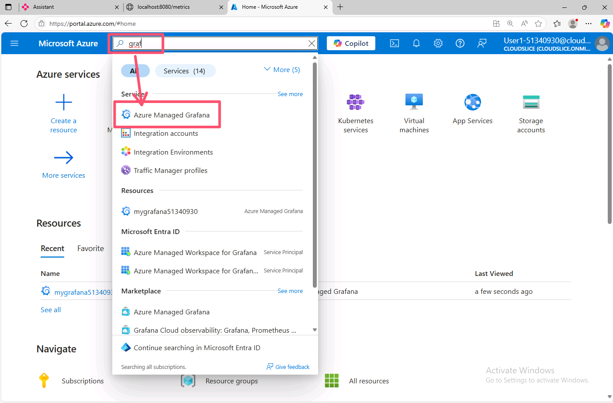

Click on your Azure Managed Grafana instance, then click on the endpoint URL to open the Grafana dashboard.

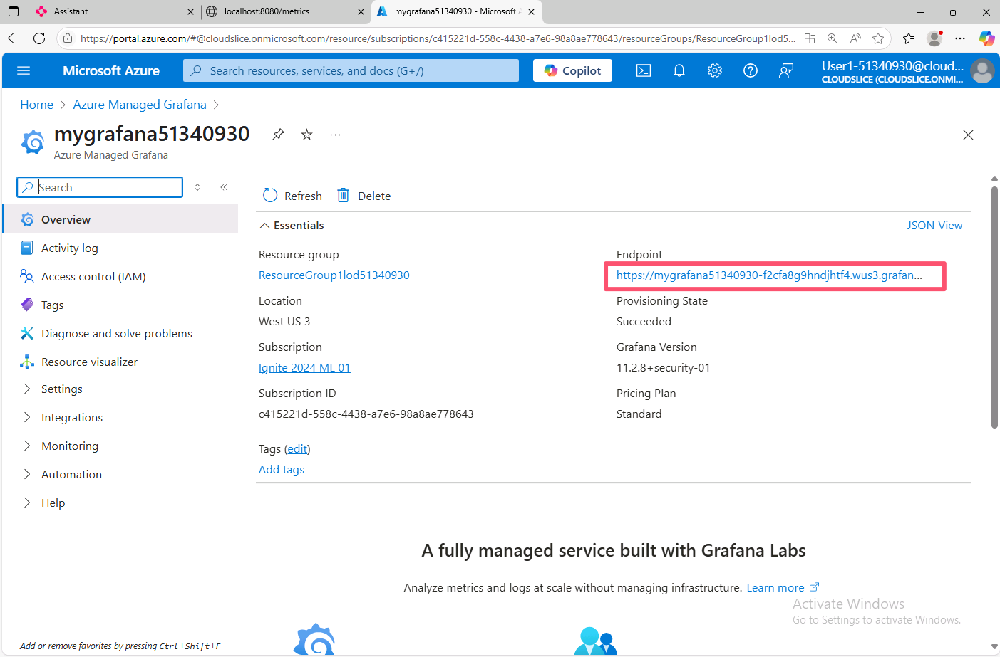

Log into the Grafana dashboard using your Azure credentials, then click on the **Dashboards** tab on the left side of the screen.

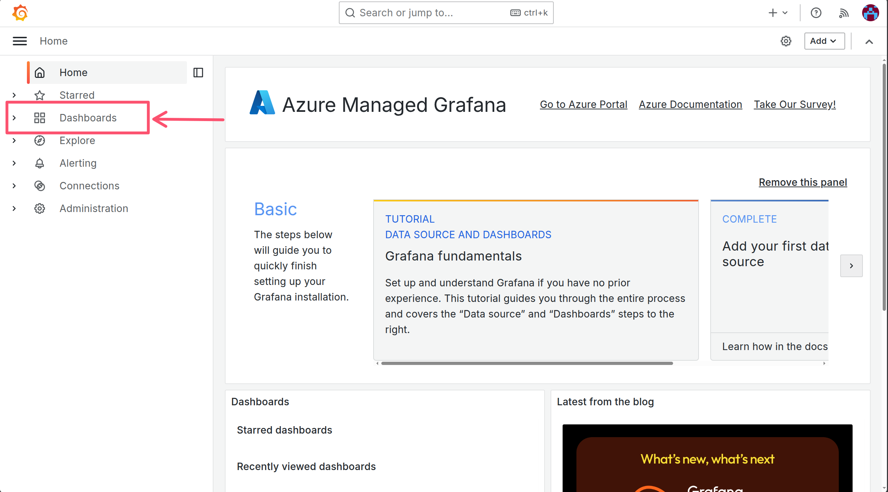

You should see a folder named **KAITO**. Click on it to open the folder.

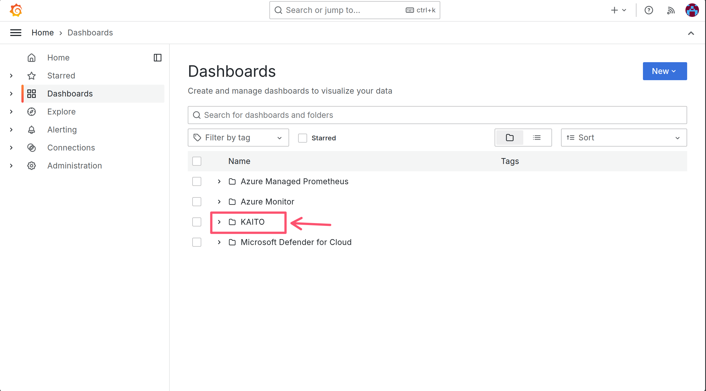

Click on the **vLLM** dashboard to open it. You should see a dashboard with various metrics related to the KAITO workspace.

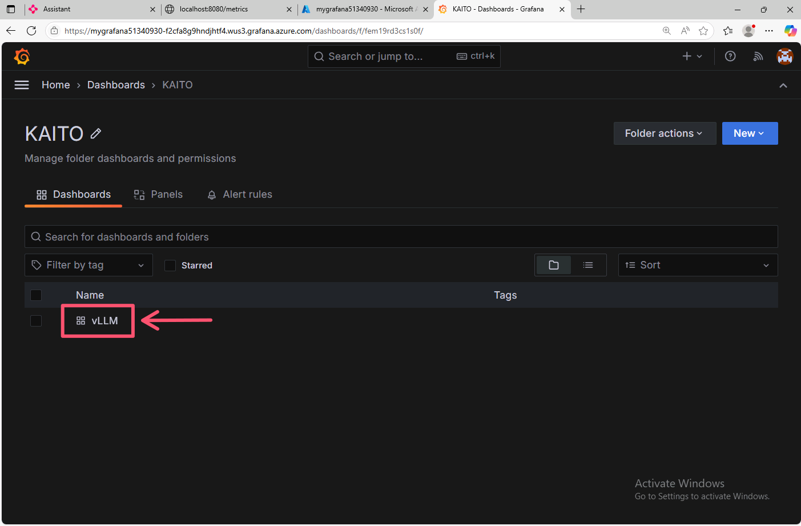

You should start to see some metrics being generated as you send requests to the KAITO workspace.

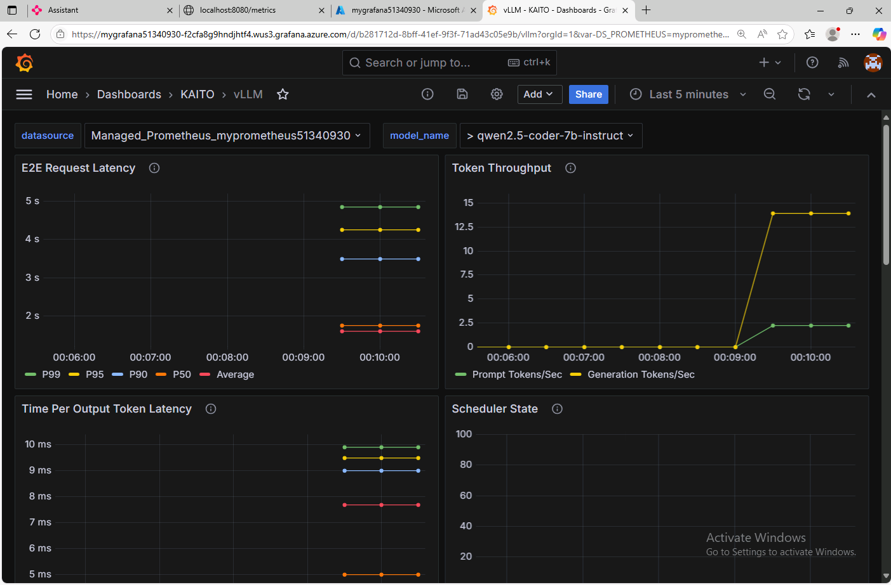

You may need to refresh the dashboard or expand the time range to see the metrics.

## Summary

Congratulations, now you know how to deploy, manage, and monitor open-source AI models on AKS using KAITO!

In this workshop, you learned how to use Visual Studio Code to deploy the KAITO add-on for AKS and work with the inferencing workspace. You also learned how to monitor the KAITO workspace by scraping metrics with Azure Managed Prometheus and ServiceMonitor CRD and visualizing the metrics by importing the vLLM Grafana dashboard into Azure Managed Grafana.

Finally, you learned how to install the open-source version of KAITO and deploy the RAG Engine to ground LLMs with your own data. This included indexing the product data from the Contoso Pet Supply store and querying the RAG Engine to get grounded responses from the LLM.

With Kubernetes and KAITO, you can see how much of the heavy lifting is done for you and you can focus on building your AI applications. The KAITO operator automates the deployment and management of AI/ML workloads, allowing you to easily deploy and manage large models on AKS. The RAG Engine allows you to ground LLMs with your own data, reducing the need to build custom RAG pipelines.

## What's next?

There are a few more features of KAITO that you didn't cover in this workshop, like fine-tuning models, but you can find more information about that in this [blog post](https://azure.github.io/AKS/2024/08/23/fine-tuning-language-models-with-kaito).

The KAITO team is continuously working on improving the KAITO experience and would love to hear your feedback. You can find the KAITO team on [GitHub](https://github.com/kaito-project/kaito) so feel free to open issues or pull requests!

## Resources

Check out the following resources to learn more about KAITO and the technologies used in this workshop:

- [Kubernetes AI Toolchain Operator](https://github.com/kaito-project/kaito)
- [AKS KAITO add-on](https://learn.microsoft.com/azure/aks/ai-toolchain-operator)
- [Deploy and test inference models iwth the AI toolchain operator (KAITO) in Visual Studio Code](https://learn.microsoft.com/en-us/azure/aks/aks-extension-kaito)
- [AKS KAITO Monitoring](https://learn.microsoft.com/azure/aks/ai-toolchain-operator-monitoring)
- [Azure Managed Prometheus - Create a Pod or Service Monitor](https://learn.microsoft.com/azure/azure-monitor/containers/prometheus-metrics-scrape-crd#create-a-pod-or-service-monitor)
- [vLLM Metrics](https://docs.vllm.ai/en/latest/design/v1/metrics.html)
- [vLLM Prometheus and Grafana](https://docs.vllm.ai/en/latest/getting_started/examples/prometheus_grafana.html)
- [Chainlit OpenAI integrations](https://docs.chainlit.io/integrations/openai)
- [Chainlit messages](https://docs.chainlit.io/concepts/message)
- [uv](https://docs.astral.sh/uv/)
- [Headlamp](https://headlamp.dev/)
