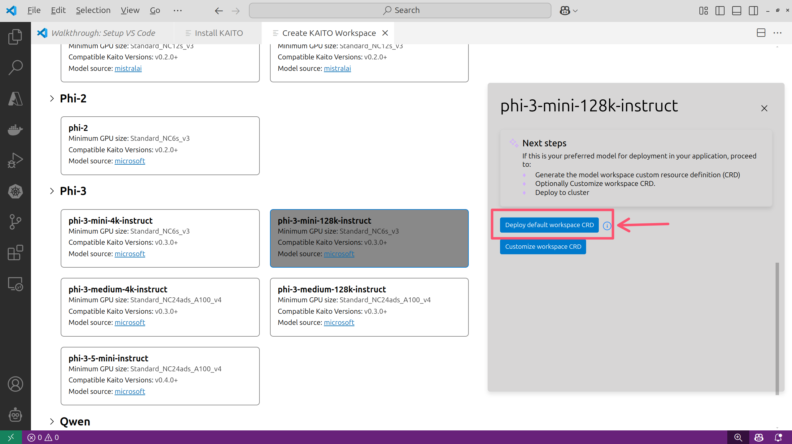
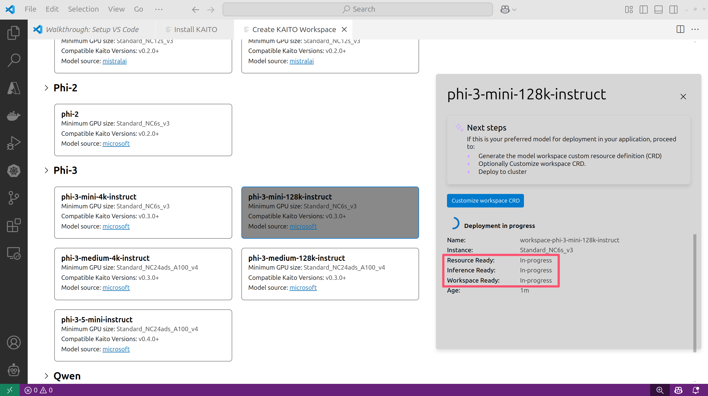
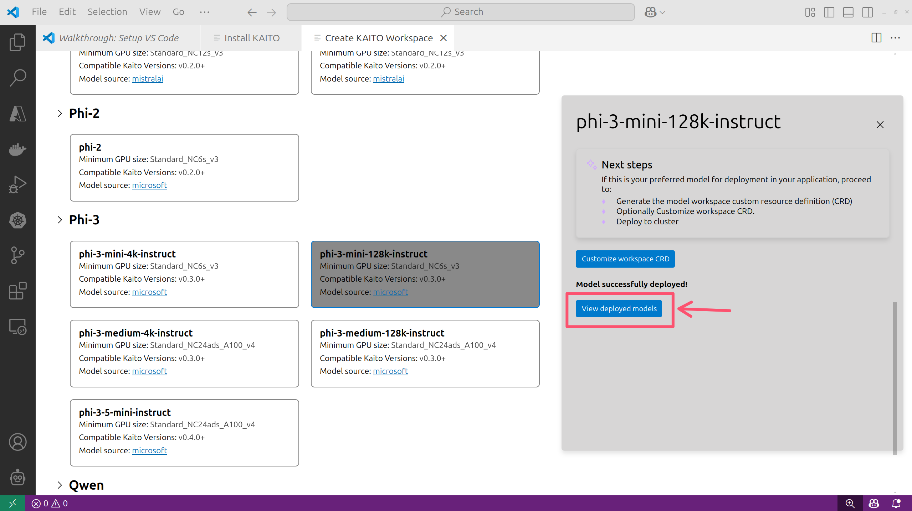
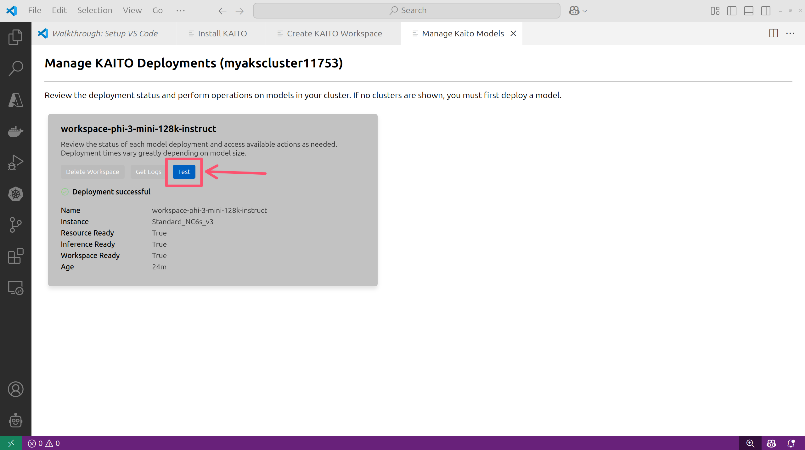
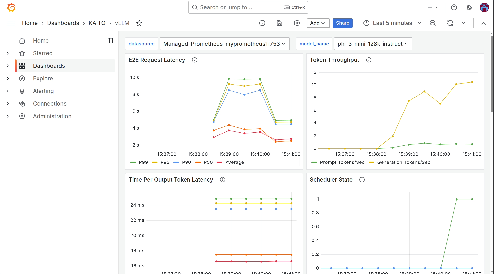

## Overview

This workshop will guide you through deploying and managing AI/ML workloads on Azure Kubernetes Service (AKS) using the KAITO operator. You will learn how to deploy a KAITO workspace, monitor it with Grafana, and use the KAITO extension in Visual Studio Code to develop and run your code.

## Pre-requisites

Before you begin, make sure you have the following:

- [Azure subscription](https://azure.microsoft.com/pricing/purchase-options/pay-as-you-go)
- [Visual Studio Code](https://code.visualstudio.com/)
- [Docker Desktop](https://www.docker.com/products/docker-desktop/)
- [Azure CLI](https://learn.microsoft.com/cli/azure/what-is-azure-cli) with extensions for the following:
  - [AKS](https://learn.microsoft.com/cli/azure/aks?view=azure-cli-latest)
  - [Grafana](https://learn.microsoft.com/en-us/cli/azure/grafana?view=azure-cli-latest)
- [kubectl](https://kubernetes.io/docs/tasks/tools/)
- [Helm](https://helm.sh/)
- [Git](https://git-scm.com/)
- [uv](https://docs.astral.sh/uv/getting-started/installation/)
- [jq](https://jqlang.org/)
- [Python 3.13 or later](https://www.python.org/downloads/)
- POSIX-compliant shell (i.e. bash, zsh, etc.)

The Azure resources needed for this workshop are already created for you. You can find the name of the resource group in the **Resources** tab of the lab environment.

Start by opening Visual Studio Code (VSCode) then open its integrated **Terminal**.

> [!hint]
> Press `Ctrl + Shift + P` then type **Toggle Terminal** to open the terminal in VSCode.


In the terminal, run the following command to log into your Azure account.

```bash
az login
```

Run the following command to export a environment variables that will be used in the workshop.

```bash
export RG_NAME=@lab.CloudResourceGroup(ResourceGroup1).Name
export AKS_NAME=$(az aks list -g $RG_NAME --query "[0].name" -o tsv)
export GRAFANA_NAME=$(az grafana list -g $RG_NAME --query "[0].name" -o tsv)
```

> [!important]
> If you open a new terminal window, you will need to run the above command again to set the environment variables.

Next, connect to the AKS cluster using the Azure CLI.

```bash
az aks get-credentials -g $RG_NAME -n $AKS_NAME
```

## What is KAITO?

KAITO is a tool designed to automate AI/ML model inference and tuning workloads within Kubernetes clusters, focusing on popular large models like Falcon, Phi-3, and more. Key features include managing large model files using container images, providing preset configurations for different GPU hardware, and supporting popular open-source inference runtimes such as vLLM and transformers.

KAITO simplifies the deployment of AI inference models by automating the provisioning of GPU nodes based on specific model requirements and hosting large model images in public registries when permissible.

### Architecture

The architecture of KAITO follows the Kubernetes Custom Resource Definition (CRD)/controller design pattern, where users manage workspace custom resources to describe GPU needs and specifications. The workspace controller creates machine custom resources to trigger node provisioning and deploys the inference workload. The GPU provisioner controller interacts with the AKS APIs to add new GPU nodes to the AKS cluster.

Once the GPU nodes are provisioned, the KAITO workspace controller deploys the inference workload using the specified model and configuration. The inference workload is exposed via a Kubernetes service, allowing users to access it through a REST API.

By default, KAITO uses the vLLM inference runtime, which is a high-performance inference engine for large language models. It also supports other runtimes like HuggingFace Transformers, but generally, you'll want to use vLLM for its performance, efficiency, compatibility with the OpenAI API, and support for metrics out-of-the-box.

### Deployment options

KAITO can be deployed in two ways on AKS:

1. **AKS add-on**: This is the easiest way to deploy KAITO on AKS however you will be limited in terms of getting the latest features and updates as soon as they are available upstream. This feature can be enabled using Azure CLI or the Visual Studio Code (VSCode) extension.
2. **Open source**: This requires more steps to deploy but you will have access to the latest features and updates as soon as they are available. To deploy open-source KAITO on AKS, you can follow this [guide](https://github.com/kaito-project/kaito/tree/main/terraform) to deploy with Terraform or use this [guide](https://github.com/kaito-project/kaito/blob/main/docs/installation.md) to deploy with Azure CLI.

## Install the AKS add-on

In this workshop, we will be using the AKS add-on to deploy KAITO on AKS. This is the easiest way to deploy the add-on is by using the [AKS extension for VSCode](https://marketplace.visualstudio.com/items?itemName=ms-kubernetes-tools.vscode-aks-tools).

### Install with Visual Studio Code

In VSCode, click on the Kubernetes extension.


Expand the **Clouds** section, then expand **Azure** section and login into your Azure account. If your Azure account is tied to multiple tenants, you will be prompted to select a tenant. Select the tenant that contains your AKS cluster. You should see a list of your Azure subscriptions. Select the subscription that contains your AKS cluster. Expand the subscription and find your AKS cluster.


Right-click your AKS cluster and select **Deploy an LLM with KAITO** and click **Install KAITO**.


In the panel that opens, click the **Install KAITO** button at the bottom. Installing KAITO will take a few minutes to complete.


Once the installation is complete, you will see a message in the panel.

### Deploy a workspace

With the KAITO add-on installed, you can now deploy a Workspace by clicking on the **Generate Workspace** button.


Here you will see a list of available Workspace presets. These are the available models that you can deploy with KAITO.


Expand the **Phi-3** family of models and select **phi-3-mini-128k-instruct**.



Here you have the option to deploy the default workspace or a custom workspace. If you click on the **Customize workspace CRD** button, the YAML manifest will be displayed in a new tab. You can modify the YAML manifest to customize the workspace deployment then apply the manifest using the **kubectl apply** command.

Click the **Deploy default workspace CRD** and wait 10 minutes for it to be ready. Keep an eye on the **Resource Ready** and **Inference Ready** statuses. Also as part of this process, subscription quota will be checked and if you don't have enough quota, the workspace will not be deployed.



With the workspace successfully deployed, click the **View deployed models** button to test the workspace.



In the workspace panel you can see it's a place where you can quickly test the inference endpoint, view logs, and delete the workspace.


Click the **Test** button to open the testing panel.



Here you can enter a prompt and configure the prompt parameters such as **Temperature**, **Top P**, **Top K**, and **Max Length**.

Enter a prompt and optionally set prompt parameters, then click the **Submit prompt** button to send the prompt to the workspace.


The response will be displayed in the panel.


## Developing with KAITO

With a workspace deployed, you can now start developing your code. In this lab, we will be using the [Chainlit](https://chainlit.io/) library to create a simple web UI for interacting with the KAITO workspace.

### Chainlit app with OpenAI API

Chainlit is a Python library that allows you to create interactive web applications for interacting with models. It provides a simple way to create a web UI for your model and allows you to quickly build prototypes and test using a web browser.

Open the VSCode terminal then run the following command to create a new directory for the project.

```bash
mkdir -p /tmp/app
cd /tmp/app
```

Download the sample code.

```bash
curl -o main.py https://raw.githubusercontent.com/kaito-project/kaito/refs/heads/main/demo/inferenceUI/chainlit_openai.py
```

Run the following command to open the `main.py` file.

```bash
code main.py
```

The code uses the OpenAI library to send requests to the KAITO workspace and display the responses in the web UI which is created using Chainlit.

Near the top of the file, you can see it relies on the `WORKSPACE_SERVICE_URL` environment variable to connect to the KAITO workspace. This value is the URL of the Kubernetes services that exposes the KAITO workspace. The service runs as an internal service in the cluster but we can access it from our local machine using Kubernetes port forwarding.

### Run the Chainlit app

Run the following command to port forward the workspace service to your local machine.

```bash
kubectl port-forward service/workspace-phi-3-mini-128k-instruct 8080:80
```

Move the process to the background by pressing `Ctrl + z`, then press `bg`, and press `Enter`.

To set the `WORKSPACE_SERVICE_URL` environment variable that the code uses, we can use a `.env` file.

Run the following command to create a `.env` file and set the `WORKSPACE_SERVICE_URL` to point to the port forwarded service that you can access locally which is `http://localhost:8080`.

```bash
echo "WORKSPACE_SERVICE_URL=http://localhost:8080/" > .env
```

We can run the code using **uv** which is a command line tool for managing Python package dependencies and projects.

Run the following command to initialize a new **uv** project.

```bash
uv init
```

The code requires some dependencies to run. We can install them using **uv**.

```bash
uv add chainlit pydantic==2.11.3 requests openai
```

The **chainlit** package is used to create the web UI, **pydantic** is used for data validation, **requests** is used to make HTTP requests, and **openai** is used to interact with the KAITO workspace which is serving the model on a vLLM server. Because the vLLM server supports the OpenAI API, we can use the `openai` library to interact with it.

Finally, we can run the code and pass in the `.env` file to set the environment variables.

```bash
uv run --env-file=.env chainlit run main.py
```

This will start a local web server that you can access in your browser at `http://localhost:8000`.

You can enter a prompt in the text box and click the submit button to send the prompt to the KAITO workspace. The response will be displayed in the web UI.


As you can see, developing against the KAITO workspace simple. Using the OpenAI library to send requests makes it compatible with any code that uses the OpenAI API.

## Monitoring KAITO workspaces

With vLLM-based workspaces, vLLM metrics are emitted from on the **/metrics** endpoint which enables you to monitor the performance of the KAITO workspace easily with Prometheus and Grafana.

You should still have the workspace service port forwarded to your local machine. If not, run the following command to port forward the workspace service to your local machine.

To view the metrics that is emitted by the vLLM server, you can use the following command.

```bash
curl http://localhost:8080/metrics
```

### Scrape metrics with Prometheus

To scrape the metrics emitted by the vLLM server, you need to have Prometheus installed in your AKS cluster. In this lab environment we are using Azure Managed Prometheus and Azure Managed Grafana. With Azure Managed Prometheus, you can deploy either a ServiceMonitor or PodMonitor CRD. We will use the ServiceMonitor CRD to scrape the metrics emitted by the vLLM server.

Before you deploy the ServiceMonitor, you will need to label the workspace service so that the ServiceMonitor can use it to identify the service.

Run the following command to label the workspace.

```bash
kubectl label service workspace-phi-3-mini-128k-instruct kaito.sh/workspace=workspace-phi-3-mini-128k-instruct
```

Deploy a ServiceMonitor to monitor the workspace which will scrape from the **/metrics** endpoint of the service that has the label `kaito.sh/workspace=workspace-phi-3-mini-128k-instruct`.

```bash
kubectl apply -f - <<EOF
apiVersion: azmonitoring.coreos.com/v1
kind: ServiceMonitor
metadata:
  name: workspace-phi-3-mini-128k-instruct-monitor
spec:
  selector:
    matchLabels:
      kaito.sh/workspace: workspace-phi-3-mini-128k-instruct
  endpoints:
  - port: http
    path: /metrics
    interval: 30s
    scheme: http
EOF
```

### Import vLLM Grafana dashboard

vLLM provides a [sample Grafana dashboard](https://docs.vllm.ai/en/latest/getting_started/examples/prometheus_grafana.html#example-materials) that you can use to monitor the performance of the KAITO workspace. You can import this dashboard into Azure Managed Grafana.

Run the following command to download the sample Grafana dashboard JSON file.

```bash
curl -s -o grafana.json https://raw.githubusercontent.com/vllm-project/vllm/refs/heads/main/examples/online_serving/prometheus_grafana/grafana.json
```

Update the JSON file to use the correct model name. This is just for convenience so you don't have to change the model name in the Grafana dashboard UI.

```bash
sed -i 's^/share/datasets/public_models/Meta-Llama-3-8B-Instruct^phi-3-mini-128k-instruct^g' grafana.json
```

Create a folder in Azure Managed Grafana to store the dashboard.

```bash
az grafana folder create \
-n $GRAFANA_NAME \
-g $RG_NAME \
--title "KAITO"
```

Import the JSON file into Azure Managed Grafana.

```bash
az grafana dashboard create \
-n $GRAFANA_NAME \
-g $RG_NAME \
--title "vLLM" \
--folder "KAITO" \
--definition "$(cat grafana.json)"
```

In the Azure portal, navigate to the Azure Managed Grafana instance and click on the endpoint URL to open the Grafana dashboard.


Log into the Grafana dashboard using your Azure credentials, then click on the **Dashboards** tab on the left side of the screen.


You should see a folder named **KAITO**. Click on it to open the folder.


Click on the **vLLM** dashboard to open it. You should see a dashboard with various metrics related to the KAITO workspace.



> [!note] The dashboard may not have metrics to display yet if you have not run any inference requests yet. You can run some inference requests using the Chainlit app that you created earlier to generate some metrics.

## Summary

In this workshop, you learned how to deploy and manage AI/ML workloads on Azure Kubernetes Service (AKS) using the KAITO operator. You learned how to use Visual Studio Code to deploy the KAITO add-on for AKS and work with the inferencing workspace. You also learned how to monitor the KAITO workspace by scraping metrics with Azure Managed Prometheus and ServiceMonitor CRD and visualizing the metrics by importing the vLLM Grafana dashboard into Azure Managed Grafana.

Finally, you learned how to install the open-source version of KAITO and deploy the RAG Engine to ground LLMs with your own data. This included indexing the product data from the Contoso Pet Supply store and querying the RAG Engine to get grounded responses from the LLM.

With Kubernetes and KAITO, you can see how much of the heavy lifting is done for you and you can focus on building your AI applications. The KAITO operator automates the deployment and management of AI/ML workloads, allowing you to easily deploy and manage large models on AKS. The RAG Engine allows you to ground LLMs with your own data, reducing the need to build custom RAG pipelines.

## What's next?

There are a few more features of KAITO that we didn't cover in this workshop, like fine-tuning models, but you can find more information about that in this [blog post](https://azure.github.io/AKS/2024/08/23/fine-tuning-language-models-with-kaito).

The KAITO team is continuously working on improving the KAITO experience and would love to hear your feedback. You can find the KAITO team on [GitHub](https://github.com/kaito-project/kaito) so feel free to open issues or pull requests!

### Clean up

To uninstall the open-source KAITO installation, you can run the following command to delete the workspace and RAG Engine, then uninstall the Helm charts, and finally delete the custom resource definitions.

```bash
# delete kaito custom resources
kubectl delete workspace phi-3-mini-128k-instruct-wks
kubectl delete ragengine phi-3-mini-128k-instruct-rag

# uninstall kaito operators
helm uninstall gpu-provisioner --namespace gpu-provisioner
helm uninstall kaito-workspace --namespace kaito-workspace
helm uninstall ragengine --namespace kaito-ragengine

# remove custom resource definitions
kubectl delete crd aksnodeclasses.karpenter.azure.com
kubectl delete crd ec2nodeclasses.karpenter.k8s.aws
kubectl delete crd nodeclaims.karpenter.sh
kubectl delete crd ragengines.kaito.sh
kubectl delete crd workspaces.kaito.sh
```

## Resources

To learn more about KAITO and the features it provides, check out the following resources:

- [Kubernetes AI Toolchain Operator](https://github.com/kaito-project/kaito)
- [AKS KAITO add-on](https://learn.microsoft.com/azure/aks/ai-toolchain-operator)
- [AKS KAITO Monitoring](https://learn.microsoft.com/azure/aks/ai-toolchain-operator-monitoring)
- [Azure Managed Prometheus - Create a Pod or Service Monitor](https://learn.microsoft.com/azure/azure-monitor/containers/prometheus-metrics-scrape-crd#create-a-pod-or-service-monitor)
- [vLLM Metrics](https://docs.vllm.ai/en/latest/design/v1/metrics.html)
- [vLLM Prometheus and Grafana](https://docs.vllm.ai/en/latest/getting_started/examples/prometheus_grafana.html)
- [Chainlit OpenAI integrations](https://docs.chainlit.io/integrations/openai)
- [Chainlit messages](https://docs.chainlit.io/concepts/message)
- [uv](https://docs.astral.sh/uv/)
- [BAAI/bge-small-en-v1.5 embedding model on HuggingFace](https://huggingface.co/BAAI/bge-small-en-v1.5)
- [Faiss Vector Database](https://faiss.ai/)