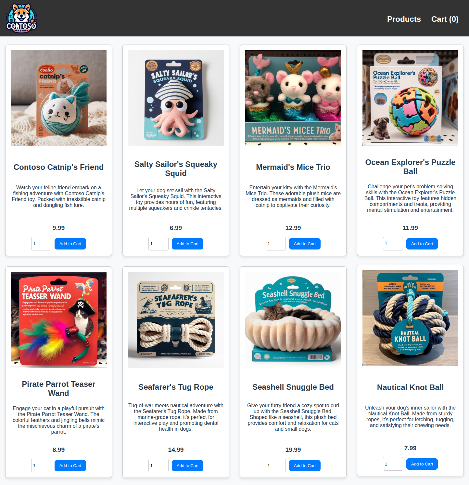
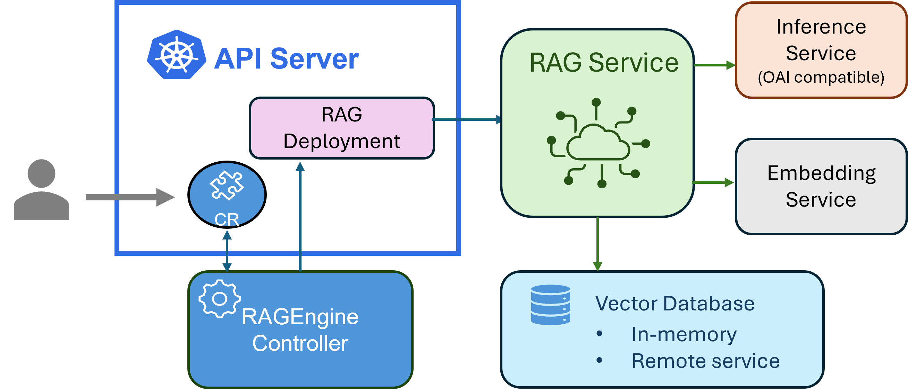

import Prerequisites from "../../src/components/SharedMarkdown/_prerequisites.mdx";

Retrieval Augmented Generation (RAG) is a powerful technique that combines the strengths of large language models (LLMs) with external knowledge sources. This approach enables more accurate and contextually relevant responses by retrieving information from knowledge bases or databases and using it to augment the LLM's output.

This workshop will guide you through setting up an easy-to-use RAG solution using KAITO on Azure Kubernetes Service (AKS).

The [KAITO](https://github.com/kaito-project/kaito) project provides Kubernetes operators that aims to simplify the deployment and management of AI tooling on Kubernetes. With the [v0.5.0 release](https://github.com/kaito-project/kaito/releases/tag/v0.5.0), KAITO has introduced a new RAGEngine operator that makes it simple to deploy and manage RAG workloads on AKS. Common uses of RAG in AI-enabled applications include:

* Customer support aid that answers FAQs using support manuals or ticket history
* Codebase PR reviewer automating feedback based on files, comments and documentation
* Healthcare doc assistant that ensures secure inference with responses grounded in vetted medical references

## Objectives

By the end of this workshop, you will be able to:

- Understand the concept of Retrieval Augmented Generation (RAG).
- Set up a RAG solution using KAITO on Azure Kubernetes Service (AKS).
- Deploy and manage RAG workloads with KAITO's RAGEngine operator.
- Integrate external knowledge sources with LLMs for enhanced responses.

<Prerequisites
  tools={[
    {
      name: "Helm",
      url: "https://helm.sh/docs/intro/install/",
    },
    {
      name: "Terraform",
      url: "https://www.terraform.io/downloads.html",
    },
    {
      name: "jq",
      url: "https://jqlang.org/download/",
    },
  ]}
/>

### Setup AKS Cluster with KAITO

To get started with KAITO on AKS, you will first need to set up an Azure Kubernetes Service (AKS) cluster. Then you'll need to install the KAITO operators on your AKS cluster. This process can be a bit complex to start, so we'll lean on the Terraform scripts provided by the KAITO project to simplify the deployment. This will allow you to quickly set up the necessary infrastructure and install the operators without having to manually configure everything.

Start by cloning the KAITO repository and navigating to the **kaito/terraform** directory:

```bash
git clone https://github.com/kaito-project/kaito.git
cd kaito/terraform
```

Next, you need to set up the Terraform CLI so that it can deploy resources in your Azure subscription. If you haven't already, install the Terraform CLI by following the instructions on the [Terraform website](https://www.terraform.io/downloads.html) then run the following command to configure your Azure subscription:

```bash
export ARM_SUBSCRIPTION_ID=$(az account show --query id -o tsv)
```

Now, you can initialize the Terraform project and apply the configuration to create your AKS cluster:

```bash
terraform init
terraform apply
```

:::note

When prompted, type `yes` to confirm the creation of the resources. This process will take a few minutes to complete.

:::

Once the resources are deployed, run the following command to connect to your AKS cluster:

```bash
az aks get-credentials \
--resource-group $(terraform output -raw rg_name) \
--name $(terraform output -raw aks_name)
```

### Deploy KAITO Workspace

[KAITO workspaces](https://kaito-project.github.io/kaito/docs/inference) are Kubernetes custom resources that are used to manage open-source model inference deployments within your cluster. Run the following command to create a workspace for using the **phi-4-mini-instruct** model:

:::danger

You must have sufficient quota available in your Azure subscription to deploy the workspace. If you don't have at least 24 vCPUs of Standard NCads A100 v4 GPU quota, you will need to [request additional quota](https://learn.microsoft.com/azure/quotas/quickstart-increase-quota-portal) from Azure support.

:::

```bash
kubectl apply -f- <<EOF
apiVersion: kaito.sh/v1beta1
kind: Workspace
metadata:
  name: workspace-phi-4-mini-instruct
resource:
  instanceType: Standard_NC24ads_A100_v4
  labelSelector:
    matchLabels:
      apps: phi-4-mini-instruct
inference:
  preset:
    name: phi-4-mini-instruct
EOF
```

:::note

This will take a few minutes to complete but you can proceed forward in this workshop.

You can check the status of the workspace by running:

```bash
kubectl get workspace workspace-phi-4-mini-instruct
```

:::

### Deploy Sample Workload

Finally, in order to demonstrate a real-world use case for RAG, let's deploy a [sample e-commerce application](https://github.com/Azure-Samples/aks-store-demo). This application is a simple online store that sells pet supplies. In our scenario, we will use this application and its product data to build a RAG application that can answer questions about the products available in the store.

Run the following command to deploy the sample workload:

```bash
kubectl apply -f https://raw.githubusercontent.com/Azure-Samples/aks-store-demo/refs/heads/main/aks-store-quickstart.yaml
```

Once the deployment is complete, you can access the store front by running the following command to get the external IP address of the service:

```bash
kubectl get service store-front -ojsonpath='{.status.loadBalancer.ingress[0].ip}'
```

This will return the external IP address of the store front service. You can then navigate to this IP address in your web browser to access the store front.



:::note

Take note of the products available in the store, as you will use this data to build and test your RAG application.

:::

## What is KAITO RAGEngine?

[KAITO RAGEngine](https://kaito-project.github.io/kaito/docs/rag) is another Kubernetes custom resource that simplifies the deployment and management of Retrieval Augmented Generation (RAG) workloads. It allows you to easily deploy RAG applications and workflows that can retrieve information from external knowledge sources and use it to enhance the responses generated by large language models (LLMs).

In a typical RAG workflow, you have a knowledge base (like a database or an index) and an LLM. Data is often indexed in a vector database, which allows for efficient retrieval of relevant information based on the user's query. This requires a few key components:

- **Knowledge Base**: A source of information that can be indexed and queried to retrieve relevant data.
- **Vector Database**: A database that stores the indexed data in a format that allows for efficient similarity search.
- **Embedding model**: A model that converts text into vector representations, which are then stored in the vector database.
- **Inference Service**: A service that provides access to a large language model (LLM) for generating responses based on the retrieved information.

With KAITO RAGEngine, the deployment of these components is simplified by providing a single CRD that encapsulates the necessary configurations for the vector database, embedding model, and inference service. By default, it uses the [Faiss](https://faiss.ai/) vector database and the [BAAI general embedding (bge)](https://huggingface.co/BAAI/bge-small-en-v1.5) model, but it can be configured to use other embedding models as needed.

Here is a high-level overview of the RAGEngine architecture:


Source: [https://github.com/kaito-project/kaito](https://github.com/kaito-project/kaito)

:::info

As you build your RAG application, instead of calling the inference service directly, you will interact with the `/query` endpoint of the RAGEngine instance. This endpoint will handle the retrieval of relevant information from the knowledge base, pass it to the inference service, and return the generated response.

:::

## Deploy RAGEngine

When you applied the Terraform configuration earlier, it also installed the [KAITO RAGEngine Helm Chart](https://github.com/kaito-project/kaito/tree/main/charts/kaito/ragengine) on your AKS cluster. So you can deploy a RAGEngine instance by deploying a single YAML file that defines the RAGEngine configuration.

Run the following command to deploy a RAGEngine instance named `ragdemo` using the bge model and the [phi-4-mini-instruct](https://github.com/kaito-project/kaito/blob/main/examples/inference/kaito_workspace_phi_4_mini.yaml) inference service:

:::info

You can customize the `instanceType` to use a different Azure VM size based on your requirements and available quota. The `Standard_D8s_v4` instance type is a **cost-effective** starting point for development and testing purposes, but you may want to use a larger instance type for production workloads or more demanding applications.

:::

```bash
kubectl apply -f - <<EOF
apiVersion: kaito.sh/v1alpha1
kind: RAGEngine
metadata:
  name: ragdemo
spec:
  compute:
    instanceType: Standard_D8s_v4
    labelSelector:
      matchLabels:
        apps: ragdemo
  embedding:
    local:
      modelID: BAAI/bge-small-en-v1.5
  inferenceService:
    url: "http://workspace-phi-4-mini-instruct/v1/completions"
EOF
```

:::note

This will take a few minutes to complete. Wait until the RAGEngine instance is in the `Ready` state and the Pods are running before proceeding.

:::

## Indexing Data

In our use case, let's say you want to build a chatbot that can answer questions about the products available in the store. We can start to build a RAG enabled chatbot that is more likely to recommend products based on the product data available in the store and not recommend things that aren't relevant. To do this, you will need to index the product data in a format that the RAGEngine can understand.

### Data Preparation

To use the RAGEngine, data must be indexed in a specific format that the RAGEngine can understand.

Here is a sample JSON schema that can be used to index:

```json
{
  "index_name": "store_index",
  "documents": [
    {
      "text": "Product description",
      "metadata": {
        "author": "Contoso Pet Supply",
        "category": "Product category",
        "url": "http://store-ip/product/product-id"
      }
    }
  ]
}
```

The `index_name` is the name of the index where the documents will be stored. The `documents` array contains individual documents, each with a `text` field for in this case the product description, and a `metadata` field that can include additional information such as the author, category, and URL of the product.

:::info

The `metadata` can be used to fill in any other information you wish to include in the LLM prompt. In our case, we want to include data such as product category and URL.

:::

### Fetching Product Data

The sample e-commerce application provides a REST API to fetch product data. You can use the following commands to retrieve the product data from the store front service.

First, get the external IP address of the store front service:

```bash
STORE_IP=$(kubectl get service store-front -ojsonpath='{.status.loadBalancer.ingress[0].ip}')
```

Next, you can fetch the product data using the following command:

```bash
curl http://${STORE_IP}/api/products | jq
```

You should see a JSON response containing the product data, which includes fields like `id`, `name`, `description`, and `price`. Here is an example of what the response might look like:

```json
[
  {
    "id": 1,
    "name": "Contoso Catnip's Friend",
    "price": 9.99,
    "description": "Watch your feline friend embark on a fishing adventure with Contoso Catnip's Friend toy. Packed with irresistible catnip and dangling fish lure.",
    "image": "/catnip.jpg"
  },
  {
    "id": 2,
    "name": "Salty Sailor's Squeaky Squid",
    "price": 6.99,
    "description": "Let your dog set sail with the Salty Sailor's Squeaky Squid. This interactive toy provides hours of fun, featuring multiple squeakers and crinkle tentacles.",
    "image": "/squid.jpg"
  }
  ...
]
```

### Transforming Product Data for Indexing

Now let's transform this product data into a format suitable for indexing with the RAGEngine.

We'll just extract the relevant fields and format them according to the schema we defined earlier using `jq`:

```bash
curl http://${STORE_IP}/api/products | jq --arg store_ip "$STORE_IP" '{
  index_name: "store_index",
  documents: [
    .[] | {
      text: "\(.name) - \(.description) Price: $\(.price)",
      metadata: {
        author: "Contoso Pet Supply",
        category: (
          if (.name | test("cat|Cat|feline|kitty"; "i")) then "Cat Toys"
          elif (.name | test("dog|Dog|Doggy"; "i")) then "Dog Toys"
          elif (.name | test("Bed|bed"; "i")) then "Pet Beds"
          elif (.name | test("Life Jacket|Jacket"; "i")) then "Pet Accessories"
          else "Pet Toys"
          end
        ),
        url: "http://\($store_ip)/product/\(.id)"
      }
    }
  ]
}' > store_products.json
```

Run the following command to view the transformed product data:

```bash
cat store_products.json | jq
```

You should see the product data formatted according to the schema we defined earlier and it should look something like this:

```json
{
  "index_name": "store_index",
  "documents": [
    {
      "text": "Contoso Catnip's Friend - Watch your feline friend embark on a fishing adventure with Contoso Catnip's Friend toy. Packed with irresistible catnip and dangling fish lure. Price: $9.99",
      "metadata": {
        "author": "Contoso Pet Supply",
        "category": "Cat Toys",
        "url": "http://<STORE_IP>/product/1"
      }
    },
    {
      "text": "Salty Sailor's Squeaky Squid - Let your dog set sail with the Salty Sailor's Squeaky Squid. This interactive toy provides hours of fun, featuring multiple squeakers and crinkle tentacles. Price: $6.99",
      "metadata": {
        "author": "Contoso Pet Supply",
        "category": "Dog Toys",
        "url": "http://<STORE_IP>/product/2"
      }
    }
  ]
}
```

### Indexing with RAGEngine

Now that you have the product data in the correct format, let's index it using the RAGEngine instance you deployed earlier. You can do this by sending a POST request to the `/index` endpoint of the RAGEngine instance.

Run the following command to port-forward the RAGEngine service to your local machine:

```bash
kubectl port-forward svc/ragdemo 8080:80 &
```

:::info

This command will forward the RAGEngine service to your local machine on port 8080 and run this command in the background. If you need to stop the port forwarding, you can press **ctrl+c**.

:::

Run the following command to index the product data:

```bash
curl -X POST http://localhost:8080/index \
-H "Content-Type: application/json" \
-d @store_products.json | jq
```

You should see a JSON response that includes a list of the products that were indexed as documents in the vector database. To verify the indexing was successful, you can list the indexes available in the RAGEngine instance by running the following command:

```bash
curl http://localhost:8080/indexes
```

You should see the `store_index` listed in the response. From there, you can also list the documents indexed in the `store_index` by running:

```bash
curl http://localhost:8080/indexes/store_index/documents | jq
```

## Querying with RAGEngine

Now that you have indexed the product data, you can use the RAGEngine to query the indexed data and generate responses using the **phi-4-mini-instruct** model.

Run the following command to query the RAGEngine instance:

```bash
curl -s http://localhost:8080/query \
-X POST \
-H "Content-Type: application/json" \
-d '{
  "index_name": "store_index",
  "query": "I need a new bed for my cat. Can you help me?",
  "top_k": 5,
  "llm_params": {
    "temperature": 0.7,
    "max_tokens": 2048
  }
}' | jq
```

You should see a JSON response that recommends the **Seashell Snuggle Bed**. This is more tailored to the user's interest about needing to purchase a new bed for their cat from the store. The response may also include a product URL in which the user can click to view the product details on the website.

Here is an example of what the response might look like:

```json
{
  "response": " Yes, there is a Seashell Snuggle Bed available from Contoso Pet Supply. It's priced at $19.99. It's shaped like a seashell and designed to provide comfort and relaxation for your cat. You can find it [here](http://<STORE_IP>/product/7).\n\n\n",
  "source_nodes": [
  ...
  ]
  ...
}
```

Also included in the response is a `source_nodes` array that contains the documents and relevancy scores that were retrieved from the vector database and used to generate the response. This can be useful for debugging and understanding how the RAGEngine is generating responses based on the indexed data.

## Summary

Congratulations! You've successfully built a complete RAG solution using KAITO on Azure Kubernetes Service. In this workshop, you:

- **Deployed infrastructure** using Terraform to create an AKS cluster with KAITO operators
- **Set up AI workloads** by deploying a phi-4-mini-instruct model workspace and RAGEngine instance
- **Indexed real data** from a sample e-commerce application into a vector database
- **Queried intelligently** to get contextual, source-backed responses from your knowledge base

With KAITO, the complexity of managing vector databases, embedding models, and inference services is abstracted away, letting you focus on building applications rather than infrastructure. By default, your models, logs, and data store(s) are **secured** with in-cluster RAG, also preventing exposure of real-time sensitive data to external LLM services.

This foundation opens doors to powerful possibilities: enterprise knowledge management systems, multi-modal applications with images and documents, real-time data integration, personalized user experiences, and automated content generation. What starts as a simple product recommendation system can scale into a comprehensive AI platform that transforms how users interact with organizational knowledge.

## What's next? 

Ready to take your RAG solution further? Here are practical next steps to enhance and scale your implementation:

**Integration & Customization**

- **Connect external LLMs**: Replace the in-cluster phi-4-mini-instruct with cloud services like Azure OpenAI, OpenAI GPT models, or other Hugging Face models to compare performance and capabilities.

- **Scale your data sources**: Index documentation, databases, APIs, or file repositories. Experiment with different document types and sizes to understand indexing optimization.

- **Customize embedding models**: Try different embedding models beyond the default BGE model to see how they affect retrieval quality for your specific use case.

**Production Applications**

- **Build a complete chatbot**: Create a web interface or integrate with platforms like Teams, Slack, or your existing applications to provide a user-friendly chat experience.

- **Add real-time features**: Connect to live APIs for dynamic content like inventory levels, pricing updates, or user preferences to keep responses current and accurate.

- **Implement user personalization**: Leverage user context, history, and preferences to provide tailored recommendations and responses.

**Operations & Monitoring**

- **Monitor performance**: Set up observability with Prometheus and Grafana to track RAGEngine performance, response times, and resource usage across your AKS cluster.

- **Optimize costs**: Experiment with different Azure VM sizes and auto-scaling configurations to balance performance with cost efficiency.

- **Explore advanced KAITO features**: Dive deeper into the [KAITO documentation](https://github.com/kaito-project/kaito) to discover additional operators, configuration options, and best practices for production deployments.

## Cleanup

To clean up the resources created during this workshop, you can run the following command to delete the RAGEngine instance and the sample e-commerce application:

```bash
terraform destroy -auto-approve
```

This will remove all the Azure resources created by the Terraform configuration, including the AKS cluster and resource group.
