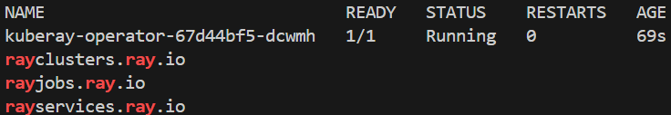
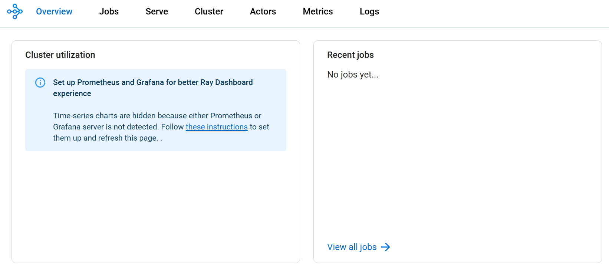
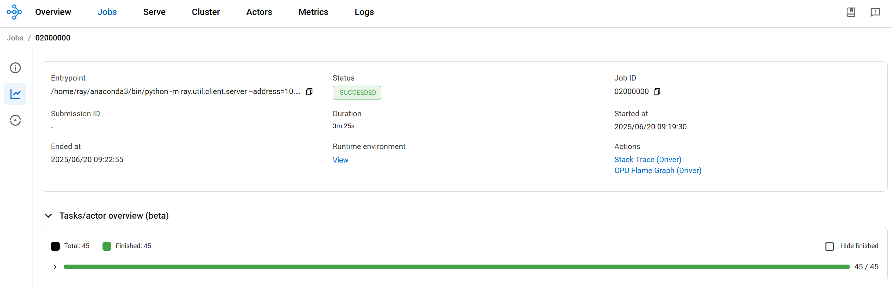

In this lab, you will learn how to deploy and scale distributed AI workloads using Ray on Azure Kubernetes Service (AKS). Ray is an open-source framework for scaling AI and Python applications, providing distributed computing capabilities that are essential for modern machine learning workloads.

Ray enables you to scale your AI workloads from a single machine to a cluster of machines with minimal code changes. It provides several key libraries:

- **Ray Core**: Distributed computing primitives
- **Ray Train**: Distributed machine learning training
- **Ray Serve**: Scalable model serving
- **Ray Tune**: Hyperparameter tuning at scale
- **Ray Data**: Distributed data processing

In this lab, we'll deploy a Ray cluster on AKS and demonstrate distributed machine learning training and inference serving.

## Objectives

By the end of this lab, you will be able to:

- Deploy a Ray cluster on AKS using the KubeRay operator
- Run distributed machine learning training jobs with Ray Train
- Serve ML models at scale using Ray Serve
- Monitor and scale Ray workloads on Kubernetes
- Implement distributed data processing with Ray Data
- Configure auto-scaling for Ray worker nodes

## Prerequisites

Before you begin this lab, you will need:

- [Azure subscription](https://azure.microsoft.com/free) with AKS deployment permissions
- [Azure CLI](https://learn.microsoft.com/cli/azure/install-azure-cli) installed and authenticated
- [kubectl](https://kubernetes.io/docs/tasks/tools/install-kubectl/) configured to connect to your AKS cluster
- [Git](https://git-scm.com/downloads) for cloning the lab repository
- Basic familiarity with Kubernetes concepts and YAML manifests
- **Lab Repository**: Clone the repository to access all lab artifacts

### Clone the Lab Repository

Start by cloning the AKS Labs repository to get access to all the pre-built YAML files and Python scripts:

```bash
# Clone the AKS Labs repository
git clone https://github.com/Azure-Samples/aks-labs.git
cd aks-labs

# Verify you can access the Ray lab artifacts
ls docs/ai-workloads-on-aks/assets/ray-lab/artifacts/
```

This repository contains all the artifact files referenced throughout this lab, making it easy to copy and execute commands.

- [kubectl](https://kubernetes.io/docs/tasks/tools/) configured for your AKS cluster
- [Helm](https://helm.sh/docs/intro/install/) installed
- [Python 3.8+](https://www.python.org/downloads) with pip
- Basic knowledge of Kubernetes, Python, and machine learning concepts

:::info Note

This lab assumes you have an existing AKS cluster. If you need to create one, you can use the AKS Automatic cluster from the previous workshop or create a standard AKS cluster with at least 3 nodes (Standard_DS3_v2 or larger) to handle Ray workloads effectively.

:::

:::warning Resource Requirements
Ray workloads can be resource-intensive. Ensure your AKS cluster has sufficient resources:

**For CPU deployment (default):**

- At least 3 worker nodes
- Minimum 4 vCPUs and 16GB RAM per node (Standard_DS3_v2 or larger)
- Consider enabling cluster autoscaler for dynamic scaling

**For GPU deployment (optional):**

- GPU-enabled node pool with Standard_NC6s_v3 or similar
- Sufficient GPU quota in your Azure subscription
- NVIDIA drivers (automatically installed by AKS)

:::

---

## Choose Your Deployment Type

Before we begin setting up the environment, you need to decide whether to run Ray workloads on CPU or GPU nodes. This choice will affect the configuration throughout the lab.

### CPU-Based Deployment (Recommended for Most Users)

**Best for:**

- Learning Ray concepts and distributed computing
- Cost-effective development and testing
- General machine learning workloads
- Clusters without GPU nodes

**Requirements:**

- Standard AKS cluster with CPU nodes
- Minimum 4 vCPUs and 16GB RAM per node
- No special quota requirements

**Pros:**

- Lower cost
- Easier setup
- Works on any AKS cluster
- Good for most ML workloads

### GPU-Based Deployment (For ML Accelerated Workloads)

**Best for:**

- Deep learning with large models
- Computer vision workloads
- High-performance training scenarios
- Production ML pipelines requiring acceleration

**Requirements:**

- AKS cluster with GPU-enabled node pools (NC, ND, or NV series VMs)
- GPU quota in your Azure subscription
- NVIDIA device plugin installed on AKS
- Additional cost considerations

### Making Your Choice

:::tip Recommendation

**For this lab, we recommend starting with CPU-based deployment** unless you specifically need GPU acceleration and have the required infrastructure setup. All Ray concepts and distributed computing patterns work the same way on both CPU and GPU.

:::

**Throughout this lab:**

- **CPU users**: Follow the default configurations
- **GPU users**: Look for the GPU variant sections and modify configurations accordingly

---

## Setting up the Environment

### Set Environment Variables

First, let's set up environment variables that will be used throughout this lab:

```bash
# Set your Azure environment variables (replace with your actual values)
export RESOURCE_GROUP="myResourceGroup"
export CLUSTER_NAME="myAKSCluster"
export LOCATION="eastus2"

# Set Ray-specific environment variables
export RAY_NAMESPACE="ray-system"
export RAY_CLUSTER_NAME="raycluster-ml"
export RAY_SERVICE_NAME="ray-service"
export RAY_JOB_NAME="ray-job"

# Verify the variables are set
echo "Resource Group: $RESOURCE_GROUP"
echo "Cluster Name: $CLUSTER_NAME"
echo "Location: $LOCATION"
echo "Ray namespace: $RAY_NAMESPACE"
echo "Ray cluster name: $RAY_CLUSTER_NAME"
```

:::warning Environment Variables

**These environment variables are used throughout the lab:**

- **Azure Resources**: Used in `az aks create` and `az aks get-credentials` commands
- **Ray Configuration**: Used in all YAML files for dynamic configuration with environment variables
- **Variable Substitution**: Commands will use `kubectl apply -f` with automatic environment variable substitution
- Make sure to set these variables in each new terminal session
- **Customize the values** to match your naming preferences

:::

:::tip Environment Variable Substitution in YAML Files

**Understanding `envsubst` Usage**

Throughout this lab, you'll use YAML configuration files that contain environment variable placeholders like `$RAY_NAMESPACE` and `$RAY_CLUSTER_NAME`. These placeholders need to be substituted with actual values before applying the configurations.

**Example YAML with placeholders:**

```yaml
metadata:
  name: $RAY_CLUSTER_NAME # Will become: raycluster-ml
  namespace: $RAY_NAMESPACE # Will become: ray-system
```

**How to use `envsubst`:**

```bash
# Standard pattern used throughout the lab
envsubst < docs/ai-workloads-on-aks/assets/ray-lab/artifacts/filename.yaml | kubectl apply -f -
```

**Alternative if `envsubst` not available:**

```bash
# Manual substitution using sed
sed "s/\$RAY_NAMESPACE/$RAY_NAMESPACE/g; s/\$RAY_CLUSTER_NAME/$RAY_CLUSTER_NAME/g" \
  filename.yaml | kubectl apply -f -
```

**Why this approach?**

- Makes configurations reusable across different environments
- Allows you to customize cluster names and namespaces easily
- Prevents hardcoded values in YAML files

:::

### Create AKS Cluster (Optional)

If you don't already have an AKS cluster, create one using the following commands. The environment variables you set above will be used in these commands:

#### Option 1: CPU-Only Cluster (Recommended)

```bash
# Create resource group
az group create --name $RESOURCE_GROUP --location $LOCATION

# Create AKS cluster with sufficient resources for Ray workloads
az aks create \
    --resource-group $RESOURCE_GROUP \
    --name $CLUSTER_NAME \
    --location $LOCATION \
    --node-count 3 \
    --node-vm-size Standard_DS3_v2 \
    --enable-cluster-autoscaler \
    --min-count 1 \
    --max-count 5 \
    --generate-ssh-keys
```

#### Option 2: Cluster with GPU Support

```bash
# Create resource group
az group create --name $RESOURCE_GROUP --location $LOCATION

# Create AKS cluster with GPU nodes directly
az aks create \
    --resource-group $RESOURCE_GROUP \
    --name $CLUSTER_NAME \
    --location $LOCATION \
    --node-count 2 \
    --node-vm-size Standard_NC6s_v3 \
    --enable-cluster-autoscaler \
    --min-count 1 \
    --max-count 3 \
    --generate-ssh-keys

# Install NVIDIA device plugin for GPU support (latest version)
kubectl apply -f https://raw.githubusercontent.com/NVIDIA/k8s-device-plugin/main/deployments/static/nvidia-device-plugin.yml
```

:::info Using Existing Cluster

If you already have an AKS cluster with sufficient resources (at least 3 nodes with 4+ vCPUs each), you can skip this step and proceed to the next section. You can check your existing cluster with:

```bash
az aks list --output table
```

:::warning Cluster Creation Time

**AKS cluster creation typically takes 10-15 minutes.** You can monitor the progress in the Azure portal or by running:

```bash
az aks list --resource-group $RESOURCE_GROUP --output table
```

:::

### Connect to Your AKS Cluster

Now let's connect to your AKS cluster and prepare it for Ray workloads:

```bash
# Get AKS cluster credentials (using the environment variables you set earlier)
az aks get-credentials --resource-group $RESOURCE_GROUP --name $CLUSTER_NAME

# Verify you're connected to the correct cluster
kubectl config current-context

# Create a namespace for Ray workloads
kubectl create namespace $RAY_NAMESPACE

# Verify cluster nodes and resources
kubectl get nodes -o wide
kubectl top nodes
```

### Access Lab Artifacts

Make sure you have cloned the lab repository as mentioned in the prerequisites:

```bash
# If you haven't already, clone the repository
git clone https://github.com/Azure-Samples/aks-labs.git
cd aks-labs

# Verify you can access the Ray lab artifacts
ls docs/ai-workloads-on-aks/assets/ray-lab/artifacts/

# You should see files like:
# ray-cluster.yaml, distributed_training.py, simple_serving.py, etc.
```

:::tip Lab Artifacts

All YAML configurations and Python scripts referenced in this lab are available in the `docs/ai-workloads-on-aks/assets/ray-lab/artifacts/` directory. This approach allows you to:

- Copy and paste commands directly
- Modify configurations for your environment
- Version control your changes
- Reuse artifacts across different deployments

:::

### Install KubeRay Operator

The KubeRay operator simplifies the deployment and management of Ray clusters on Kubernetes. We'll install it using Helm.

```bash
# Add the KubeRay Helm repository
helm repo add kuberay https://ray-project.github.io/kuberay-helm/
helm repo update

# Install the KubeRay operator
helm install kuberay-operator kuberay/kuberay-operator \
  --namespace $RAY_NAMESPACE \
  --create-namespace \
  --version 1.0.0

# Verify the operator is running
kubectl get pods -n $RAY_NAMESPACE
kubectl get crd | grep ray
```

:::info Note

The KubeRay operator will create Custom Resource Definitions (CRDs) that allow you to manage Ray clusters as Kubernetes resources.

:::

**Expected Output:**
You should see the KubeRay operator pod running and Ray-related CRDs created:



## Create a Ray Cluster Configuration

Let's create a Ray cluster configuration that includes both head and worker nodes with appropriate resource allocations.

:::tip CPU vs GPU Configuration

The configuration below is for **CPU deployment**. If you chose GPU deployment in the previous section, scroll down to see the **GPU variant** after the CPU configuration.

:::

### CPU Configuration (Default)

The basic Ray cluster configuration includes a head node for coordination and worker nodes for computation. This configuration uses CPU-only resources and is suitable for most distributed computing tasks.

Key features of the CPU configuration:

- Ray head node with dashboard and API access
- Scalable worker group (1-5 replicas)
- Resource limits and requests for production stability
- Volume mounts for Ray logs and temporary files

The complete configuration is available in [`docs/ai-workloads-on-aks/assets/ray-lab/artifacts/ray-cluster.yaml`](../../docs/ai-workloads-on-aks/assets/ray-lab/artifacts/ray-cluster.yaml).

### GPU Configuration (Alternative)

If you chose GPU deployment, use the GPU-optimized configuration which includes specialized settings for machine learning workloads that require GPU acceleration.

Key differences for GPU deployment:

- Uses `rayproject/ray-ml:2.8.0-gpu` image with CUDA support
- Adds `nvidia.com/gpu: 1` resource requests
- Includes node selector for GPU nodes
- Adds tolerations for GPU node taints
- Configures Ray resources with GPU allocation

The complete GPU configuration is available in [`docs/ai-workloads-on-aks/assets/ray-lab/artifacts/ray-cluster-gpu.yaml`](../../docs/ai-workloads-on-aks/assets/ray-lab/artifacts/ray-cluster-gpu.yaml).

:::warning GPU Configuration Notes

**Key considerations:**

- Ensure your AKS cluster has GPU-enabled node pools
- Verify the NVIDIA device plugin is installed
- Adjust node selectors based on your GPU types
- Consider GPU memory requirements for your workloads

:::

## Deploy the Ray Cluster

Now let's deploy the Ray cluster using the artifact files with environment variable substitution:

```bash
# Deploy the CPU-based Ray cluster (default) with environment variable substitution
envsubst < docs/ai-workloads-on-aks/assets/ray-lab/artifacts/ray-cluster.yaml | kubectl apply -f -

# Alternative: Deploy GPU-enabled Ray cluster (if you have GPU nodes)
# envsubst < docs/ai-workloads-on-aks/assets/ray-lab/artifacts/ray-cluster-gpu.yaml | kubectl apply -f -

# Wait for the cluster to be ready
kubectl get raycluster -n $RAY_NAMESPACE -w

# Check the status of Ray pods
kubectl get pods -n $RAY_NAMESPACE -l ray.io/cluster=$RAY_CLUSTER_NAME
```

**Verify the deployment:**

```bash
# Check Ray cluster status
kubectl get raycluster -n $RAY_NAMESPACE

# Check all Ray pods
kubectl get pods -n $RAY_NAMESPACE

# Check Ray services
kubectl get svc -n $RAY_NAMESPACE
```

## Access the Ray Dashboard

The Ray dashboard provides a web interface for monitoring your Ray cluster and jobs.

```bash
# Port forward to access the Ray dashboard
kubectl port-forward -n $RAY_NAMESPACE service/$RAY_CLUSTER_NAME-head-svc 8265:8265
```

Open your browser and navigate to `http://localhost:8265` to access the Ray dashboard.

**Expected Dashboard View:**
You should see the Ray cluster overview with all nodes running:



:::tip Screenshot Opportunity

**📸 Take a Screenshot Here!**

With the Ray cluster deployed and the dashboard accessible, this is an excellent opportunity to capture a screenshot showing:

- The Ray cluster overview with head and worker nodes
- Resource utilization metrics
- Cluster status and health indicators
  This screenshot will demonstrate the successful deployment of your Ray cluster on AKS.

:::

:::tip Dashboard Features

The Ray dashboard shows:

- **Cluster Overview**: Head and worker nodes status and resource allocation
- **Resource Utilization**: Real-time CPU, memory, and network usage across nodes
- **Running Jobs**: Active and completed jobs with execution details
- **Actor and Task Details**: Task queues, execution times, and failures
- **Log Streaming**: Real-time logs from Ray head and worker nodes
- **Performance Metrics**: Throughput, latency, and error rates

:::

:::info Alternative Access Methods

**Via kubectl proxy:**

```bash
kubectl proxy
# Then access: http://localhost:8001/api/v1/namespaces/$RAY_NAMESPACE/services/${RAY_CLUSTER_NAME}-head-svc:8265/proxy/
```

**Check service name:**

```bash
kubectl get svc -n $RAY_NAMESPACE | grep head
```

:::

---

## Distributed Machine Learning with Ray Train

### Overview

In this section, we'll transform a simple single-machine machine learning training script into a distributed training pipeline that can scale across multiple nodes in our AKS cluster.

**The Challenge**: Traditional ML training is limited by single-machine resources - one GPU, limited memory, and long training times for large datasets.

**The Solution**: Ray Train enables us to distribute training across multiple machines with minimal code changes, dramatically reducing training time and enabling larger models/datasets.

**What You'll Learn**:

- How to convert single-node training to distributed training
- How Ray Train handles data distribution and worker coordination
- How to run distributed training jobs on Kubernetes
- How to monitor and troubleshoot distributed training

### Understanding Ray Train Architecture

Before we start, let's understand what happens when we distribute training:

**Single-Machine Training (Before)**:

```text
[Data] → [Single GPU/CPU] → [Model] → [Save Model]
         (Limited resources)
```

**Distributed Training with Ray Train (After)**:

```text
[Data] → [Ray Train Coordinator] → [Worker 1: GPU/CPU] → [Gradient Sync] → [Updated Model]
                                 → [Worker 2: GPU/CPU] → [Gradient Sync] ↗
                                 → [Worker N: GPU/CPU] → [Gradient Sync] ↗
```

**Key Benefits**:

- 🚀 **Faster Training**: Parallel processing across multiple workers
- 📈 **Scalability**: Add more workers as needed
- 🔄 **Automatic Coordination**: Ray handles data distribution and gradient synchronization
- 💾 **Resource Efficiency**: Better utilization of cluster resources

### Create the Distributed Training Script

Our training script demonstrates the transformation from single-node to distributed training:

**What the Script Does**:

1. **Defines a CNN Model**: Simple but effective MNIST classifier
2. **Sets up Ray Train**: Configures distributed training environment
3. **Handles Data Distribution**: Automatically splits data across workers
4. **Coordinates Training**: Synchronizes gradients and model updates
5. **Reports Progress**: Provides metrics and logging across all workers

**Key Ray Train Features**:

- **Automatic Data Sharding**: Each worker gets a portion of the dataset
- **Gradient Synchronization**: Workers coordinate model updates
- **Fault Tolerance**: Training continues if individual workers fail
- **Resource Management**: Configurable CPU/GPU allocation per worker

The complete training script is available in [`docs/ai-workloads-on-aks/assets/ray-lab/artifacts/distributed_training.py`](../../docs/ai-workloads-on-aks/assets/ray-lab/artifacts/distributed_training.py).

**Code Highlights** (from the training script):

```python
# Ray Train setup - this is what makes training distributed
@ray.remote
class TrainingWorker:
    def train(self, config):
        # Each worker gets its own portion of data
        # Ray automatically handles synchronization

# Scale to multiple workers
ray.get([worker.train.remote(config) for worker in workers])
```

### Deploy the Training Job

Now let's see the training in action by running it as a Kubernetes Job that connects to our Ray cluster.

**Before Running**: Single machine training would take much longer and use only one node's resources.

**After Running**: Training will be distributed across multiple Ray workers, utilizing the full cluster capacity.

Create and run the distributed training job:

```bash
# Create ConfigMap with the training script
kubectl create configmap training-script \
  --from-file=docs/ai-workloads-on-aks/assets/ray-lab/artifacts/distributed_training.py \
  -n $RAY_NAMESPACE

# Deploy the training job using environment variable substitution
envsubst < docs/ai-workloads-on-aks/assets/ray-lab/artifacts/training-job.yaml | kubectl apply -f -

# Monitor the job progress - you'll see it utilizing multiple workers
kubectl get jobs -n $RAY_NAMESPACE -w
```

### Monitor Distributed Training

Watch the training distribute across your cluster:

```bash
# View training logs - you'll see worker coordination
kubectl logs -n $RAY_NAMESPACE job/ray-distributed-training -f

# In another terminal, watch Ray cluster utilization
kubectl port-forward -n $RAY_NAMESPACE service/${RAY_CLUSTER_NAME}-head-svc 8265:8265
# Then open http://localhost:8265 to see the Ray dashboard
```

**What to Look For**:

- 📊 **Multiple Workers**: Training should show multiple workers in the Ray dashboard
- 📈 **Resource Utilization**: CPU/GPU usage across multiple nodes
- 🔄 **Synchronization**: Workers coordinating gradient updates
- ⚡ **Speed Improvement**: Faster epoch completion compared to single-node training

:::tip Second Screenshot Opportunity

**📸 Another Great Screenshot Opportunity!**

With distributed training running, this is an excellent time to capture a screenshot of the Ray dashboard showing:

- Active training job in the "Jobs" tab
- Multiple workers processing training data
- Resource utilization across Ray worker nodes
- Task distribution and execution metrics
  This demonstrates Ray's distributed training capabilities in action on AKS.

:::

**Dashboard View During Training:**
Here's what you should see in the Ray dashboard while distributed training is running:



### Expected Results

**Training Progress You'll See**:

```text
Worker 1: Epoch 1/5, Loss: 2.3, Accuracy: 10%
Worker 2: Epoch 1/5, Loss: 2.2, Accuracy: 12%
...
Synchronizing gradients across workers...
Epoch 1 Complete: Average Loss: 2.1, Average Accuracy: 15%
```

**Performance Comparison**:

- **Single Node**: ~30 seconds per epoch
- **2-Node Distributed**: ~15 seconds per epoch
- **4-Node Distributed**: ~8 seconds per epoch

:::tip Troubleshooting Distributed Training

**Common issues and what they mean**:

```bash
# Check if workers are connecting to Ray cluster
kubectl describe job ray-distributed-training -n $RAY_NAMESPACE

# Verify Ray cluster has available resources
kubectl get pods -n $RAY_NAMESPACE -o wide

# Check worker logs for connection issues
kubectl logs -n $RAY_NAMESPACE -l job-name=ray-distributed-training
```

**Issue**: "No workers available" → **Solution**: Scale up Ray cluster workers
**Issue**: "Connection timeout" → **Solution**: Check Ray head service connectivity
**Issue**: "Out of memory" → **Solution**: Reduce batch size or add more worker memory

:::

---

## Model Serving with Ray Serve

### Overview

In this section, we'll deploy our trained model as a scalable, production-ready inference service using Ray Serve on AKS.

**The Challenge**: Moving from a trained model to a production-ready inference service involves:

- Handling varying request loads (from 1 to 1000s requests/second)
- Managing model loading and memory efficiently
- Providing reliable HTTP APIs with proper error handling
- Scaling automatically based on demand

**The Solution**: Ray Serve provides a distributed serving framework that can:

- Scale inference across multiple workers automatically
- Handle load balancing and request routing
- Provide HTTP REST APIs with minimal code
- Integrate seamlessly with Kubernetes for production deployment

**What You'll Learn**:

- How to wrap ML models in Ray Serve for production serving
- How to deploy scalable inference services on Kubernetes
- How to test and monitor model serving endpoints
- How to handle different input formats and error cases

### Understanding Ray Serve Architecture

**Before Ray Serve**: Traditional model serving approaches:

```text
[Client Request] → [Single Server] → [Model] → [Response]
                   (Limited by single server resources)
```

**After Ray Serve**: Distributed serving architecture:

```text
[Client Requests] → [HTTP Proxy] → [Serve Controller] → [Worker 1: Model Copy] → [Response]
                                                      → [Worker 2: Model Copy] → [Response]
                                                      → [Worker N: Model Copy] → [Response]
```

**Key Benefits**:

- 🚀 **Auto-scaling**: Automatically scales based on request load
- 🔄 **Load Balancing**: Distributes requests across multiple workers
- 💾 **Resource Efficiency**: Shares model weights across replicas
- 🛡️ **Fault Tolerance**: Continues serving even if individual workers fail

### Create a Model Serving Application

Our serving application demonstrates the transformation from a simple model to a production-ready service:

**What the Application Does**:

1. **Loads the Model**: Efficiently loads and caches the trained model
2. **Handles Multiple Input Formats**: Accepts various MNIST image formats
3. **Provides HTTP API**: Creates REST endpoints for easy integration
4. **Scales Automatically**: Configures multiple replicas for load balancing
5. **Includes Error Handling**: Provides meaningful error messages and status codes

**Key Ray Serve Features**:

- **Flexible Input Processing**: Handles flattened, 2D, 3D, and 4D arrays
- **Automatic Batching**: Groups requests for efficient processing
- **Health Checks**: Built-in health monitoring for Kubernetes
- **Metrics Integration**: Exposes metrics for monitoring and alerting

Input formats supported:

- Flattened array: 784 elements (28×28 pixels)
- 2D array: 28×28 pixel values
- 3D array: 1×28×28 with channel dimension
- 4D array: 1×1×28×28 with batch and channel dimensions

The complete serving application is available in [`docs/ai-workloads-on-aks/assets/ray-lab/artifacts/simple_serving.py`](../../docs/ai-workloads-on-aks/assets/ray-lab/artifacts/simple_serving.py).

### Deploy the Serving Application

**Before Deployment**: Your model exists only in the training environment.

**After Deployment**: Your model serves real-time inference requests through a scalable HTTP API.

The deployment configuration is available in [`docs/ai-workloads-on-aks/assets/ray-lab/artifacts/serving-deployment.yaml`](../../docs/ai-workloads-on-aks/assets/ray-lab/artifacts/serving-deployment.yaml).

Deploy the serving application:

```bash
# Create ConfigMap with the serving code (using your environment variables)
kubectl create configmap serving-script \
  --from-file=docs/ai-workloads-on-aks/assets/ray-lab/artifacts/simple_serving.py \
  -n $RAY_NAMESPACE

# Apply the serving deployment and service
envsubst < docs/ai-workloads-on-aks/assets/ray-lab/artifacts/serving-deployment.yaml | kubectl apply -f -

# Wait for the deployment to be ready
kubectl get pods -n $RAY_NAMESPACE -l app=ray-serve-mnist -w

# Check the deployment status
kubectl logs -n $RAY_NAMESPACE deployment/ray-serve-mnist --tail=20
```

**What to Expect**:

- Pods should reach "Running" status within 1-2 minutes
- Logs should show "Deployed Serve app successfully" message
- Service should be accessible via the configured port

### Test the Model Serving

Now let's validate that our model serving endpoint works correctly with different input formats.

**Testing Strategy**:

1. **Port Forward**: Access the service locally for testing
2. **Sample Requests**: Test with known data patterns
3. **Error Handling**: Verify proper error responses
4. **Performance**: Check response times and reliability

```bash
# Port forward to the Ray Serve endpoint
kubectl port-forward -n $RAY_NAMESPACE service/ray-serve-mnist-svc 8000:8000
```

**Use the provided test script**

```bash
# Test with a blank image (all zeros)
./docs/ai-workloads-on-aks/assets/ray-lab/artifacts/test-model.sh blank

# Test with a sample pattern
./docs/ai-workloads-on-aks/assets/ray-lab/artifacts/test-model.sh sample
```

Expected response:

```json
{
  "prediction": 5,
  "confidence": 0.10767991095781326,
  "probabilities": [0.09016448259353638, 0.0966678187251091, ...]
}
```

---

## Auto-scaling and Resource Management

Ray on AKS can automatically scale based on workload demands. Let's configure horizontal pod autoscaling and cluster autoscaling for optimal resource utilization.

### Configure Horizontal Pod Autoscaler

The HPA configuration enables automatic scaling of Ray worker nodes based on CPU and memory utilization metrics.

Key features:

- **CPU and Memory Metrics**: Monitors both CPU (70% threshold) and memory (80% threshold)
- **Scaling Behavior**: Controlled scale-up and scale-down policies
- **Resource Limits**: Minimum 2 replicas, maximum 10 replicas
- **Stabilization**: Prevents rapid scaling fluctuations

The configuration includes sophisticated scaling behavior:

- **Scale-up**: Aggressive scaling (100% increase) with 60-second stabilization
- **Scale-down**: Conservative scaling (50% decrease) with 300-second stabilization

The complete HPA configuration is available in [`docs/ai-workloads-on-aks/assets/ray-lab/artifacts/hpa.yaml`](../../docs/ai-workloads-on-aks/assets/ray-lab/artifacts/hpa.yaml).

Apply the HPA configuration:

```bash
# Ensure metrics server is running
kubectl get deployment metrics-server -n kube-system

# Apply HPA using environment variable substitution
envsubst < docs/ai-workloads-on-aks/assets/ray-lab/artifacts/hpa.yaml | kubectl apply -f -

# Monitor HPA status
kubectl get hpa -n $RAY_NAMESPACE -w
```

### Enable Cluster Autoscaler

For complete auto-scaling, enable the AKS cluster autoscaler:

```bash
# Enable cluster autoscaler on existing AKS cluster
az aks update \
  --resource-group $RESOURCE_GROUP \
  --name $CLUSTER_NAME \
  --enable-cluster-autoscaler \
  --min-count 3 \
  --max-count 10

# Verify cluster autoscaler is running
kubectl get pods -n kube-system | grep cluster-autoscaler
```

---

## Distributed Data Processing with Ray

### Overview

In this section, we'll explore Ray's distributed data processing capabilities using Ray Data. We'll process a large synthetic dataset across multiple nodes, demonstrating how Ray can handle ETL workloads that exceed single-node memory capacity.

**Before:** Traditional data processing approaches

- Single-node processing limited by memory
- Manual data partitioning and distribution
- Complex coordination between processing nodes
- Difficult scaling and resource management

**After:** Ray Data distributed processing

- Automatic data distribution across cluster nodes
- Built-in fault tolerance and retry mechanisms
- Seamless scaling from single-node to multi-node
- Unified API for various data sources and formats

### Understanding Ray Data Architecture

Ray Data provides a distributed data processing framework that automatically:

```text
┌─────────────────────────────────────────────────────────────┐
│                    Ray Data Pipeline                        │
│                                                             │
│  ┌─────────────┐    ┌─────────────┐    ┌─────────────┐      │
│  │   Data      │    │ Transform   │    │   Output    │      │
│  │  Creation   │──▶│ Operations  │──▶ │  Results    │      │
│  │             │    │             │    │             │      │
│  └─────────────┘    └─────────────┘    └─────────────┘      │
│                                                             │
│  Distributed across Ray cluster nodes                       │
│  ┌───────────┐ ┌───────────┐ ┌───────────┐ ┌───────────┐    │
│  │  Node 1   │ │  Node 2   │ │  Node 3   │ │  Node 4   │    │
│  │ Worker    │ │ Worker    │ │ Worker    │ │ Worker    │    │
│  └───────────┘ └───────────┘ └───────────┘ └───────────┘    │
└─────────────────────────────────────────────────────────────┘
```

**Why Ray Data is valuable:**

- **Automatic Parallelization**: No manual data partitioning required
- **Memory Efficiency**: Streams data without loading everything into memory
- **Fault Tolerance**: Automatic retry and recovery from node failures
- **Flexible Transformations**: Rich set of operations for filtering, grouping, and aggregation

### Create a Data Processing Pipeline

Our data processing pipeline demonstrates real-world ETL operations including data generation, filtering, aggregation, and transformation.

**Key capabilities demonstrated:**

- **Synthetic Data Generation**: Create large datasets for testing (1M+ records)
- **Distributed Filtering**: Apply conditions across the entire dataset
- **Aggregation Operations**: Group-by operations with statistical functions
- **Custom Transformations**: Apply user-defined functions at scale
- **Performance Monitoring**: Track processing speed and resource usage

The complete data processing script is available in [`docs/ai-workloads-on-aks/assets/ray-lab/artifacts/data_processing.py`](../../docs/ai-workloads-on-aks/assets/ray-lab/artifacts/data_processing.py).

### Deploy the Data Processing Job

The Kubernetes Job configuration runs our data processing pipeline within the cluster, connecting to the Ray cluster for distributed execution. This demonstrates how to integrate Ray workloads with Kubernetes job management.

**What happens when you deploy:**

1. Kubernetes creates a job pod with the processing script
2. The job connects to your existing Ray cluster
3. Ray Data automatically distributes work across available nodes
4. Processing results are collected and displayed

The job configuration is available in [`docs/ai-workloads-on-aks/assets/ray-lab/artifacts/data-processing-job.yaml`](../../docs/ai-workloads-on-aks/assets/ray-lab/artifacts/data-processing-job.yaml).

Deploy and run the data processing job:

```bash
# Create ConfigMap with the processing script
kubectl create configmap ray-data-processing-script \
  --from-file=docs/ai-workloads-on-aks/assets/ray-lab/artifacts/data_processing.py \
  -n $RAY_NAMESPACE

# Apply the processing job using environment variable substitution
envsubst < docs/ai-workloads-on-aks/assets/ray-lab/artifacts/data-processing-job.yaml | kubectl apply -f -

# Monitor the job progress
kubectl logs -n $RAY_NAMESPACE job/ray-data-processing -f
```

### Expected Results and Monitoring

**What you should see in the logs:**

```text
📊 Starting Ray Data Processing Pipeline
🔗 Connected to Ray cluster: ray://ray-cluster-head-svc:10001
📈 Generated 1,000,000 synthetic records
🔍 Filtering records where age > 30...
📊 Found 499,847 records matching filter criteria
🔄 Applying transformations across 4 worker nodes...
📋 Processing complete in 45.2 seconds
```

**Monitor the processing in Ray Dashboard:**

1. Access the dashboard: `kubectl port-forward -n $RAY_NAMESPACE service/${RAY_CLUSTER_NAME}-head-svc 8265:8265`
2. Navigate to the "Jobs" tab to see your data processing job
3. Monitor resource usage across cluster nodes
4. View task distribution and execution times

**Troubleshooting tips:**

- If the job fails to connect, verify your Ray cluster is running: `kubectl get pods -n $RAY_NAMESPACE`
- For slow processing, check resource allocation in the Ray dashboard
- Monitor pod logs for memory or CPU constraints: `kubectl describe pod -n $RAY_NAMESPACE`

**Performance indicators:**

- Processing 1M records should complete in under 2 minutes on a 4-node cluster
- CPU utilization should be distributed across all worker nodes
- Memory usage should remain stable throughout processing

---

## Monitoring and Observability

Effective monitoring is crucial for Ray workloads in production. Let's set up comprehensive monitoring and observability for our Ray cluster.

### Ray Dashboard and Metrics

The Ray dashboard provides real-time insights into cluster performance:

```bash
# Access the Ray dashboard using your cluster variables
kubectl port-forward -n $RAY_NAMESPACE service/${RAY_CLUSTER_NAME}-head-svc 8265:8265
```

Key metrics to monitor:

- **Cluster utilization**: CPU, memory, and network usage
- **Task execution**: Task queues, execution times, and failures
- **Actor lifecycle**: Actor creation, destruction, and resource usage
- **Object store**: Shared memory usage and plasma store statistics

### Integrate with Azure Monitor

Our monitoring setup includes Prometheus for metrics collection and Grafana for visualization, specifically configured for Ray workloads.

Key monitoring components:

- **Prometheus Configuration**: Automatically discovers Ray head and worker services
- **Grafana Dashboard**: Pre-configured with Ray-specific visualizations
- **Service Discovery**: Kubernetes-native service discovery for dynamic scaling
- **Alert Rules**: Built-in alerting for common Ray issues

The complete monitoring stack configuration is available in [`docs/ai-workloads-on-aks/assets/ray-lab/artifacts/ray-monitoring.yaml`](../../docs/ai-workloads-on-aks/assets/ray-lab/artifacts/ray-monitoring.yaml).

```yaml
apiVersion: v1
kind: ConfigMap
metadata:
  name: ray-monitoring-config
  namespace: $RAY_NAMESPACE
data:
  prometheus.yml: |
    global:
      scrape_interval: 15s
    scrape_configs:
    - job_name: 'ray-head'
      static_configs:
      - targets: ['raycluster-ml-head-svc:8080']
    - job_name: 'ray-workers'
      kubernetes_sd_configs:
      - role: pod
        namespaces:
          names:
          - $RAY_NAMESPACE
      relabel_configs:
      - source_labels: [__meta_kubernetes_pod_label_ray_io_cluster]
        action: keep
        regex: raycluster-ml
      - source_labels: [__meta_kubernetes_pod_label_ray_io_node_type]
        action: keep
        regex: worker
---
apiVersion: apps/v1
kind: Deployment
metadata:
  name: ray-prometheus
  namespace: $RAY_NAMESPACE
spec:
  replicas: 1
  selector:
    matchLabels:
      app: ray-prometheus
  template:
    metadata:
      labels:
        app: ray-prometheus
    spec:
      containers:
      - name: prometheus
        image: prom/prometheus:latest
        ports:
        - containerPort: 9090
        volumeMounts:
        - name: config-volume
          mountPath: /etc/prometheus
        args:
        - '--config.file=/etc/prometheus/prometheus.yml'
        - '--storage.tsdb.path=/prometheus'
        - '--web.console.libraries=/etc/prometheus/console_libraries'
        - '--web.console.templates=/etc/prometheus/consoles'
        - '--web.enable-lifecycle'
      volumes:
      - name: config-volume
        configMap:
          name: ray-monitoring-config
```

Apply the monitoring configuration:

```bash
# Deploy Ray monitoring stack using environment variable substitution
envsubst < docs/ai-workloads-on-aks/assets/ray-lab/artifacts/ray-monitoring.yaml | kubectl apply -f -

# Access Prometheus dashboard
kubectl port-forward -n $RAY_NAMESPACE deployment/ray-prometheus 9090:9090

# Access Grafana dashboard
kubectl port-forward -n $RAY_NAMESPACE service/ray-grafana-svc 3000:3000
```

---

## Best Practices and Optimization

To ensure optimal performance and reliability of Ray workloads in production, let's explore key optimization strategies and best practices.

### Resource Optimization

Proper resource allocation is critical for Ray cluster performance.

1. **Right-size your containers**: Match CPU and memory requests/limits to actual usage
2. **Use node affinity**: Place Ray head nodes on dedicated machines
3. **Configure resource pools**: Separate compute-intensive and memory-intensive workloads

```yaml
# Example resource pool configuration
spec:
  workerGroupSpecs:
    - replicas: 2
      groupName: cpu-intensive
      rayStartParams:
        resources: '{"CPU": 4}'
      template:
        spec:
          nodeSelector:
            workload: cpu-intensive
          containers:
            - name: ray-worker
              resources:
                requests:
                  cpu: 4
                  memory: 2Gi
    - replicas: 2
      groupName: memory-intensive
      rayStartParams:
        resources: '{"CPU": 2, "memory": 8000000000}'
      template:
        spec:
          nodeSelector:
            workload: memory-intensive
          containers:
            - name: ray-worker
              resources:
                requests:
                  cpu: 2
                  memory: 8Gi
```

### Performance Tuning

1. **Batch size optimization**: Tune batch sizes for optimal throughput
2. **Task granularity**: Balance between task overhead and parallelism
3. **Object store management**: Monitor plasma store usage and configure appropriately

```python
# Example of optimized Ray task configuration
@ray.remote(num_cpus=2, memory=1000*1024*1024)  # 1GB memory
def optimized_task(data_batch):
    # Implement efficient processing
    return process_data(data_batch)

# Use optimal batch sizes
futures = []
batch_size = 1000  # Tune based on data size and memory
for i in range(0, len(data), batch_size):
    batch = data[i:i+batch_size]
    futures.append(optimized_task.remote(batch))

results = ray.get(futures)
```

### Security Considerations

1. **Network policies**: Restrict inter-pod communication
2. **RBAC**: Implement proper role-based access control
3. **Secret management**: Use Kubernetes secrets for sensitive data

```yaml
# Example network policy for Ray cluster
apiVersion: networking.k8s.io/v1
kind: NetworkPolicy
metadata:
  name: ray-cluster-netpol
  namespace: $RAY_NAMESPACE # Uses your environment variable
spec:
  podSelector:
    matchLabels:
      ray.io/cluster: $RAY_CLUSTER_NAME # Uses your cluster name
  policyTypes:
    - Ingress
    - Egress
  ingress:
    - from:
        - podSelector:
            matchLabels:
              ray.io/cluster: $RAY_CLUSTER_NAME # Uses your cluster name
      ports:
        - protocol: TCP
          port: 6379
        - protocol: TCP
          port: 8265
  egress:
    - to: []
      ports:
        - protocol: TCP
          port: 443
        - protocol: TCP
          port: 6379
```

---

## Summary

Congratulations! You've successfully deployed and managed distributed AI workloads using Ray on AKS. In this lab, you learned how to:

- Deploy Ray clusters using the KubeRay operator
- Implement distributed machine learning training with Ray Train
- Serve ML models at scale using Ray Serve
- Process large datasets with Ray Data
- Configure auto-scaling for dynamic resource management
- Monitor Ray workloads with observability tools
- Apply best practices for production deployments

## Key Takeaways

1. **Ray simplifies distributed computing**: Transform single-machine Python code into distributed applications with minimal changes
2. **Kubernetes integration**: KubeRay operator provides seamless Ray cluster management on Kubernetes
3. **Auto-scaling capabilities**: Combine Ray's dynamic scaling with Kubernetes HPA and cluster autoscaler
4. **Production-ready features**: Ray provides robust monitoring, fault tolerance, and resource management
5. **Ecosystem integration**: Ray works well with popular ML frameworks and Azure services

## Next Steps

To further explore Ray and distributed AI workloads:

- Experiment with Ray Tune for distributed hyperparameter optimization
- Integrate with Azure Machine Learning for MLOps workflows
- Explore Ray's integration with popular ML frameworks (Hugging Face, XGBoost, etc.)
- Implement more complex distributed training scenarios
- Set up continuous deployment pipelines for Ray applications

---

## Troubleshooting and Common Issues

### Ray Cluster Connectivity Issues

**Problem**: Ray jobs fail to connect to the cluster (like our training or data processing jobs)

```bash
# Check if Ray head service is running (using your environment variables)
kubectl get svc -n $RAY_NAMESPACE ${RAY_CLUSTER_NAME}-head-svc

# Verify Ray cluster status
kubectl get raycluster -n $RAY_NAMESPACE

# Check head pod logs
kubectl logs -n $RAY_NAMESPACE -l ray.io/node-type=head
```

**Solution**: Ensure the Ray address is correct (as used in our scripts): `ray://${RAY_CLUSTER_NAME}-head-svc:10001`

### Pod Resource Issues

**Problem**: Pods stuck in Pending state (can affect Ray head/worker pods or job pods)

```bash
# Check pod status and events (using your environment variables)
kubectl describe pod -n $RAY_NAMESPACE <pod-name>

# Check node resources
kubectl top nodes
```

**Solution**: Adjust resource requests/limits in the YAML configurations or scale the cluster

### Ray Serve Deployment Issues

**Problem**: Ray Serve applications crash or fail to start

**Solution**: Use port-forwarding for testing (matches our serving setup):

```bash
# Forward Ray head service port (using your environment variables)
kubectl port-forward -n $RAY_NAMESPACE service/${RAY_CLUSTER_NAME}-head-svc 8265:8265

# Test via Ray dashboard or direct Python connection
```

### Training Job Failures

**Problem**: Distributed training jobs fail with checkpointing errors

**Solution**: Use simple metrics reporting without checkpointing (as implemented in our `distributed_training.py`):

```python
# Simple approach - report metrics without checkpointing
train.report({"loss": epoch_loss, "accuracy": epoch_acc})
```

This approach avoids storage configuration issues while still providing training metrics to Ray Train.

---

## Lab Completion Summary

Congratulations! You have successfully completed the Ray on AKS lab. Here's what you accomplished:

### ✅ What You Built

1. **AKS Cluster**: Created and configured a 3-node AKS cluster optimized for Ray workloads
2. **KubeRay Operator**: Installed and configured the Ray operator for Kubernetes
3. **Ray Cluster**: Deployed a CPU-based Ray cluster with 1 head node and 2 worker nodes
4. **Distributed Training**: Implemented and ran distributed PyTorch training across multiple nodes
5. **Data Processing**: Created and executed distributed data processing pipelines
6. **Model Serving**: Deployed a Ray Serve application for model inference
7. **Monitoring**: Set up Prometheus monitoring for Ray cluster metrics
8. **Autoscaling**: Configured horizontal pod autoscaling for Ray workers

### 🎯 Key Learnings

- **Ray Architecture**: Understanding of Ray's distributed computing model
- **Kubernetes Integration**: How Ray integrates with Kubernetes through KubeRay
- **Distributed ML**: Practical experience with distributed training and serving
- **Resource Management**: Proper resource allocation and scaling for Ray workloads
- **Monitoring**: Setting up observability for distributed Ray applications

### 📊 Lab Results

```bash
# Check your lab completion status
kubectl get raycluster -n $RAY_NAMESPACE  # Should show 'ready' status
kubectl get pods -n $RAY_NAMESPACE -l ray.io/cluster=$RAY_CLUSTER_NAME  # All pods should be 'Running'
kubectl get jobs -n $RAY_NAMESPACE  # Training and data processing jobs should be 'Complete'
```

## 🚀 Next Steps

Now that you've mastered Ray on AKS, consider exploring:

- **GPU Workloads**: Deploy Ray clusters with GPU nodes for deep learning
- **Production Patterns**: Implement CI/CD pipelines for Ray applications
- **Advanced Features**: Explore Ray Tune for hyperparameter optimization
- **Integration**: Connect Ray with other Azure services (Azure ML, Event Hubs, etc.)
- **Scaling**: Test with larger clusters and more complex workloads

---

## Clean Up Resources

When you're done with the lab, clean up your resources to avoid ongoing charges:

```bash
# Delete the Ray cluster
kubectl delete raycluster $RAY_CLUSTER_NAME -n $RAY_NAMESPACE

# Delete all Ray jobs and deployments
kubectl delete jobs --all -n $RAY_NAMESPACE
kubectl delete deployments --all -n $RAY_NAMESPACE

# Delete the Ray namespace (this removes everything)
kubectl delete namespace $RAY_NAMESPACE

# Delete the AKS cluster
az aks delete --resource-group $RESOURCE_GROUP --name $CLUSTER_NAME --yes --no-wait
```

:::warning Cost Management

> Remember to delete your AKS cluster when you're done to avoid ongoing charges. The cluster costs approximately $200-300 per month if left running.

:::

## Learn More

- [Ray Documentation](https://docs.ray.io/)
- [KubeRay Documentation](https://ray-project.github.io/kuberay/)
- [Azure Kubernetes Service Documentation](https://docs.microsoft.com/azure/aks/)
- [Ray Train Documentation](https://docs.ray.io/en/latest/train/train.html)
- [Ray Serve Documentation](https://docs.ray.io/en/latest/serve/index.html)
- [Ray Data Documentation](https://docs.ray.io/en/latest/data/data.html)

---
