# Getting Started with Azure Kubernetes Service (AKS) Automatic

This workshop will guide you up to speed with working with Azure Kubernetes Service (AKS) Automatic. AKS Automatic is a new way to deploy and manage Kubernetes clusters on Azure. It is a fully managed Kubernetes service that simplifies the deployment, management, and operations of Kubernetes clusters. With AKS Automatic, you can deploy a Kubernetes cluster with just a few clicks in the Azure Portal. AKS Automatic is designed to be simple and easy to use, so you can focus on building and deploying your applications.

## Objectives

After completing this workshop, you will be able to:

- Deploy an application to an AKS Automatic cluster
- Troubleshoot application issues
- Integrate applications with Azure services
- Scale your cluster and applications
- Observe your cluster and applications

## Prerequisites

Before you begin, you will need an [Azure subscription](https://azure.microsoft.com/) with Owner permissions and a [GitHub account](https://github.com/signup).

In addition, you will need the following tools installed on your local machine:

- [Azure CLI](https://learn.microsoft.com/cli/azure/what-is-azure-cli?WT.mc_id=containers-105184-pauyu)
- [Visual Studio Code](https://code.visualstudio.com/)
- [Git](https://git-scm.com/)
- [GitHub CLI](https://cli.github.com/)
- Bash shell (e.g. [Windows Terminal](https://www.microsoft.com/p/windows-terminal/9n0dx20hk701) with [WSL](https://docs.microsoft.com/windows/wsl/install-win10) or [Azure Cloud Shell](https://shell.azure.com))

To keep focus on AKS-specific features, this workshop will need some Azure resources to be pre-provisioned. You can use the following Azure CLI commands to create the resources:

```bash
# login to azure
az login

# register preview features
az feature register --namespace Microsoft.ContainerService --name AutomaticSKUPreview

# register resource providers
az provider register --namespace Microsoft.Insights
az provider register --namespace Microsoft.ServiceLinker

# create resource group
az group create \
--name myresourcegroup \
--location eastus

# create resources for the workshop
az deployment group create \
--resource-group myresourcegroup \
--template-uri https://raw.githubusercontent.com/Azure-Samples/aks-labs/docs/getting-started/assets/aks-automatic/azure-deploy.json \
--parameters nameSuffix=$(date +%s) userObjectId=$(az ad signed-in-user show --query id -o tsv) \
--query "properties.outputs"
```

This will create a new resource group and deploy the following resources:

- Azure Container Registry for storing container images
- Azure CosmosDB database with a MongoDB API (version 7.0) and a database named `test`
- Azure User-Assigned Managed Identity for CosmosDB access
- Azure Monitor Workspace for Prometheus metrics
- Azure Log Analytics Workspace for container and application insights
- Azure Managed Grafana for visualizing 

Once the resources are deployed, you can proceed with the workshop.

## Deploy your app to AKS Automatic

Let's jump right in and deploy an application to an AKS Automatic cluster. In this section, you will use AKS Automated Deployment to deploy a sample application hosted on GitHub to your AKS cluster.

With AKS, the [Automated Deployments](https://learn.microsoft.com/azure/aks/automated-deployments) feature allows you to create [GitHub Actions workflows](https://docs.github.com/actions) that allows you to start deploying your applications to your AKS cluster with minimal effort. All you need to do is point it at a GitHub repository with your application code. 

If you have Dockerfiles or Kubernetes manifests in your repository, that's great, you can simply point to them in the Automated Deployments setup. If you don't have Dockerfiles or Kubernetes manifests in your repository, don't sweat... Automated Deployments can create them for you!

### Fork and clone the sample repository

Open a bash shell and run the following command then follow the instructions printed in the terminal to complete the login process.

```bash
gh auth login
```

:::note

Here is an example of the login process with options selected.

```text
$ gh auth login
? Where do you use GitHub? GitHub.com
? What is your preferred protocol for Git operations on this host? HTTPS
? Authenticate Git with your GitHub credentials? Yes
? How would you like to authenticate GitHub CLI? Login with a web browser

! First copy your one-time code: 1234-ABCD
Press Enter to open https://github.com/login/device in your browser...
```

:::

After you've completed the login process, run the following command to fork the [contoso-air](https://github.com/pauldotyu/contoso-air) repository to your GitHub account.

```bash
gh repo fork pauldotyu/contoso-air --clone
```

Change into the `contoso-air` directory.

```bash
cd contoso-air
```

Set the default repository to your forked repository.

```bash
gh repo set-default
```

:::note

When prompted, select your fork of the `contoso-air` repository and press `Enter`.

:::

You're now ready to deploy the sample application to your AKS cluster.

### Automated Deployments setup

Open a web browser and navigate to the [Azure portal](https://portal.azure.com/) and login with your Azure account.

In the search box at the top of the portal, type **Kubernetes services** and click the **Kubernetes services** option from the search results.

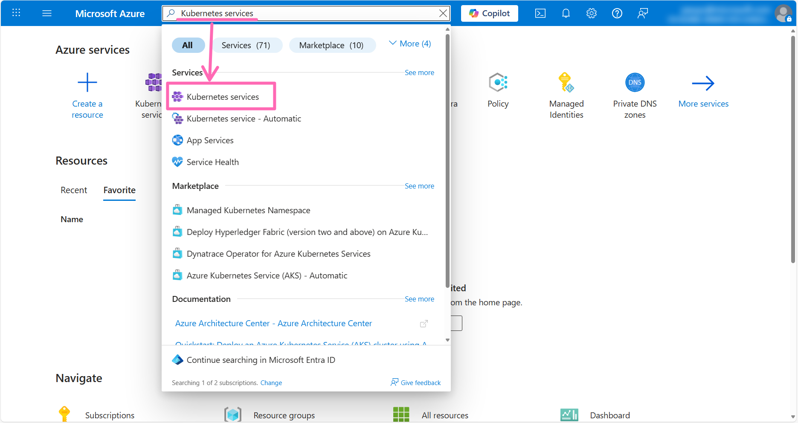

In the upper left portion of the screen, click the **+ Create** button to view all the available options for creating a new AKS cluster. Click on the **Deploy application (new)** option.

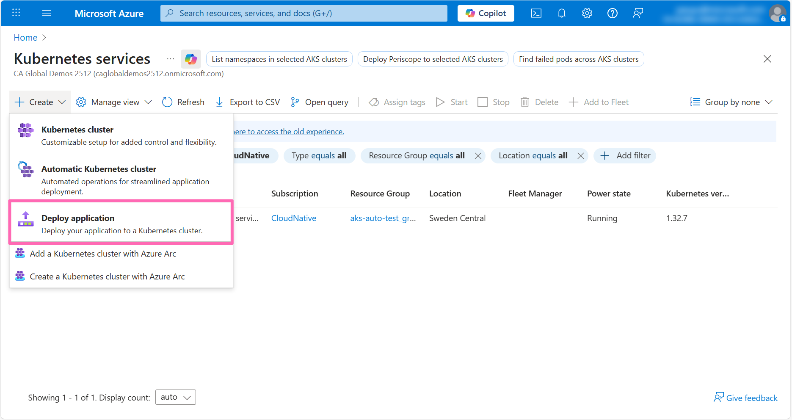

In the **Basics** tab, click on the **Deploy your application** option, then select your Azure subscription and resource group.

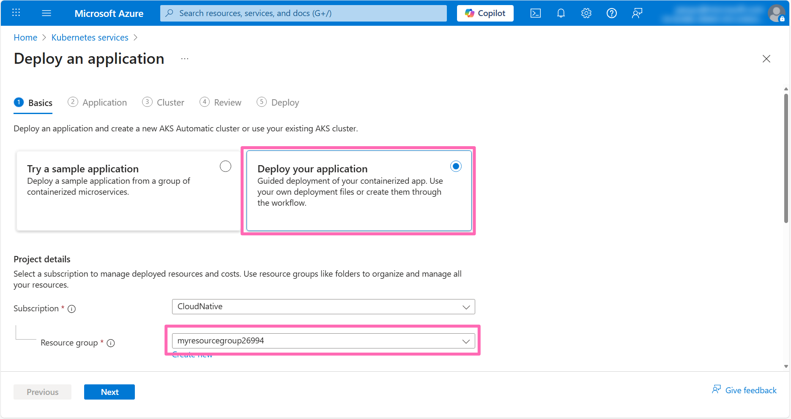

In the **Repository details** section, type `contoso-air` as your **Workflow name**.

If you have not already authorized Azure to access your GitHub account, you will be prompted to do so. Click the **Authorize access** button to continue.


Once your GitHub account is authorized, you will be able to select the repository you forked earlier. Click the **Select repository** drop down, then select the **contoso-air** repository you forked earlier and leave the branch defaulted to **main**.

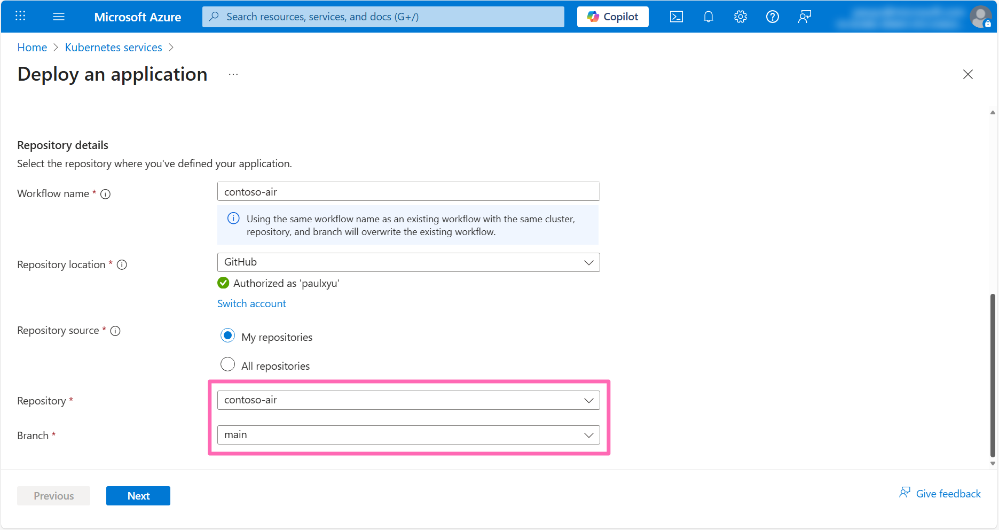

Click **Next**.

In the **Application** tab, fill in the following in the **Image** section:

- **Container configuration**: Select **Auto-containerize (generate Dockerfile)**
- **Save files in repository**: Click the **Select** link to open the directory explorer, then navigate to the `Root/src` directory, select the checkbox next to the `web` folder, then click **Select**.

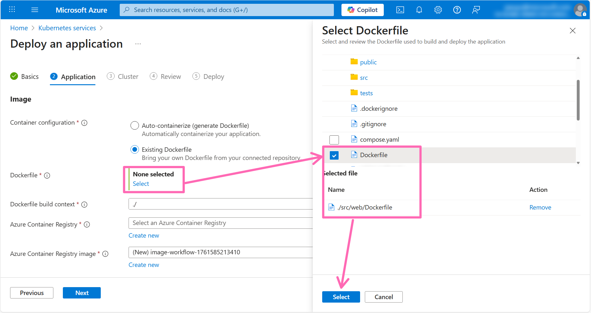

Scroll down to the **Dockerfile configuration** section, fill in the following details:

- **Application environment**: Select **JavaScript - Node.js 22**
- **Application port**: Enter **3000**
- **Dockerfile build context**: Enter `./src/web`
- **Azure Container Registry**: Select your Azure Container Registry
- **Azure Container Registry image**: Click the **Create new** link then enter `contoso-air`

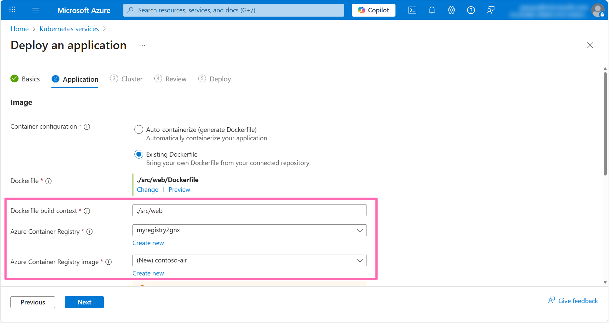

Scroll down to the **Deployment configuration** section and fill in the following details:

- **Deployment options**: Select **Generate application deployment files**
- **Save files in repository**: Click the **Select** link to open the directory explorer, then select the checkbox next to the `Root` folder, then click **Select**.

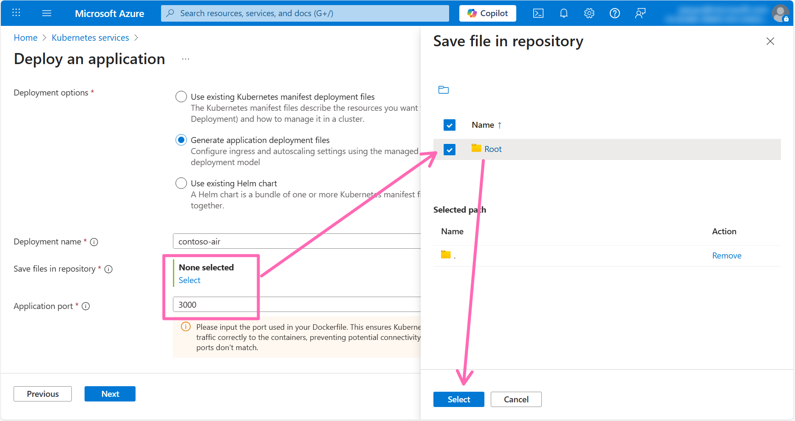

Click **Next**.

In the **Cluster configuration** section, make sure the **Create Automatic Kubernetes cluster** option is selected and set the **Kubernetes cluster name** to be `myakscluster`.

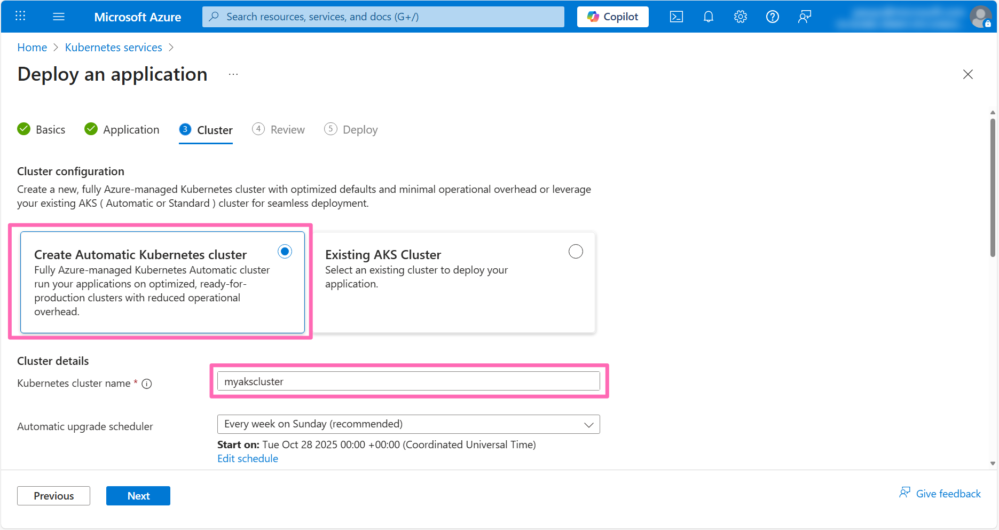

For **Namespace**, select **Create new** and enter `dev`.

You can leave the remaining fields as their default values.

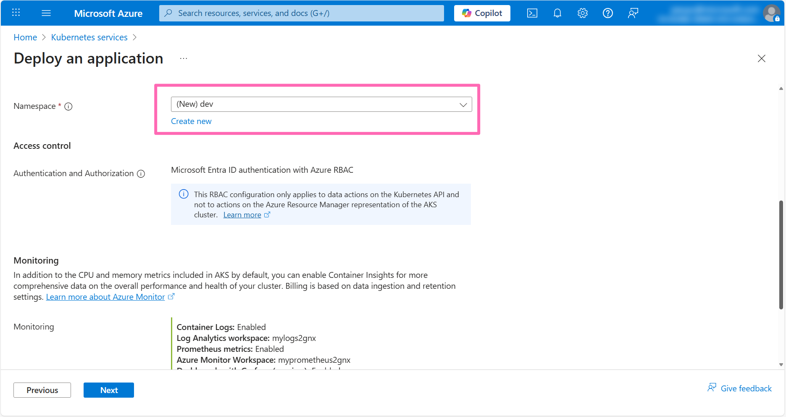

:::note

You will see that the monitoring and logging options have been enabled by default and set to use the Azure resources that are available in your subscription. If you don't have these resources available, AKS Automatic will create them for you.

:::

Click **Next**.

In the **Review** tab, you will see a summary of the configuration you have selected and view a preview of the Dockerfile and Kubernetes deployment files that will be generated for you.

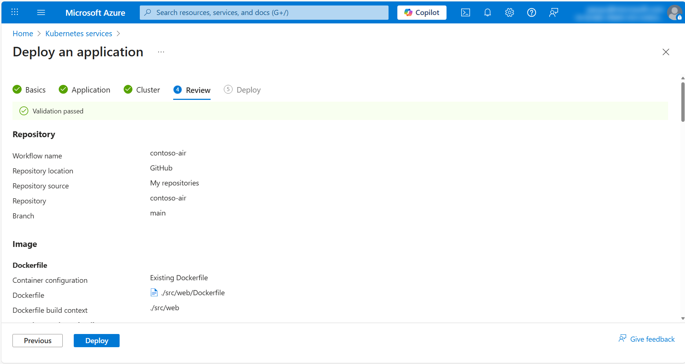

When ready, click the **Deploy** button to start the deployment.

:::warning

This process can take up to 20 minutes to complete

:::

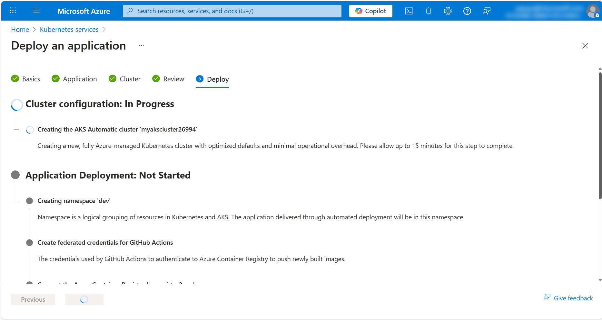

### Review the pull request

Once the deployment is complete, click on the **Approve pull request** button to view the pull request to be taken to the pull request page in your GitHub repository. 

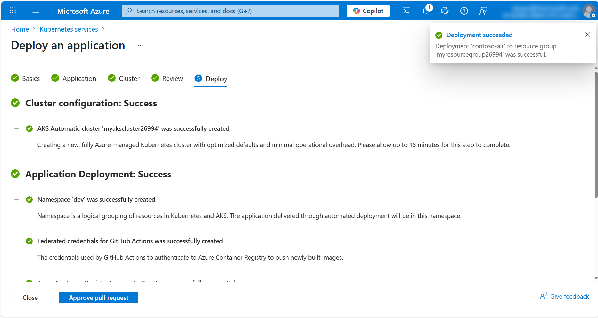

In the pull request review, click on the **Files changed** tab to view the changes that were made by the Automated Deployments workflow. 

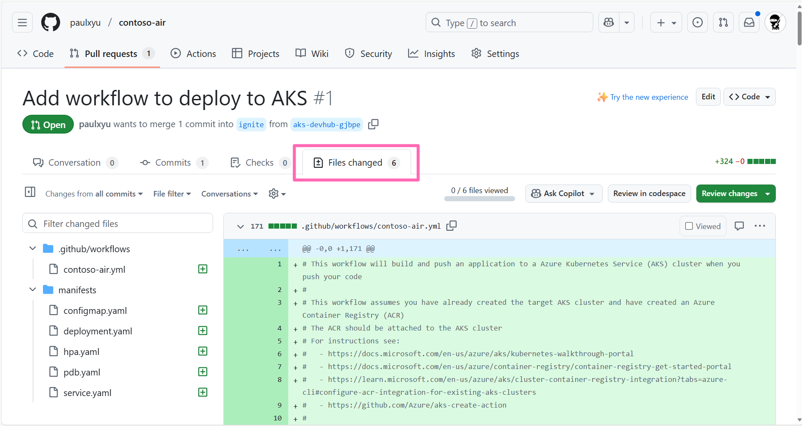

Navigate back to the **Conversation** tab and click on the **Merge pull request** button to merge the pull request, then click **Confirm merge**.

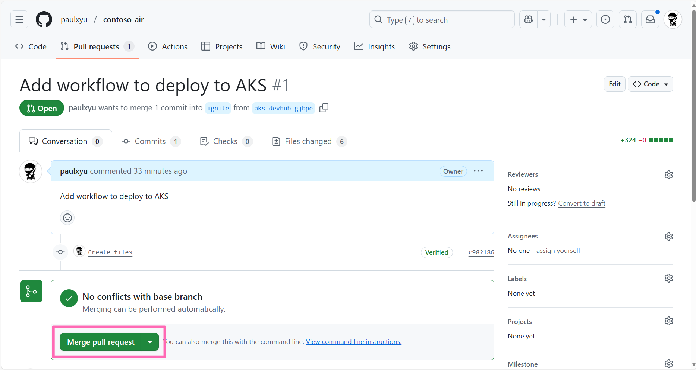

With the pull request merged, the changes will be automatically deployed to your AKS cluster. You can view the deployment logs by clicking on the **Actions** tab in your GitHub repository.

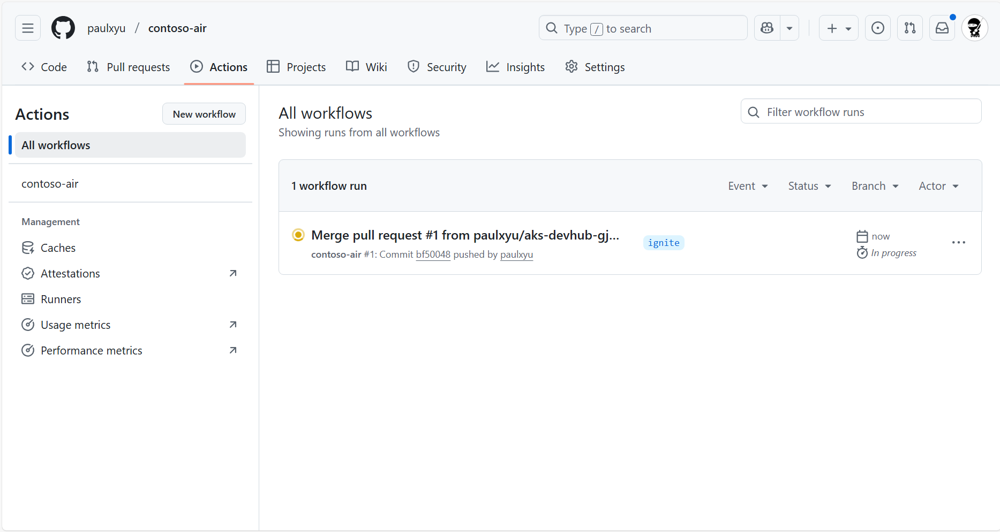

In the **Actions** tab, you will see the Automated Deployments workflow running. Click on the workflow run to view the logs.

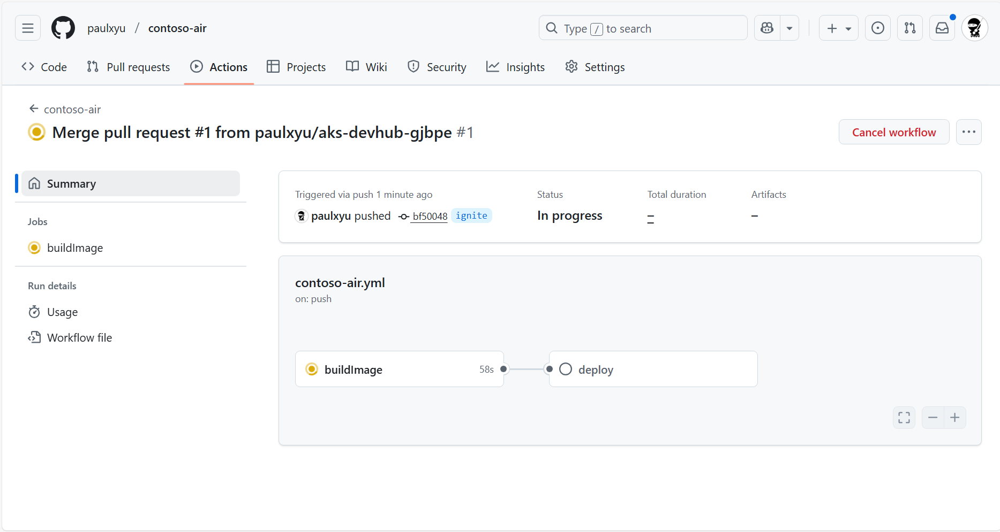

In the workflow run details page, you can view the logs of each step in the workflow by simply clicking on the step.

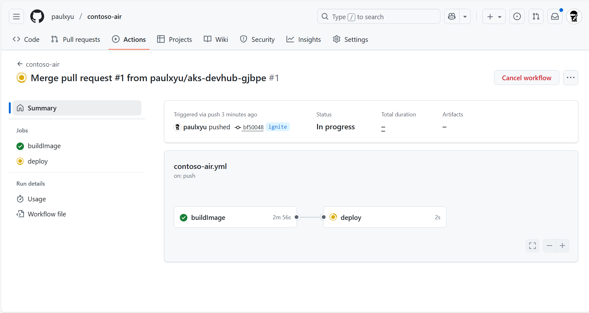

After a few minutes, the workflow will complete and you will see two green check marks next to the **buildImage** and **deploy** steps. This means that the application has been successfully deployed to your AKS cluster.

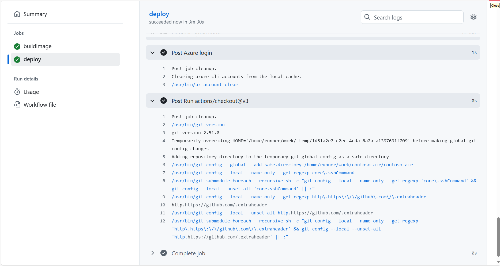

### Test the deployed application

Back in the Azure portal, click the **Close** button to close the Automated Deployments setup. 

In the left-hand menu, click on **Services and ingresses** under the **Kubernetes resources** section. You should see a new service called `contoso-air` with a public IP address assigned to it. Click on the IP address to view the deployed application.

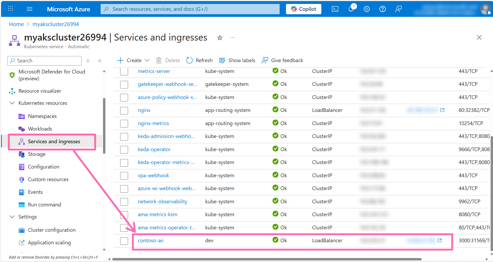

With AKS Automated Deployments, every time you push application code changes to your GitHub repository, the GitHub Action workflow will automatically build and deploy your application to your AKS cluster. This is a great way to automate the deployment process and ensure that your applications are always up-to-date!

Let's test the application functionality by clicking the **Login** link in the upper right corner of the page. 


There is no authentication required, so you can simply type in whatever you like for the username and password and click the **Log in** button.


Click on the **Book** button and fill in the form with your trip details and click the **Find flights** button. 


You will see some available flight options. Scroll to the bottom of the page and click **Next** to continue.


Did you notice that the application redirected you back to the login page? What happened? Let's find out...

### Troubleshoot the application

Head back over to the Azure portal and click on **Logs** under the **Monitoring** section of the AKS cluster left-hand menu. Here you can view the logs collected by the Azure Monitor agent running on the cluster nodes.

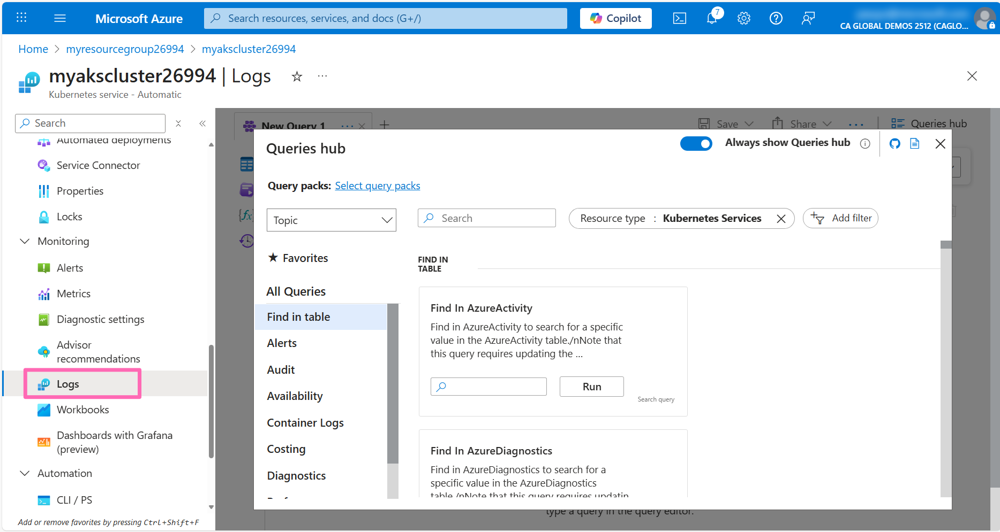

Close the **Queries hub** pop-up to get to the query editor, then enter the following query to view container logs.

```kql
ContainerLogV2
| where LogLevel contains "error"
```

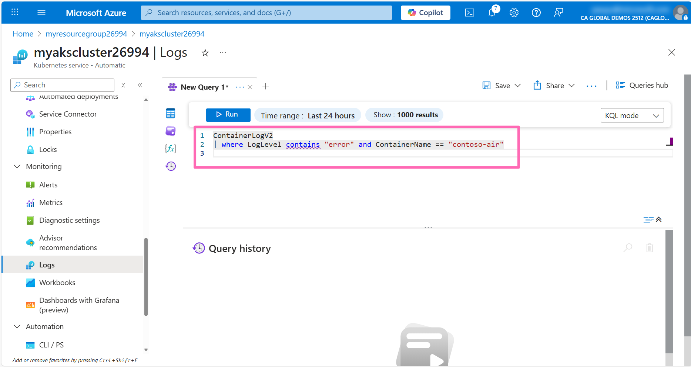

Expand some of the logs to see the error messages that were generated by the application.

You should see an error message that says `Azure CosmosDB settings not found. Booking functionality not available.`.


This error occurred because the application is trying to connect to an Azure CosmosDB database to store the booking information, but the connection settings are not configured. We can fix this by adding configuration to the application.

## Integrating apps with Azure services

Let's use the [AKS Service Connector](https://learn.microsoft.com/azure/service-connector/overview) to connect the application to Azure CosmosDB. Service Connector is a new feature that greatly simplifies the process of configuring [Workload Identity](https://learn.microsoft.com/azure/aks/workload-identity-overview?tabs=dotnet) for your applications running on AKS. [Workload Identity](https://learn.microsoft.com/entra/workload-id/workload-identities-overview) is a feature that allows you to assign an identity to a pod and use that identity to authenticate with Microsoft Entra ID to access Azure services.

:::tip

Workload Identity is the recommended way to authenticate with Azure services from your applications running on AKS. It is more secure than using service principals and does not require you to manage credentials in your application. To read more about the implementation of Workload Identity for Kubernetes, see [this doc](https://azure.github.io/azure-workload-identity/docs/).

:::

### Service Connector setup

In the left-hand menu, click on **Service Connector** under **Settings** then click on the **+ Create** button.

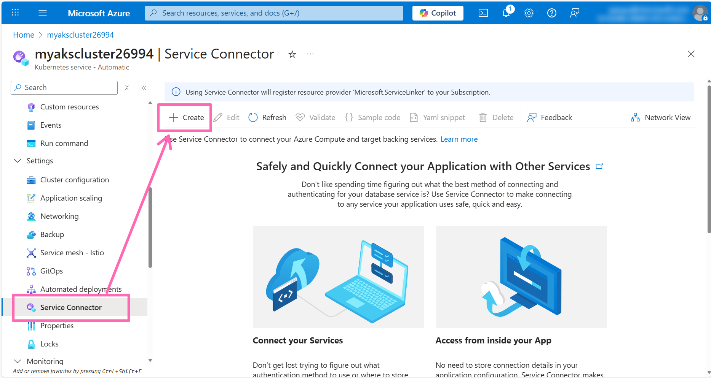

In the **Basics** tab, enter the following details:

- **Kubernetes namespace**: Enter **dev**
- **Service type**: Select **Cosmos DB**
- **API type**: Select **MongoDB**
- **MongoDB database**: Select **test**

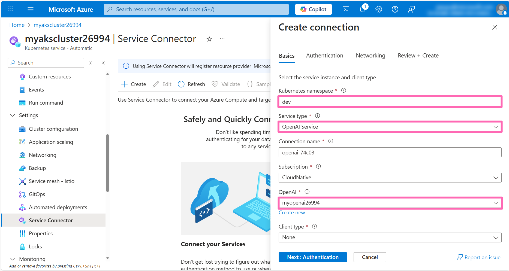

Click **Next: Authentication**.

In the **Authentication** tab, select the **Workload Identity** option and select the user-assigned managed identity with a name that starts with `mymongo` and ends with `-identity`.

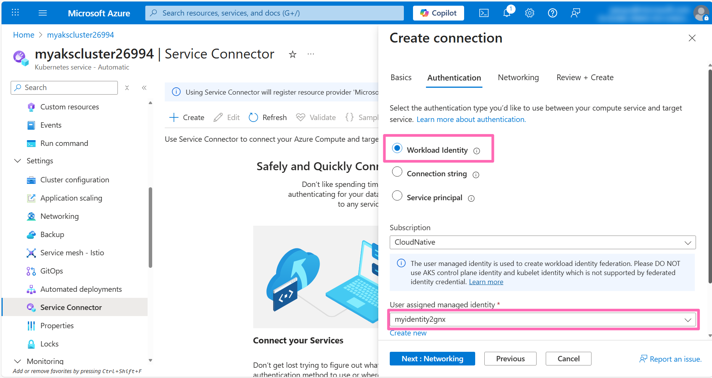

Click **Next: Networking** then click **Next: Review + create** and finally click **Create**.

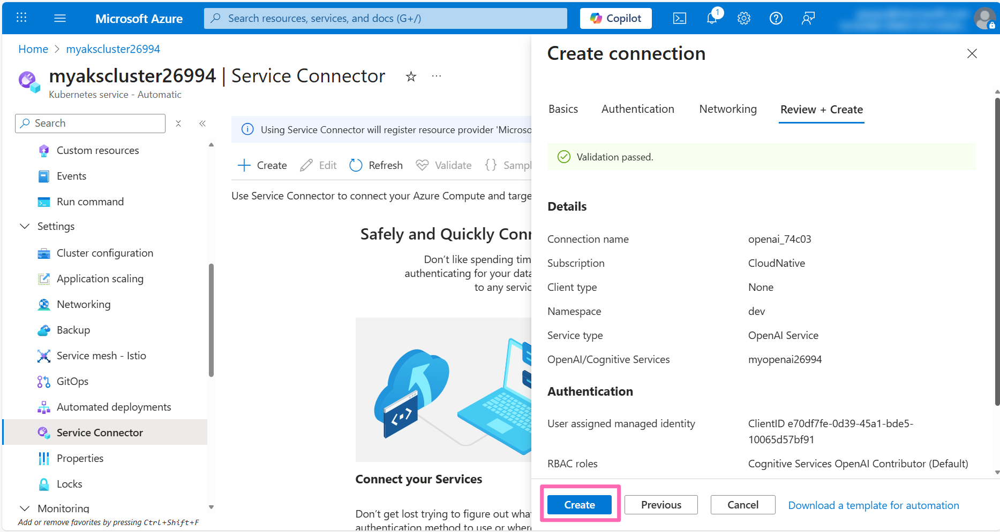

:::info

This process will take a few minutes as the Service Connector does some work behind the scenes to configure Workload Identity for the application. Some of the tasks include assigning the proper Azure role permissions to the [managed identity](https://learn.microsoft.com/entra/identity/managed-identities-azure-resources/overview) to access the CosmosDB, creating a [Federated Credential](https://learn.microsoft.com/entra/workload-id/workload-identity-federation) to establish trust between the Kubernetes cluster and the managed identity, creating a Kubernetes [ServiceAccount](https://kubernetes.io/docs/concepts/security/service-accounts/) with a link back to the managed identity, and finally creating a Kubernetes [Secret](https://kubernetes.io/docs/concepts/configuration/secret/) with the CosmosDB endpoint information.

:::

### Configure the application

Once the Service Connector for Azure CosmosDB has been created, you can configure the application to use the CosmosDB connection details.

In the Service Connector page, select the checkbox next to the CosmosDB connection and click the **Yaml snippet** button.

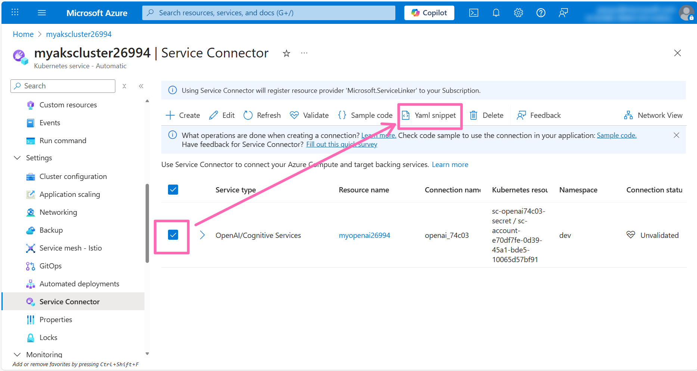

In the **YAML snippet** window, select **Kubernetes Workload** for **Resource type**, then select **contoso-air** for **Kubernetes Workload**.

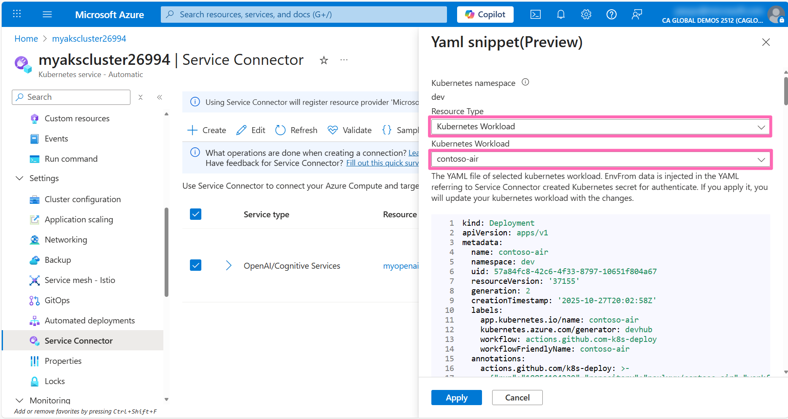

You will see the YAML manifest for the contoso-air application with the highlighted edits required to connect to CosmosDB via Workload Identity.


Scroll through the YAML manifest to view the changes highlighted in yellow, then click **Apply** to apply the changes to the application. This will redeploy the contoso-air application with the new connection details. 


Wait a minute or two for the new pod to be rolled out then navigate back to the application and attempt to book a flight. Now, you should be able to book a flight without any errors!


## Scaling your cluster and apps

Right now, the application is running a single replica. When the web app receives a lot of traffic, it may not be able to handle the load. To automatically scale your deployments, you can use the [Horizontal Pod Autoscaler (HPA)](https://kubernetes.io/docs/tasks/run-application/horizontal-pod-autoscale/) resource. HPA allows you to automatically scale a workload based on the resource utilization of the pods in the deployment. The resource utilization is based on the CPU and memory requests and limits set in the pod configuration, so it is important to set these values correctly to ensure the HPA can scale your application correctly.

### Vertical Pod Autoscaler (VPA) setup

Knowing what to set the request and limit values to can be challenging. This is where the [Vertical Pod Autoscaler (VPA)](https://kubernetes.io/docs/tasks/run-application/vertical-pod-autoscaling/) can help. It is a Kubernetes resource that allows you to automatically adjust the CPU and memory requests and limits for your pods based on the actual resource utilization of the pods. This can help you optimize the resource utilization of your pods and reduce the risk of running out of resources.

AKS Automatic comes with the VPA controller pre-installed, so you can use the VPA resource immediately by simply deploying a VPA resource manifest to your cluster.

Navigate to the **Custom resource** section under **Settings** in the AKS cluster left-hand menu. 

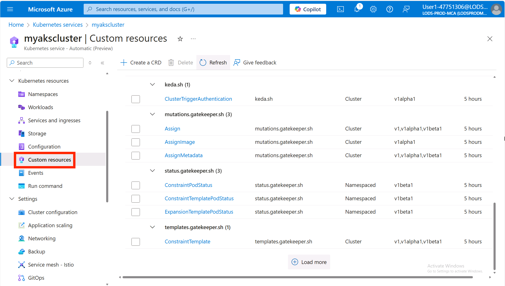

Scroll down to the bottom of the page and click on the **Load more** button to view all the available custom resources.

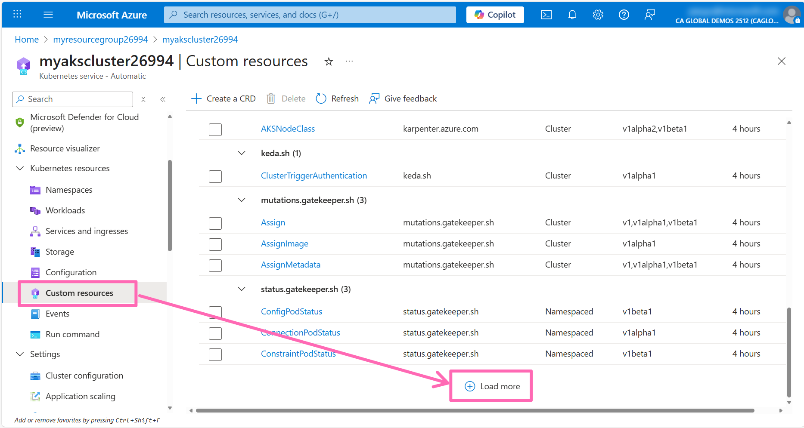

Click on the **VerticalPodAutoscaler** resource to view the VPA resources in the cluster.

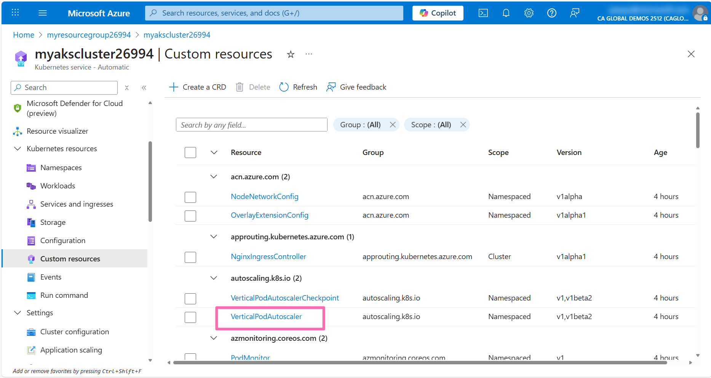

Click on the **+ Create** button and click the **Apply a YAML** option. 

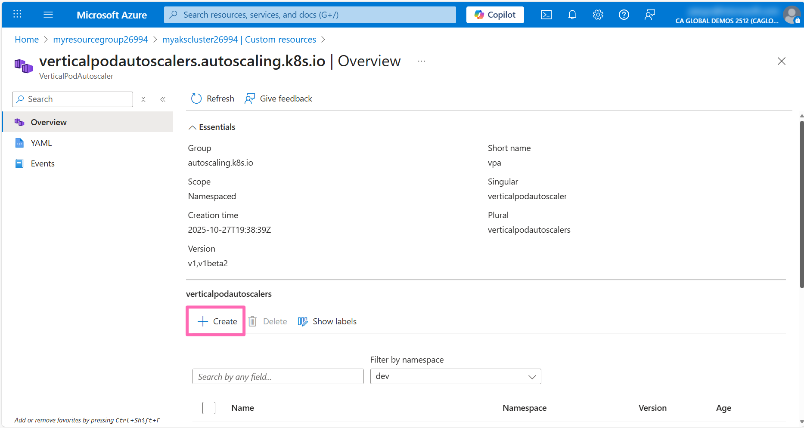

Let's lean on Microsoft Copilot in Azure to help generate the VPA manifest. In the text editor, press `Alt + I` to open the Copilot editor and type in the following prompt:

```text
Help me create a vertical pod autoscaler manifest for the contoso-air deployment in the dev namespace and set min and max cpu and memory to something typical for a nodejs app. Ensure the values for both requests and limits are set.
```

Press `Enter` to generate the VPA manifest.


When the VPA manifest is generated, click the copy button to copy the manifest to the clipboard. Then paste the manifest into the text editor in the Azure portal.

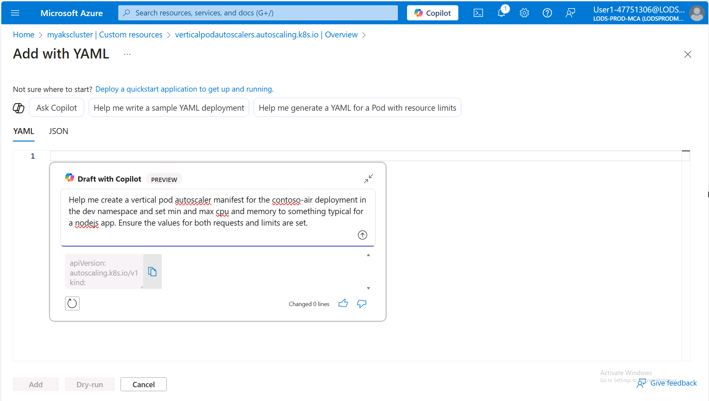

Click **Add** to create the VPA resource.

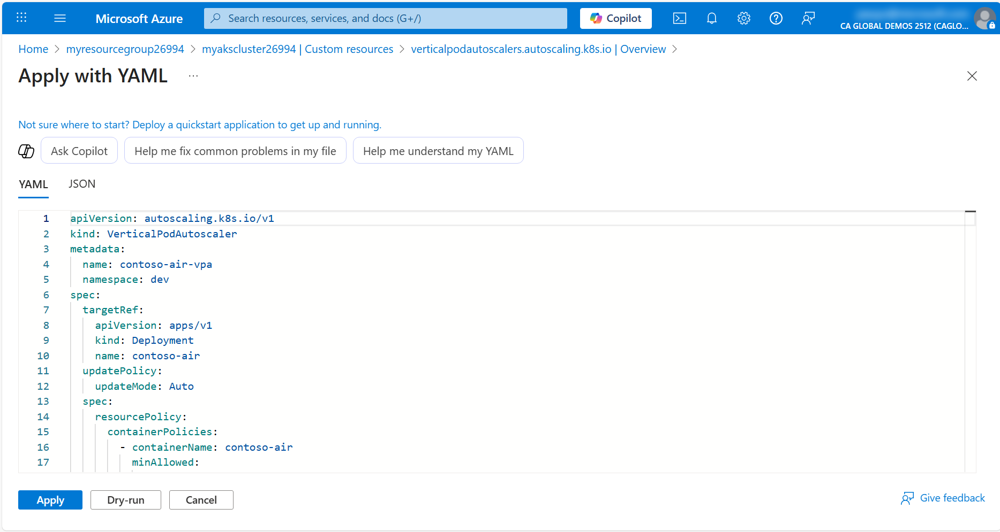

:::tip

The VPA resource will only update the CPU and memory requests and limits for the pods in the deployment if the number of replicas is greater than 1. Also the pod will be restarted when the VPA resource updates the pod configuration so it is important to create Pod Disruption Budgets (PDBs) to ensure that the pods are not restarted all at once.

:::

### KEDA scaler setup

The [Kubernetes Event-driven Autoscaling (KEDA)](https://keda.sh/) project that allows you to scale your application workloads based on the number of events in a queue, the length of a stream, the number of messages in a topic. Pretty much anything that emits a metric can be used to scale your application with KEDA.

AKS Automatic comes with the KEDA controller pre-installed, so you can use the KEDA resource immediately by simply deploying a KEDA resource manifest to your cluster.

Navigate to **Application scaling** under **Settings** in the AKS cluster left-hand menu,  then click on the **+ Create** button.

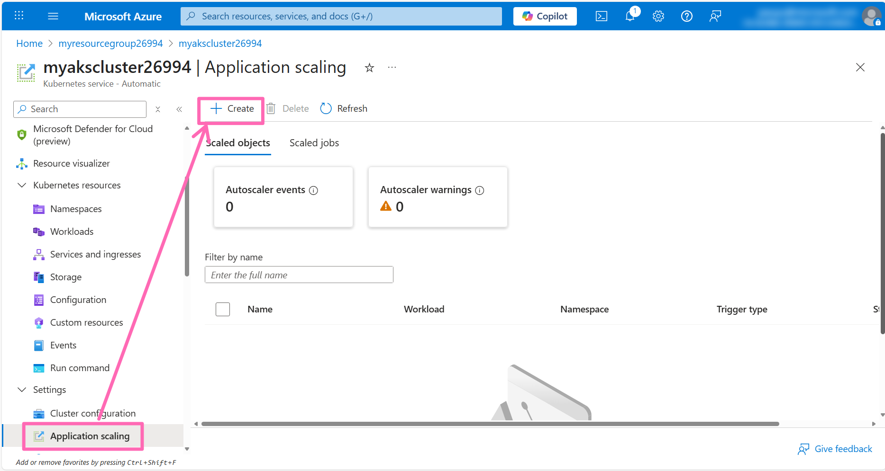

In the **Basics** tab, enter the following details:

- **Name**: Enter **contoso-air-so**
- **Namespace**: Select **dev**
- **Target workload**: Select **contoso-air**
- **Minimum replicas**: Enter **3**
- **Maximum replicas**: Enter **10**
- **Trigger type**: Select **CPU**

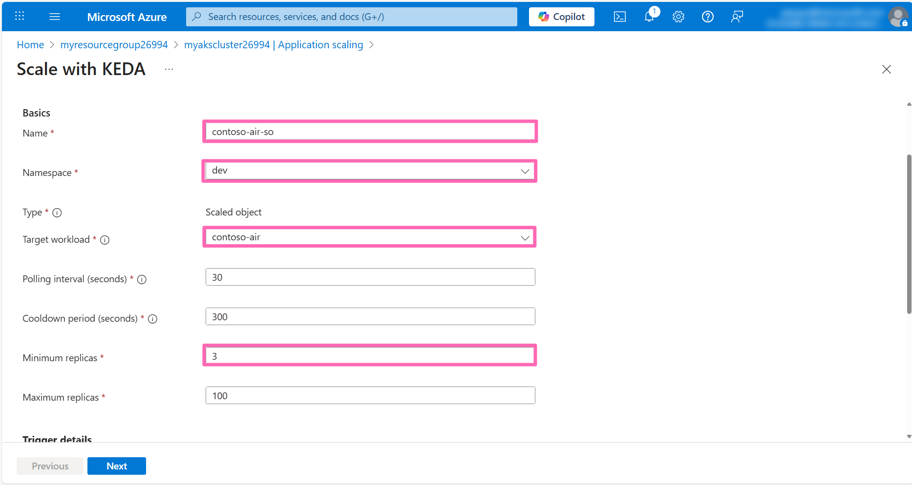

Leave the rest of the fields as their default values and click **Next**.

In the **Review + create** tab, click **Customize with YAML** to view the YAML manifest for the ScaledObject resource. You can see the YAML manifest the AKS portal generated for the ScaledObject resource. Here you can add additional configuration to the ScaledObject resource if needed.

Click **Save and create** to create the ScaledObject resource.

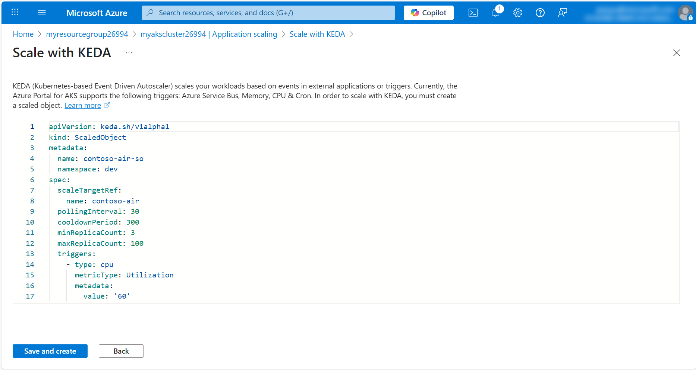

Head over to the **Workloads** section in the left-hand menu and click on **Deployments**. In the **Filter by namespace** field, enter **dev**. You should see the **contoso-air** deployment is now running 3 replicas.

:::note

Now that the number of replicas has been increased, the VPA resource will be able to adjust the CPU and memory requests and limits for the pods in the deployment based on the actual resource utilization of the pods the next time it reconciles.

:::

This was a simple example of using using KEDA. But using KEDA over the HPA for CPU and memory utilization doesn't give you lot to differentiate the experience. The real power of KEDA comes from its ability to scale your application based on external metrics like the number of messages in a queue, the length of a stream, the number of messages in a topic, or based on a custom schedule using CRON expressions. There are many [scalers](https://keda.sh/docs/2.15/scalers/) available for KEDA that you can use to scale your application based on a variety of external metrics.

To run a simple load test to see the scaling in action, you can use the [hey](https://github.com/rakyll/hey) tool to generate some traffic to the application. You can install the `hey` tool by running the following command:

```bash
curl -o hey https://hey-release.s3.us-east-2.amazonaws.com/hey_linux_amd64
chmod +x hey
sudo mv hey /usr/local/bin
```

Run the following command to generate some traffic to the application:

```bash
hey -z 60s http://<contoso-air-service-ip>
```

This will generate some traffic to the application for 60 seconds. You should see the number of replicas for the `contoso-air` deployment increase as the load increases.

### Node Autoprovisioning (NAP)

If you noticed it taking a while for the pods to start up after scaling the deployment, that's because the cluster nodes need to have enough resources to run the additional pods. With AKS Automatic, workloads are scheduled on the cluster in a user node pool that is managed by the AKS service. The AKS service will automatically scale the node pool to meet the demands of the workloads running on the cluster. This is known as [Node Autoprovisioning (NAP)](https://learn.microsoft.com/azure/aks/node-autoprovision?tabs=azure-cli).

 NAP is based on the open-source [Karpenter](https://karpenter.sh/) project, and the [AKS provider](https://github.com/Azure/karpenter-provider-azure), enables it to work with the Azure cloud. NAP will automatically scale your cluster node pool to meet the demands of your application workloads, not only with additional nodes, but will find the most efficient VM configuration to host the demands of your workloads.

We won't go into the details of setting up NAP in this workshop, but you can read more about it in the [AKS documentation](https://learn.microsoft.com/azure/aks/node-autoprovision?tabs=azure-cli).

## BONUS: Observing your cluster and apps

Monitoring and observability are key components of running applications in production. With AKS Automatic, you get a lot of monitoring and observability features enabled out-of-the-box. If you recall from the beginning of the workshop, we created an [Azure Log Analytics Workspace](https://learn.microsoft.com/azure/azure-monitor/logs/log-analytics-overview) with [Container Insights](https://learn.microsoft.com/azure/azure-monitor/containers/container-insights-overview) to collect application logs, [Azure Monitor Managed Workspace](https://learn.microsoft.com/azure/azure-monitor/containers/kubernetes-monitoring-enable?tabs=cli) to with [Prometheus recording rules](https://learn.microsoft.com/azure/azure-monitor/containers/prometheus-metrics-scrape-default) enabled to capture metrics from workloads within the cluster, and [Azure Managed Grafana](https://azure.microsoft.com/products/managed-grafana) to visualize the metrics.

### Cluster and container insights

Navigate to the **Monitoring** section in the AKS cluster left-hand menu and click on **Insights**. Here you will see a high-level overview of how the cluster is performing.

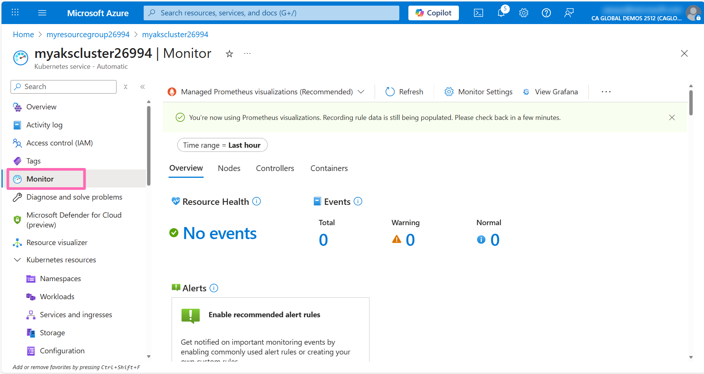

The AKS Automatic cluster was also pre-configured with basic CPU utilization and memory utilization alerts. You can also create additional alerts based on the metrics collected by the Prometheus workspace.

Click on the **Recommended alerts (Preview)** button to view the recommended alerts for the cluster. Expand the **Prometheus community alert rules (Preview)** section to see the list of Prometheus alert rules that are available. You can enable any of these alerts by clicking on the toggle switch.

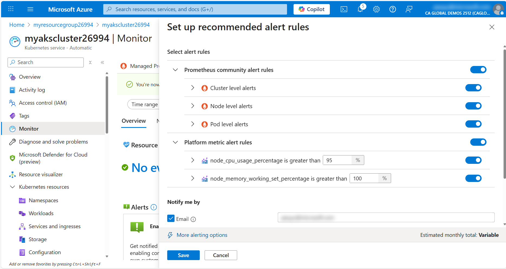

Click save to enable the alerts.

### Workbooks and logs

With Container Insights enabled, you can query the logs using Kusto Query Language (KQL). You can also create custom workbooks to visualize the data. One nice feature of Container Insights is having pre-configured workbooks that you can use to monitor your cluster and applications without having to write any queries.

In the **Monitoring** section of the AKS cluster left-hand menu, click on **Workbooks**. Here you will see a list of pre-configured workbooks that you can use to monitor your cluster.

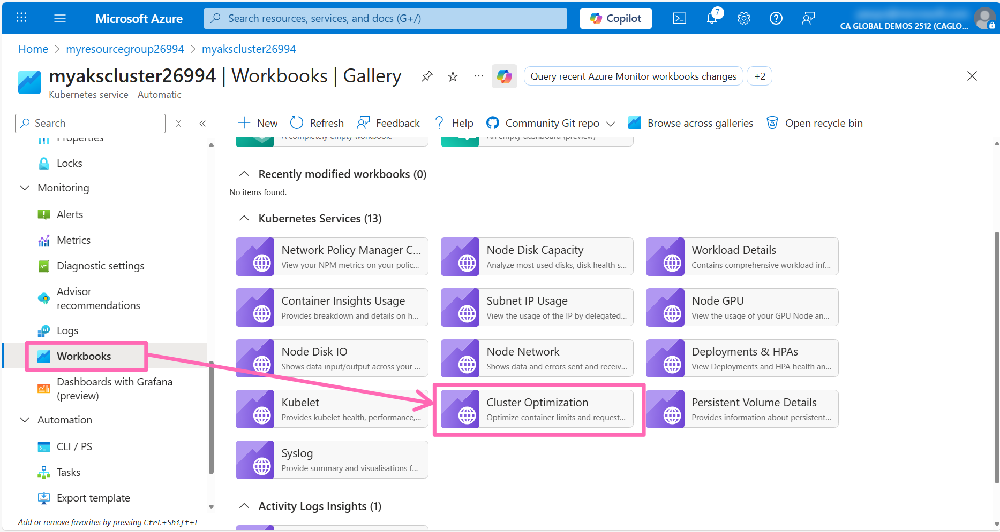

One workbook that is particularly useful is the **Cluster Optimization** workbook. This workbook can help you identify anomalies and detect application probe failures in addition to providing guidance on optimizing container resource requests and limits. Click on the **Cluster Optimization** workbook to view the details.

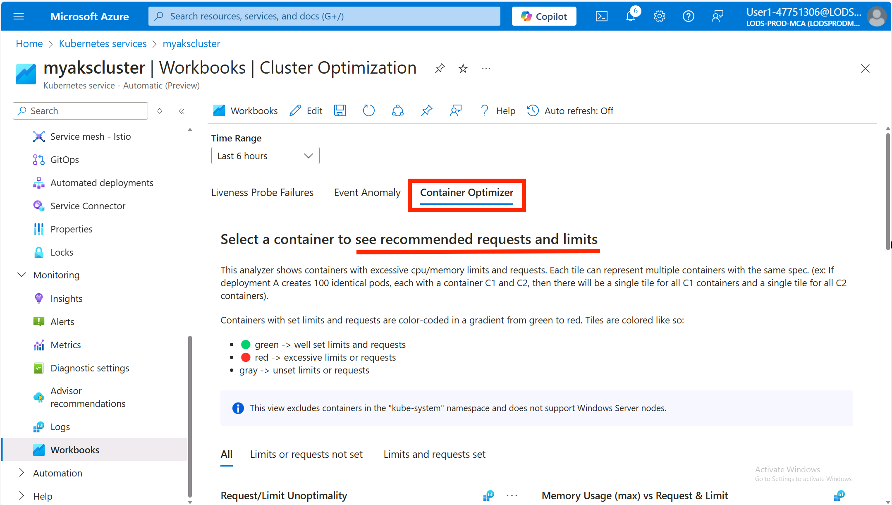

Take some time to explore the other workbooks available in the list.

:::tip

The workbook visuals will include a query button that you can click to view the KQL query that powers the visual. This is a great way to learn how to write your own queries.

:::

If you click on the **Logs** section in the left-hand menu, you can view the logs collected by Container Insights. Here, you can write your own KQL queries or run pre-configured queries to logs from your cluster and applications. 

:::note

You did this earlier when you were troubleshooting the application.

:::

If you expand the **Logs** menu, click on **Queries**, and scroll down to the **Container Logs** section, you will see a list of pre-configured queries that you can run. Click on a query and click **Run** to view the results.

You can also view live streaming logs for a specific container by clicking on the **Workloads** section in the left-hand menu. In the **Deployments** tab, scroll down and locate the **order-service** deployment. Click on the **order-service** deployment to view the details. In the left-hand menu, click on **Live logs**, then select the pod you want to view logs for.

:::info 

This is the equivalent of running `kubectl logs -f <pod-name>` in the terminal.

:::

### Visualizing metrics with Grafana

The Azure Portal provides a great way to view metrics and logs, but if you prefer to visualize the data using Grafana, or execute complex queries using PromQL, you can use the Azure Managed Grafana instance that was created with the AKS Automatic cluster.

In the AKS cluster's left-hand menu, click on **Insights** under the **Monitoring** section and click on the **View Grafana** button at the top of the page. This will open a window with the linked Azure Managed Grafana instance. Click on the **Browse dashboards** link. This will take you to the Azure Managed Grafana instance.

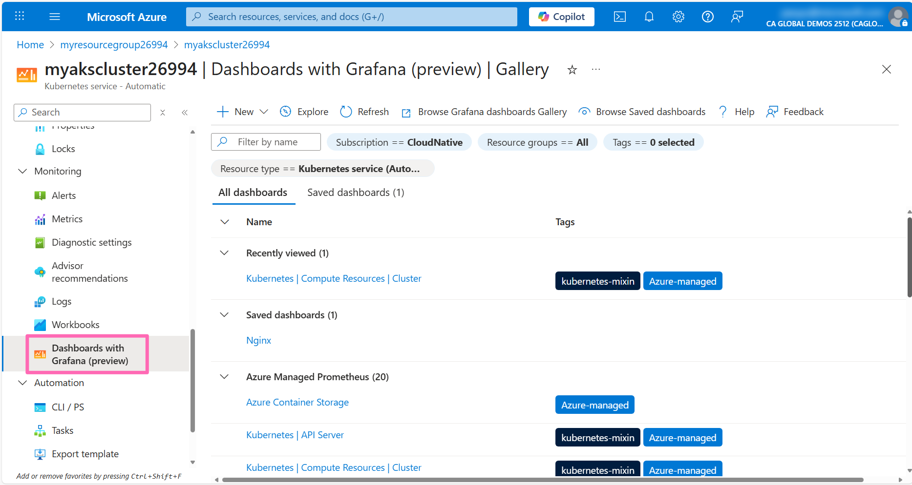

In the Grafana home page, click on the **Dashboards** link in the left-hand menu. Here you will see a list of pre-configured dashboards that you can use to visualize the metrics collected by the Prometheus workspace. In the **Dashboards** list, expand the **Azure Managed Prometheus** folder and explore the dashboards available.

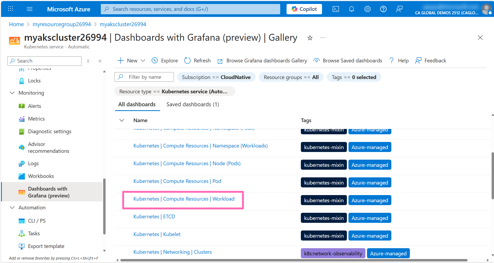

Each dashboard provides a different view of the metrics collected by the Prometheus workspace with controls to allow you to filter the data.

Click on a **Kubernetes / Compute Resources / Workload** dashboard. Filter the **namespace** to `default` the **type** to `deployment`, and the **workload** to `order-service`. This will show you the metrics for the order-service deployment.

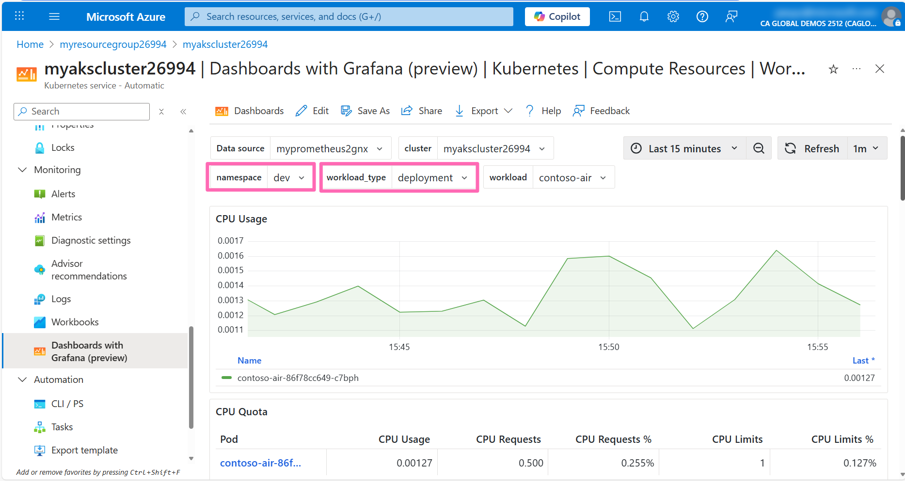

### Querying metrics with PromQL

If you prefer to write your own queries to visualize the data, you can use the **Explore** feature in Grafana. In the Grafana home page, click on the **Explore** link in the left-hand menu, and select the **Managed_Prometheus_defaultazuremonitorworkspace** data source.

The query editor supports a graphical query builder and a text-based query editor. The graphical query builder is a great way to get started with PromQL. You can select the metric you want to query, the aggregation function, and any filters you want to apply.

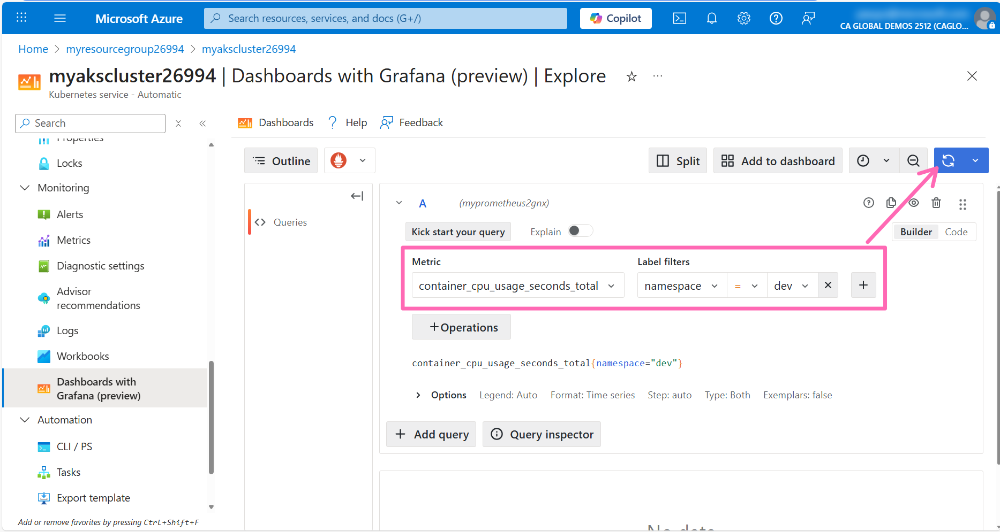

There is a lot you can do with Grafana and PromQL, so take some time to explore the features and visualize the metrics collected by the Prometheus workspace.

## Summary

In this workshop, you learned how to create an AKS Automatic cluster and deploy an application to the cluster using Automated Deployments. From there, you learned how to troubleshoot application issues using the Azure portal and how to integrate applications with Azure services using the AKS Service Connector. You also learned how to configure your applications for resource specific scaling using the Vertical Pod Autoscaler (VPA) and scaling your applications KEDA. Hopefully, you now have a better understanding of how easy it can be to build and deploy applications on AKS Automatic.

To learn more about AKS Automatic, visit the [AKS documentation](https://learn.microsoft.com/azure/aks/intro-aks-automatic).

In addition to this workshop, you can also explore the following resources:

- [Azure Kubernetes Service (AKS) documentation](https://learn.microsoft.com/azure/aks)
- [Kubernetes: Getting started](https://azure.microsoft.com/solutions/kubernetes-on-azure/get-started/)
- [Learning Path: Introduction to Kubernetes on Azure](https://learn.microsoft.com/training/paths/intro-to-kubernetes-on-azure/)
- [Learning Path: Deploy containers by using Azure Kubernetes Service (AKS)](https://learn.microsoft.com/training/paths/deploy-manage-containers-azure-kubernetes-service/)

If you have any feedback or suggestions for this workshop, please feel free to open an issue or pull request in the [GitHub repository](https://github.com/Azure-Samples/aks-labs)
