import Prerequisites from "../../src/components/SharedMarkdown/_prerequisites.mdx";
import ProvisionResourceGroup from "../../src/components/SharedMarkdown/_provision_resource_group.mdx";
import ProvisionResources from "../../src/components/SharedMarkdown/_provision_resources.mdx";
import Cleanup from "../../src/components/SharedMarkdown/_cleanup.mdx";

This workshop will show you how easy it is to deploy applications to AKS Automatic. AKS Automatic is a new way to deploy and manage Kubernetes clusters on Azure. It is a fully managed Kubernetes service that simplifies the deployment, management, and operations of Kubernetes clusters. With AKS Automatic, you can deploy a Kubernetes cluster with just a few clicks in the Azure Portal, and it is designed to be simple and easy to use, so you can focus on building your applications!

---

## Objectives

After completing this workshop, you will be able to:

- Deploy an application to an AKS Automatic cluster
- Troubleshoot application issues
- Integrate applications with Azure services
- Scale your cluster and applications
- Observe your cluster and applications

---

<Prerequisites />

This workshop will need some Azure preview features enabled and resources to be pre-provisioned. You can use the Azure CLI commands below to register the preview features.

Register preview features.

```bash
az feature register --namespace Microsoft.ContainerService --name AzureMonitorAppMonitoringPreview
```

Register resource providers.

```bash
az provider register --namespace Microsoft.DevHub
az provider register --namespace Microsoft.Insights
az provider register --namespace Microsoft.PolicyInsights
az provider register --namespace Microsoft.ServiceLinker
```

:::warning

As noted in the AKS Automatic [documentation](https://learn.microsoft.com/azure/aks/automatic/quick-automatic-managed-network?pivots=azure-portal), AKS Automatic tries to dynamically select a virtual machine size for the system node pool based on the capacity available in the subscription. Make sure your subscription has quota for 16 vCPUs of any of the following sizes in the region you're deploying the cluster to: [Standard_D4pds_v5](https://learn.microsoft.com/azure/virtual-machines/sizes/general-purpose/dpsv5-series), [Standard_D4lds_v5](https://learn.microsoft.com/azure/virtual-machines/sizes/general-purpose/dldsv5-series), [Standard_D4ads_v5](https://learn.microsoft.com/azure/virtual-machines/sizes/general-purpose/dadsv5-series), [Standard_D4ds_v5](https://learn.microsoft.com/azure/virtual-machines/sizes/general-purpose/ddsv5-series), [Standard_D4d_v5](https://learn.microsoft.com/azure/virtual-machines/sizes/general-purpose/ddv5-series), [Standard_D4d_v4](https://learn.microsoft.com/azure/virtual-machines/sizes/general-purpose/ddv4-series), [Standard_DS3_v2](https://learn.microsoft.com/azure/virtual-machines/sizes/general-purpose/dsv3-series), [Standard_DS12_v2](https://learn.microsoft.com/azure/virtual-machines/sizes/memory-optimized/dv2-dsv2-series-memory). You can [view quotas for specific VM-families and submit quota increase requests](https://learn.microsoft.com/azure/quotas/per-vm-quota-requests) through the Azure portal.

Also, to support the deployment of AKS Automatic in private virtual networks, AKS Automatic is currently limited to regions that support API Server VNet integration. See the [limited availability section of the **Use API Server VNet integration**](https://learn.microsoft.com/azure/aks/api-server-vnet-integration#limited-availability) for more details.

:::

<ProvisionResourceGroup />
<ProvisionResources />

After you have provisioned the required resources, the last thing you need to do is create an [Azure OpenAI account](https://learn.microsoft.com/azure/ai-foundry/openai/overview) and `gpt-4.1-mini` model which is not included in the ARM template you just deployed.

You can do that by running the following commands.

```bash
# Set the Azure OpenAI account name
export AOAI_NAME=myopenai$RAND

# Create the Azure OpenAI account
AOAI_ID=$(az cognitiveservices account create \
--resource-group $RG_NAME \
--location $LOCATION \
--name $AOAI_NAME \
--custom-domain $AOAI_NAME \
--kind OpenAI \
--sku S0 \
--assign-identity \
--query id -o tsv)

# Create a deployment for the gpt-4.1-mini model
az cognitiveservices account deployment create \
-n $AOAI_NAME \
-g $RG_NAME \
--deployment-name gpt-4.1-mini \
--model-name gpt-4.1-mini \
--model-version 2025-04-14 \
--model-format OpenAI \
--sku-capacity 200 \
--sku-name GlobalStandard
```

Once the resources are deployed, you can proceed with the workshop.

:::tip

Keep your terminal open as you will need it to run commands throughout the workshop.

:::

---

## Deploy your app to AKS Automatic

With AKS, the [Automated Deployments](https://learn.microsoft.com/azure/aks/automated-deployments) feature allows you to create [GitHub Actions workflows](https://docs.github.com/actions) that allows you to start deploying your applications to your AKS cluster with minimal effort, even if you don't already have an AKS cluster. All you need to do is point it at a GitHub repository with your application code.

If you have Dockerfiles or Kubernetes manifests in your repository, that's great, you can simply point to them in the Automated Deployments setup. If you don't have Dockerfiles or Kubernetes manifests in your repository, don't sweat 😅 Automated Deployments can create them for you 🚀

### Fork and clone the sample repository

Open a bash shell and run the following command then follow the instructions printed in the terminal to complete the login process.

```bash
gh auth login
```

After you've completed the login process, run the following command to fork the [contoso-air](https://github.com/Azure-Samples/contoso-air) repository to your GitHub account.

```bash
gh repo fork Azure-Samples/contoso-air --clone --default-branch-only
```

Change into the `contoso-air` directory.

```bash
cd contoso-air
```

Set the default repository to your forked repository.

```bash
gh repo set-default
```

:::warning

When prompted, select your fork of the repository and press **Enter**. Do not select the original **Azure-Samples/contoso-air** repository.

:::

You're now ready to deploy the sample application to your AKS cluster.

### Automated Deployments setup

Log in to the [Azure portal](https://portal.azure.com/?feature.Microsoft_Azure_AutomaticAKS=flight4) type **Kubernetes services** in the search box at the top of the page and click the **Kubernetes services** option from the search results.

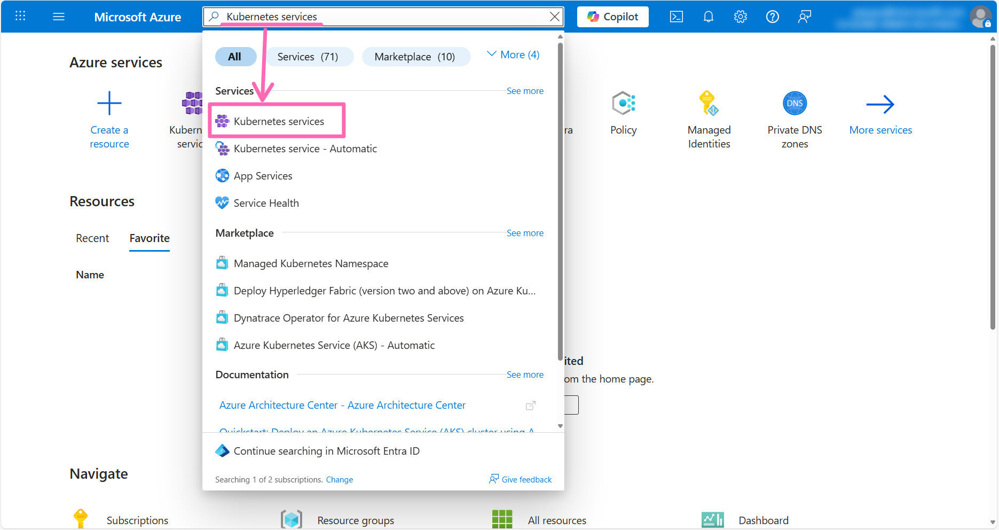

In the upper left portion of the screen, click the **+ Create** button to view all the available options for creating a new AKS cluster.

Click on the **Deploy application** option.


In the **Basics** tab, click on the **Deploy your application** option, then select your Azure subscription and the resource group you created during the lab environment setup.

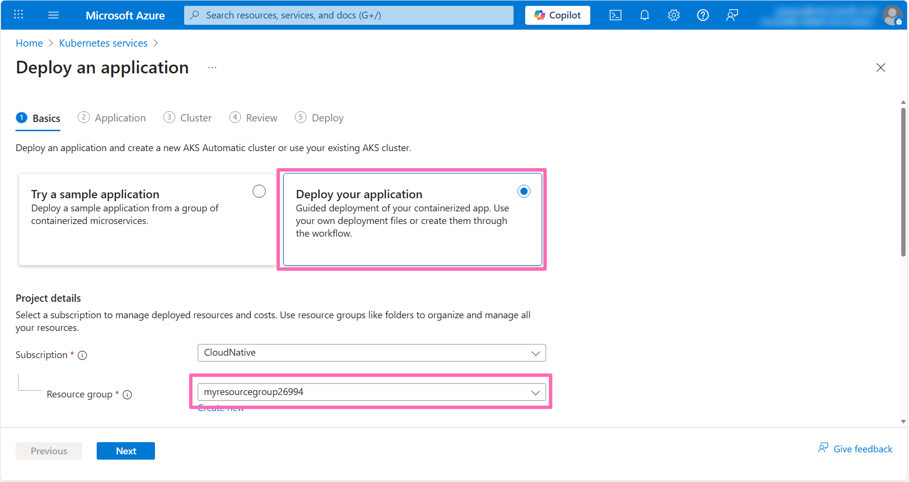

In the **Repository details** section set **Workflow name** to `contoso-air`.

If you have not already authorized Azure to access your GitHub account, you will be prompted to do so. Click the **Authorize access** button to continue. Once your GitHub account is authorized, you will be able to select the repository you forked earlier.

Click the **Select repository** drop down, then select the **contoso-air** repository you forked earlier, and select the **main** branch.


Click **Next**.

In the **Application** tab, complete the **Image** section with the following details:

- **Container configuration**: Select **Existing Dockerfile**
- **Dockerfile**: Click the **Select** link, browse to the **./src/web** directory, select the Dockerfile, then click the **Select** button


- **Dockerfile build context**: Enter `./src/web`
- **Azure Container Registry**: Select the Azure Container Registry in your resource group
- **Azure Container Registry image**: Click the **Create new** link then enter `contoso-air`


In the **Deployment configuration** section and fill in the following details:

- **Deployment options**: Select **Generate application deployment files**
- **Save files in repository**: Click the **Select** link to open the directory explorer, then select the checkbox next to the **Root** folder, then click **Select**.
- **Application port**: Enter `3000`

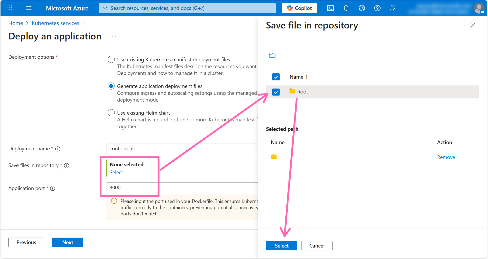

Click **Next**.

In the **Cluster configuration** section, ensure the **Create Automatic Kubernetes cluster** option is chosen and specify `myakscluster` as the **Kubernetes cluster name**.


For **Namespace**, select **Create new** and type `dev`.

:::warning

Be sure to set the namespace to `dev` as instructions later in the workshop will use this namespace.

:::

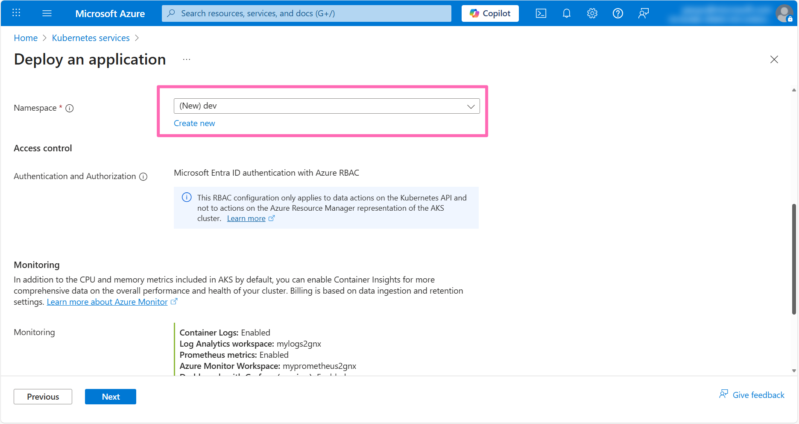

You will see that the monitoring and logging options have been enabled by default and set to use the Azure resources that are available in your subscription. If you don't have these resources available, AKS Automatic will create them for you. If you want to change the monitoring and logging settings, you can do so by clicking on the **Change** link and selecting the desired target resources for monitoring and logging. Leave the remaining fields at their default values.

Click **Next**.

In the **Review** tab, you will see a summary of the configuration you have selected and view a preview of the Dockerfile and Kubernetes deployment files that will be generated for you.


When ready, click the **Deploy** button to start the deployment.

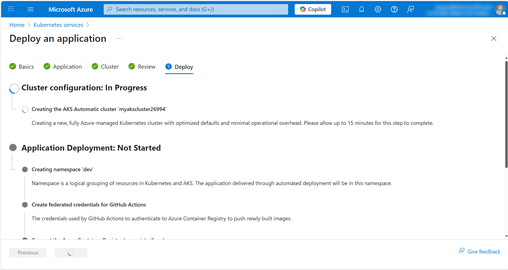

:::danger

This process can take up to 20 minutes to complete. Do not close the browser window or navigate away from the page until the deployment is complete.

:::

### Review the pull request

Once the deployment is complete, click on the **Approve pull request** button to view the pull request to be taken to the pull request page in your GitHub repository.

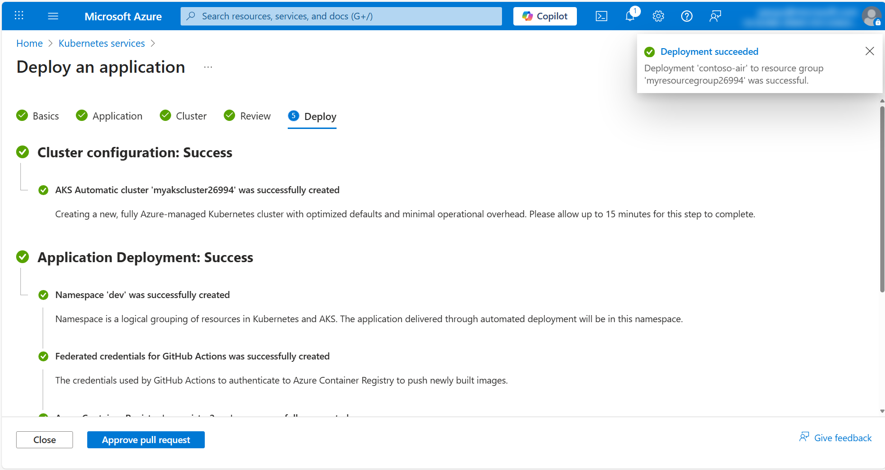

In the pull request review, click on the **Files changed** tab to view the changes that were made by the Automated Deployments workflow.

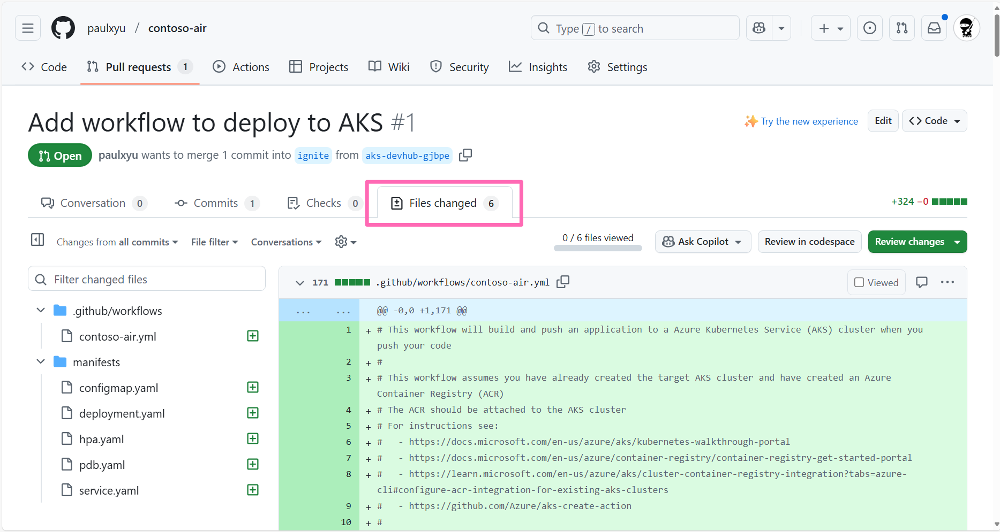

Navigate back to the **Conversation** tab and click on the **Merge pull request** button to merge the pull request, then click **Confirm merge**.

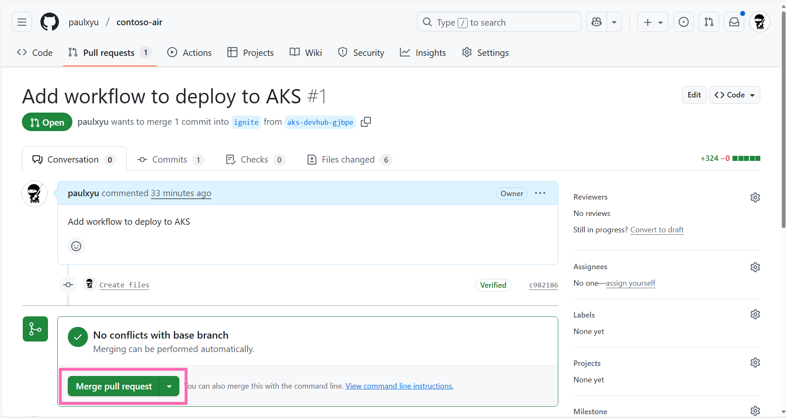

With the pull request merged, the changes will be automatically deployed to your AKS cluster. You can view the deployment logs by clicking on the **Actions** tab in your GitHub repository.

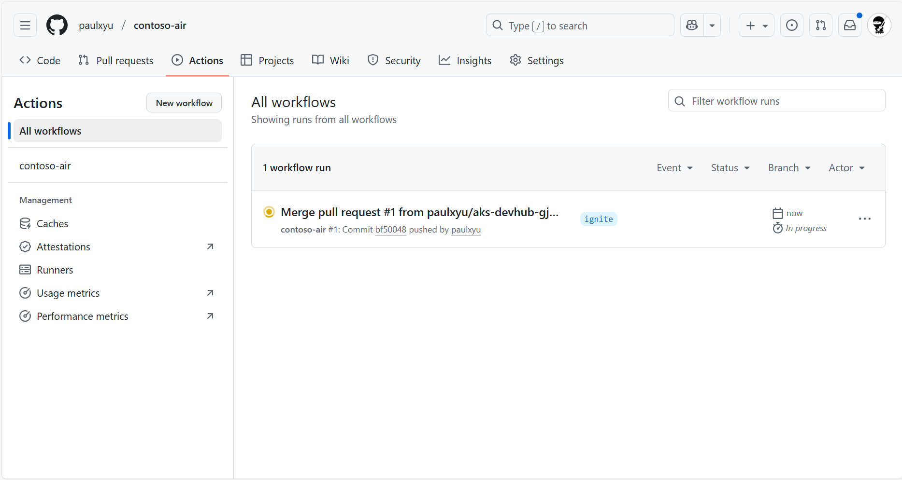

In the **Actions** tab, you will see the Automated Deployments workflow running. Click on the workflow run to view the logs.


In the workflow run details page, you can view the logs of each job in the workflow by simply clicking on the job.


After 5-10 minutes, the workflow will complete and you will see two green check marks next to the **buildImage** and **deploy** jobs. This means that the application has been successfully deployed to your AKS cluster.


:::tip
If the deploy job fails, it is likely that Node Autoprovisioning (NAP) is taking a bit longer than usual to provision a new node for the cluster. Try clicking the "Re-run" button at the top of the page to re-run the deploy workflow job.

:::

With AKS Automated Deployments, every time you push application code changes to your GitHub repository, the GitHub Action workflow will automatically build and deploy your application to your AKS cluster. This is a great way to automate the deployment process and ensure that your applications are always up-to-date!

### Test the deployed application

Back in the Azure portal, click the **Close** button to close the Automated Deployments setup.

In the left-hand menu, click on **Services and ingresses** under the **Kubernetes resources** section. You should see a new service called `contoso-air` with an external IP address assigned to it. Click on the IP address to view the deployed application.


Let's test the application's chat functionality by clicking the **Ask the AI travel assistant** button.

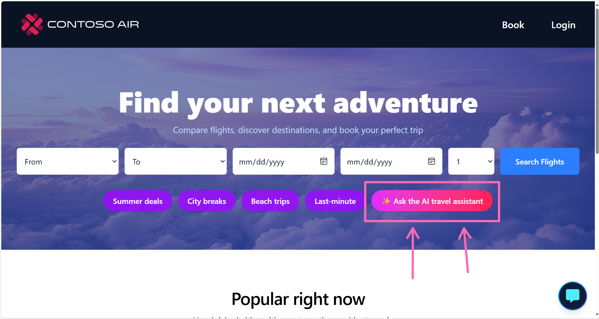

Attempt to interact with the AI assistant and you'll quickly find that the chat provider is not detected.

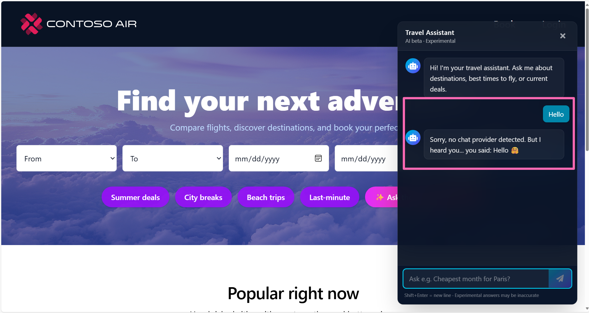

The application needs to be configured to a backend LLM (e.g., Azure OpenAI), but the connection settings are not configured. We can fix this by adding configuration to the application using the AKS Service Connector!

---

## Integrating apps with Azure services

[AKS Service Connector](https://learn.microsoft.com/azure/service-connector/overview) streamlines connecting applications to Azure resources like Azure OpenAI by automating the configuration of [Workload Identity](https://learn.microsoft.com/azure/aks/workload-identity-overview?tabs=javascript). This feature allows you to assign identities to pods, enabling them to authenticate with Microsoft Entra ID and access Azure services securely without passwords. For a deeper understanding, check out the [Workload Identity overview](https://learn.microsoft.com/entra/workload-id/workload-identities-overview).

:::tip

Workload Identity is the recommended way to authenticate with Azure services from your applications running on AKS. It is more secure than using service principals and does not require you to manage credentials in your application. To read more about the implementation of Workload Identity for Kubernetes, see [this doc](https://azure.github.io/azure-workload-identity/docs/).

:::

### Application configuration

Add configuration to the application to specify Azure OpenAI as the chat provider and the model deployed earlier. You can do this in the Azure portal by navigating to the **Configuration** section under **Kubernetes resources** in the left-hand menu, filtering by the `dev` namespace, and selecting the `contoso-air-config` config map.

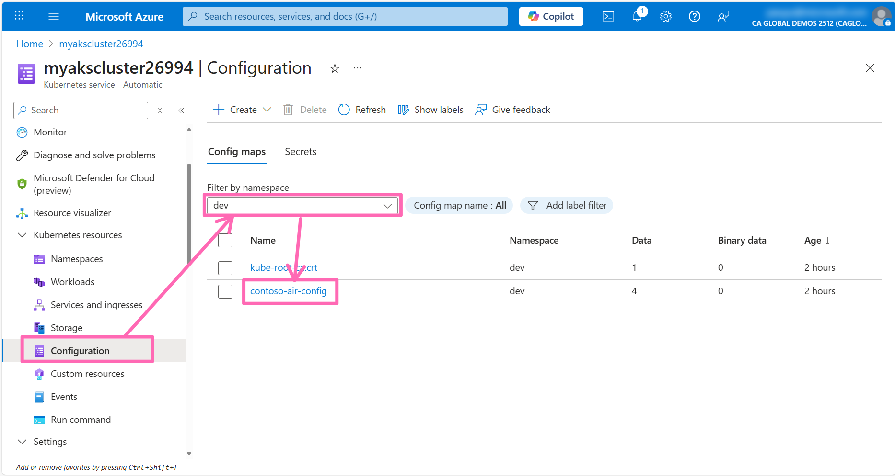

Click on the **YAML** tab, then in the YAML editor, add the following configuration to the end of the file, then click **Review + save**.

```yaml
data:
  AZURE_OPENAI_API_VERSION: 2024-12-01-preview
  AZURE_OPENAI_DEPLOYMENT: gpt-4.1-mini
  CHAT_PROVIDER: azure
  LOG_CHAT: 'true'
```

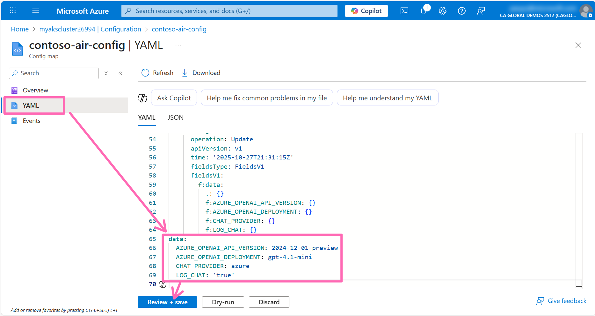

You will be prompted to confirm the changes. Scroll all the way down to the bottom of the page to review the changes, then check the **Confirm manifest changes** checkbox and click **Save**.

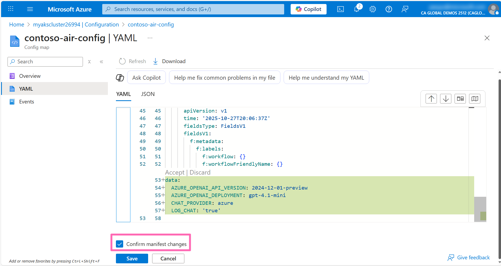

:::info

This configmap was created by the Automated Deployments workflow earlier. The new configuration settings you added will instruct the application to use Azure OpenAI as the chat provider and specify the deployment name of the model to use and the contoso-air application is already configured to read these settings and inject them into the application environment.

:::

### Service Connector setup

In the left-hand menu, click on **Service Connector** under **Settings** then click on the **+ Create** button.

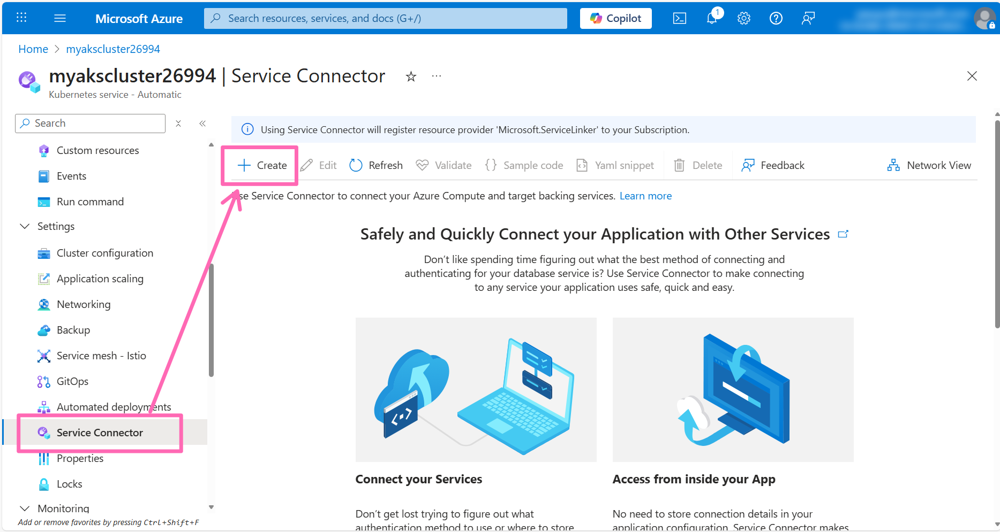

In the **Basics** tab, enter the following details:

- **Kubernetes namespace**: Enter `dev`
- **Service type**: Select **OpenAI Service**
- **OpenAI**: Select the Azure OpenAI account you created earlier


Click **Next: Authentication**.

In the **Authentication** tab, select the **Workload Identity** option. You should see a user-assigned managed identity that was created during your lab setup. If no managed identities appear in the dropdown, click the **Create new** link to provision a new one.


Optionally, you can expand the **Advanced** section to customize the managed identity settings. By default, the **Cognitive Services OpenAI Contributor** role is assigned, granting the workload identity permissions to authenticate and interact with your LLM. You'll also notice there's additional configuration information that Service Connector will set as environment variables in the application. These variables will be saved to a Kubernetes Secret which will then be used to configure the connection to the Azure OpenAI account.

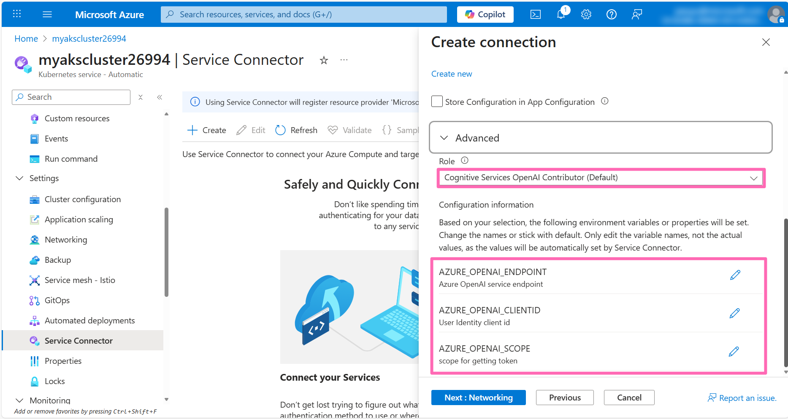

Click **Next: Networking** then click **Next: Review + create** and finally click **Create**.

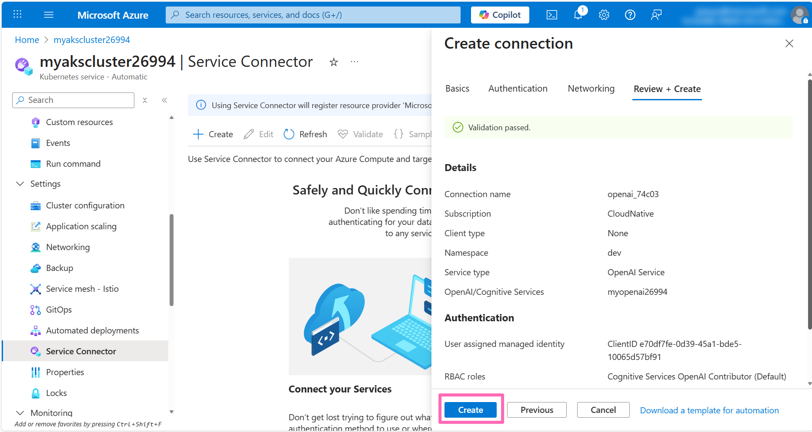

:::info

This process will take a few minutes while Service Connector configures the Workload Identity infrastructure. Behind the scenes, it's:

- Assigning appropriate Azure role permissions to the [managed identity](https://learn.microsoft.com/entra/identity/managed-identities-azure-resources/overview) for Azure OpenAI access
- Creating a [Federated Credential](https://learn.microsoft.com/entra/workload-id/workload-identity-federation) that establishes trust between your Kubernetes cluster and the managed identity
- Setting up a Kubernetes [ServiceAccount](https://kubernetes.io/docs/concepts/security/service-accounts/) linked to the managed identity
- Creating a Kubernetes [Secret](https://kubernetes.io/docs/concepts/configuration/secret/) containing the Azure OpenAI connection information

:::

### Configure the application for Workload Identity

Once you've successfully set up the Service Connector for your Azure OpenAI account, it's time to configure your application to use these connection details.

In the Service Connector page, select the checkbox next to the OpenAI connection and click the **Yaml snippet** button.

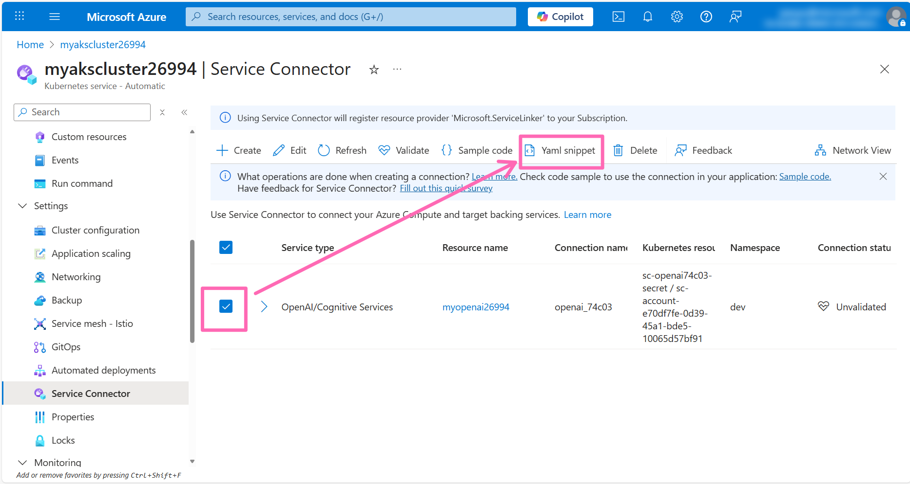

In the **YAML snippet** window, select **Kubernetes Workload** for **Resource type**, then select **contoso-air** for **Kubernetes Workload**.


You will see the YAML manifest for the contoso-air application with the highlighted edits required to connect to Azure OpenAI via Workload Identity.

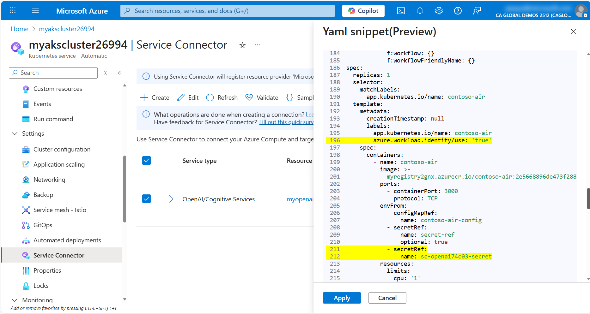

Scroll through the YAML manifest to view all the changes highlighted in yellow, then click **Apply** to apply the changes to the application. This will redeploy the contoso-air application with the new connection details.

:::tip

This will apply changes directly to the application deployment but ideally you would want to commit these changes to your repository so that they are versioned and can be tracked and automatically deployed using the Automated Deployments workflow that you set up earlier.

:::

Wait a minute or two for the new pod to be rolled out then navigate back to the application and attempt to interact with the AI assistant. Now, you should be able to chat with an AI assistant without any errors!


---

## Observing your cluster and apps

Monitoring and observability are key components of running applications in production. With AKS Automatic, you get a lot of monitoring and observability features enabled out-of-the-box. You experienced some of these features when you used ran queries to look for error logs in the application. Let's take a closer look at how you can monitor and observe your application and cluster.

At the start of the workshop, you set up the AKS Automatic cluster and integrated it with [Azure Log Analytics Workspace](https://learn.microsoft.com/azure/azure-monitor/logs/log-analytics-overview) for logging, [Azure Monitor Managed Workspace](https://learn.microsoft.com/azure/azure-monitor/containers/kubernetes-monitoring-enable?tabs=cli) for metrics collection, and [Azure Managed Grafana](https://azure.microsoft.com/products/managed-grafana) for data visualization.

Now, you can also enable the [Azure Monitor Application Insights for AKS](https://learn.microsoft.com/azure/azure-monitor/app/kubernetes-codeless) feature to automatically instrument your applications with [Azure Application Insights](https://learn.microsoft.com/azure/azure-monitor/app/app-insights-overview).

### App monitoring

[Azure Monitor Application Insights](https://learn.microsoft.com/azure/azure-monitor/app/app-insights-overview) is an Application Performance Management (APM) solution designed for real-time monitoring and observability of your applications. Leveraging [OpenTelemetry (OTel)](https://opentelemetry.io/), it collects telemetry data from your applications and streams it to Azure Monitor. This enables you to evaluate application performance, monitor usage trends, pinpoint bottlenecks, and gain actionable insights into application behavior. With AKS, you can enable the [AutoInstrumentation](https://learn.microsoft.com/azure/azure-monitor/app/kubernetes-codeless) feature which allows you to collect telemetry for your applications without requiring any code changes.

:::warning

At the time of this writing, the AutoInstrumentation feature is in public preview. Please refer to the [official documentation](https://learn.microsoft.com/azure/azure-monitor/app/kubernetes-codeless#register-the-azuremonitorappmonitoringpreview-feature-flag) for the most up-to-date information.

:::

You can enable the feature on your AKS cluster with the following command:

Before you run the command below, make sure you are logged into Azure CLI and have variables set for the resource group name and AKS cluster name.

```bash
AKS_NAME=$(az aks list -g ${RG_NAME} --query "[0].name" -o tsv)
```

:::info

The `$RG_NAME` variable was set during lab setup in the Prerequisites section above.

:::

With the variables set, run the following command to enable the AutoInstrumentation feature on your AKS cluster.

```bash
az aks update \
-g ${RG_NAME} \
-n ${AKS_NAME} \
--enable-azure-monitor-app-monitoring
```

:::tip

Using the `--enable-azure-monitor-app-monitoring` flag for AKS requires the `aks-preview` extension installed for Azure CLI. Run the `az extension add --name aks-preview` command to install it.

:::

With this feature enabled, you can now deploy a new Instrumentation custom resource to your AKS cluster to automatically instrument your applications without any modifications to the code.

In the Azure portal, navigate to the **Workloads** section under **Kubernetes resources** in the left-hand menu. Filter by the **dev** namespace and click on the **contoso-air** deployment to view the deployment details.

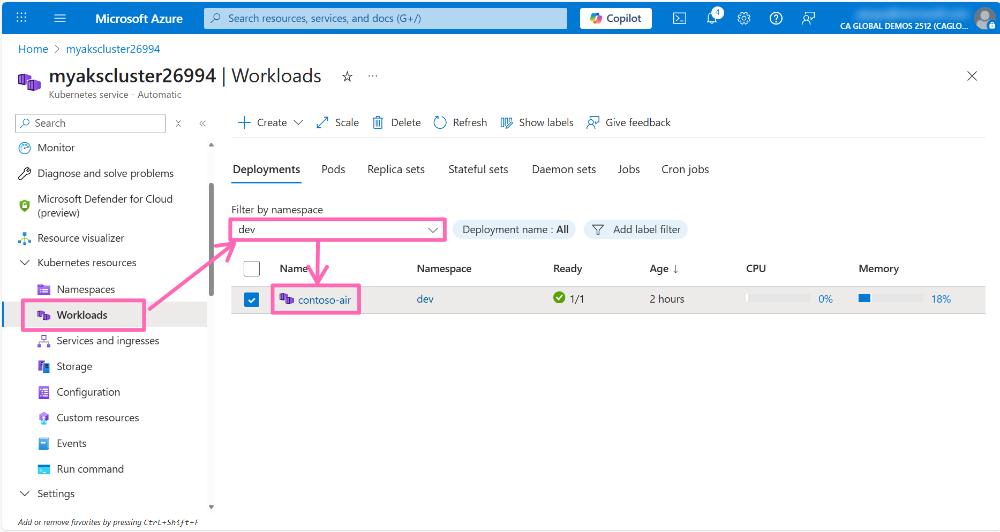

Click the **Application Monitoring** tab to configure AutoInstrumentation for the contoso-air application.

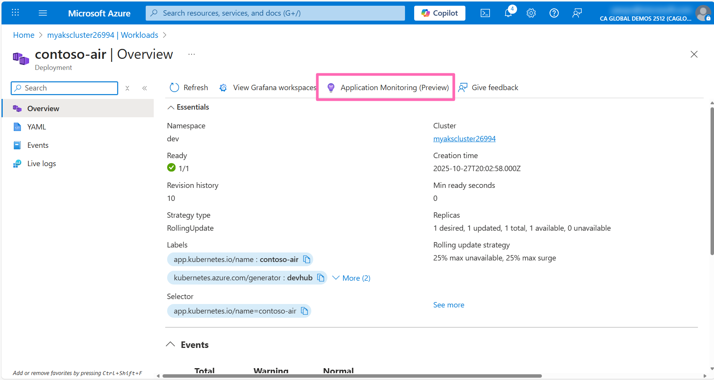

In the **Configure Application Monitoring** pane, enter the following details:

- **Application Insights**: Select the Application Insights resource in your resource group
- **Application Language**: Select **NodeJS**
- Check the **Perform rollout restart of all deployments in the namespace to deploy changes immediately** checkbox.
- Click **Configure** to apply the changes.

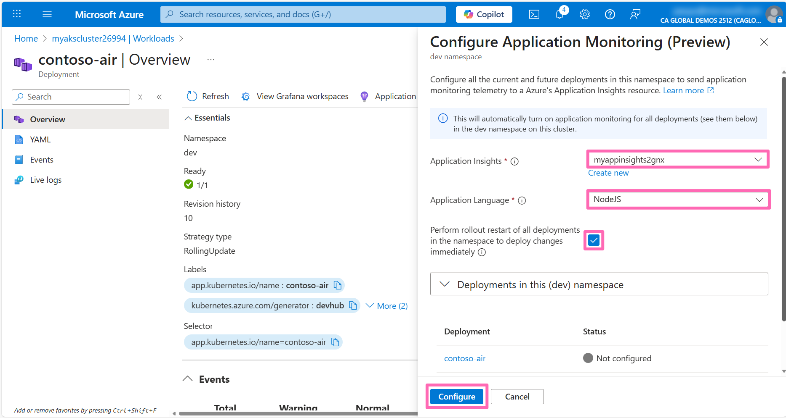

:::tip

This is a simple example of how to instrument your application across an entire namespace. You can also instrument individual deployments by deploying custom resources into your Kubernetes cluster. See the [documentation](https://learn.microsoft.com/azure/azure-monitor/app/kubernetes-codeless#mixed-mode-onboarding) for more details.

:::

Once the configuration is applied, the contoso-air deployment will be restarted to apply the instrumentation changes immediately.

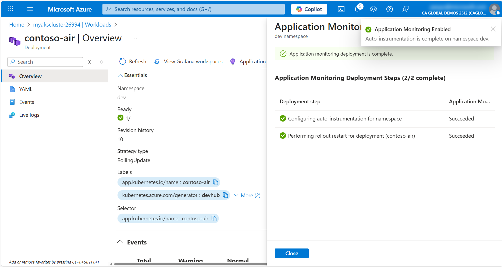

Now that the application is instrumented with Application Insights, navigate back to the contoso-air application in your web browser and chat with the AI assitant to generate some metrics. Once the metrics have been generated and collected by the OTel collector, you can view the application performance and usage metrics in the Azure portal.

Navigate to the **Application Insights** resource in your resource group.

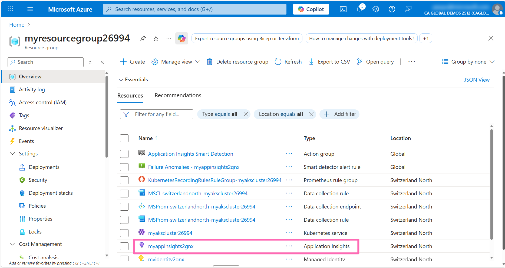

Click on the **Application map** under **Investigate** in the left-hand menu to view a high-level overview of the application components, their dependencies, and number of calls.

:::tip

If the Azure OpenAI endpoint does not appear in the application map, return to the Contoso Air website and chat with the AI assistant a bit more to generate some data. Then, in the Application Map, click the **Refresh** button. The map will update in real time and should now display the application connected to the Azure OpenAI endpoint, along with the request latency to the model endpoint.

:::

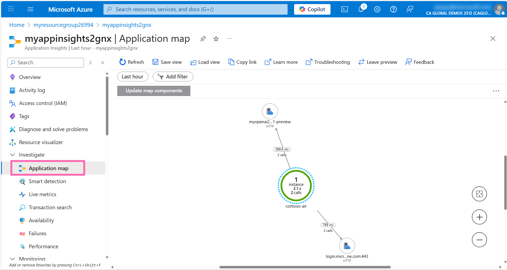

Click on the **Live Metrics** tab to view the live metrics for the application. Here you can see incoming and outgoing requests, response times, and exceptions in real-time.

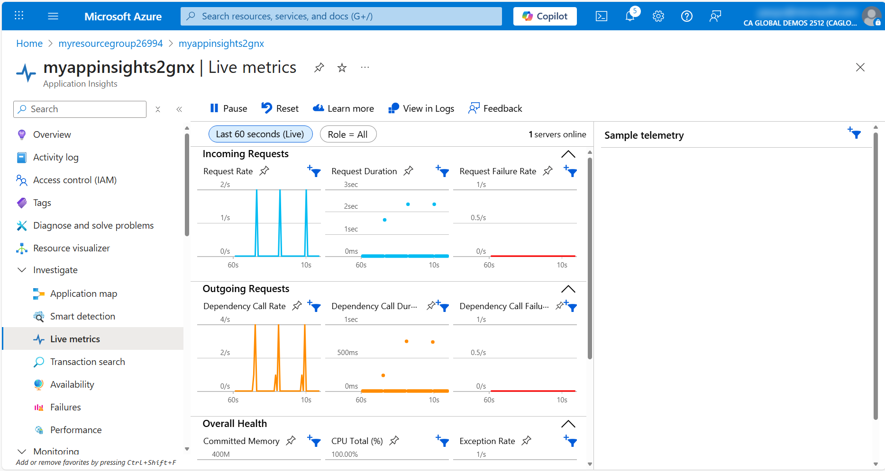

Finally, click on the **Performance** tab to view the performance metrics for the application. Here you can see the average response time, request rate, and failure rate for the application.

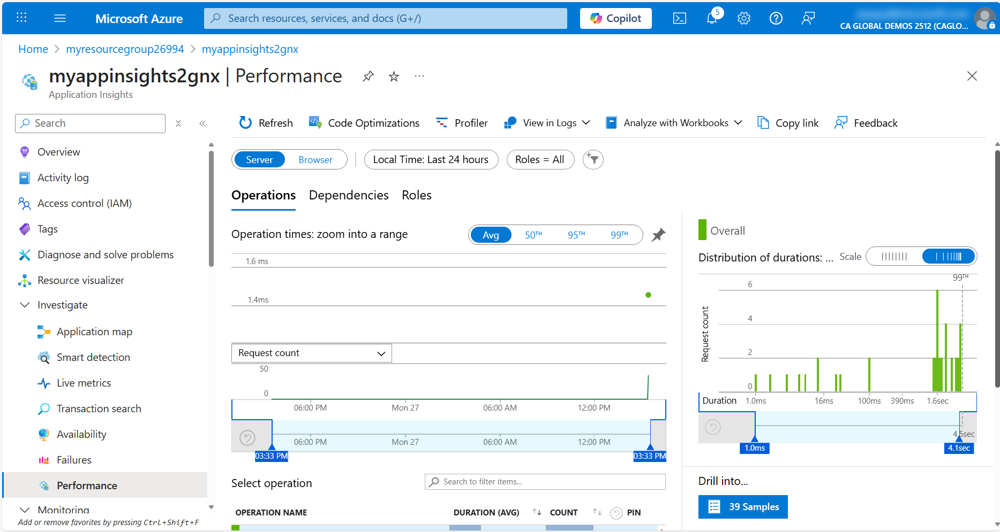

Feel free to explore the other features of Application Insights and see how you can use it to monitor and observe your applications.

### Cluster monitoring

AKS Automatic simplifies monitoring your cluster using [Container Insights](https://learn.microsoft.com/azure/azure-monitor/containers/container-insights-overview) which offers a detailed monitoring solution for your containerized applications running on AKS. It gathers and analyzes logs, metrics, and events from your cluster and applications, providing valuable insights into their performance and health.

To access this feature, navigate back to your AKS cluster in the Azure portal. You should see the **Monitoring** section in the left-hand menu. Click it to view a high-level summary of your cluster's performance.


The AKS Automatic cluster was also pre-configured with basic CPU utilization and memory utilization alerts. You can also create additional alerts based on the metrics collected by the Prometheus workspace.

Click on the **Recommended alerts (Preview)** button to view the recommended alerts for the cluster. Expand the **Prometheus community alert rules (Preview)** section to see the list of Prometheus alert rules that are available. You can enable any of these alerts by clicking on the toggle switch.


Click **Save** to enable the alerts.

#### Workbooks and logs

With Container Insights enabled, you can query logs using Kusto Query Language (KQL) and create custom or pre-configured workbooks for data visualization. 

In the **Monitoring** section of the AKS cluster menu, click **Workbooks** to access pre-configured options. The **Cluster Optimization** workbook is particularly useful for identifying anomalies, detecting probe failures, and optimizing container resource requests and limits. Explore this and other available workbooks to monitor your cluster effectively.


:::tip

The workbook visuals will include a query button that you can click to view the KQL query that powers the visual. This is a great way to learn how to write your own queries.

:::

To aide in troubleshoting your application, you can easily access container logs emitted by the application. Select **Logs** from the **Monitoring** section in the AKS cluster's left-hand menu. This section allows you to access the logs gathered by the Azure Monitor agent operating on the cluster nodes.


:::tip

If you are presented with a **Welcome to Log Analytics** pop-up, close it to access the query editor.

:::

Close the **Queries hub** pop-up to get to the query editor, then change the query editor from **Simple mode** to **KQL mode** by using the drop-down menu in the top-right corner. 

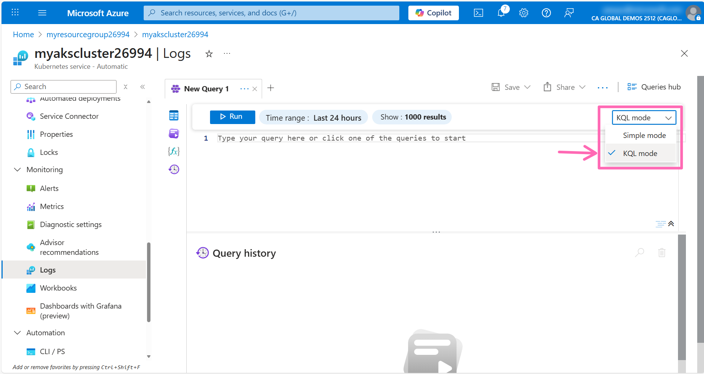

In the editor window, type the following query, then click the **Run** button to view container logs.

```kql
ContainerLogV2
| where ContainerName == "contoso-air"
```

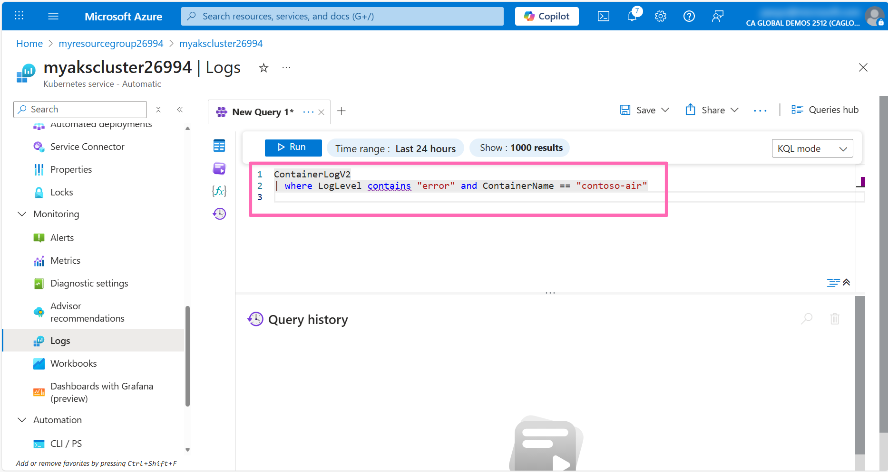

You should see some log messages in the table below. Expand some of the logs to view the message details that were generated by the application.

:::note

Some of the queries might not have enough data to return results.

:::

### Dashboards with Grafana

The Azure Portal provides a great way to view metrics and logs, but if you prefer to visualize the data using Grafana, or execute complex queries using PromQL, you can use an Azure Managed Grafana instance or leverage the new **Dashboards with Grafana** feature for AKS!

In the AKS cluster's left-hand menu, click on **Dashboards with Grafana** under the **Monitoring** section. You will see a list of all the pre-configured Grafana dashboard that are available for your cluster.

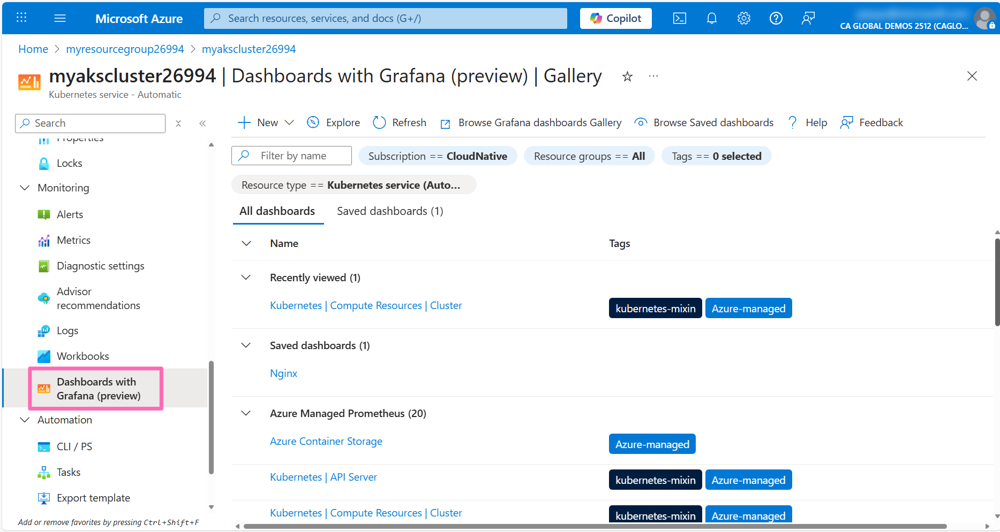

Log into the Grafana instance then in the Grafana home page, click on the **Dashboards** link in the left-hand menu. Here you will see a list of pre-configured dashboards that you can use to visualize the metrics collected by the Prometheus workspace.

In the **Dashboards** list, expand the **Azure Managed Prometheus** folder and explore the dashboards available. Each dashboard provides a different view of the metrics collected by the Prometheus workspace with controls to allow you to filter the data.

Click on a **Kubernetes / Compute Resources / Workload** dashboard.


Filter the **namespace** to **dev** the **type** to **deployment**, and the **workload** to **contoso-air**. This will show you the metrics for the contoso-air deployment.

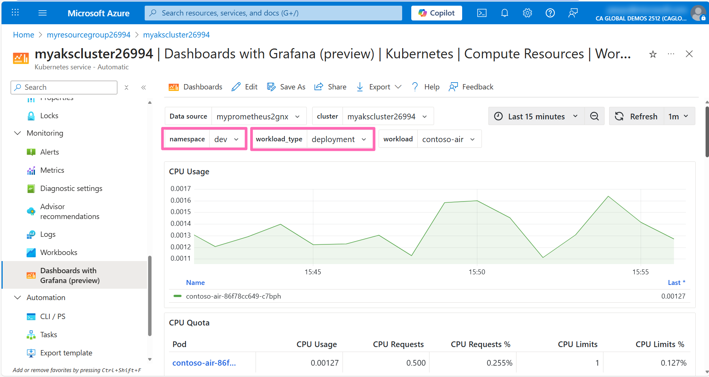

#### Querying metrics with PromQL

If you prefer to write your own queries to visualize the data, click **Dashboards** to navigate back to the dashboards list and click the **Explore** tab at the top of the pane. 

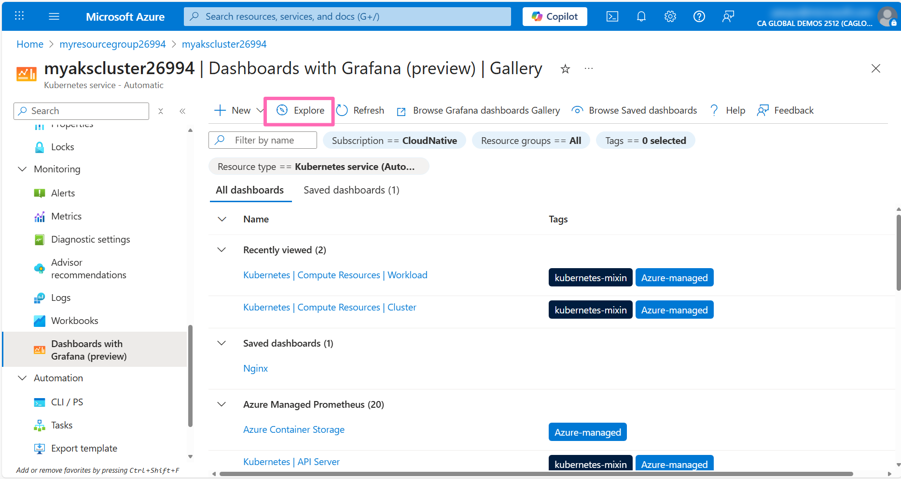

In the **Explore** pane, Azure Monitor is the default datasource. You can change this by clicking it and selecting your Prometheus data source.

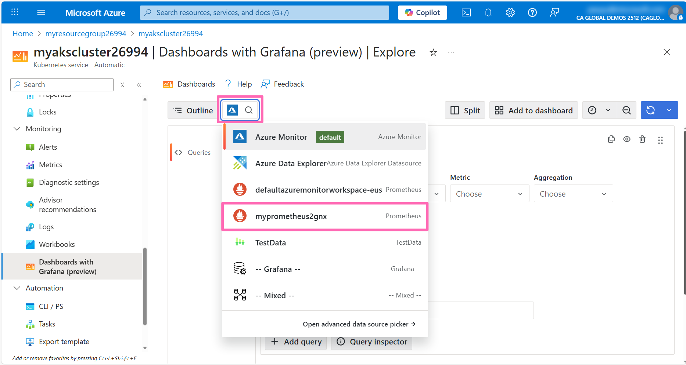

The query editor supports a graphical query builder and a text-based query editor. The graphical query builder is a great way to get started with PromQL. You can select the metric you want to query, the aggregation function, and any filters you want to apply.


There is a lot you can do with Grafana and PromQL, so take some time to explore the features and visualize the metrics collected by the Prometheus workspace.

---

## Scaling your cluster and apps

Now that you have learned how to deploy applications to AKS Automatic and monitor your cluster and applications, let's explore how to scale your cluster and applications to handle the demands of your workloads effectively.

Right now, the application is running a single pod. When the web app is under heavy load, it may not be able to handle the requests. To automatically scale your deployments, you should use [Kubernetes Event-driven Autoscaling (KEDA)](https://keda.sh/) which allows you to scale your application workloads based on utilization metrics, number of events in a queue, or based on a custom schedule using CRON expressions.

But simply using implementing KEDA is not enough. KEDA can try to deploy more pods, but if the cluster is out of resources, the pods will not be scheduled and remain in pending status.

With AKS Automatic, [Node Autoprovisioning (NAP)](https://learn.microsoft.com/azure/aks/node-autoprovision?tabs=azure-cli) is enabled and is used over the traditional cluster autoscaler. With NAP, it can detect if there are pods pending scheduling and will automatically scale the node pool to meet the demands. We won't go into the details of working with NAP in this workshop, but you can read more about it in the [AKS documentation](https://learn.microsoft.com/azure/aks/node-autoprovision?tabs=azure-cli).

:::info

NAP will not only automatically scale out additional nodes to meet demand, it will also find the most efficient VM configuration to host the demands of your workloads and scale nodes in when the demand is low to save costs.

:::

For the Kubernetes scheduler to efficiently schedule pods on nodes, it is best practice to include resource requests and limits in your pod configuration. The Automated Deployment setup added some default resource requests and limits to the pod configuration, but they may not be optimal. Knowing what to set the request and limit values to can be challenging. This is where the [Vertical Pod Autoscaler (VPA)](https://kubernetes.io/docs/tasks/run-application/vertical-pod-autoscaling/) can help.

### Vertical Pod Autoscaler (VPA) setup

VPA is a Kubernetes resource that allows you to automatically adjust the CPU and memory requests and limits for your pods based on the actual resource utilization of the pods. This can help you optimize the resource utilization of your pods and reduce the risk of running out of resources.

AKS Automatic comes with the VPA controller pre-installed, so you can use the VPA resource immediately by simply deploying a VPA resource manifest to your cluster.

:::info

When you deployed the application using AKS Automated Deployments, the deployment manifest included some default resource requests and limits for the contoso-air application pods. These values may not be optimal for your workload, so using VPA can help you automatically adjust these values based on the actual resource utilization of the pods.

:::

Navigate to the **Custom resource** section under **Kubernetes resources** in the AKS cluster left-hand menu. Scroll down to the bottom of the page and click on the **Load more** button to view all the available custom resources.

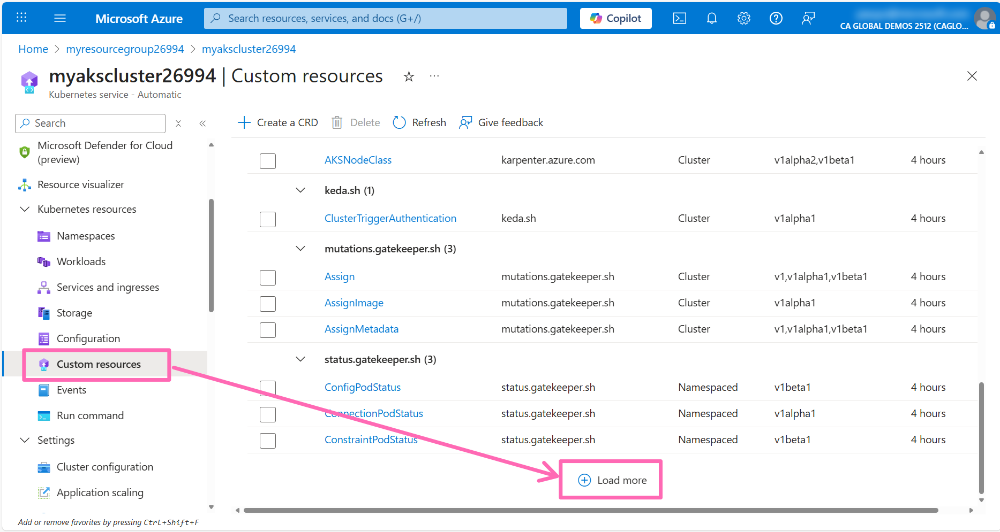

Click on the **VerticalPodAutoscaler** resource to view the VPA resources in the cluster.


Click on the **+ Create** button where you'll see a **Apply with YAML** editor.


Not sure what to add here? No worries! You can lean on [Microsoft Copilot in Azure](https://learn.microsoft.com/azure/copilot/overview) to help generate the VPA manifest.

Click in the text editor or press **Alt + I** to open the Copilot editor.

In the **Draft with Copilot** text box, type in the following prompt:

```text
Help me create a vertical pod autoscaler manifest for the contoso-air deployment in the dev namespace and set min and max cpu and memory to something typical for a nodejs app. Please apply the values for both requests and limits.
```

Press **Enter** to generate the VPA manifest.

When the VPA manifest is generated, click the **Accept all** button to accept the changes, then click **Add** to create the VPA resource.

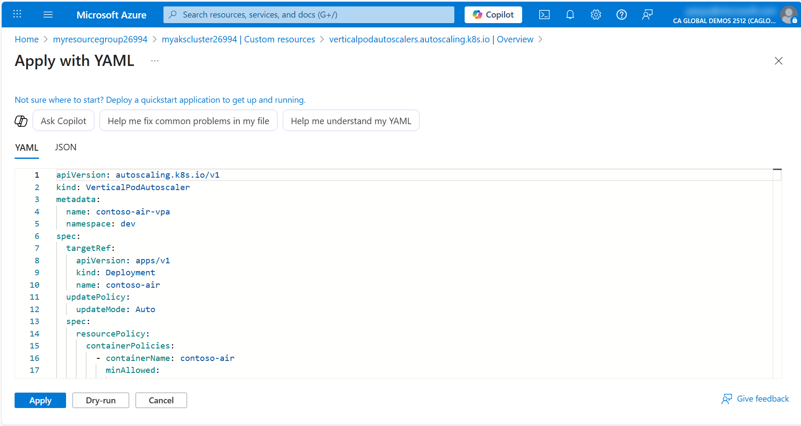

:::warning

Microsoft Copilot in Azure may provide different results. If your results are different, simply copy the following VPA manifest and paste it into the **Apply with YAML** editor.

```yaml
apiVersion: autoscaling.k8s.io/v1
kind: VerticalPodAutoscaler
metadata:
  name: contoso-air-vpa
  namespace: dev
spec:
  targetRef:
    apiVersion: apps/v1
    kind: Deployment
    name: contoso-air
  updatePolicy:
    updateMode: Auto
  resourcePolicy:
    containerPolicies:
      - containerName: contoso-air
        minAllowed:
          cpu: 100m
          memory: 256Mi
        maxAllowed:
          cpu: 1
          memory: 512Mi
        controlledResources: ["cpu", "memory"]
```

:::

The VPA resource will only update the CPU and memory requests and limits for the pods in the deployment if the number of replicas is greater than 1. Also the pod will be restarted when the VPA resource updates the pod configuration so it is important to create [Pod Disruption Budgets (PDBs)](https://kubernetes.io/docs/concepts/workloads/pods/disruptions/#pod-disruption-budgets) to ensure that the pods are not restarted all at once.

### KEDA scaler setup

AKS Automatic also comes with the KEDA controller pre-installed, so you can use the KEDA resource immediately by simply deploying a KEDA scaler to your cluster.

:::warning

KEDA works with the Horizontal Pod Autoscaler (HPA) to scale your applications based on external metrics. It will automatically create an HPA resource for you when you create a KEDA ScaledObject resource and take ownership of the resource. If you already have an existing HPA resource, you can [transfer ownership](https://keda.sh/docs/2.17/concepts/scaling-deployments/#transferring-ownership-of-an-existing-hpa) so that KEDA manages the existing resource instead of creating one. When the contoso-air application was deployed to Kubernetes with AKS Automated Deployments, a HPA resource was automatically created. Rather than transferring ownership, we will need to delete the existing HPA resource so that KEDA can create a new one.

To delete the existing HPA resource, navigate to the **Run command** section under **Kubernetes resources** in the AKS cluster left-hand menu. In the command editor, run the following command:

```bash
kubectl delete hpa contoso-air -n dev
```

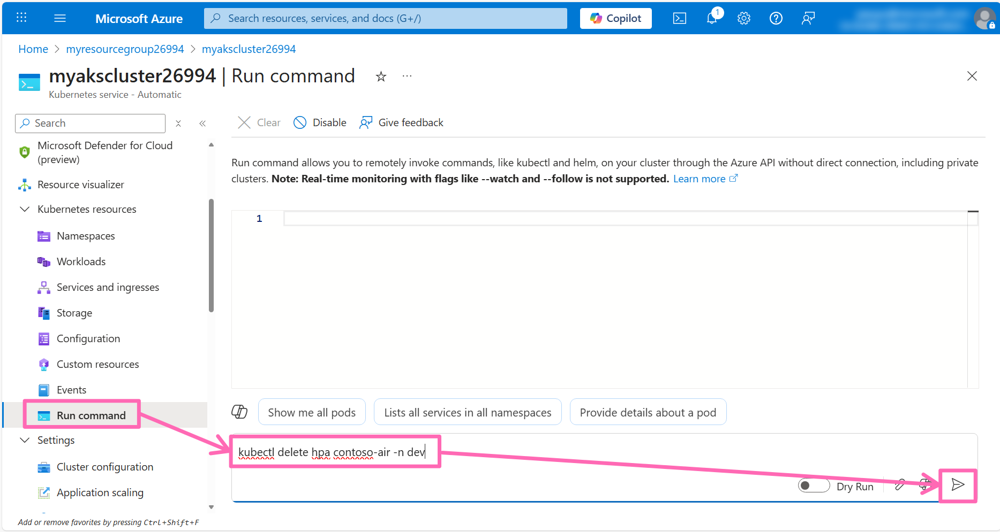
:::

Navigate to **Application scaling** under **Settings** in the AKS cluster left-hand menu, then click on the **+ Create** button.

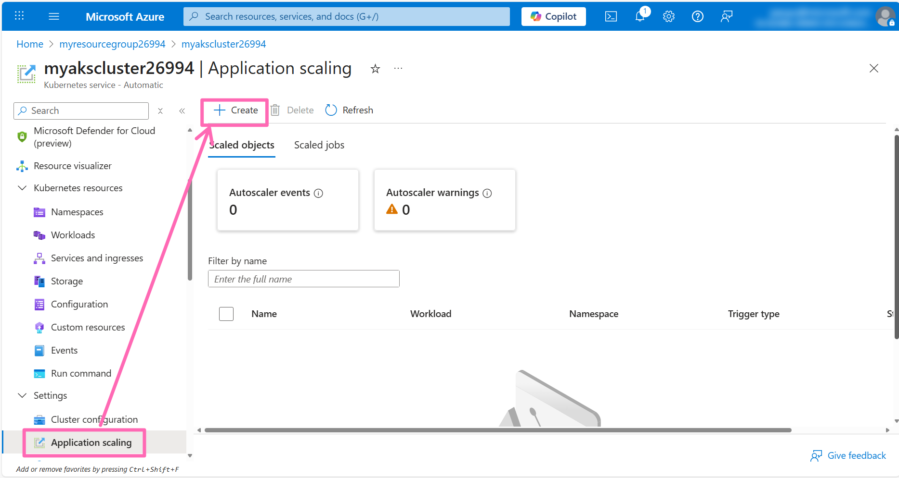

In the **Basics** section, enter the following details:

- **Name**: Enter `contoso-air-so`
- **Namespace**: Select **dev**
- **Target workload**: Select **contoso-air**
- **Minimum replicas**: Enter `3`


In the **Trigger details** section, enter the following details:

- **Trigger type**: Select **CPU**

Leave the rest of the fields as their default values and click **Next**.

In the **Review + create** tab, click **Customize with YAML** to view the YAML manifest for the ScaledObject resource. You can see the YAML manifest the AKS portal generated for the ScaledObject resource. Here you can add additional configuration to the ScaledObject resource if needed.

Click **Save and create** to create the ScaledObject resource.


Head over to the **Workloads** section in the left-hand menu under **Kubernetes resources**. In the **Filter by namespace** drop down list, select **dev**. You should see the **contoso-air** deployment is now running (or starting) 3 replicas.

Now that the number of replicas has been increased, the VPA resource will be able to adjust the CPU and memory requests and limits for the pods in the deployment based on the actual resource utilization of the pods the next time it reconciles.

:::tip

This was a simple example of using using KEDA. The real power of KEDA comes from its ability to scale your application based on external metrics. There are many [scalers](https://keda.sh/docs/scalers/) available for KEDA that you can use to scale your application based on a variety of external metrics.

:::

If you have time, try to run a simple load test to see the scaling in action. You can use the [hey](https://github.com/rakyll/hey) tool to generate some traffic to the application.

:::info

If you don't have the **hey** tool installed, checkout the [installation guide](https://github.com/rakyll/hey?tab=readme-ov-file#installation) and follow the instructions based on your operating system.

:::

Run the following command to generate some traffic to the application:

```bash
hey -z 30s -c 100 http://<REPLACE_THIS_WITH_CONTOSO_AIR_SERVICE_IP>
```

This will generate some traffic to the application for 30 seconds. You should see the number of replicas for the **contoso-air** deployment increase as the load increases.

---

## Summary

In this workshop, you learned how to create an AKS Automatic cluster and deploy an application to the cluster using Automated Deployments. From there, you learned how to troubleshoot application issues using the Azure portal and how to integrate applications with Azure services using the AKS Service Connector. You also learned how to enable application monitoring with AutoInstrumentation using Azure Monitor Application Insights, which provides deep visibility into your application's performance without requiring any code changes. Additionally, you explored how to configure your applications for resource specific scaling using the Vertical Pod Autoscaler (VPA) and scaling your applications with KEDA. Hopefully, you now have a better understanding of how easy it can be to build and deploy applications on AKS Automatic.

To learn more about AKS Automatic, visit the [AKS documentation](https://learn.microsoft.com/azure/aks/intro-aks-automatic) and checkout our other [AKS Automatic](/docs/operations/operating-aks-automatic) lab in this repo to explore more features of AKS.

In addition to this workshop, you can also explore the following resources:

- [Azure Kubernetes Service (AKS) documentation](https://learn.microsoft.com/azure/aks)
- [Kubernetes: Getting started](https://azure.microsoft.com/solutions/kubernetes-on-azure/get-started/)
- [Learning Path: Introduction to Kubernetes on Azure](https://learn.microsoft.com/training/paths/intro-to-kubernetes-on-azure/)
- [Learning Path: Deploy containers by using Azure Kubernetes Service (AKS)](https://learn.microsoft.com/training/paths/deploy-manage-containers-azure-kubernetes-service/)

If you have any feedback or suggestions for this workshop, please feel free to open an issue or pull request in the [GitHub repository](https://github.com/Azure-Samples/aks-labs)

<Cleanup />
