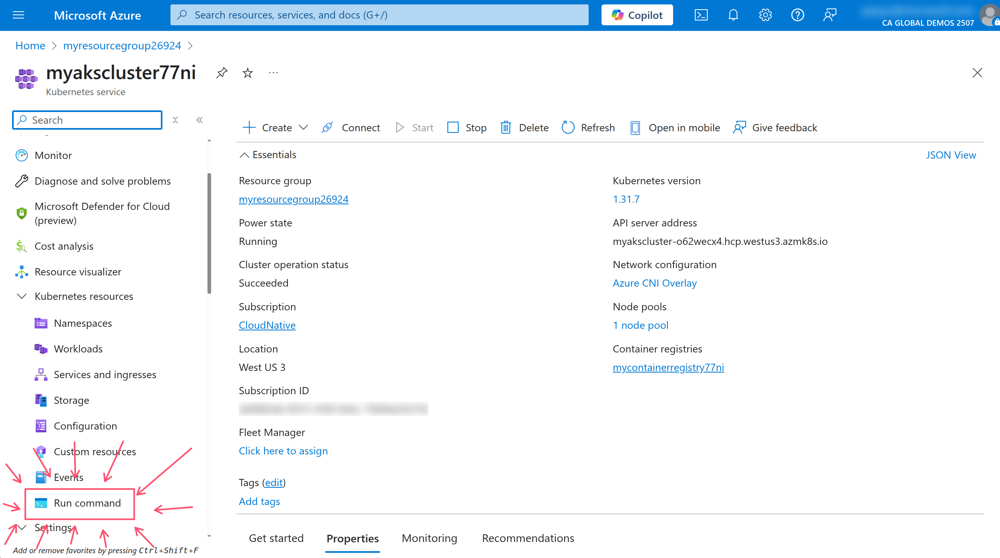
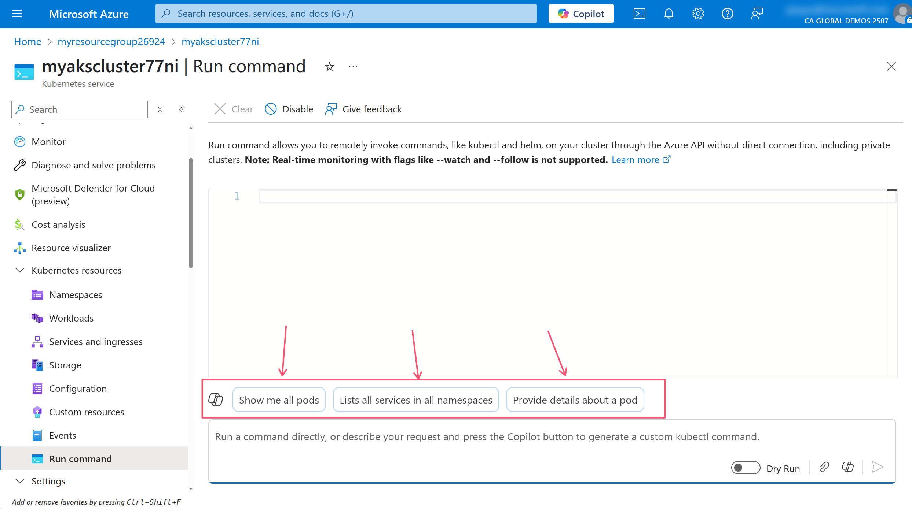
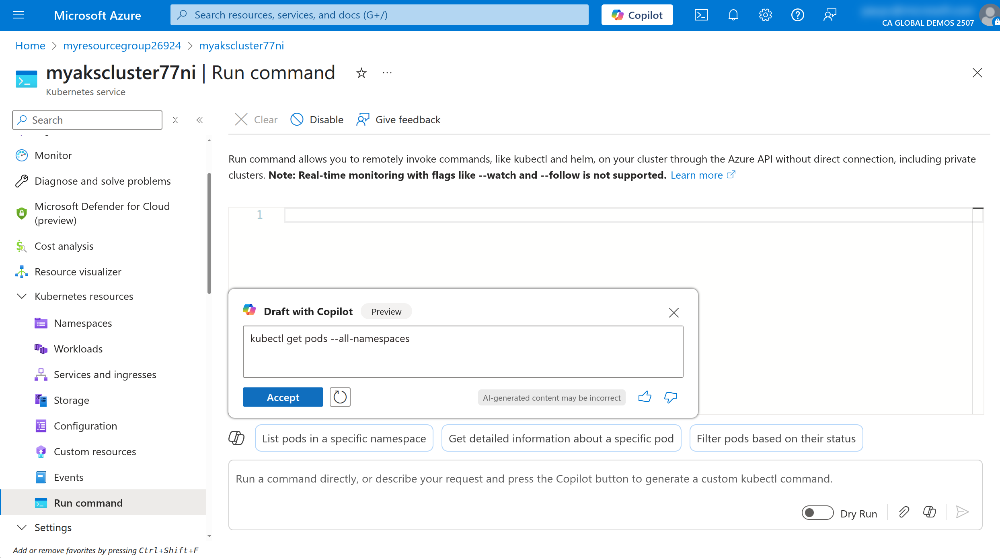
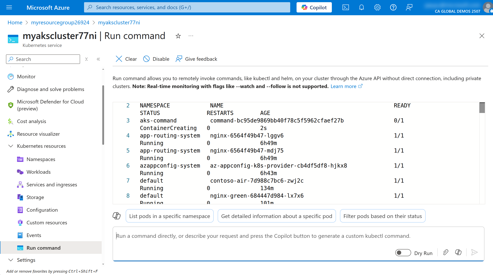
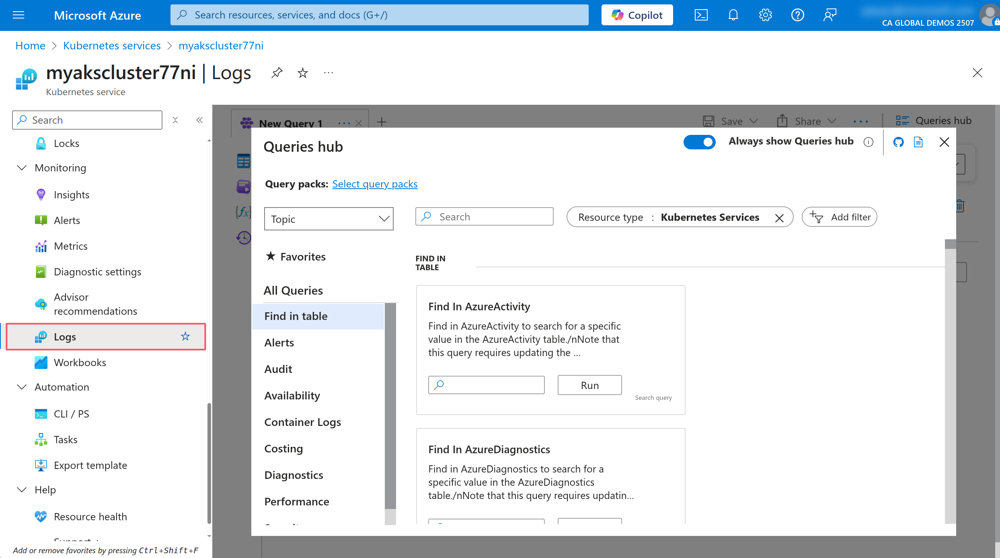
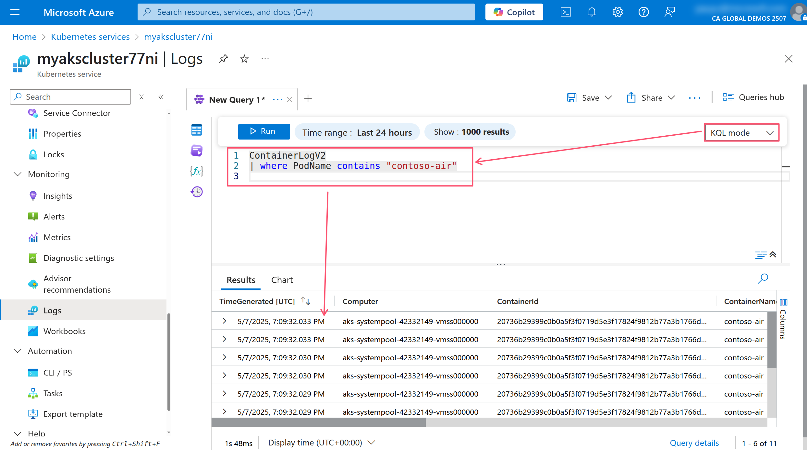
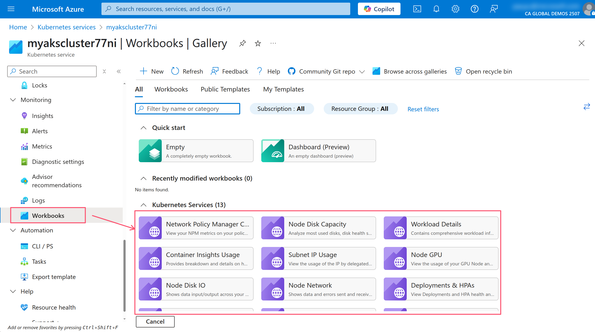
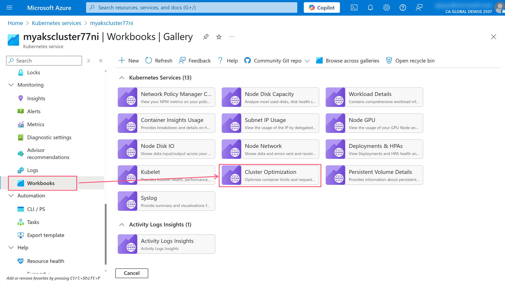
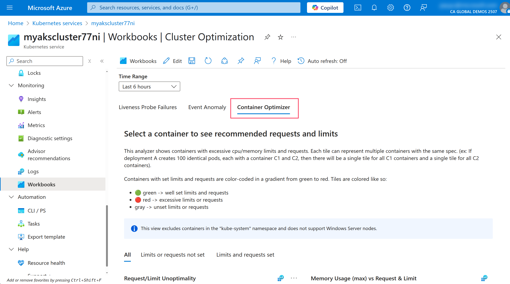
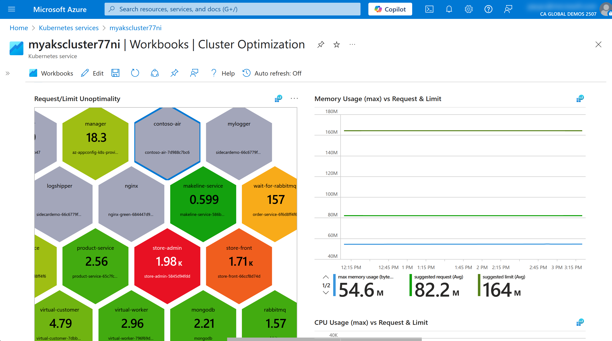

import Prerequisites from "../../src/components/SharedMarkdown/_prerequisites.mdx";
import ProvisionResourceGroup from "../../src/components/SharedMarkdown/_provision_resource_group.mdx";

This workshop provides a hands-on introduction to get you started with Kubernetes and Azure Kubernetes Service (AKS). It focuses on key concepts, tools, and best practices for deploying and managing containerized applications. The topics within this workshop align with [Kubernetes Certified Application Developer (CKAD)](https://training.linuxfoundation.org/certification/certified-kubernetes-application-developer-ckad/) objectives, offering practical exercises to build foundational skills for working with Kubernetes while also learning some tips and tricks with AKS along the way. This workshop does not aim to be a full and complete study guide for the CKAD exam but it will give you a solid foundation to build on 💪

---

## Objectives

As you progress through the workshop, you will learn how to:

- Set up and configure workshop environment
- Package applications into container images and push them to Azure Container Registry
- Deploy workloads using Kubernetes resources such as Deployments, Services, and Ingress
- Implement deployment strategies like blue/green and canary deployments
- Utilize Kubernetes tools like Helm and Kustomize for application deployment and configuration
- Monitor and troubleshoot applications using Kubernetes CLI tools and Azure Monitor
- Secure and configure applications using Kubernetes SecurityContexts, ConfigMaps, Secrets, and ServiceAccounts
- Understand and apply Kubernetes networking concepts, including NetworkPolicies and Ingress rules
- Leverage persistent volumes for application storage needs
- Explore Kubernetes observability and maintenance practices, including API deprecations and health checks

---

<Prerequisites
  tools={[
    {
      name: "Docker Desktop",
      url: "https://www.docker.com/products/docker-desktop/"
    },
    {
      name: "Helm",
      url: "https://helm.sh/docs/intro/install/",
    },
    {
      name: "Kustomize",
      url: "https://kubectl.docs.kubernetes.io/installation/kustomize/",
    },
    {
      name: "Draft",
      url: "https://github.com/Azure/draft",
    },
    {
      name: "jq",
      url: "https://jqlang.org/",
    },

]}
/>

<ProvisionResourceGroup />

### Setup Azure Resources

To keep focus on AKS-specific features, this workshop will need some Azure preview features enabled and resources to be pre-provisioned.

This lab will require the use of multiple Azure resources including:

- [Azure Kubernetes Service](https://learn.microsoft.com/azure/aks/what-is-aks) cluster to work with throughout the workshop
- [Azure Container Registry](https://learn.microsoft.com/azure/container-registry/container-registry-intro) for storing container images
- [Azure Managed Prometheus](https://learn.microsoft.com/azure/azure-monitor/metrics/prometheus-metrics-overview) for AKS monitoring
- [Azure Managed Grafana](https://learn.microsoft.com/azure/managed-grafana/overview) for visualizing the Prometheus metrics
- [Azure Log Analytics workspace](https://learn.microsoft.com/azure/azure-monitor/logs/log-analytics-workspace-overview) for storing application logs
- [Azure Key Vault](https://learn.microsoft.com/azure/key-vault/general/overview) for storing secrets
- [Azure App Configuration](https://learn.microsoft.com/azure/azure-app-configuration/overview) for storing application configuration
- [Azure Cosmos DB](https://learn.microsoft.com/azure/cosmos-db/introduction) for demo application data storage
- [Azure User-Assigned Managed Identities](https://learn.microsoft.com/entra/identity/managed-identities-azure-resources/how-manage-user-assigned-managed-identities?pivots=identity-mi-methods-azp) for authenticating to the Azure services

:::tip

You can deploy these resources using a single [ARM template](https://learn.microsoft.com/azure/azure-resource-manager/templates/overview).

:::

Run the following command to deploy [this ARM template](https://raw.githubusercontent.com/Azure-Samples/aks-labs/refs/heads/main/docs/getting-started/assets/k8s-aks-fundamentals/main.json).

```bash
az deployment group create \
--resource-group $RG_NAME \
--name "${RG_NAME}-deployment" \
--template-uri https://raw.githubusercontent.com/Azure-Samples/aks-labs/refs/heads/main/docs/getting-started/assets/k8s-aks-fundamentals/main.json \
--parameters randomSeed=$RAND userObjectId=$(az ad signed-in-user show --query id -o tsv)
```

:::danger Important

Export the following variables to use throughout the workshop. If you close your terminal or open a new terminal, you will need to set the `RG_NAME` variable to the name of your resource group and re-run the following commands.

```bash
export AKS_NAME=$(az deployment group show --name "${RG_NAME}-deployment" --resource-group $RG_NAME --query properties.outputs.aksName.value -o tsv)
export AKS_NRG_NAME=$(az deployment group show --name "${RG_NAME}-deployment" --resource-group $RG_NAME --query properties.outputs.aksNodeResourceGroupName.value -o tsv)
export ACR_NAME=$(az deployment group show --name "${RG_NAME}-deployment" --resource-group $RG_NAME --query properties.outputs.acrName.value -o tsv)
export MONGO_NAME=$(az deployment group show --name "${RG_NAME}-deployment" --resource-group $RG_NAME --query properties.outputs.mongoName.value -o tsv)
export MONGO_CLIENT_ID=$(az deployment group show --name "${RG_NAME}-deployment" --resource-group $RG_NAME --query properties.outputs.mongoIdentityClientId.value -o tsv)
export MONGO_LISTCONNECTIONSTRING_URL=$(az deployment group show --name "${RG_NAME}-deployment" --resource-group $RG_NAME --query properties.outputs.mongoListConnectionStringUrl.value -o tsv)
```

:::

### Kubernetes architecture and components

You should have a basic understanding of [Kubernetes concepts](https://kubernetes.io/docs/concepts/). The [Kubernetes Architecture](https://kubernetes.io/docs/concepts/architecture/) documentation is a great place to learn about the key components of a Kubernetes cluster.

The cluster is made up of a [control plane](https://kubernetes.io/docs/concepts/architecture/#control-plane-components) and one or more [worker nodes](https://kubernetes.io/docs/concepts/architecture/#node-components). The control plane is responsible for managing the cluster and the worker nodes are responsible for running the applications.


_Source: [https://kubernetes.io/docs/concepts/architecture](https://kubernetes.io/docs/concepts/architecture/)_

There's also several [addons](https://kubernetes.io/docs/concepts/architecture/#addons) that can be enabled in the cluster to provide additional functionality.

:::info

In AKS, Azure manages the control plane for you, so you don't need to worry about setting up and managing the control plane components. The control plane components will not be visible to you; however, the worker nodes is something you can manage and will be visible in what's known as the **Node Resource Group**. This is a resource group that is created by AKS to manage the worker nodes and other resources that are needed for the cluster.

:::

## Application Design and Build

A container can be thought of as a lightweight, portable, and deployment of software that includes everything needed to run an application. This includes the application code, runtime, libraries, and dependencies. Knowing how you build and package your application in a container image is key to running it in Kubernetes.

### Define, build and modify container images

Knowing how to package your application in a container image is key to running it in Kubernetes. The most common way to do this is to use [Dockerfile](https://docs.docker.com/reference/dockerfile/) and Docker CLI or Podman CLI to execute image build commands.

Once the container image is built, you'll need to push it to a remote container registry. A container registry is a service that stores container images and allows you to pull them down to your local machine or to a Kubernetes cluster. There are several container registries available, with some common ones including [Docker Hub](https://hub.docker.com/) or [GitHub Container Registry](https://docs.github.com/en/packages/working-with-a-github-packages-registry/working-with-the-container-registry). When using AKS, you will want to use [Azure Container Registry (ACR)](https://learn.microsoft.com/azure/container-registry/container-registry-intro) which is a private registry that offers several features such as geo-replication, integration with Microsoft Entra ID, artifact streaming, and even continuous vulnerability scanning and patching.

#### Container image manifest with Draft

If you don't already have a container image for you application you can look to an open-source tool like [Draft](https://github.com/Azure/draft) or lean on AI tools like [GitHub Copilot](https://github.com/features/copilot) to help you create a Dockerfile.

Let's look to package the [Contoso Air](https://github.com/Azure-Samples/contoso-air) sample application into a container image. Run the following command to clone the repository.

```bash
git clone https://github.com/Azure-Samples/contoso-air.git
cd contoso-air
```

This repository contains a simple Node.js flight booking application that is uses MongoDB as the backend database.

Open the repository in Visual Studio Code then open the integrated terminal.

:::warning

Make sure to reset your environment variables in the terminal as mentioned above.

:::

From the terminal, run the following command to create a Dockerfile for the application.

```bash
cd src/web
draft create --dockerfile-only --interactive
```

This command will detect the application type is JavaScript (or Node.js) and create a Dockerfile for the application.

Using the `--interactive` flag will prompt you for the port that the application will listen on and the version of Node.js to use.

Enter `3000` for the port and `22` for the Node.js version.

:::tip

Draft is also available as part of the [Azure CLI aks-preview extension](https://github.com/Azure/azure-cli-extensions/tree/main/src/aks-preview). With this extension you can use the `az aks draft` command to create a Dockerfile for the application. See the [Draft for Azure Kubernetes Service (AKS) (preview)](https://learn.microsoft.com/azure/aks/draft) for more information.

You can also use the [AKS extension for Visual Studio Code](https://marketplace.visualstudio.com/items?itemName=ms-kubernetes-tools.vscode-aks-tools) which has [integration with Draft](https://azure.github.io/vscode-aks-tools/features/draft-integration.html) to create a Dockerfile for the application. This extension provides a graphical interface for creating manifest files.

See this [doc](https://code.visualstudio.com/docs/azure/aksextensions) for additional information on the AKS extension for Visual Studio Code.

:::

Draft can also help create Kubernetes manifest files, but we won't use that here, so the `--dockerfile-only` flag tells Draft to only create the Dockerfile.

Once the Dockerfile is created, you can open it in Visual Studio Code to see the contents.

#### Build and run the container image

The Dockerfile is a set of instructions that tells Docker how to build the container image. The `FROM` instruction specifies the base image to use, in this case, Node.js version 22. The `ENV` instruction sets an environment variable, and the `EXPOSE` instruction tells Docker which port the application will listen on.

Run the following command to build the container image.

```bash
docker build -t contoso-air:latest .
```

With the container image built, we can now run it locally.

```bash
docker run -d -p 3000:3000 --name contoso-air contoso-air:latest
```

This command will run the container image and map port 3000 on the host to port 3000 in the container. You can now access the application in your browser at [http://localhost:3000/](http://localhost:3000/).

To stop the container, you can run the following command.

```bash
docker stop contoso-air
```

#### Push the container image to a container registry

Now that the application containerized and confirmed to be running locally, we can push it to a container registry. In this case, we will use Azure Container Registry (ACR).

Run the following commands to get the name of the ACR and login.

```bash
az acr login --name $ACR_NAME
```

Run the following command to tag the container image with the ACR registry name.

```bash
docker tag contoso-air:latest $ACR_NAME.azurecr.io/contoso-air:latest
```

Now that the image is tagged, we can push it to ACR.

```bash
docker push $ACR_NAME.azurecr.io/contoso-air:latest
```

:::tip

You should be familiar with the other Docker commands. Take a look at the [Docker CLI docs](https://docs.docker.com/reference/cli/docker/) and [Docker CLI Cheat Sheet](https://docs.docker.com/get-started/docker_cheatsheet.pdf) for more information.

:::

With ACR, you can use ACR tasks to execute remote builds. To have ACR perform a remote build, you can use the `az acr build` command. This command will package the application source code, push it up to Azure, build the image, and save it in the registry. This is a great way to build images in the cloud without needing to have Docker installed locally.

```bash
az acr build \
--registry $ACR_NAME \
--image contoso-air:latest . \
--no-wait
```

:::tip

Be sure to checkout the [Signing a Container Image with Notation and Azure Key Vault](../security/secure-supply-chain) and [Securing AKS Applications with ACR Continuous Patching](../security/acr-patching) workshop for more information on how to use ACR to secure your applications.

:::

:::warning

Before you move on, you should return to the root of the repository.

```bash
cd ../..
```

:::

### Choose and use the right workload resource (Deployment, DaemonSet, CronJob, etc.)

With the application containerized and pushed to ACR, we can now deploy it to the AKS cluster. In Kubernetes, you deploy applications using [workload resources](https://kubernetes.io/docs/concepts/workloads/). These resources are used to manage the lifecycle of your application and ensure that it is running as expected.

#### Kubernetes workload resources

Kubernetes is a container orchestrator, but it doesn't run containers directly. Instead, it runs containers inside a resource known as a [Pod](https://kubernetes.io/docs/concepts/workloads/pods/). A Pod is the smallest deployable unit in Kubernetes. It is a logical host for one or more containers which runs your application.

But even then, a Pod is not what you want to deploy because a Pod is not a long-lived resource. Meaning, if a Pod dies, Kubernetes will not attempt to restart it.

Instead, you need to use a workload resource to manage Pods for you. There are several different types of workload resources in Kubernetes that manages Pods, each with its own use case and knowing when to use each is important.

The most common types of workload resources are:

- [Deployment](https://kubernetes.io/docs/concepts/workloads/controllers/deployment/) resource is a declarative way to manage a set of Pods. It in turn creates a ReplicaSet resource to manage the Pods. A Deployment is used for stateless applications and is the most common way to deploy applications in Kubernetes.
- [ReplicaSet](https://kubernetes.io/docs/concepts/workloads/controllers/replicaset/) resource is a low-level resource that is used to manage a set of Pods. It is used to ensure that a specified number of pod replicas are running at any given time. A ReplicaSet is mostly used by the Deployment resource to manage the Pods. You typically won't use a ReplicaSet directly, but it's important to understand how it works.
- [StatefulSet](https://kubernetes.io/docs/concepts/workloads/controllers/statefulset/) resource is used to manage stateful applications. It is used for applications that require stable, unique network identifiers and stable storage. A StatefulSet is used for applications that require persistent storage and stable network identities, such as databases.
  A stateful set is a workload resource that is used to manage stateful applications. It is used for applications that require stable, unique network identifiers and stable storage.
- [DaemonSet](https://kubernetes.io/docs/concepts/workloads/controllers/daemonset/) resource is often used to ensure that a copy of a Pod is running on all nodes in the cluster, such as logging or monitoring agents.
- [Job](https://kubernetes.io/docs/concepts/workloads/controllers/job/) resource is a workload resource that is used to run a batch job. These are applications that need to run to completion, such as data processing jobs.
- [CronJob](https://kubernetes.io/docs/concepts/workloads/controllers/cron-jobs/) resource is a workload resource that is used to run a batch job on a schedule, such as backups or report generation.

The workload resource that you request are reconciled by various [controllers](https://kubernetes.io/docs/concepts/architecture/controller/) in the Kubernetes control plane. For example, when you create a Deployment, the Deployment controller will create a ReplicaSet and the ReplicaSet controller will create the Pods.

When you submit a resource through the [Kubernetes API server](https://kubernetes.io/docs/concepts/architecture/#kube-apiserver), the desired state is stored in [etcd](https://kubernetes.io/docs/concepts/architecture/#etcd) and controllers are responsible for ensuring that the actual state matches the desired state. This is known as the reconciliation loop.

Each resource type is it's own API in Kubernetes and has it's own set of properties which you set in a manifest file written in YAML or JSON. Once the manifest file is created, you can use the kubectl CLI to create the resource in the cluster.

#### Using kubectl to interact with the cluster

The [kubectl CLI](https://kubernetes.io/docs/reference/kubectl/introduction/) is a powerful tool and the most common way to interact with Kubernetes API server.

In order to use kubectl against your AKS cluster, you need to get the [kubeconfig file](https://kubernetes.io/docs/concepts/configuration/organize-cluster-access-kubeconfig/) for the cluster. The kubeconfig file contains the information needed to connect and authenticate to the cluster.

Run the following command to get the kubeconfig file for the AKS cluster.

```bash
az aks get-credentials --resource-group $RG_NAME --name $AKS_NAME
```

With the kubeconfig file in place, you can use kubectl to interact with the cluster.

Run the following command to see the kubeconfig file.

```bash
kubectl config view --raw
```

:::tip

You will notice the kubeconfig file includes certificate data. This is the default authentication method used by AKS, but you can also use [Microsoft Entra ID](https://learn.microsoft.com/azure/aks/enable-authentication-microsoft-entra-id) and [Azure RBAC](https://learn.microsoft.com/azure/role-based-access-control/overview) for authentication and authorization. See the [Use Azure role-based access control for Kubernetes Authorization](https://learn.microsoft.com/azure/aks/manage-azure-rbac?tabs=azure-cli) documentation for more information.

:::

Now you can interact with the Kubernetes API server. To quickly see all the available API resources in the cluster, you can run the following command.

```bash
kubectl api-resources
```

To see the details of the Deployments resource, you can run the following command.

```bash
kubectl explain deployment
```

This will show all the top-level attributes of the Deployment resource with a description of each attribute. You can use this to understand how to configure the Deployment resource.

You can also use the `--recursive` flag to see all the available attributes for the resource.

```bash
kubectl explain deployment --recursive
```

That's a lot of attributes! To get a smaller subset of attributes with additional details, think of the output as a tree structure that you can traverse. For example, if you want to see how to configure the container in the Pod template, you can run the following command.

```bash
kubectl explain deployment.spec.template.spec.containers
```

This will show you the fields that are available for the container in the Pod template. You can use this to understand how to properly configure the container within the Deployment resource.

:::tip

Be sure to check out the [kubectl Quick Reference guide](https://kubernetes.io/docs/reference/kubectl/cheatsheet/) for more information on how to use kubectl.

:::

#### Using kubectl to create resource manifests

Going back to the contoso-air application, we can create a Deployment resource to run the application in Kubernetes.

If you have never written a Kubernetes manifest file, you can use the Draft CLI to create a manifest file for you or use another common method which is to use the kubectl CLI to create a manifest file.

Create a directory called `manifests` in the root of the repository to store the manifest files.

```bash
mkdir manifests
```

Let's create a Deployment resource manifest for the contoso-air application.

```bash
kubectl create deployment contoso-air \
--image=$ACR_NAME.azurecr.io/contoso-air:latest \
--port=3000 \
--dry-run=client \
--output yaml > manifests/contoso-air-deployment.yaml
```

This command will create a Deployment resource for the contoso-air image in ACR, expose port 300, and save it to a file called `contoso-air-deployment.yaml`. The `--dry-run=client` flag tells kubectl to only create the manifest file and not actually create the resource in the cluster. The `--output yaml` flag tells kubectl to output the manifest file in YAML format.

Open the `contoso-air-deployment.yaml` file in Visual Studio Code and look through the manifest.

:::info

As mentioned above, you could also use Draft to create the manifest file. Using Draft, you will get a manifest that includes a bit more best practices baked in.

:::

#### Creating resources with kubectl

Deploying a manifest file is as simple as running the following command.

```bash
kubectl apply -f manifests/contoso-air-deployment.yaml
```

To view the status of the Deployment resource, you can run the following command.

```bash
kubectl get deployment contoso-air
```

The Deployment controller will create a ReplicaSet resource to create and manage the Pods that are requested by the Deployment resource.

To watch the status of the Pods that are created by the Deployment resource, you can run the following command.

```bash
kubectl get pods --watch
```

Once you see that the contoso-air Pod is running, you can stop the watch command by pressing `Ctrl+C` in the terminal.

To view the application in your browser, you can run a port-forward command to forward the port from the Pod to your local machine.

```bash
kubectl port-forward deployment/contoso-air 3000:3000
```

:::info

By default, Kubernetes resources are only accessible from within the cluster. To access a resource from outside the cluster, you need to use a [Service](https://kubernetes.io/docs/concepts/services-networking/service/) resource to expose it. We'll cover that later. In the meantime, you can use the [`kubectl port-forward` command](https://kubernetes.io/docs/reference/kubectl/generated/kubectl_port-forward/) to forward a port from the local machine to the Pod. This will enable you to access the application as if it were running on your local machine.

:::

You can now access the application in your browser at [http://localhost:3000/](http://localhost:3000/).

To stop the port-forward command, you can press `Ctrl+C` in the terminal.

### Understand multi-container Pod design patterns (e.g. sidecar, init and others)

As mentioned above, a Pod can contain one or more containers that share the same network namespace and storage volumes. You can think of a Pod as a small VM where apps can communicate with each other and share data.

#### Sidecar containers

The design pattern of running multiple containers in a Pod, is often referred to as the "sidecar pattern". This is useful when you have a main application container with one or more containers that provide additional functionality such as logging, monitoring, caching, networking, etc. See [here](https://kubernetes.io/docs/concepts/workloads/pods/sidecar-containers/) for more details.

Although the sidecar pattern has been a common design pattern in Kubernetes for a long time, many faced challenges with it because it was not natively supported. Some challenges included the fact that the sidecar container would not be restarted if it failed, or guaranteeing that the sidecar container would be started before the main application container. This made it difficult to use sidecar containers for certain scenarios. With Kubernetes v1.28 and later, Kubernetes [native sidecar container support was introduced](https://kubernetes.io/blog/2023/08/25/native-sidecar-containers/). This allows you to run a sidecar container as an `initContainer` with the `restartPolicy: Always` attribute. This means that the sidecar container will always be restarted if it fails, and it will run before the main application container starts which addressed a lot of challenges with the previous approach of using a sidecar container.

Run the following command to create a simple application that writes logs to a file and a sidecar container that reads the logs from the file and outputs them to stdout.

```bash
kubectl apply -f - <<EOF
apiVersion: apps/v1
kind: Deployment
metadata:
  name: sidecardemo
spec:
  replicas: 1
  selector:
    matchLabels:
      app: sidecardemo
  template:
    metadata:
      labels:
        app: sidecardemo
    spec:
      containers:
        - name: mylogger
          image: alpine:latest
          command: ['sh', '-c', 'while true; do date >> /opt/logs.txt; sleep 1; done']
          volumeMounts:
            - name: data
              mountPath: /opt
      initContainers:
        - name: logshipper
          image: alpine:latest
          restartPolicy: Always
          command: ['sh', '-c', 'touch /opt/logs.txt && tail -F /opt/logs.txt']
          volumeMounts:
            - name: data
              mountPath: /opt
      volumes:
        - name: data
          emptyDir: {}
EOF
```

:::info

Typically, you would want to create YAML manifest files for your resources and use the `kubectl apply -f` command pass in the file name to deploy resources. But for the sake of simplicity, we are using the `kubectl apply -f -` command to create the resources directly using heredocs which allow you to redirect a block of text to the `kubectl apply` command.

:::

This will create a Pod with two containers: **mylogger** and **logshipper**.

- **mylogger** writes the current date to a file every second
- **logshipper** reads the file and outputs the contents to stdout

Run the following command to see the logs of the logshipper container.

```bash
# get the name of the sidecardemo Pod
POD_NAME=$(kubectl get po -l app=sidecardemo --output jsonpath='{.items[0].metadata.name}')

# get the logs of the logshipper container within the sidecardemo Pod
kubectl logs $POD_NAME -c logshipper
```

### Utilize persistent and ephemeral volumes

The logs in the sidecardemo Pod are stored in an [`emptyDir` volume](https://kubernetes.io/docs/concepts/storage/volumes/#emptydir). This means that the logs will be lost if the Pod is deleted or restarted.

#### Persistent Volumes and Persistent Volume Claims

If you need data to persist beyond the life of a Pod, you would typically create a [Persistent Volume (PV)](https://kubernetes.io/docs/concepts/storage/persistent-volumes/) which is allocatable storage within the cluster, and [Persistent Volume Claim (PVC)](https://kubernetes.io/docs/concepts/storage/persistent-volumes/#persistentvolumeclaims) to make a claim on the piece of storage. PVs can be created manually in the cluster by an administrator or provisioned automatically using [Storage Classes](https://kubernetes.io/docs/concepts/storage/storage-classes/).

In AKS, [Azure CSI drivers and storage classes](https://learn.microsoft.com/azure/aks/csi-storage-drivers) can dynamically provision Azure Storage resources such as [Azure Managed Disks](https://learn.microsoft.com/azure/virtual-machines/managed-disks-overview) or [Azure File Shares](https://learn.microsoft.com/azure/storage/files/storage-files-introduction) to be used as PVs.

Run the following command to see the storage classes that are available in your cluster.

```bash
kubectl get storageclasses
```

You should see a list of storage classes that are available in your cluster. The `azurefile-csi` storage class is used to create Azure File Shares and the `managed-csi` storage class is used to create Azure Managed Disks.

:::tip

The classes with `csi` in the name infer that the [Container Storage Interface](https://kubernetes.io/docs/concepts/storage/volumes/#csi) drivers are used to provision the underlying storage, while the other storage classes are used to provision storage using the deprecated in-tree drivers.

:::

#### Implementing persistent storage with Azure Storage

In the previous example we deployed a Deployment with a sidecar container that writes to a file. We can use a PVC that uses the `azurefile-csi` storage class which tells AKS to create an Azure File Share in the Azure Storage account that is associated with the AKS cluster. This will allow us to persist the logs in the Azure File Share and access them from other Pods or even from outside the cluster.

Run the following command to create the PVC.

```bash
kubectl apply -f - <<EOF
apiVersion: v1
kind: PersistentVolumeClaim
metadata:
  name: pvc-azurefile
spec:
  accessModes:
    - ReadWriteMany
  resources:
    requests:
      storage: 1Gi
  storageClassName: azurefile-csi
EOF
```

This will request a 1Gi persistent volume from the azurefile-csi storage class. The `accessModes` field specifies that the volume can be mounted as read-write by as many nodes as needed which is useful for shared volumes.

Run the following command to delete the previous Deployment.

```bash
kubectl delete deployment sidecardemo
```

Create a new Deployment that uses the PVC to store the logs.

```bash
kubectl apply -f - <<EOF
apiVersion: apps/v1
kind: Deployment
metadata:
  name: sidecardemo
spec:
  replicas: 1
  selector:
    matchLabels:
      app: sidecardemo
  template:
    metadata:
      labels:
        app: sidecardemo
    spec:
      containers:
        - name: mylogger
          image: alpine:latest
          command: ['sh', '-c', 'while true; do date >> /opt/logs.txt; sleep 1; done']
          volumeMounts:
            - name: data
              mountPath: /opt
      initContainers:
        - name: logshipper
          image: alpine:latest
          restartPolicy: Always
          command: ['sh', '-c', 'touch /opt/logs.txt && tail -F /opt/logs.txt']
          volumeMounts:
            - name: data
              mountPath: /opt
      volumes:
        - name: data
          persistentVolumeClaim:
            claimName: pvc-azurefile       # <-- use the pvc
EOF
```

This manifest is nearly identical to the previous one, but it uses a PVC instead of `emptyDir` as the Pod's mounted volume.

Run the following command to see the status of the PVC.

```bash
kubectl get pvc pvc-azurefile
```

You should see the PVC with a `STATUS` of `Bound`. This means the PVC has been successfully created and is ready to be used by the pod.

The AKS storage classes will dynamically create an Azure File Share in an Azure Storage account and attach it to the pod. The storage account can be found in the AKS cluster's Node Resource Group -- which is the resource group that AKS manages.

You can find the Node Resource Group by running the following command.

```bash
az resource list \
--resource-group $AKS_NRG_NAME \
--query "[?contains(type, 'Microsoft.Storage/storageAccounts')]" | jq
```

Let's confirm the logs are being written to a file in Azure File Share.

Run the following command to get the name of the storage account.

```bash
STORAGE_ACCOUNT_NAME=$(az resource list \
--resource-group $AKS_NRG_NAME \
--query "[?contains(type, 'Microsoft.Storage/storageAccounts')]" | jq -r '.[0].name')
```

Run the following command to get the name of the file share.

```bash
FILE_SHARE_NAME=$(kubectl get pvc pvc-azurefile -o jsonpath='{.spec.volumeName}')
```

Run the following command to list the files in the Azure File Share.

```bash
az storage file list \
--account-name $STORAGE_ACCOUNT_NAME \
--share-name $FILE_SHARE_NAME | jq
```

You should see a file with the name `logs.txt`. Additionally, you can use the Azure Portal to view the file share and download the logs.txt file to view its contents.

:::tip

Be sure to checkout the [Advanced Storage Concepts lab](/docs/storage/advanced-storage-concepts) for more advanced storage scenarios.

:::

## Application Deployment

A reliable and repeatable application deployment process is vital for delivering updates with confidence and minimizing downtime. In this section, you will explore common deployment patterns (such as blue/green and canary), learn how rolling updates protect availability, and use declarative tools like Helm and Kustomize to package and configure your workloads. Together, these techniques help you ship changes safely, maintain consistency across environments, and roll back quickly if issues arise.

### Use Kubernetes primitives to implement common deployment strategies (e.g. blue/green or canary)

Blue/green deployment is a deployment strategy that allows you to deploy a new version of an application without downtime. The idea is to have two identical environments, one for the current version (blue) and one for the new version (green). When you are ready to deploy the new version, you switch the traffic from the blue environment to the green environment.

This is made easy with Kubernetes because you can use a Service resource to route traffic to the Pods. You can create two separate Deployments for the blue and green environments and use a Service resource to route traffic to the correct Deployment based on the label of the Pods.

:::tip

[Labels](https://kubernetes.io/docs/concepts/overview/working-with-objects/labels/) are key/value pairs that are attached to Kubernetes resources. They are used to identify and organize resources in the cluster. This becomes a powerful tool when you want to group resources together and apply operations to them using [selectors](https://kubernetes.io/docs/concepts/overview/working-with-objects/labels/#label-selectors).

:::

Run the following command to create two separate Deployments Nginx servers. One will have blue text and the other will have green text. The Deployments will use a ConfigMap to store the HTML file that is served by the Nginx server. The ConfigMap will be mounted as a volume in the Nginx container at the path `/usr/share/nginx/html/index.html`.

:::info

ConfigMaps will be covered in a later section, but for now, just know that a ConfigMap is a Kubernetes resource that allows you to store configuration data and pass it to your application. In this case, we are using a ConfigMap to store the HTML file that is served by the Nginx server.

:::

```bash
kubectl apply -f - <<EOF
apiVersion: v1
kind: ConfigMap
metadata:
  name: nginx-blue
data:
  index.html: |
    <!DOCTYPE html>
    <html>
    <head>
    <title>Welcome to nginx!</title>
    <style>
    html { color-scheme: light dark; }
    body { width: 35em; margin: 0 auto;
    font-family: Tahoma, Verdana, Arial, sans-serif;
    color: blue;}
    </style>
    </head>
    <body>
    <h1>Welcome to nginx!</h1>
    <p>If you see this page, the nginx web server is successfully installed and
    working. Further configuration is required.</p>
    <p>For online documentation and support please refer to
    <a href="http://nginx.org/">nginx.org</a>.<br/>
    Commercial support is available at
    <a href="http://nginx.com/">nginx.com</a>.</p>
    <p><em>Thank you for using nginx.</em></p>
    </body>
    </html>
---
apiVersion: apps/v1
kind: Deployment
metadata:
  name: nginx-blue
  labels:
    app: nginx-blue
spec:
  replicas: 1
  selector:
    matchLabels:
      app: nginx-blue
  template:
    metadata:
      labels:
        app: nginx-blue
    spec:
      containers:
      - name: nginx
        image: nginx:latest
        ports:
        - containerPort: 80
        volumeMounts:
        - name: html
          mountPath: /usr/share/nginx/html
      volumes:
      - name: html
        configMap:
          name: nginx-blue
---
apiVersion: v1
kind: ConfigMap
metadata:
  name: nginx-green
data:
  index.html: |
    <!DOCTYPE html>
    <html>
    <head>
    <title>Welcome to nginx!</title>
    <style>
    html { color-scheme: light dark; }
    body { width: 35em; margin: 0 auto;
    font-family: Tahoma, Verdana, Arial, sans-serif;
    color: green;}
    </style>
    </head>
    <body>
    <h1>Welcome to nginx!</h1>
    <p>If you see this page, the nginx web server is successfully installed and
    working. Further configuration is required.</p>
    <p>For online documentation and support please refer to
    <a href="http://nginx.org/">nginx.org</a>.<br/>
    Commercial support is available at
    <a href="http://nginx.com/">nginx.com</a>.</p>
    <p><em>Thank you for using nginx.</em></p>
    </body>
    </html>
---
apiVersion: apps/v1
kind: Deployment
metadata:
  name: nginx-green
  labels:
    app: nginx-green
spec:
  replicas: 1
  selector:
    matchLabels:
      app: nginx-green
  template:
    metadata:
      labels:
        app: nginx-green
    spec:
      containers:
      - name: nginx
        image: nginx:latest
        ports:
        - containerPort: 80
        volumeMounts:
        - name: html
          mountPath: /usr/share/nginx/html
      volumes:
      - name: html
        configMap:
          name: nginx-green
EOF
```

Run the following command to expose the nginx-blue Pod using a Service resource and make sure to set the selector to match the Pod label of the nginx-blue Pod.

```bash
kubectl expose deploy/nginx-blue --selector app=nginx-blue --name mynginx --type LoadBalancer
```

:::info

The `kubectl expose` command creates a Service resource that acts as a load balancer for the nginx-blue Pod. The `--selector` flag specifies the label selector to use to match the Pod, and the `--name` flag specifies the name of the Service resource. The `--type LoadBalancer` flag specifies that the Service resource should be of type LoadBalancer, which will create an external Azure Load Balancer to route external traffic to the Service.

:::

Run the following command to get the Service resource and see the details.

```bash
kubectl get svc mynginx
```

Wait until the `EXTERNAL-IP` is assigned. This may take a few minutes.

Once the `EXTERNAL-IP` is assigned, you can run the following command to port-forward the Service resource to your local machine.

```bash
echo "http://$(kubectl get svc mynginx --output jsonpath='{.status.loadBalancer.ingress[0].ip}')"
```

Click the link in your terminal to open the Nginx welcome page in your browser. You should see the Nginx welcome page with blue text.

Now that you have the nginx-blue Pod running, you can test the blue/green deployment strategy by deploying the nginx-green Pod and updating the Service resource to point to the nginx-green Pod.

Run the following command to update the Service resource to point to the nginx-green Pod.

```bash
kubectl patch svc mynginx --patch '{"spec":{"selector":{"app":"nginx-green"}}}'
```

If you open the link in your browser again, you should see the Nginx welcome page with green text.

So using the Service resource, you can easily switch the traffic from the blue environment to the green environment without downtime.

Canary deployment is a deployment strategy that allows you to deploy a new version of an application to a small subset of users before rolling it out to the entire user base. This allows you to test the new version of the application in production and ensure that it is working correctly before rolling it out to all users.

Like the blue/green deployment strategy, you can create two separate Deployments for the blue and green environments but use the same label for the Pods. The service will route traffic to any Pod that matches the label but you can control the percentage of traffic that is routed to each Deployment by scaling the replicas of each Deployment.

Run the following command to update the Deployments to add a new label to the Pods.

```bash
kubectl patch deploy nginx-blue --type='json' -p='[{"op": "add", "path": "/spec/template/metadata/labels/project", "value": "mynginx"}]'
kubectl patch deploy nginx-green --type='json' -p='[{"op": "add", "path": "/spec/template/metadata/labels/project", "value": "mynginx"}]'
```

:::warning

This method of updating resources is not recommended for production use. The `kubectl patch` command is used to update the existing resource. It is effectively like an update command but it allows you to update only specific fields of the resource. In this case, we are using the `--type='json'` flag to specify that we are using a JSON patch to update the resource. The `-p` flag specifies the patch to apply to the resource and the `op` field specifies the operation to perform. In this case, we are using the `add` operation to add a new label to the Pod template metadata.

:::

Run the following command to remove the old label selector and add the new label selector to the Service resource.

```bash
kubectl patch service mynginx --type='json' -p='[{"op": "remove", "path": "/spec/selector/app"}, {"op": "add", "path": "/spec/selector/project", "value": "mynginx"}]'
```

Run the following command to scale the nginx-blue Deployment to 1 replica and the nginx-green Deployment to 3 replicas.

```bash
kubectl scale deploy nginx-blue --replicas=1
kubectl scale deploy nginx-green --replicas=3
```

Now that you have the nginx-blue and nginx-green Deployments running with the same label, you can test the canary deployment strategy by running a curl command to see the response.

```bash
while true; do curl -s "http://$(kubectl get svc mynginx --output jsonpath='{.status.loadBalancer.ingress[0].ip}')" | grep color:; done
```

You should see the response alternating between blue and green text. This is because the Service resource is routing traffic to both Deployments based on the label selector.

Press `Ctrl+C` to stop the curl command.

Scale the nginx-blue Deployment to 0 replicas and the nginx-green Deployment to 4 replicas.

```bash
kubectl scale deploy nginx-blue --replicas=0
```

Now if you run the curl command again, you should only see Nginx welcome page content with green text.

Using native Kubernetes resources, you can easily implement blue/green and canary deployment strategies to deploy your applications without downtime.

:::tip

These are some strategies that you can using simple [Kubernetes Labels and Selectors](https://kubernetes.io/docs/concepts/overview/working-with-objects/labels/). There are other deployment strategies that you can use with more advanced tools like [Argo Rollouts](https://argo-rollouts.readthedocs.io/en/stable/) and [Flagger](https://fluxcd.io/flagger/), or with service meshes like [Istio](https://istio.io/latest/) and [Linkerd](https://linkerd.io/). These tools provide more advanced features for managing deployments and traffic routing.

:::

### Understand Deployments and how to perform rolling updates

Let's re-deploy the nginx-green Deployment with a new version, this time without any customization to the HTML file.

```bash
kubectl apply -f - <<EOF
apiVersion: apps/v1
kind: Deployment
metadata:
  name: nginx-green
  labels:
    app: nginx-green
spec:
  replicas: 1
  selector:
    matchLabels:
      app: nginx-green
  template:
    metadata:
      labels:
        app: nginx-green
    spec:
      containers:
      - name: nginx
        image: nginx:latest
        ports:
        - containerPort: 80
EOF
```

If you browse to the site again, you should see the Nginx welcome page its normal white text.

With the re-deployment of the nginx-green Deployment, the Deployment controller will automatically perform a rolling update of the Pods. This means that it will gradually replace the old Pods with new Pods running the new version of the application. This isn't as noticeable with our example since we only have 1 replica but if you had multiple replicas, you would see the old Pods being replaced with new Pods one at a time.

The Deployment controller will also keep history of the previous versions of the Deployment. This means that if you need to roll back to a previous version of the Deployment, you can do so easily.

Run the following command to see the history of the Deployment.

```bash
kubectl rollout history deploy/nginx-green
```

You should see the history of the Deployment with the revision numbers.

To rollback to a previous version of the Deployment, you can run the `kubectl rollout undo` command and rollback to the previous revision or a specific revision if you specify the revision number using the `--to-revision` flag.

Let's rollback to the previous revision.

```bash
kubectl rollout undo deploy/nginx-green
```

Now if you browse to the site again, you should see the Nginx welcome page with green text.

### Use the Helm package manager to deploy existing packages

[Helm](https://helm.sh) is a package manager for Kubernetes that allows you to easily deploy and manage applications in your cluster. Helm uses a packaging format called charts, which are collections of files that describe a related set of Kubernetes resources.

These charts are handy for deploying applications that are complex and have many dependencies. For example, a web application may have a database, a cache, and a message queue with each of these requiring additional resources like ConfigMaps, Secrets, ServiceAccounts, and RBAC roles, etc.

To simplify the deployment of these applications, you can package up all the resource manifests into a Helm chart and publish it to a Helm repository for others to use. The Helm repository can be a public repository like [Artifact Hub](https://artifacthub.io/) or a private OCI-compliant registry like Azure Container Registry or GitHub Container Registry.

Let's deploy the [aks-store-demo](https://github.com/Azure-Samples/aks-store-demo) application using Helm.

Run the following command to add the aks-store-demo Helm repository to your local Helm client then update the Helm repository.

```bash
helm repo add aks-store-demo https://azure-samples.github.io/aks-store-demo
helm repo update
```

Often times a Helm repository will have multiple charts. You can use the `helm search repo` command to search for charts in the repository.

```bash
helm search repo aks-store-demo
```

You can also view the details of a chart using the `helm template` command. This will render the chart templates and show you the Kubernetes resources that will be created when you install the chart.

```bash
helm template aks-store-demo/aks-store-demo-chart
```

To install the chart, you can use the `helm install` command. This will create all the resources defined in the chart and deploy the application to your cluster.

```bash
helm install aks-store-demo aks-store-demo/aks-store-demo-chart --namespace pets --create-namespace
```

Once the chart is installed, you can use the `helm list` command to see the list of releases in the cluster.

```bash
helm list -n pets
```

:::info

Note the Helm releases are namespaced. This means that you can have the same release name in different namespaces. For example, you can have a release called `aks-store-demo` in the `pets` namespace and another release called `aks-store-demo` in the `dev` namespace.

:::

Run the following command to confirm the aks-store-demo application is running.

```bash
kubectl get all -n pets
```

Now you can access the aks-store-demo application using the LoadBalancer IP address. Click on the link in your terminal to open the aks-store-demo application in your browser.

```bash
echo "http://$(kubectl get svc -n pets store-front --output jsonpath='{.status.loadBalancer.ingress[0].ip}')"
```

To uninstall the aks-store-demo application, you can use the `helm uninstall` command. This will delete all the resources created by the chart.

```bash
helm uninstall aks-store-demo -n pets
```

Finally, to remove the aks-store-demo Helm repository from your local Helm client, you can use the `helm repo remove` command.

```bash
helm repo remove aks-store-demo
```

Helm is a powerful templating engine that allows you to create reusable templates for your Kubernetes resources. Let's look at another option for customizing your Kubernetes resources next.

:::tip

To learn more about Helm templating, check out the [Helm documentation](https://helm.sh/docs/chart_template_guide/getting_started/).

:::

### Kustomize

[Kustomize](https://kustomize.io/) is a tool that allows you to customize Kubernetes resource manifests without using templating. It is built into kubectl and allows you to create overlays for different environments. This is useful for managing different configurations for different environments such as development, staging, and production.

It is different from Helm in that it does note require any special syntax for templating. Instead, it leverages base manifest files and overlays them to create a new set of manifests. This allows you to reuse manifests as much as possible and only override values that are different between environments.

To use Kustomize, you need to create a `kustomization.yaml` manifest to define the resources that should be included in the overlay. You can use the `kustomize build` command to build the overlay and output the Kubernetes resources.

The aks-store-demo application has a Kustomize overlay for the dev environment. You can use this to deploy the aks-store-demo application to the dev environment.

There isn't a repository for Kustomize like there is for Helm, so you will need to clone the aks-store-demo repository to your local machine.

```bash
git clone https://github.com/Azure-Samples/aks-store-demo.git
cd aks-store-demo
```

In the repo, you will find a `kustomize` directory with the following structure.

```text
.
├── base
│   ├── kustomization.yaml
│   ├── makeline-service.yaml
│   ├── mongodb.yaml
│   ├── order-service.yaml
│   ├── product-service.yaml
│   ├── rabbitmq.yaml
│   ├── store-admin.yaml
│   ├── store-front.yaml
│   ├── virtual-customer.yaml
│   └── virtual-worker.yaml
└── overlays
    └── dev
        ├── kustomization.yaml
        └── namespace.yaml
```

The `base` directory contains the base manifests for the aks-store-demo application. The `overlays` directory contains the overlays for different environments. In this case, we have a `dev` overlay.

To see how the resources manifests will look like when they are built, you can run the following command.

```bash
kustomize build ./kustomize/overlays/dev
```

This will output the Kubernetes resources that will be created when you deploy the aks-store-demo application.

To deploy the aks-store-demo application, you can run the following command which will build the Kustomize overlay and redirect the output to the `kubectl apply` command.

```bash
kustomize build ./kustomize/overlays/dev | kubectl apply -f -
```

This deployment is nearly identical to the one we deployed using Helm.

You can use the `kubectl get all -n pets` command to see the resources that were created then browse to the aks-store-demo application using the LoadBalancer IP address like we did before.

Kustomize is another powerful tool that allows you to customize Kubernetes resource deployments. It's a bit more lightweight than Helm and does not require any special syntax for templating. This makes it a good choice for simple deployments where you don't need the full power of Helm.

:::tip

To learn more about Kustomize and how to use its generators and transformers to create overlays, check out the [Kustomize documentation](https://kubectl.docs.kubernetes.io/references/kustomize/kustomization/).

:::

## Application Observability and Maintenance

Observability is the ability to measure and understand the internal state of a system based on the data it generates. Kubernetes itself does not provide any built-in observability features, but it does provide a set of APIs and tools that can be used in conjunction with other tools to provide observability.

Mainly, with Kubernetes, you will be able to view container logs, events, and metrics. From there you can use other tools to aggregate and analyze the data. For example, you can use Azure Monitor to collect and analyze logs and metrics from your Kubernetes cluster or use Prometheus and Grafana to collect and visualize metrics from your applications.

### Understand API deprecations

With the frequent releases of Kubernetes, it is important to keep up with the API deprecations and changes. There aren't a lot of breaking changes in the Kubernetes API, and if there is, you will be given ample time to upgrade your Kubernetes deployments.

With AKS, you have a few ways to deal with API deprecations. Upon upgrading an AKS cluster, you will be [notified of any deprecated APIs that are being used in the cluster and stop the upgrade process](https://learn.microsoft.com/azure/aks/stop-cluster-upgrade-api-breaking-changes) so that you can remove the resources that are using the deprecated APIs or bypass the validation and ignore the deprecation warnings.

If you don't have bandwidth to upgrade the cluster but still want to take advantage of security patches, you can opt into the [AKS LTS (Long Term Support) feature](https://learn.microsoft.com/azure/aks/long-term-support). This feature allows you stay on a specific version of Kubernetes for an additional year of support once community support ends -- for a total of up to two years from the general availability of a specific version of Kubernetes.

:::info

Note that this feature does require moving the cluster to the **Premium** tier which is a paid feature.

:::

### Implement probes and health checks

Probes are a way to check the health of a container and determine whether it is ready to receive traffic. Kubernetes supports three types of probes: **liveness**, **readiness**, and **startup**.

- [Liveness probes](https://kubernetes.io/docs/tasks/configure-pod-container/configure-liveness-readiness-startup-probes/#define-a-liveness-http-request) are used to periodically check if a container is running.
- [Readiness probes](https://kubernetes.io/docs/tasks/configure-pod-container/configure-liveness-readiness-startup-probes/#define-readiness-probes) are used to periodically check if a container is ready to receive traffic. This is useful for containers take a long time to start up or need to warm up before they can handle traffic.
- [Startup probes](https://kubernetes.io/docs/tasks/configure-pod-container/configure-liveness-readiness-startup-probes/#define-startup-probes) are used to check if a container has started. Like readiness probes, this is useful for containers that take a long time to start up. Unlike readiness probes, startup probes are only run once when the container starts.

:::tip

[Configuring these probes](https://kubernetes.io/docs/tasks/configure-pod-container/configure-liveness-readiness-startup-probes/#configure-probes) are important for ensuring that your application is running correctly. However, you should be careful when configuring the probes to ensure that they are not too aggressive and do not cause unnecessary restarts of the container.

:::

### Use built-in CLI tools to monitor Kubernetes applications

Throughout this workshop, you've been running the [`kubectl` CLI commands](https://kubernetes.io/docs/reference/kubectl/) on your local machine to interact with the Kubernetes API server. You can also use the **Run command** feature in the AKS portal to run `kubectl` commands directly in the AKS cluster. In fact, you can even use the **Microsoft Copilot in Azure** feature to help you write the commands.

Open a new browser tab and navigate to your AKS resource.

In the left-hand menu, click on **Run command**.



In the **Run command** window, click on one of the Copilot suggestions to run the command.



Review the command and click on **Accept** to place the command in the **Run command** window, then click on the **Run** button to execute the command.



You will see the output of the command in the **Run command** window.



:::tip

Using Microsoft Copilot in Azure is a great way to learn how to use the `kubectl` CLI commands and get suggestions for commands that you can run. This is especially useful if you are new to Kubernetes and are not familiar with the `kubectl` CLI commands. To learn more about how to use this tool, refer to the [Work with AKS clusters efficiently using Microsoft Copilot in Azure](https://learn.microsoft.com/azure/copilot/work-aks-clusters) documentation.

:::

### Utilize container logs

To view the logs of a container, you can use the `kubectl logs` command. This command will output the logs of the container in the terminal. If a Pod has multiple containers, you can specify the container name using the `-c` flag.

In the AKS portal, run the following command to view the logs of the contoso-air Pod that we deployed earlier.

```bash
# get the name of the contoso-air Pod
POD_NAME=$(kubectl get po -l app=contoso-air --output jsonpath='{.items[0].metadata.name}')

# view the logs of the contoso-air Pod
kubectl logs $POD_NAME
```

This method of viewing logs is useful for quickly checking the logs of a container. However, the logs are not persisted and will be lost if the Pod is deleted. This is where Azure Container Insights comes in.

With Azure Container Insights, container logs are persisted to Azure Log Analytics workspace which allows you to query and analyze the logs even after the Pod is deleted using Kusto Query Language (KQL).

In the AKS portal, click on the **Logs** menu under the **Monitoring** section to view the logs of the AKS cluster.



Close the **Welcome to Azure Monitor** window and the **Queries Hub** if they appear. In the query editor, make sure the mode dropdown is set to **KQL mode** then run the following query to view the logs of the AKS cluster.

```kql
ContainerLogV2
| where PodName contains "contoso-air"
```



This will show you the logs of all the containers in the AKS cluster. You can use the KQL query editor to filter and analyze the logs.

### Debugging in Kubernetes

Debugging in Kubernetes can be challenging. First, you need to understand the architecture of Kubernetes and how it works to be able to debug deployment issues. Using the `kubectl` CLI to check for the status of the Pods and the events in the cluster is a good start.

:::tip

Most Kubernetes resources will have a [status field](https://github.com/kubernetes/community/blob/master/contributors/devel/sig-architecture/api-conventions.md#spec-and-status) that indicates the current state of the resource. The statuses are unique to the resource type so you will have to refer to the [Kubernetes documentation](https://kubernetes.io/docs/concepts/overview/working-with-objects/#object-spec-and-status) to understand what each mean for native resources and vendor documentation for third-party custom resources.

:::

You can use the `kubectl describe` command to view the details of a Pod and see the status and events that have occurred.

```bash
kubectl describe pod $POD_NAME
```

Towards the bottom of the output you will find the events that have occurred. This information can be useful for troubleshooting issues with any resource.

You can also use the `kubectl exec` command to run commands in a container. This is useful for debugging issues with the application running in the container.

```bash
kubectl exec -it $POD_NAME -- /bin/sh
```

This command will open a shell in the nginx-blue container. You can use this to run commands in the container and troubleshoot issues with the application.

:::info

Being able to exec into a container is great, but be weary about creating container images that include a shell. Best practice here would be to limit the container image to only include the application and its dependencies and/or use distroless images. This will help reduce the attack surface of the container and make it more secure.

:::

You can also use the `kubectl events` command to view the events that have occurred in the cluster. This is useful for troubleshooting issues with the cluster.

```bash
kubectl get events -n kube-system --sort-by=.metadata.creationTimestamp
```

Going through an exhaustive list potential issues and their solutions is beyond the scope of this workshop. However, you can leverage the AKS Workbooks to help you identify and troubleshoot issues with your AKS cluster and the apps running within it.

In the AKS portal, click on the **Workbooks** menu item under the **Monitoring** section.



These workbooks are a collection of queries and visualizations that can help you identify and troubleshoot issues with your AKS cluster. You can use these workbooks to monitor the health of your cluster, view the resource usage of your Pods, and troubleshoot issues with your applications.

:::tip

In the AKS blog, a recent post titled [Enhancing Observability in Azure Kubernetes Service (AKS): What’s New?](https://azure.github.io/AKS/2025/03/28/enhancing-observability-in-azure-kubernetes-service) was published that goes into all the latest with AKS observability enhancements in AKS so be sure to check that out.

Also checkout the [Advanced Observability Concepts](../operations/observability-and-monitoring) lab for more advanced observability scenarios.

:::

## Application Environment, Configuration and Security

Every application has some form of configuration that is required to run. This can be anything from environment variables, configuration files, or command line arguments. Kubernetes provides several ways to manage configuration for your applications or even deploy custom applications that extend Kubernetes.

### Discover and use resources that extend Kubernetes (CRD, Operators)

[Operators](https://kubernetes.io/docs/concepts/extend-kubernetes/operator/) are a way to extend Kubernetes to manage complex applications. They are built on top of [Custom Resource Definitions (CRDs)](https://kubernetes.io/docs/concepts/extend-kubernetes/api-extension/custom-resources/) and use the Kubernetes API to manage the lifecycle of the application.

[KEDA (Kubernetes Event-Driven Autoscaler)](https://keda.sh/) and [VPA (Vertical Pod Autoscaler)](https://github.com/kubernetes/autoscaler/tree/master/vertical-pod-autoscaler) are two examples of operators that are commonly used in Kubernetes. These open-source tools can be installed manually, but in AKS, they are available as managed add-on and enabled in your lab cluster.

Run the following command to see a list of CRDs in the cluster.

```bash
kubectl get crd
```

:::tip

You could also see a list of CRDs in the AKS portal by clicking on the **Custom resources** menu item under the **Kubernetes resources** section.

:::

### Understand authentication, authorization and admission control

In Kubernetes, authentication is the process of verifying the identity of a user or ServiceAccount. Authorization is the process of determining whether a user or ServiceAccount has permission to perform a specific action on a resource.

#### Kubernetes API server authentication and authorization

Kubernetes supports several authentication methods with the most common being certificate-based authentication. This is the default method used by AKS. When you run the `az aks get-credentials` command, it creates a kubeconfig file that contains the certificate for the AKS cluster. This certificate is used to authenticate to the cluster.

You can view the kubeconfig file by running the following command.

```bash
kubectl config view
```

The kubeconfig file contains the following information:

- **clusters**: The list of clusters that are configured in the kubeconfig file. Each cluster has a name and a certificate authority (CA) certificate.
- **contexts**: The list of contexts that are configured in the kubeconfig file. Each context has a name and specifies the cluster and user to use when connecting to the cluster.
- **users**: The list of users that are configured in the kubeconfig file. Each user has a name and a certificate.

:::tip

Your kubeconfig file might include connection information for multiple clusters. You can use the `kubectl config use-context` command to switch between clusters.

Optionally if you are using Visual Studio Code, you can install the [Kubernetes extension](https://marketplace.visualstudio.com/items?itemName=ms-kubernetes-tools.vscode-kubernetes-tools) to view and manage your Kubernetes resources directly from Visual Studio Code.

:::

To grant access to a user or ServiceAccount, [Kubernetes has a built-in Role-Based Access Control (RBAC) system](https://kubernetes.io/docs/reference/access-authn-authz/rbac/). RBAC is used to define roles and permissions for users and service accounts in the cluster. When you create a [Role or ClusterRole](https://kubernetes.io/docs/reference/access-authn-authz/rbac/#role-and-clusterrole), you define the permissions that are granted to the user or ServiceAccount. You can then bind the Role or ClusterRole to a user or ServiceAccount using a RoleBinding or ClusterRoleBinding.

There are many ClusterRoles in your AKS cluster by default. You can view them by running the following command.

```bash
kubectl get clusterroles
```

The ClusterRoles that is associated with the default cluster user is **cluster-admin** when you pulled down the kubeconfig file using the `az aks get-credentials` command. This means that the user has full access to the cluster and can perform any action on any resource in the cluster.

Run the following command to get the details of the **cluster-admin** ClusterRole

```bash
kubectl describe clusterrole cluster-admin
```

All the empty brackets and asterisks means the role can do anything in the cluster.

Compare this to the **view** ClusterRole which can only list and get resources.

```bash
kubectl describe clusterrole view
```

You can see there's a lot more granularity in the permissions that are granted to the user. You'll see that resources are listed explicitly and the verbs are limited to **get**, **list**, and **watch**. This means that the user can only view the resources in the cluster and cannot modify them.

:::tip

The AKS cluster used in this workshop is configured to use local accounts and Kubernetes RBAC for authorization, which is also the default behavior. But as you saw, the default user has full access to the cluster. Anyone with access to the AKS resource in Azure can get the kubeconfig file and have full access to the cluster. You might not want this 🤔 Instead, should use Microsoft Entra ID for authentication and Azure RBAC for authorization. This means you can apply granular control over who can access the cluster and what actions they can perform from the Azure portal. Refer to the [Use Azure role-based access control for Kubernetes Authorization](https://learn.microsoft.com/azure/aks/manage-azure-rbac?tabs=azure-cli) to learn more and enable this feature on an existing cluster.

:::

#### Admission control

In Kubernetes, admission control is a way to enforce policies on the resources that are created in the cluster. [Admission controllers](https://kubernetes.io/docs/reference/access-authn-authz/admission-controllers/) are plugins that intercept requests to the Kubernetes API server and can modify or reject the requests based on the policies that are defined.

Historically admission control was implemented using [validating admission webhooks](https://kubernetes.io/docs/reference/access-authn-authz/extensible-admission-controllers/#what-are-admission-webhooks) which are HTTP callbacks that are called by the Kubernetes API server when a request is made to create or modify a resource. The webhook can then validate the request and either accept or reject it based on the policies that are defined.

With Kubernetes 1.30 or later, admission control can be implemented using the [Validating Admission Policy](https://kubernetes.io/blog/2024/04/24/validating-admission-policy-ga/) feature which is a new way to implement admission control using a declarative policy language. This in-process alternative to webhooks is more efficient because it does not require an external HTTP call to validate the request.

:::tip

This feature is available in your lab cluster, so refer to the [Kubernetes 1.26: Introducing Validating Admission Policies](https://kubernetes.io/blog/2022/12/20/validating-admission-policies-alpha/) blog post for a quick introduction to the feature and how to use it.

Other options for [admission control on AKS](https://learn.microsoft.com/azure/architecture/operator-guides/aks/aks-triage-controllers) is to use the Azure Policy add-on for AKS which allows you to define Azure policies and assign them to the AKS cluster. The add-on will translate the Azure policies to Open Policy Agent (OPA) Gatekeeper policies and enforce them in the cluster. To learn more about the Azure Policy add-on for AKS, check out this resource: [Azure Policy add-on for AKS](https://learn.microsoft.com/azure/governance/policy/concepts/policy-for-kubernetes).

:::

### Define resource requirements

To squeeze the most out of your Kubernetes cluster, you need to understand how your application uses resources. Getting this right will help you save money and improve the performance of your application and optimally bin pack the containers in the cluster.

### Understand requests, limits, quotas

Kubernetes schedules containers to run on nodes in the cluster. But as it schedules containers, it must know how much CPU and memory each container is expected to use. This is where proper [resource management for Pods and Containers using requests and limits](https://kubernetes.io/docs/concepts/configuration/manage-resources-containers/) come in.

You should define requests and limits for each container in your application. Requests are the minimum amount of CPU and memory that the container needs to run. Limits are the maximum amount of CPU and memory that the container can use. This allows Kubernetes to schedule the container on a node that has enough resources to run the container. Making sure the application has enough resources to run is important for performance and reliability. Not only that, but preventing a container from using more resources than it needs is important for cost savings.

:::tip

You can also [define resource quotas for a namespace](https://kubernetes.io/docs/tasks/administer-cluster/manage-resources/quota-memory-cpu-namespace/) to limit the total amount of CPU and memory that can be used by all the containers in the namespace. This is useful for preventing a single application from using all the resources in the cluster.

:::

As an application developer, you may have profiled the application and know how much CPU and memory it needs to run. But if you don't know how much CPU and memory the application needs, you can take a trial and error approach and use the `kubectl top pod` command to view the resource usage of the containers in the cluster. This could be time-consuming and tedious.

In AKS, you can use the AKS Monitor feature and use the built in **Workbooks** to get recommendations for the resource requests and limits for the containers in the cluster.

In the AKS portal, click on the **Workbooks** menu item under the **Monitoring** section, then click on the **Cluster Optimization** workbook.



In the **Cluster Optimization** workbook, click on the **Container Optimizer** tab.



In the **Container Optimizer** tab, click on one of the deployments to see the details of the resource usage and the recommendations for the requests and limits.



The other option is to use the Vertical Pod Autoscaler (VPA) to automatically adjust the requests and limits for the containers in the cluster. The VPA will monitor the resource usage of the containers and adjust the requests and limits over time and based on the usage patterns.

The VPA is an operator that runs in the cluster and uses the Kubernetes API to monitor the resource usage of the containers. It can be installed as a managed add-on in AKS.

To use the VPA, you need to create a VPA resource that specifies the target deployment and the resource requests and limits. The VPA will then monitor the resource usage of the containers in the deployment and adjust the requests and limits over time.

Run the following command to create a VPA resource for the contoso-air deployment.

```bash
kubectl apply -f - <<EOF
apiVersion: autoscaling.k8s.io/v1
kind: VerticalPodAutoscaler
metadata:
  name: contoso-air-vpa
spec:
  targetRef:
    apiVersion: apps/v1
    kind: Deployment
    name: contoso-air
  updatePolicy:
    updateMode: "Auto"
  resourcePolicy:
    containerPolicies:
    - containerName: contoso-air
      minAllowed:
        cpu: 100m
        memory: 128Mi
      maxAllowed:
        cpu: 1
        memory: 1Gi
EOF
```

This will create a VPA resource that targets the contoso-air deployment and sets the minimum and maximum resource requests and limits for the container.

You can view the status of the VPA resource by running the following command.

```bash
kubectl get vpa contoso-air-vpa
```

You should see the status of the VPA resource and the current resource requests and limits for the container.

```text
NAME                RECOMMENDED   MINIMUM   MAXIMUM   AGE
contoso-air-vpa   100m/128Mi    100m/128Mi 1/1Gi     5m
```

Once the VPA resource is created, it will automatically adjust the resource requests and limits for the container and restart the container.

Note that the VPA will only adjust the resource requests and limits if Deployment is configured to run more than one replica. If the Deployment is configured to run only one replica, the VPA will not adjust the resource requests and limits as this can cause downtime for the application.

Run the following command to scale the contoso-air deployment to 2 replicas.

```bash
kubectl scale deploy contoso-air --replicas=2
```

Run the following command to view the status of the Pods in the contoso-air deployment.

```bash
kubectl get pods -l app=contoso-air
```

You will notice the original Pod is terminated and a new Pod is created with the updated resource requests and limits.

Run the following command to confirm the resource requests and limits have been updated.

```bash
kubectl get pod -l app=contoso-air --output yaml | grep -A 3 resources:
```

VPA will also annotate the Pod indicating that it was updated by the VPA.

```bash
kubectl get pod -l app=contoso-air --output yaml | grep -A 2 annotations:
```

Understanding how much resources your application needs to run is important for performance and reliability. It also helps you save costs by preventing the application from using more resources than it needs. It also helps the Kubernetes scheduler to schedule the Pods on the nodes in the most efficient way.

### Understand ConfigMaps

Almost every application has settings that can be configured. These settings are typically stored in a configuration file or environment variables. In Kubernetes, you can use [ConfigMaps](https://kubernetes.io/docs/concepts/configuration/configmap/) to store these settings and make them available to the application.

You can create a ConfigMap resource from a file or from literal values. The ConfigMap resource can then be mounted as a volume in the Pod or used as environment variables in the container.

Create a ConfigMap resource for the contoso-air application.

```bash
kubectl create configmap contoso-air-configs \
--from-literal=AZURE_COSMOS_CLIENTID=$MONGO_CLIENT_ID \
--from-literal=AZURE_COSMOS_LISTCONNECTIONSTRINGURL=$MONGO_LISTCONNECTIONSTRING_URL \
--from-literal=AZURE_COSMOS_SCOPE=https://management.azure.com/.default
```

To view the contents of the ConfigMap resource, you can run the following command.

```bash
kubectl get configmap contoso-air-configs --output yaml
```

With the ConfigMap resource created, you can reference it in the Deployment resource to be used as environment variables in the container.

Update the contoso-air deployment to use the ConfigMap resource.

```bash
kubectl apply -f - <<EOF
apiVersion: apps/v1
kind: Deployment
metadata:
  creationTimestamp: null
  labels:
    app: contoso-air
  name: contoso-air
spec:
  replicas: 2
  selector:
    matchLabels:
      app: contoso-air
  strategy: {}
  template:
    metadata:
      creationTimestamp: null
      labels:
        app: contoso-air
    spec:
      containers:
      - image: $ACR_NAME.azurecr.io/contoso-air:latest
        name: contoso-air
        ports:
        - containerPort: 3000
        resources: {}
        envFrom:
          - configMapRef:             # <-- use all keys in the ConfigMap resource
              name: contoso-air-configs
status: {}
EOF
```

To verify the configuration has been applied, you can run the following command to view the environment variables in the container.

```bash
# get the contoso-air Pod name
POD_NAME=$(kubectl get po -l app=contoso-air -ojsonpath='{.items[0].metadata.name}')

# exec into the contoso-air Pod and print the environment variables
kubectl exec -it $POD_NAME -- printenv
```

You should see the environment variables that start with `AZURE_COSMOS_` which have been pulled in from the ConfigMap resource.

:::tip

Often times, a cluster administrator will create a ConfigMap resource for the application and provide the name of the ConfigMap resource to the application developer. The application developer can then use the ConfigMap resource in their application.

You can also use the Azure AppConfiguration service to store application settings and secrets. The Azure App Configuration service is a fully managed service that allows you to store application settings and secrets in a central location. You can then use the Azure App Configuration provider for Kubernetes to access the settings and secrets in your application.

:::

### Create & consume Secrets

Just like ConfigMaps, you can use [Secrets](https://kubernetes.io/docs/concepts/configuration/secret/) to store sensitive information such as passwords, tokens, and SSH keys. Secrets are similar to ConfigMaps, but they are base64 encoded and are intended to be used for sensitive information.

Secrets are created and used in the same way as ConfigMaps. So instead of creating a Secrets resource, let's use the Azure App Config Provider for Kubernetes to store the secrets in Azure Key Vault and use them in the application.

```bash
kubectl create secret generic contoso-air-secrets \
--from-literal=AZURE_COSMOS_LISTCONNECTIONSTRINGURL=$MONGO_LISTCONNECTIONSTRING_URL
```

The Kubernetes Secret resource is created and the secret is stored in the cluster. You can view the contents of the Secret resource by running the following command.

```bash
kubectl get secret contoso-air-secrets --output yaml
```

Notice how the output of this is a bit different than the output of the ConfigMap we saw earlier. The value of the secret is base64 encoded and is not human-readable. This isn't particularly secure because base64 encoding can be easily decoded.

Run the following command to view the actual value of the secret.

```bash
kubectl get secret contoso-air-secrets --output jsonpath='{.data.AZURE_COSMOS_LISTCONNECTIONSTRINGURL}' | base64 --decode
```

Anyone with access to the Kubernetes cluster can view the contents of the Secret resource. So you can see why sensitive information should be stored in a more secure location such as Azure Key Vault.

:::tip

With AKS, you can store secrets in Azure Key Vault and use the Secret Store CSI driver to access the secrets in your application. The Secret Store CSI driver is a Kubernetes CSI driver that allows you to mount secrets from Azure Key Vault and use them in your application.

:::

### Understand ServiceAccounts

[ServiceAccounts](https://kubernetes.io/docs/concepts/security/service-accounts/) are used to provide an identity for applications that run in the cluster. By default, Kubernetes creates a default ServiceAccount for each namespace. This ServiceAccount can be used by the application to authenticate to the Kubernetes API server.

#### ServiceAccounts in action with Workload Identity

A great example of ServiceAccount usage in AKS is with the [Workload Identity](https://learn.microsoft.com/azure/aks/workload-identity-overview?tabs=dotnet) feature. Workload Identity allows you to use Microsoft Entra ID to authenticate to Azure services from the application running in the cluster.

```bash
kubectl apply -f - <<EOF
apiVersion: v1
kind: ServiceAccount
metadata:
  annotations:
    azure.workload.identity/client-id: ${MONGO_CLIENT_ID}
  name: contoso-air
EOF
```

This ServiceAccount is annotated with the `azure.workload.identity/client-id` annotation which maps to the Client ID of the Microsoft Entra ID application.

Update the deployment to use AKS workload identity

```bash
kubectl apply -f - <<EOF
apiVersion: apps/v1
kind: Deployment
metadata:
  creationTimestamp: null
  labels:
    app: contoso-air
  name: contoso-air
spec:
  replicas: 2
  selector:
    matchLabels:
      app: contoso-air
  strategy: {}
  template:
    metadata:
      creationTimestamp: null
      labels:
        app: contoso-air
        azure.workload.identity/use: "true"
    spec:
      serviceAccount: contoso-air
      containers:
      - image: $ACR_NAME.azurecr.io/contoso-air:latest
        name: contoso-air
        ports:
        - containerPort: 3000
        resources: {}
        env:
          - name: AZURE_COSMOS_SCOPE
            valueFrom:
              configMapKeyRef:
                name: contoso-air-configs
                key: AZURE_COSMOS_SCOPE                      # <-- Use specific key from ConfigMap
          - name: AZURE_COSMOS_CLIENTID
            valueFrom:
              configMapKeyRef:
                name: contoso-air-configs
                key: AZURE_COSMOS_CLIENTID                   # <-- Use specific key from ConfigMap
          - name: AZURE_COSMOS_LISTCONNECTIONSTRINGURL
            valueFrom:
              secretKeyRef:
                name: contoso-air-secrets
                key: AZURE_COSMOS_LISTCONNECTIONSTRINGURL    # <-- Use specific key from Secret
status: {}
EOF
```

This will re-create the Deployment resource and update the Pods to use the new ServiceAccount and enable Workload Identity using the `azure.workload.identity/use: "true"` label. Also notice how the environment variables are now using the `valueFrom` field to reference the ConfigMap and Secret resources. This is another way to reference the ConfigMap and Secret resources in the container but at a more granular level by specifying the key to use from the ConfigMap or Secret resource.

Run the following command to check the environment variables in the Pod.

```bash
# get the contoso-air Pod name
POD_NAME=$(kubectl get po -l app=contoso-air -ojsonpath='{.items[0].metadata.name}')

# exec into the contoso-air Pod and print the environment variables
kubectl exec -it $POD_NAME -- printenv | grep AZURE_
```

Now you should see some additional environment variables that are set in the Pod. The `AZURE_CLIENT_ID`, `AZURE_TENANT_ID`, `AZURE_FEDERATED_TOKEN_FILE`, and `AZURE_AUTHORITY_HOST` environment variables are set by the Azure Workload Identity feature. These environment variables are used by the application to authenticate to Azure services using Microsoft Entra ID.

The contoso-air application has been coded to use the [Microsoft Authentication Library (MSAL)](https://learn.microsoft.com/entra/identity-platform/msal-overview) to authenticate to Azure services using Microsoft Entra ID. The application will use the environment variables set by the Azure Workload Identity feature to authenticate to Azure services.

Run the following command to check the application logs.

```bash
kubectl logs $POD_NAME
```

In the logs, You should see **Connected to the database** in the logs which indicates that the application is able to connect to the Azure Cosmos DB database using the Workload Identity feature.

:::tip

Azure Service Connector for AKS can automate a lot of the underlying configuration that is needed to use Workload Identity. This includes creating the ServiceAccount, assigning the Azure role to the ServicePrincipal, and creating the ConfigMap and Secret resources. Be sure to checkout the [Use Service Connector in AKS](https://learn.microsoft.com/azure/service-connector/how-to-use-service-connector-in-aks) documentation to learn more about this feature.

:::

### Understand Application Security (SecurityContexts, Capabilities, etc.)

In Kubernetes, [Security Contexts](https://kubernetes.io/docs/tasks/configure-pod-container/security-context/) are used to define security settings for a Pod or container. These settings can include user and group IDs, capabilities, and SELinux options.

Let's take a look at the security settings for the contoso-air application.

```bash
kubectl get deployment contoso-air --output jsonpath='{.spec.template.spec.containers[0].securityContext}'
```

You should see nothing in the output. This means that the container is running at a level of privilege it probably should not be.

Let's update the contoso-air container to run with least privilege.

```bash
kubectl apply -f - <<EOF
apiVersion: apps/v1
kind: Deployment
metadata:
  creationTimestamp: null
  labels:
    app: contoso-air
  name: contoso-air
spec:
  replicas: 2
  selector:
    matchLabels:
      app: contoso-air
  strategy: {}
  template:
    metadata:
      creationTimestamp: null
      labels:
        app: contoso-air
        azure.workload.identity/use: "true"
    spec:
      serviceAccount: contoso-air
      containers:
      - image: $ACR_NAME.azurecr.io/contoso-air:latest
        name: contoso-air
        ports:
        - containerPort: 3000
        resources: {}
        env:
          - name: AZURE_COSMOS_SCOPE
            valueFrom:
              configMapKeyRef:
                name: contoso-air-configs
                key: AZURE_COSMOS_SCOPE
          - name: AZURE_COSMOS_CLIENTID
            valueFrom:
              configMapKeyRef:
                name: contoso-air-configs
                key: AZURE_COSMOS_CLIENTID
          - name: AZURE_COSMOS_LISTCONNECTIONSTRINGURL
            valueFrom:
              secretKeyRef:
                name: contoso-air-secrets
                key: AZURE_COSMOS_LISTCONNECTIONSTRINGURL
        securityContext:                                     # <-- Add security context
          allowPrivilegeEscalation: false                    # <-- Prevent privilege escalation
          capabilities:                                      # <-- Set capabilities
            drop:                                            # <-- Drop all capabilities
              - ALL
          privileged: false                                 # <-- Prevent privileged containers
          readOnlyRootFilesystem: true                      # <-- Set root filesystem to read-only
          runAsUser: 1001                                   # <-- Run as non-root user
status: {}
EOF
```

The `runAsUser` field specifies the user ID that is used to run the container. The `capabilities` field specifies the capabilities that are added to the container.

## Services and Networking

Kubernetes networking is rather simple. Every Pod in the cluster has its own IP address and can communicate with other Pods in the cluster using their IP addresses. As Pods are exposed via Services, discoverability and load balancing is enabled out-of-the-box so applications can reach each other using an internal DNS name.

With this simplicity comes complexity as you layer in features and functionality to secure and manage the network traffic in the cluster. This includes things like NetworkPolicies, Ingress controllers, and Service meshes.

### Demonstrate basic understanding of NetworkPolicies

[NetworkPolicies](https://kubernetes.io/docs/concepts/services-networking/network-policies/) are used to control the traffic between Pods in the cluster. By default, all traffic is allowed between Pods in the same namespace. You can use NetworkPolicies to restrict the traffic between Pods and control which Pods can communicate with each other.

:::tip

By default, AKS clusters do not have NetworkPolicies enabled; you must enable this and have a few options. Be sure to review the [Network policy options in AKS](https://learn.microsoft.com/azure/aks/use-network-policies#network-policy-options-in-aks) documentation to learn more.

The cluster for this workshop has been enabled with Cilium as the CNI plugin which is a popular choice for NetworkPolicies as it provides a lot of additional features such as eBPF support and better performance. Be sure to checkout the [Configure Azure CNI Powered by Cilium in Azure Kubernetes Service (AKS)](https://learn.microsoft.com/azure/aks/azure-cni-powered-by-cilium) guide to learn more.

:::

Run the following command to create a few NetworkPolicies in the cluster.

```bash
kubectl apply -f - <<EOF
apiVersion: networking.k8s.io/v1
kind: NetworkPolicy
metadata:
  name: default-deny-policy
spec:
  podSelector: {}
  policyTypes:
    - Ingress
    - Egress
---
apiVersion: networking.k8s.io/v1
kind: NetworkPolicy
metadata:
  name: nginx-green-to-blue
spec:
  podSelector:
    matchLabels:
      app: nginx-green
  policyTypes:
  - Ingress
  ingress:
  - from:
    - podSelector:
        matchLabels:
          app: nginx-blue
EOF
```

The first NetworkPolicy resource is a default deny policy that denies all traffic to and from all Pods in the cluster. The second NetworkPolicy resource allows ingress traffic from the nginx-blue Pod to the nginx-green Pod.

You can test the policy by running the following command to check the status of the Pods. But first, scale the nginx-blue deployment back to 1 replica if you scaled it to 0 in the previous section.

```bash
kubectl scale deploy nginx-blue --replicas=1
```

Run the following commands attempt to connect to the nginx-blue Pod from the nginx-green Pod.

```bash
# get the name of the nginx-green Pod
NGINX_GREEN_POD=$(kubectl get po -l app=nginx-green --output jsonpath='{.items[0].metadata.name}')

# get the IP of the nginx-blue Pod
NGINX_BLUE_POD_IP=$(kubectl get po -l app=nginx-blue --output jsonpath='{.items[0].status.podIPs[0].ip}')

# run the curl command from the nginx-blue Pod to access the nginx-green Pod
kubectl exec -it $NGINX_GREEN_POD -- curl -IL -m 3 http://$NGINX_BLUE_POD_IP:80
```

You should see a **curl: (28) Connection timed out after 3001 milliseconds** response. This is because the default deny NetworkPolicy disallows all traffic to and from all Pods in the cluster.

Now try to connect to the nginx-green Pod from the nginx-blue Pod.

```bash
# get the name of the nginx-blue Pod
NGINX_BLUE_POD=$(kubectl get po -l app=nginx-blue --output jsonpath='{.items[0].metadata.name}')

# get the IP of the nginx-green Pod
NGINX_GREEN_POD_IP=$(kubectl get po -l app=nginx-blue --output jsonpath='{.items[0].status.podIPs[0].ip}')

# run the curl command from the nginx-blue Pod to access the nginx-green Pod
kubectl exec -it $NGINX_BLUE_POD -- curl -IL -m 3 http://$NGINX_GREEN_POD_IP:80
```

You should see a **HTTP/1.1 200 OK** response from the nginx-green Pod. This is because the `nginx-green-to-blue` NetworkPolicy allows ingress traffic from the nginx-blue Pod to the nginx-green Pod.

If you delete the NetworkPolicy resources, the nginx-green Pod will be able to access any Pod in the cluster again.

```bash
kubectl delete networkpolicy default-deny-policy
kubectl delete networkpolicy nginx-green-to-blue
```

:::tip

NetworkPolicies are a powerful way to control the traffic between Pods in the cluster. However, they can be complex to manage and configure. You should carefully consider the NetworkPolicies that you create and test them thoroughly to ensure that they work as expected. To test more with NetworkPolicies, take a look at the [NetworkPolicy Editor by Isovalent](https://editor.networkpolicy.io/?id=ifXDGpnROFKWauLg) which is a nice interactive tool to help you learn how NetworkPolicies work.

Also be sure to check out the [Advanced Container Networking Services](../networking/acns-lab) workshop which goes into more detail about the Cilium CNI plugin and how to use it in AKS.

:::

### Provide and troubleshoot access to applications via services

In Kubernetes, a [Service](https://kubernetes.io/docs/concepts/services-networking/service/) is a resource that provides a stable endpoint for accessing a set of Pods. Services are used to expose applications running in the cluster to the outside world or to other applications running in the cluster. For HTTP-based applications, Services might not be the best option as they are limited to Layer 4 of the OSI model. This means that they can only route traffic based on the IP address and port of the request. For HTTP-based applications, you will want to use an Ingress resource to expose the application to the outside world.

### Use Ingress rules to expose applications

Up until now, we have been using either the `kubectl port-forward` command to access the applications running in the cluster or using the `kubectl expose` command to create a Service resource that exposed a HTTP-based application to the outside world via public IP. This is great for development and testing, but in production, you will want to use an Ingress resource to expose the application to the outside world.

[Ingress](https://kubernetes.io/docs/concepts/services-networking/ingress/) is a Kubernetes resource that allows you to expose your application to the outside world. Ingress resources are used to define rules for routing traffic to the application at Layer 7 of the OSI model. This means that you can route traffic based on the hostname and path of the request. For example, you can route traffic to different services based on the hostname and path of the request.

The [Ingress-Nginx](https://kubernetes.github.io/ingress-nginx/) project is a popular Ingress controller for Kubernetes. It is a powerful and flexible Ingress controller that can be used to expose your application to the outside world. This operator is available in AKS as a managed add-on. So you can simply deploy an Ingress resource and the Ingress-Nginx controller will be deployed for you.

With AKS, the Ingress-Nginx controller is deployed as a managed add-on known as [AKS App Routing](https://learn.microsoft.com/azure/aks/app-routing). This means that you don't have to worry about deploying and managing the Ingress-Nginx controller yourself. You can simply deploy an Ingress resource and the Ingress-Nginx controller will be deployed for you.

Let's expose the contoso-air application to the outside world using an Ingress resource.

An Ingress is a resource that sits in front of a Service resource, so we will need to create a Service resource for the contoso-air application first. Run the following command to create a Service resource for the contoso-air application.

```bash
kubectl expose deployment contoso-air --port 3000
```

Now deploy an Ingress resource to expose the contoso-air application to the public internet.

```bash
kubectl apply -f - <<EOF
apiVersion: networking.k8s.io/v1
kind: Ingress
metadata:
  name: contoso-air
spec:
  ingressClassName: webapprouting.kubernetes.azure.com
  rules:
  - http:
      paths:
      - backend:
          service:
            name: contoso-air
            port:
              number: 3000
        path: /
        pathType: Prefix
EOF
```

:::tip

The Ingress resource is considered to be a reliable yet legacy way to manage traffic in Kubernetes. The Gateway API is emerging as a new standard for managing traffic in Kubernetes for both Layer 4 and Layer 7 traffic. To learn more about the Gateway API, check out the [Gateway API](https://gateway-api.sigs.k8s.io/) project.

:::

Check the status of the Ingress resource and wait for the **ADDRESS** field to be populated with a public IP address.

```bash
kubectl get ingress contoso-air
```

This may take a few minutes as AKS provisions an Azure Load Balancer and assigns a public IP address to the Ingress resource.

```bash
echo "http://$(kubectl get ingress contoso-air --output jsonpath='{.status.loadBalancer.ingress[0].ip}')"
```

:::tip

The AKS App Routing add-on does more than just deploy the Ingress-Nginx controller. It also provides integration with Azure DNS and Azure Key Vault to provide an end-to-end solution for exposing your application to the outside world and managing the secrets and certificates for it. To learn more about the AKS App Routing add-on, check out the [Set up a custom domain name and SSL certificate with the application routing add-on](https://learn.microsoft.com/azure/aks/app-routing-dns-ssl) documentation.

:::

At this point, you should have a fully functional contoso-air application running and exposed to the outside world using an Ingress resource. You can access the application using the public IP address assigned to the Ingress resource, log in using any username and password (the authentication is not implemented) and book a flight ✈️ to your favorite destination 😎

## Summary

In this workshop, you gained a hands-on understanding of Kubernetes fundamentals and how to deploy and manage applications on AKS. You explored key Kubernetes resources, deployment strategies, and best practices for application configuration, security, and observability. From containerizing applications to implementing advanced deployment patterns like blue/green and canary, you learned how to ensure reliability and scalability. Additionally, you discovered how to leverage AKS features like Workload Identity, Azure Monitor, and App Routing to simplify operations and enhance security.

Remember, Kubernetes is best learned through practice. Experiment with the concepts and tools covered here to deepen your understanding. For an even easier way to manage AKS with minimal `kubectl` commands, check out the [AKS the Easy Way with AKS Automatic](./aks-automatic) workshop. It’s a great starting point for deploying and managing applications directly from the Azure portal.

## Next Steps

- [AKS the Easy Way with AKS Automatic](./aks-automatic)
- [Core concepts for Azure Kubernetes Service (AKS)](https://learn.microsoft.com/azure/aks/core-aks-concepts)
- [What is a container?](https://azure.microsoft.com/resources/cloud-computing-dictionary/what-is-a-container)
- [Kubernetes Documentation](https://kubernetes.io/docs/home/)
