import Prerequisites from "../../src/components/SharedMarkdown/_prerequisites.mdx";
import Cleanup from "../../src/components/SharedMarkdown/_cleanup.mdx";

This workshop demonstrates how to migrate and modernize the iconic **Spring Boot PetClinic** application from local execution to **Azure Kubernetes Service (AKS)**. You'll experience the complete modernization journey using AI-powered tools such as **GitHub Copilot app modernization** and **Containerization Assist MCP Server**.

## Objectives

By the end of this workshop, you will be able to:

- Run [Spring Boot PetClinic](https://github.com/spring-projects/spring-petclinic) locally with PostgreSQL and basic authentication.
- Modernize the codebase using [GitHub Copilot app modernization](https://marketplace.visualstudio.com/items?itemName=vscjava.migrate-java-to-azure).
- Migrate the database to [Azure PostgreSQL Flexible Server](https://learn.microsoft.com/azure/postgresql/flexible-server/) integrated with [Microsoft Entra ID](https://learn.microsoft.com/en-us/azure/active-directory/).
- Containerize the app using [Containerization Assist MCP Server](https://www.npmjs.com/package/containerization-assist-mcp?activeTab=readme).
- Deploy to [AKS](https://learn.microsoft.com/azure/aks/) using [Workload Identity](https://learn.microsoft.com/en-us/azure/aks/workload-identity-overview) and [Service Connector](https://learn.microsoft.com/en-us/azure/service-connector/).

<Prerequisites
  tools={[
    {
      name: "Azure CLI",
      url: "https://learn.microsoft.com/en-us/cli/azure/install-azure-cli",
    },
    {
      name: "Java 17 or 21 (Microsoft OpenJDK)",
      url: "https://learn.microsoft.com/en-us/java/openjdk/download",
    },
    {
      name: "Maven 3.8+",
      url: "https://maven.apache.org/install.html",
    },
    {
      name: "Docker Desktop",
      url: "https://www.docker.com/",
    },
    {
      name: "Visual Studio Code with Java Extension Pack",
      url: "https://code.visualstudio.com/",
    },
    {
      name: "kubectl",
      url: "https://learn.microsoft.com/en-us/azure/aks/learn/quick-kubernetes-deploy-cli#install-the-azure-cli-and-kubernetes-cli",
    },
    {
      name: "Git",
      url: "https://git-scm.com/downloads",
    },
  ]}
/>

Before we begin lets create a new directory that can be a placeholder for all of our files created during this lab:

```bash
mkdir -p ~/aks-labs/migration/migrate-to-aks
cd ~/aks-labs/migration/migrate-to-aks
```

Next, proceed by declaring the following environment variables:

```bash
cat <<EOF> .envrc
# Environment variables
RESOURCE_GROUP_NAME="rg-petclinic"
LOCATION="westus3"
NAME_SUFFIX=$(openssl rand -hex 4)  # Generates 8-character random suffix

# Resource names
AKS_CLUSTER_NAME="aks-petclinic"
POSTGRES_SERVER_NAME="db-petclinic${NAME_SUFFIX:0:4}"
POSTGRES_DATABASE_NAME="petclinic"
USER_ASSIGNED_IDENTITY_NAME="mi-petclinic"
ACR_NAME="acrpetclinic${NAME_SUFFIX:0:6}"
EOF
```

Load the environment variables:

```bash
source .envrc
```

:::tip
Now that we have saved the environment variables, you can always reload these variables later if needed by running `source .envrc` on this directory.
:::

### Create the resources for the workshop

Create the User Assigned Managed Identity

```bash
az identity create \
  --name ${USER_ASSIGNED_IDENTITY_NAME} \
  --resource-group ${RESOURCE_GROUP_NAME} \
  --location ${LOCATION} 

# Capture the identity details
USER_ASSIGNED_IDENTITY_ID=$(az identity show \
  --name ${USER_ASSIGNED_IDENTITY_NAME} \
  --resource-group ${RESOURCE_GROUP_NAME} \
  --query id \
  --output tsv)

USER_ASSIGNED_IDENTITY_CLIENT_ID=$(az identity show \
  --name ${USER_ASSIGNED_IDENTITY_NAME} \
  --resource-group ${RESOURCE_GROUP_NAME} \
  --query clientId \
  --output tsv)

USER_ASSIGNED_IDENTITY_PRINCIPAL_ID=$(az identity show \
  --name ${USER_ASSIGNED_IDENTITY_NAME} \
  --resource-group ${RESOURCE_GROUP_NAME} \
  --query principalId \
  --output tsv)
```

Create the PostgreSQL Flexible Server

```bash
az postgres flexible-server create \
  --name ${POSTGRES_SERVER_NAME} \
  --resource-group ${RESOURCE_GROUP_NAME} \
  --location ${LOCATION} \
  --sku-name Standard_B1ms \
  --tier Burstable \
  --version 15 \
  --storage-size 32 \
  --storage-auto-grow Enabled \
  --microsoft-entra-auth Enabled \
  --password-auth Disabled

az postgres flexible-server db create \
  --resource-group ${RESOURCE_GROUP_NAME} \
  --server-name ${POSTGRES_SERVER_NAME} \
  --database-name ${POSTGRES_DATABASE_NAME}

# Capture database ID
POSTGRES_DATABASE_ID=$(az postgres flexible-server db show \
  --resource-group ${RESOURCE_GROUP_NAME} \
  --server-name ${POSTGRES_SERVER_NAME} \
  --database-name ${POSTGRES_DATABASE_NAME} \
  --query id \
  --output tsv)
```

Create the Azure Container Registry

```bash
az acr create \
  --name ${ACR_NAME} \
  --resource-group ${RESOURCE_GROUP_NAME} \
  --location ${LOCATION} \
  --sku Basic

# Capture ACR details
ACR_LOGIN_SERVER=$(az acr show \
  --name ${ACR_NAME} \
  --resource-group ${RESOURCE_GROUP_NAME} \
  --query loginServer \
  --output tsv)
```

Create the AKS Cluster

```bash
az aks create \
  --name ${AKS_CLUSTER_NAME} \
  --resource-group ${RESOURCE_GROUP_NAME} \
  --location ${LOCATION} \
  --attach-acr ${ACR_NAME}

# Capture AKS cluster ID
AKS_CLUSTER_ID=$(az aks show \
  --name ${AKS_CLUSTER_NAME} \
  --resource-group ${RESOURCE_GROUP_NAME} \
  --query id \
  --output tsv)

AKS_CLUSTER_FQDN=$(az aks show \
  --name ${AKS_CLUSTER_NAME} \
  --resource-group ${RESOURCE_GROUP_NAME} \
  --query fqdn \
  --output tsv)
```

Get the credentials to access the cluster:

```bash
az aks get-credentials \
  --name ${AKS_CLUSTER_NAME} \
  --resource-group ${RESOURCE_GROUP_NAME} \
  --file "${AKS_CLUSTER_NAME}-kubeconfig"
```

Use the `${AKS_CLUSTER_NAME}-kubeconfig` file this as your **KUBECONFIG**

```bash
export KUBECONFIG=$PWD/${AKS_CLUSTER_NAME}-kubeconfig
```

You can now test your access to the AKS cluster

```
kubectl get pods
```

### Install the Service Connector

Next, we need to install the Service Connector. This will allow the AKS cluster and the Postgres Flexible Server to communicate securely. 
In a terminal, run the following command to install the service-connector:

```bash
az extension add --name serviceconnector-passwordless --upgrade

nohub bash -c 'az aks connection create postgres-flexible \
--source-id ${AKS_CLUSTER_ID} \
--target-id ${POSTGRES_DATABASE_ID} \
--workload-identity ${USER_ASSIGNED_IDENTITY_ID} \
--client-type none \
--kube-namespace default | tee ~/spring-petclinic/k8s/sc.json' > ~/spring-petclinic/k8s/sc.log 2>&1 &' 
```

:::note
This script will log its output into the ~/spring-petclinic/k8s/sc.log file. You can check for its progress opening that file.
:::

### Install the GitHub Copilot app modernization extension

In VS Code, go to **Extensions** and install the **GitHub Copilot app modernization**

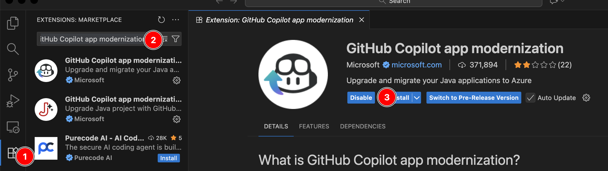

1. Click on the **Extensions** icon.
1. In the search box, look for the **GitHub Copilot app modernization** extension.
1. Install the extension.

### Sign In to VS Code with GitHub

To use GitHub Copilot, sign in with the GitHub account. After signing in to GitHub, open VS Code and complete the Copilot setup:

1. Open VS Code and click on the **Extensions** icon in the left sidebar. Search for **GitHub Copilot Chat** and install the extension.

  

2. Click the **account icon** (bottom right) → **Sign in to use Copilot.**

  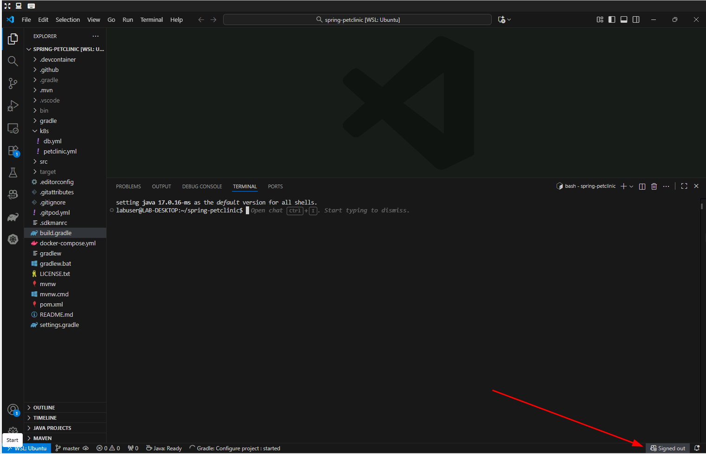

3. Select **Continue with GitHub**.

  

4. Authorize VS Code to access your GitHub account.

  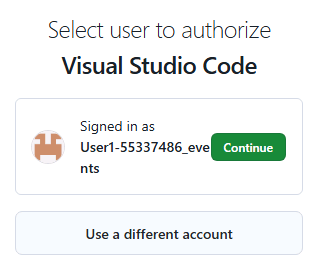

5. Click **Connect**, then **Authorize Visual-Studio-Code**.

  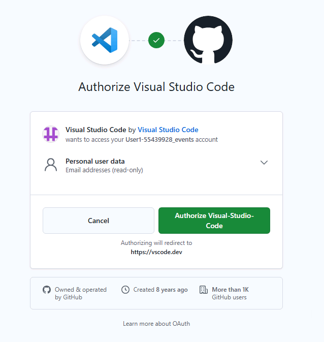

6. When prompted, choose to always allow **vscode.dev** to open links.

  

7. Back in VS Code, open the **GitHub Copilot Chat** window and switch the model to **Claude Sonnet 4.5**.

  


## Set Up Local PetClinic Environment
### Run the Automated Setup Script

To facilitate standing up our local environment, we will use a script to perform a complete one-command setup. This script will:

1. **Clone the repository** to `~/spring-petclinic` and creates a symlink for easy access
2. **Launch PostgreSQL** in a Docker container with pre-configured credentials
3. **Build and start** the Spring Boot application connected to the database

Steps:

1. Clone the GitHub repository for this workshop.

	```bash
	git clone https://github.com/appdevgbb/mm-springboot-petclinic-to-aks-automatic-ignite.git
	```

1. Next, execute the setup script from the `infra` directory:

	```bash
	cd mm-springboot-petclinic-to-aks-automatic-ignite/infra
	chmod +x setup-local-lab-infra.sh
	./setup-local-lab-infra.sh
	```

The script will complete in approximately 1-2 minutes. When finished, your PetClinic application will be running at **http://localhost:8080**.

### Verify and Explore PetClinic Locally

In this section, you'll confirm that the locally deployed PetClinic application is running with PostgreSQL, and explore its main features.

In VS Code, open a new terminal by pressing `` Ctrl+` `` (backtick) or go to **Terminal** → **New Terminal** in the menu.

In the new terminal, run the petclinic:

```bash
mvn clean compile && mvn spring-boot:run \
-Dspring-boot.run.arguments="--spring.messages.basename=messages/messages \
--spring.datasource.url=jdbc:postgresql://localhost/petclinic \
--spring.sql.init.mode=always \
--spring.sql.init.schema-locations=classpath:db/postgres/schema.sql \
--spring.sql.init.data-locations=classpath:db/postgres/data.sql \
--spring.jpa.hibernate.ddl-auto=none"
```

Open your browser and go to http://localhost:8080 to confirm the PetClinic application is running.

   

### Explore the PetClinic Application

Once it's running, try out the key features:

- **Find Owners:** Select **"FIND OWNERS"**, leave the Last Name field blank, and click "Find Owner" to list all 10 owners.

- **View Owner Details:** Click an owner (e.g., Betty Davis) to see their information and pets.

- **Edit Pet Information:** From an owner's page, click **"Edit Pet"** to view or modify pet details.

- **Review Veterinarians:** Go to **"VETERINARIANS"** to see the 6 vets and their specialties (radiology, surgery, dentistry).

After exploring the PetClinic application, you can stop it by pressing `CTRL+C`.

## Application Modernization

In this section, you'll use GitHub Copilot app modernization to assess, remediate, and modernize the Spring Boot application in preparation to migrate the workload to AKS.

Next let's begin our modernization work.

1. Select `GitHub Copilot app modernization` extension.

   

### Execute the Assessment

Now that you have GitHub Copilot setup, you can use the assessment tool to analyze your Spring Boot PetClinic application using the configured analysis parameters.

1. Navigate the Extension Interface and click **Migrate to Azure** to begin the modernization process.

   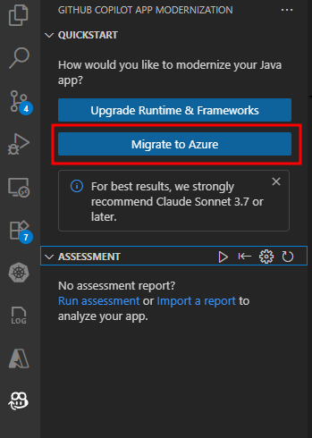

2. Allow the GitHub Copilot app modernization to sign in to GitHub.

   

3. Authorize your user to sign in.

   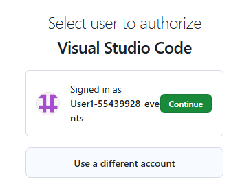

4. And finally, authorize it again on this screen.

   

5. The assessment will start now. Notice that GitHub will install the AppCAT CLI for Java. This might take a few minutes.

   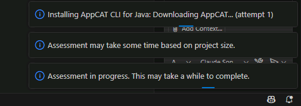

:::info

You can follow the progress of the upgrade by looking at the Terminal in VS Code.

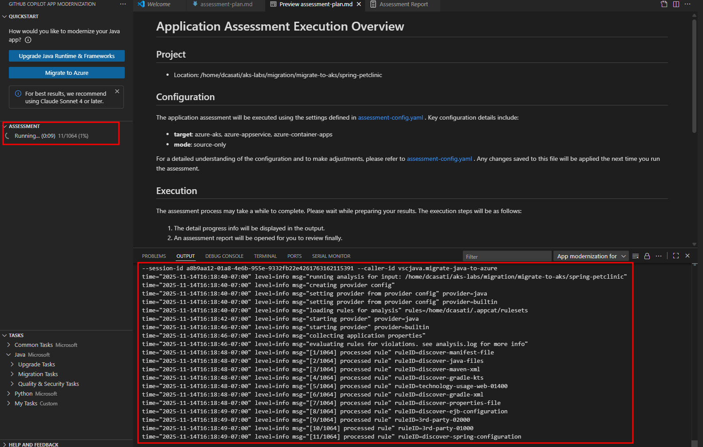

Also note that you might be prompted to allow access to the language models provided by GitHub Copilot Chat. Click on **Allow**.

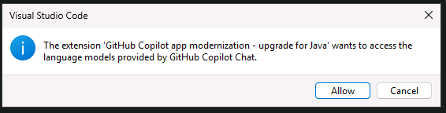

:::

### Overview of the Assessment

Assessment results are consumed by GitHub Copilot App Modernization (AppCAT). AppCAT examines the scan findings and produces targeted modernization recommendations to prepare the application for containerization and migration to Azure.

- **target**: the desired runtime or Azure compute service you plan to move the app to.
- **mode**: the analysis depth AppCAT should use.

#### Analysis Targets

Target values select the rule sets and guidance AppCAT will apply.

| Target | Description |
|--------|---------|
| azure-aks | Guidance and best practices for deploying to Azure Kubernetes Service (AKS). |
| azure-appservice | Guidance and best practices for deploying to Azure App Service. |
| azure-container-apps | Guidance and best practices for deploying to Azure Container Apps. |
| cloud-readiness | General recommendations to make the app "cloud-ready" for Azure. |
| linux | Recommendations to make the app Linux-ready (packaging, file paths, runtime details). |
| openjdk11 | Compatibility and runtime recommendations for running Java 8 apps on Java 11. |
| openjdk17 | Compatibility and runtime recommendations for running Java 11 apps on Java 17. |
| openjdk21 | Compatibility and runtime recommendations for running Java 17 apps on Java 21. |

#### Analysis Modes

Choose how deep AppCAT should inspect the project.

| Mode | Description |
|--------|---------|
| source-only | Fast analysis that examines source code only. |
| full | Full analysis: inspects source code and scans dependencies (slower, more thorough). |

#### Where to Change These Options

Edit the file at `.github/appmod-java/appcat/assessment-config.yaml` to change targets and modes.

For this lab, AppCAT runs with the following configuration:

```yaml
appcat:
  - target:
      - azure-aks
      - azure-appservice
      - azure-container-apps
      - cloud-readiness
    mode: source-only
```

If you want a broader scan (including dependency checks) change `mode` to `full`, or add/remove entries under `target` to focus recommendations on a specific runtime or Azure compute service.

### Review the Assessment Results

After the assessment completes, you'll see a success message in the GitHub Copilot chat summarizing what was accomplished:


The assessment analyzed the Spring Boot Petclinic application for cloud migration readiness and identified the following:

**Key Findings:**

- 8 cloud readiness issues requiring attention
- 1 Java upgrade opportunity for modernization

**Resolution Approach:** More than 50% of the identified issues can be automatically resolved through code and configuration updates using GitHub Copilot's built-in app modernization capabilities.

**Issue Prioritization:** Issues are categorized by urgency level to guide remediation efforts:

- **Mandatory (Purple)** - Critical issues that must be addressed before migration.
- **Potential (Blue)** - Performance and optimization opportunities.
- **Optional (Gray)** - Nice-to-have improvements that can be addressed later.

This prioritization framework ensures teams focus on blocking issues first while identifying opportunities for optimization and future enhancements.

### Review Specific Findings

Click on individual issues in the report to see detailed recommendations. In practice, you would review all recommendations and determine the set that aligns with your migration and modernization goals for the application.

:::note

For this lab, we will spend our time focusing on one modernization recommendation: updating the code to use modern authentication via Azure Database for PostgreSQL Flexible Server with Entra ID authentication.

:::

| Aspect | Details |
|--------|---------|
| **Modernization Lab Focus** | Database Migration to Azure PostgreSQL Flexible Server |
| **What was found** | PostgreSQL database configuration using basic authentication detected in Java source code files |
| **Why this matters** | External dependencies like on-premises databases with legacy authentication must be resolved before migrating to Azure |
| **Recommended solution** | Migrate to Azure Database for PostgreSQL Flexible Server |
| **Benefits** | Fully managed service with automatic backups, scaling, and high availability |

### Take Action on Findings

Based on the assessment findings, GitHub Copilot app modernization provides two types of migration actions to assist with modernization opportunities:

1. Using the **guided migrations** ("Run Task" button), which offer fully guided, step-by-step remediation flows for common migration patterns that the tool has been trained to handle.

2. Using the **unguided migrations** ("Ask Copilot" button), which provide AI assistance with context aware guidance and code suggestions for more complex or custom scenarios.

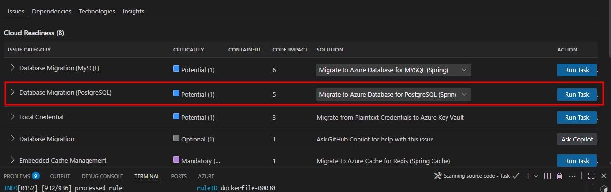

For this workshop, we'll focus on one modernization area that demonstrates how to externalize dependencies in the workload to Azure PaaS before deploying to AKS. We'll migrate from self-hosted PostgreSQL with basic authentication to Azure PostgreSQL Flexible Server using Entra ID authentication with AKS Workload Identity.

### Select PostgreSQL Migration Task

Begin the modernization by selecting the desired migration task. For our Spring Boot application, we will migrate to Azure PostgreSQL Flexible Server using the Spring option. The other options shown are for generic JDBC usage.


:::note

Choose the "Spring" option for Spring Boot applications, as it provides Spring-specific optimizations and configurations. The generic JDBC options are for non-Spring applications.

:::

### Execute Postgres Migration Task

Click the **Run Task** button described in the previous section to kick off the modernization changes needed in the PetClinic app. This will update the Java code to work with PostgreSQL Flexible Server using Entra ID authentication.


The tool will execute the `appmod-run-task` command for `managed-identity-spring/mi-postgresql-spring`, which will examine the workspace structure and initiate the migration task to modernize your Spring Boot application for Azure PostgreSQL with managed identity authentication. If prompted to run shell commands, please review and allow each command as the Agent may require additional context before execution.

### Review Migration Plan and Begin Code Migration

The App Modernization tool has analyzed your Spring Boot application and generated a comprehensive migration plan in its chat window and in the `plan.md` file. This plan outlines the specific changes needed to implement Azure Managed Identity authentication for PostgreSQL connectivity.


To Begin Migration type **"Continue"** in the GitHub Agent Chat to start the code refactoring.

### Review Migration Process and Progress Tracking

Once you confirm with **"Continue"**, the migration tool begins implementing changes using a structured, two-phase approach designed to ensure traceability and commit changes to a new dedicated code branch for changes to enable rollback if needed.

#### Two-Phase Migration Process

**Phase 1: Update Dependencies**

- **Purpose**: Add the necessary Azure libraries to your project.
- **Changes made**:
  - Updates `pom.xml` with Spring Cloud Azure BOM and PostgreSQL starter dependency
  - Updates `build.gradle` with corresponding Gradle dependencies
  - Adds Spring Cloud Azure version properties.

**Phase 2: Configure Application Properties**

- **Purpose**: Update configuration files to use managed identity authentication.
- **Changes made**:
  - Updates `application.properties` to configure PostgreSQL with managed identity (9 lines added, 2 removed)
  - Updates `application-postgres.properties` with Entra ID authentication settings (5 lines added, 4 removed)
  - Replaces username/password authentication with managed identity configuration.

#### Progress Tracking

The `progress.md` file provides real-time visibility into the migration process:

- **Change documentation**: Detailed log of what changes are being made and why.
- **File modifications**: Clear tracking of which files are being updated.
- **Rationale**: Explanation of the reasoning behind each modification.
- **Status updates**: Real-time progress of the migration work.

:::info

**How to Monitor Progress:**

- Watch the GitHub Copilot chat for real-time status updates
- Check the `progress.md` file in the migration directory for detailed change logs
- Review the `plan.md` file to understand the complete migration strategy
- Monitor the terminal output for any build or dependency resolution messages

:::

### Review Migration Completion Summary

Upon successful completion of the validation process, the App Modernization tool presents a comprehensive migration summary report confirming the successful implementation of Azure Managed Identity authentication for PostgreSQL in your Spring Boot application.


The migration has successfully transformed your application from **password-based** Postgres authentication to **Azure Managed Identity** for PostgreSQL, removing the need for credentials in code while maintaining application functionality. The process integrated Spring Cloud Azure dependencies, updated configuration properties for managed identity authentication, and ensured all validation stages passed including: **CVE scanning, build validation, consistency checks, and test execution**.

:::info

Because the workload is based on Java Spring Boot, an advantage of this migration is that no Java code changes were required. Spring Boot's configuration-driven architecture automatically handles database connection details based on the configuration files.

When switching from password authentication to managed identity, Spring reads the updated configuration and automatically uses the appropriate authentication method. Your existing Java code for database operations (such as saving pet records or retrieving owner information) continues to function as before, but now connects to the database using the more secure managed identity approach.

:::

**Files Modified:**

The migration process updated the following configuration files:

- `pom.xml` and `build.gradle` - Added Spring Cloud Azure dependencies.
- `application.properties` and `application-postgres.properties` - Configured managed identity authentication.
- Test configurations - Updated to work with the new authentication method.

:::info

Throughout this lab, the GitHub Copilot App Modernization extension will create, edit and change various files. The Agent will give you an option to _Keep_ or _Undo_ these changes which will be saved into a new Branch, preserving your original files in case you need to rollback any changes.


:::

### Validation and Fix Iteration Loop

After implementing the migration changes, the App Modernization tool automatically validates the results through a comprehensive testing process to ensure the migration changes are secure, functional, and consistent.


**Validation Stages:**

| Stage | Validation | Details |
|--------|---------|---------|
| 1 | **CVE Validation** | Scans newly added dependencies for known security vulnerabilities. |
| 2 | **Build Validation** | Verifies the application compiles and builds successfully after migration changes. |
| 3 | **Consistency Validation** | Ensures all configuration files are properly updated and consistent. |
| 4 | **Test Validation** | Executes application tests to verify functionality remains intact. |

:::note
During these stages, you might be prompted to allow the **GitHub Copilot app modernization** extension to access GitHub. Allow it and select your user account when asked.


:::

**Automated Error Detection and Resolution:**

The tool includes intelligent error detection capabilities that automatically identify and resolve common issues:

- Parses build output to detect compilation errors.
- Identifies root causes of test failures.
- Applies automated fixes for common migration issues.
- Continues through validation iterations (up to 10 iterations) until the build succeeds.

:::info

**User Control:**

At any point during this validation process, you may interrupt the automated fixes and manually resolve issues if you prefer to handle specific problems yourself. The tool provides clear feedback on what it's attempting to fix and allows you to take control when needed at any time.

This systematic approach ensures your Spring Boot application is successfully modernized for Azure PostgreSQL with Entra ID authentication while maintaining full functionality.

:::

## Generate Containerization Assets with AI

In this section, you'll use AI-powered tools to generate Docker and Kubernetes manifests for your modernized Spring Boot application.

### Using Containerization Assist

In the GitHub Copilot App Mod extension, click on **Containerize Task -> Containerize Application**

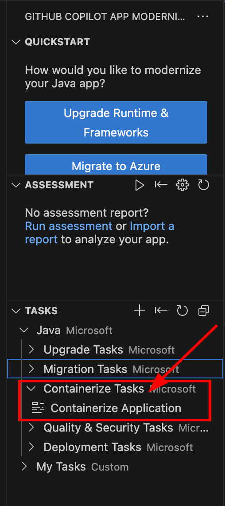

The Containerization Assist MCP Server will scan your project and conteineriza your application. It will elaborate on a strategy on how to do this which will involve:

- **Dockerfile**: Multi-stage build with optimized base image
- **Kubernetes Deployment**: With Azure workload identity, PostgreSQL secrets, health checks, and resource limits
- **Kubernetes Service**: LoadBalancer configuration for external access

The expected result are Kubernetes manifests in the `k8s/` directory.

:::note 
You are almost there. Before deploying it to your cluster, double check the image location, the use of workload identity and if the service connector secret reference in the deployment file are correct to your environment. 
:::

:::tip
If needed, you can refer to this [sample](./assets/migration-to-aks/sample.yaml) deployment file. 

 Key areas to pay close attention to are:
  - azure.workload.identity/use: "true" 
  - serviceAccountName: `sc-account-XXXX` this needs to reflect the service account created earlier during the PostgreSQL Service Connector 
  - image: `<acr-login-server>/petclinic:0.0.1` this should point to your ACR and image created earlier.

If needed, you can retriev the Service Connector account name from your `k8s/sc.json` file.
Example format `sc-account-d4157fc8-73b5-4a68-acf4-39c8f22db792`
:::

### Build and Push Container Image to ACR

Build the containerized application and push it to your Azure Container Registry.

Login to ACR using Azure CLI:

```bash
az acr login --name ${ACR_NAME}
```

Build the Docker image in Azure Container Registry:

```bash
az acr build -t petclinic:0.0.1 . -r ${ACR_NAME}
```

## Deploying the modernized application

In this section, you'll deploy the modernized application to AKS using Service Connector secrets for passwordless authentication with PostgreSQL.

### Deploying to AKS

Apply the Kubernetes manifests to deploy the application.

Update the image name in your deployment manifest with your ACR login server. You can retrieve the name of your Azure Container Registry with this command:

```bash
echo "${ACR_LOGIN_SERVER}/petclinic:0.0.1"
```

Apply the deployment manifest:

```bash
kubectl apply -f k8s/petclinic.yaml
```

Monitor deployment status:

```bash
kubectl get pods,services,deployments
```

Expect:

```bash
NAME                                    READY   STATUS              RESTARTS   AGE
petclinic-deployment-5f9db48c65-qpb8l   0/1     Pending             0          2m2s
```

### Verify Deployment and Connectivity

Test the deployed application and verify Entra ID authentication.

Port forward to access the application:

```bash
kubectl port-forward svc/petclinic-service 8080:80
```

Test the application (in another terminal):

```bash
curl http://localhost:8080
```

Check pod logs for successful database connections:

```bash
kubectl logs -l app=petclinic
```

Verify health endpoints:

```bash
curl http://localhost:8080/actuator/health
```

### Validate Entra ID Authentication

Verify that the application is using passwordless authentication:

1. Check environment variables in the pod (get first pod with label)
	```bash
	POD_NAME=$(kubectl get pods -l app=spring-petclinic -o jsonpath='{.items[0].metadata.name}')
	kubectl exec $POD_NAME -- env | grep POSTGRES
	```

	Expected output:

	```bash
	AZURE_POSTGRESQL_PORT=5432
	AZURE_POSTGRESQL_DATABASE=petclinic
	AZURE_POSTGRESQL_USERNAME=aad_pg
	AZURE_POSTGRESQL_CLIENTID=1094a914-1837-406a-ad58-b9dcc499177a
	AZURE_POSTGRESQL_HOST=db-petclinic55954159.postgres.database.azure.com
	AZURE_POSTGRESQL_SSL=true
	POSTGRES_USER=aad_pg
	```

1. Verify no password environment variables are present

	```bash
	kubectl exec $POD_NAME -- env | grep -i pass
	```

	Expected output:
  
	```bash
	SPRING_DATASOURCE_AZURE_PASSWORDLESS_ENABLED=true
	```

1. Check application logs for successful authentication

	```bash
	kubectl logs -l app=spring-petclinic --tail=100 | grep -i "hibernate"
	```

	Expected outcome:

	```bash
	[...]
	Hibernate: drop table if exists pets cascade
	Hibernate: drop table if exists specialties cascade
	Hibernate: drop table if exists types cascade
	Hibernate: drop table if exists vet_specialties cascade
	[...]
	```

The application is successfully deployed to AKS with passwordless authentication to PostgreSQL using Entra ID and workload identity.

## Workshop Recap & What's Next

**Congratulations!** You've successfully completed a comprehensive application modernization journey, transforming a legacy Spring Boot application into a cloud-native, secure, and scalable solution on Azure.


### What You Accomplished

**Local Environment Setup**

- Set up Spring Boot PetClinic with PostgreSQL in Docker
- Validated local application functionality and database connectivity

**Application Modernization**

- Used GitHub Copilot App Modernization to assess code for cloud readiness
- Migrated from basic PostgreSQL authentication to Azure PostgreSQL Flexible Server
- Implemented Microsoft Entra ID authentication with managed identity
- Applied automated code transformations for cloud-native patterns

**Containerization**

- Generated Docker containers using AI-powered tools
- Created optimized Kubernetes manifests with health checks and security best practices
- Built and pushed container images to Azure Container Registry

**Cloud Deployment**

- Deployed to Azure Kubernetes Service (AKS)
- Configured passwordless authentication using workload identity
- Integrated Azure Service Connector for seamless database connectivity
- Validated production deployment with secure authentication

### Key Takeaways

This workshop demonstrated how AI-powered tools can dramatically accelerate application modernization while maintaining code quality and security standards. The combination of GitHub Copilot App Modernization and Azure's managed services enables teams to focus on business value rather than infrastructure complexity.