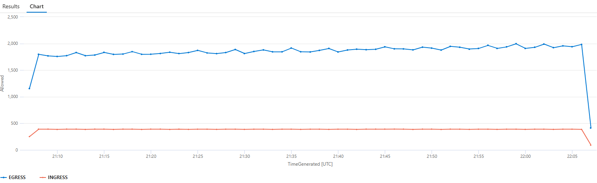

## Advanced Networking Concepts

When you created the AKS cluster you might have noticed that we used the Azure CNI network plugin in overlay mode with [Cilium](https://cilium.io/) for the network dataplane and security. This mode is the most advanced networking mode available in AKS and provides the most flexibility in how IP addresses are assigned to pods and how network policies are enforced.

In this section, you will explore advanced networking concepts such as network policies, FQDN filtering, and advanced container networking services.

### Advanced Container Networking Services

Advanced Container Networking Services (ACNS) is a suite of services built to significantly enhance the operational capabilities of your Azure Kubernetes Service (AKS) clusters.
Advanced Container Networking Services contains features split into two pillars:

- **Security**: For clusters using Azure CNI Powered by Cilium, network policies include fully qualified domain name (FQDN) filtering for tackling the complexities of maintaining configuration.
- **Observability**: The inaugural feature of the Advanced Container Networking Services suite bringing the power of Hubble’s control plane to both Cilium and non-Cilium Linux data planes. These features aim to provide visibility into networking and performance.

### Enforcing Network Policy

In this section, we’ll apply network policies to control traffic flow to and from the Pet Shop application. We will start with standard network policy that doesn't require ACNS, then we enforce more advanced FQDN policies.

#### Test Connectivity

Do the following test to make sure that all traffic is allowed by default

Run the following command to test a connection to an external website from the order-service pod.

```bash
kubectl exec -n pets -it $(kubectl get po -n pets -l app=order-service -ojsonpath='{.items[0].metadata.name}') -c order-service -- sh -c 'wget --spider www.bing.com'
```

You should see output similar to the following:

```text
Connecting to www.bing.com (13.107.21.237:80)
remote file exists
```

Now test the connection between the order-service and product-service pods which is allowed but not required by the architecture.

```bash
kubectl exec -n pets -it $(kubectl get po -n pets -l app=order-service -ojsonpath='{.items[0].metadata.name}') -c order-service  -- sh -c 'nc -zv -w2 product-service 3002'
```

You should see output similar to the following:

```text
product-service (10.0.96.101:3002) open
```

In both tests, the connection was successful. This is because all traffic is allowed by default in Kubernetes.

#### Deploy Network Policy

Now, let's deploy some network policy to allow only the required ports in the pets namespace.

Run the following command to apply the network policy manifest file from the assets folder.

```bash
kubectl apply -n pets -f assets/acns-network-policy.yaml
```

Optionally, take a look at the network policy manifest file by running the following command.

```bash
cat assets/acns-network-policy.yaml
```

Apply the network policy to the pets namespace.

```bash
kubectl apply -n pets -f assets/acns-network-policy.yaml
```

#### Verify Policies

Review the created policies using the following command

```bash
kubectl get cnp -n pets
```

Ensure that only allowed connections succeed and others are blocked. For example, order-service should not be able to access www.bing.com or the product-service.

Run the following command to test the connection to www.bing.com from the order-service pod.

```bash
kubectl exec -n pets -it $(kubectl get po -n pets -l app=order-service -ojsonpath='{.items[0].metadata.name}') -c order-service -- sh -c 'wget --spider --timeout=1 --tries=1 www.bing.com'
```

You should see output similar to the following:

```text
wget: bad address 'www.bing.com'
command terminated with exit code 1
```

Run the following command to test the connection between the order-service and product-service pods.

```bash
kubectl exec -n pets -it $(kubectl get po -n pets -l app=order-service -ojsonpath='{.items[0].metadata.name}') -c order-service  -- sh -c 'nc -zv -w2 product-service 3002'
```

You should see output similar to the following:

```text
nc: bad address 'product-service'
command terminated with exit code 1
```

We've just enforced network policies to control traffic flow to and from pods within the demo application. At the same time, we should be able to access the pet shop app UI and order product normally.

### Configuring FQDN Filtering

Using network policies, you can control traffic flow to and from your AKS cluster. This is traditionally been enforced based on IP addresses and ports. But what if you want to control traffic based on fully qualified domain names (FQDNs)? What if an application owner asks you to allow traffic to a specific domain like Microsoft Graph API?

This is where FQDN filtering comes in.

<div class="info" data-title="Note">

> FQDN filtering is only available for clusters using Azure CNI Powered by Cilium.

</div>

Let's explore how we can apply FQDN-based network policies to control outbound access to specific domains.

#### Test Connectivity

Let's start with testing the connection from the order-service to see if it can contact the Microsoft Graph API endpoint.

Run the following command to test the connection to the Microsoft Graph API from the order-service pod.

```bash
kubectl exec -n pets -it $(kubectl get po -n pets -l app=order-service -ojsonpath='{.items[0].metadata.name}') -c order-service  -- sh -c 'wget --spider --timeout=1 --tries=1 https://graph.microsoft.com'
```

As you can see the traffic is denied. This is an expected behavior because we have implemented zero trust security policy and denying any unwanted traffic.

#### Create an FQDN Policy

To limit egress to certain domains, apply an FQDN policy. This policy permits access only to specified URLs, ensuring controlled outbound traffic.

<div class="info" data-title="Note">

> FQDN filtering requires ACNS to be enabled

</div>

Run the following command to apply the FQDN policy manifest file from the assets folder.

```bash
kubectl apply -n pets -f assets/acns-network-policy-fqdn.yaml
```

Optionally, take a look at the FQDN policy manifest file by running the following command.

```bash
cat assets/acns-network-policy-fqdn.yaml
```

#### Verify FQDN Policy Enforcement

Now if we try to access Microsoft Graph API from order-service app, that should be allowed.

```bash
kubectl exec -n pets -it $(kubectl get po -n pets -l app=order-service -ojsonpath='{.items[0].metadata.name}') -c order-service  -- sh -c 'wget --spider --timeout=1 --tries=1 https://graph.microsoft.com'
```

You should see output similar to the following:

```text
Connecting to graph.microsoft.com (20.190.152.88:443)
Connecting to developer.microsoft.com (23.45.149.11:443)
Connecting to developer.microsoft.com (23.45.149.11:443)
remote file exists
```

### Monitoring Advanced Network Metrics and Flows

Advanced Container Networking Services (ACNS) provides deep visibility into your cluster's network activity. This includes flow logs and deep visibility into your cluster's network activity. All communications to and from pods are logged, allowing you to investigate connectivity issues over time

Using Azure Managed Grafana, you can visualize real-time data and gain insights into network traffic patterns, performance, and policy effectiveness.

What if a customer reports a problem in accessing the pets shop? How can you troubleshoot the issue?

We'll work to simulate a problem and then use ACNS to troubleshoot the issue.

#### Introducing Chaos to Test container networking

Let's start by applying a new network policy to cause some chaos in the network. This policy will drop incoming traffic to the store-front service.

Run the following command to apply the chaos policy manifest file from the assets folder.

```bash
kubectl apply -n pets -f assets/acns-network-policy-chaos.yaml
```

Optionally, examine the chaos policy manifest file by running the following command.

```bash
cat assets/acns-network-policy-chaos.yaml
```

#### Access Grafana Dashboard

When you enabled Advanced Container Networking Services (ACNS) on your AKS cluster, you also enabled metrics collection. These metrics provide insights into traffic volume, dropped packets, number of connections, etc. The metrics are stored in Prometheus format and, as such, you can view them in Grafana.

Using your browser, navigate to [Azure Portal](https://aka.ms/publicportal), search for **grafana** resource, then click on the **Azure Managed Grafana** link under the **Services** section. Locate the Azure Managed Grafana resource that was created earlier in the workshop and click on it, then click on the URL next to **Endpoint** to open the Grafana dashboard.


Part of ACNS we provide pre-defined networking dashboards. Review the available dashboards


You can start with the **Kubernetes / Networking / Clusters** dashboard to get an over view of whats is happening in the cluster.


Lets' change the view to the **Kubernetes / Networking / Drops**, select the **pets** namespace, and **store-front** workload


Now you can see increase in the dropped incoming traffic and the reason is "policy_denied" so now we now the reason that something was wrong with the network policy. let's dive dipper and understand why this is happening

[Optional] Familiarize yourself with the other dashboards for DNS, and pod flows

|  |  |
| ----------------------------------------------- | ----------------------------------------------------------- |

#### Leverage Container Network Flow Logs for Faster Troubleshooting

The Grafana metrics showed you **that** there's a problem - dropped incoming traffic to store-front. But they don't tell you:
- **Who** is being blocked (which specific source IPs or clients)
- **Why** DNS queries fail for specific domains
- **When** exactly the problem started affecting individual flows
- **What** external endpoints are failing vs succeeding

This is where **Container Network Flow Logs** accelerate your troubleshooting. Think of metrics as the "smoke alarm" and flow logs as the "security camera footage" - metrics alert you to the problem, while flow logs show you exactly what happened.

**The Traditional Troubleshooting Approach (Without Flow Logs):**
1. SSH into individual nodes to check iptables rules (risky in production)
2. Enable debug logging on pods (requires restarts, loses existing state)
3. Manually test connections one-by-one to isolate the issue
4. Correlate timestamps across multiple pod logs to understand traffic patterns
5. **Estimated time: 2-4 hours** for a complex network policy issue

**With Container Network Flow Logs (What You'll Do Next):**
1. Run a single KQL query to see exact blocked connections with source IPs
2. Query DNS traffic to identify which domains are allowed vs blocked
3. Correlate DNS success with connection failures in one view
4. Visualize traffic patterns over time to pinpoint when the issue started
5. **Estimated time: 10-15 minutes** to fully diagnose the root cause

Let's see this in action by investigating the issues developers reported.

##### Enable Flow Logs for the Pets Namespace

To enable container network flow logs, you need to apply a `ContainerNetworkLog` custom resource that defines which network flows to capture. Let's create a filter to capture all traffic in the pets namespace.

Create a file named `pets-flow-logs.yaml` with the following content:

```bash
cat <<EOF > pets-flow-logs.yaml
apiVersion: acn.azure.com/v1alpha1
kind: ContainerNetworkLog
metadata:
  name: testcnl # Cluster scoped
spec:
  includefilters: # List of filters
    - name: egress-filter # Capture egress traffic from pets namespace
      from:
        namespacedPod: # List of source namespace/pods. Prepend namespace with /
          - pets/order-service-
          - pets/product-service-
          - pets/rabbitmq
          - pets/store-front-
      protocol: # List of protocols; can be tcp, udp, dns
        - tcp
        - udp
        - dns
      verdict: # List of verdicts; can be forwarded, dropped
        - forwarded
        - dropped
    
    - name: ingress-filter # Capture ingress traffic to pets namespace
      to:
        namespacedPod: # Destination pods
          - pets/store-front-
          - pets/order-service-
          - pets/product-service-
          - pets/rabbitmq
      protocol:
        - tcp
        - udp
      verdict:
        - forwarded
        - dropped
EOF
```

Apply the custom resource to enable flow log collection:

```bash
kubectl apply -f pets-flow-logs.yaml
```

Verify the custom resource was created successfully:

```bash
kubectl describe containernetworklog pets-namespace-flow-logs
```

You should see a `Status` field showing `State: CONFIGURED`. This means flow logs are now being collected for the pets namespace and sent to your Log Analytics workspace.

<div class="info" data-title="Note">

> Flow logs are stored locally on the nodes at `/var/log/acns/hubble/events.log` and then collected by the Azure Monitor Agent and sent to Log Analytics. It may take 2-3 minutes for logs to appear in Log Analytics after network events occur.

</div>

##### Generate Traffic to Observe Flow Logs

Now let's create a realistic troubleshooting scenario. Imagine you're a platform engineer and developers report that the store-front application is experiencing intermittent connectivity issues. Some external API calls work while others fail, and users occasionally can't access the application.

Let's simulate this scenario by applying an additional network policy and generating various types of traffic:

**Step 1: Apply the Combined FQDN and L7 Policy**

This policy adds FQDN filtering and L7 HTTP rules to the store-front application:

```bash
kubectl apply -f assets/aks-combined-fqdn-l7.yaml
```

Optionally, review the policy to understand what traffic it allows:

```bash
cat assets/aks-combined-fqdn-l7.yaml
```

**Step 2: Generate Test Traffic (Individual Scenarios)**

Now let's generate test traffic for each scenario individually so you can observe the results step by step.

**Scenario 1: Test External Access to Store-Front**

This tests whether external users can access the store-front application.

```bash
STORE_FRONT_IP=$(kubectl get svc -n pets store-front -o jsonpath='{.status.loadBalancer.ingress[0].ip}')
echo "Testing external access to store-front at ${STORE_FRONT_IP}..."
curl -s -m 2 http://${STORE_FRONT_IP} || echo "Connection failed"
```

**Expected Result:**

```text
Connection failed
```

**Why?** The chaos policy blocks ALL ingress traffic with `ingress: - fromEndpoints: []` (allow from nowhere = block all)

---

**Scenario 2: Test FQDN Access to microsoft.com (Allowed Domain)**

This tests access to a domain that is in BOTH the DNS patterns AND toFQDNs list.

```bash
echo "Testing FQDN access to microsoft.com..."
kubectl exec -n pets -it $(kubectl get po -n pets -l app=store-front -ojsonpath='{.items[0].metadata.name}') -- sh -c 'wget --spider --timeout=2 https://www.microsoft.com'
```

**Expected Result:**

```text
Connecting to www.microsoft.com (23.192.18.101:443)
wget: server returned error: HTTP/1.1 403 Forbidden
```

**Why?** The network policy **allows** the connection (DNS query succeeds, HTTPS connection succeeds), but the Microsoft web server returns HTTP 403. This proves the FQDN policy is working correctly - the network allows the traffic through.

---

**Scenario 3: Test FQDN Access to api.github.com (DNS Blocked)**

This tests access to a domain that is in the toFQDNs list but NOT in the DNS patterns - demonstrating a common misconfiguration.

```bash
echo "Testing FQDN access to api.github.com..."
kubectl exec -n pets -it $(kubectl get po -n pets -l app=store-front -ojsonpath='{.items[0].metadata.name}') -- sh -c 'wget --spider --timeout=2 https://api.github.com'
```

**Expected Result:**

```text
wget: bad address 'api.github.com'
command terminated with exit code 1
```

**Why?** Even though `api.github.com` is in the `toFQDNs` list, the DNS query itself is being blocked because `api.github.com` is NOT in the DNS `matchPattern` rules. The pod never gets to attempt the HTTPS connection.

---

**Scenario 4: Test L7 HTTP Policy - Product Service API Access**

This tests Layer 7 (HTTP) filtering which inspects the actual HTTP method and path, not just IP/port.

```bash
echo "Testing L7 HTTP access to product-service..."
kubectl exec -n pets -it $(kubectl get po -n pets -l app=store-front -ojsonpath='{.items[0].metadata.name}') -- sh -c 'wget --spider --timeout=2 http://product-service:3002/'
```

**Expected Result:**

```text
Connecting to product-service:3002 (10.0.96.101:3002)
remote file exists
```

**Why?** The L7 HTTP policy allows GET requests to the `/` path on product-service. This demonstrates Layer 7 (application layer) filtering - the policy can inspect HTTP methods and paths, not just IP addresses and ports.
Now test a different HTTP method (POST) to the same endpoint:

```bash
echo "Testing L7 HTTP POST to product-service (should be blocked)..."
kubectl exec -n pets -it $(kubectl get po -n pets -l app=store-front -ojsonpath='{.items[0].metadata.name}') -- sh -c 'wget --timeout=2 --post-data="" http://product-service:3002/' || echo "Request blocked by L7 policy"
```

**Expected Result:**

```text
Connecting to product-service:3002 (10.0.96.101:3002)
wget: server returned error: HTTP/1.1 403 Forbidden
Request blocked by L7 policy
```

**Why?** The L7 policy only allows GET requests. POST requests to the same endpoint are blocked at the application layer. This shows how L7 policies provide fine-grained control beyond traditional L3/L4 network policies.

---

**Scenario 5: Test Internal Service-to-Service Communication**

This tests that internal pod-to-pod communication works correctly within the namespace.

```bash
echo "Testing internal service communication (store-front to order-service)..."
kubectl exec -n pets -it $(kubectl get po -n pets -l app=store-front -ojsonpath='{.items[0].metadata.name}') -- sh -c 'nc -zv -w2 order-service 3000'
```

**Expected Result:**

```text
order-service (10.0.96.102:3000) open
```

**Why?** The network policies allow internal communication between services in the pets namespace. This confirms that while external access is restricted and FQDN filtering is applied, internal service mesh communication remains functional.

---

**Scenario 6: Test Internal DNS Resolution with Short Service Names**

This tests that internal cluster DNS resolution works correctly with Kubernetes short service names.

```bash
echo "Testing DNS resolution with short service name..."
kubectl exec -n pets -it $(kubectl get po -n pets -l app=store-front -ojsonpath='{.items[0].metadata.name}') -- sh -c 'nslookup order-service'
```

**Expected Result:**

```text
Server:    10.0.0.10
Address 1: 10.0.0.10 kube-dns.kube-system.svc.cluster.local

Name:      order-service
Address 1: 10.0.96.102 order-service.pets.svc.cluster.local
```

**Why?** The DNS query for `order-service` (short name) gets automatically expanded to `order-service.pets.svc.cluster.local` using the pod's DNS search domain. This demonstrates that internal cluster DNS resolution works correctly, even with the network policies in place. The DNS query matches the `*.pets.svc.cluster.local` pattern in the DNS rules, allowing successful name resolution.

---

**Summary of Test Scenarios:**

| Scenario | Test Type | Protocol/Layer | Result |
|----------|-----------|----------------|--------|
| 1 | External → store-front | L3/L4 (TCP/IP) | ❌ Ingress blocked by chaos policy |
| 2 | microsoft.com | L7 (HTTPS/FQDN) | ✅ Network OK (HTTP 403 from server) |
| 3 | api.github.com | L7 (DNS/FQDN) | ❌ DNS query blocked (missing from DNS patterns) |
| 4 | GET /api/products | L7 (HTTP method) | ✅ Allowed by L7 policy |
| 4b | POST /api/products | L7 (HTTP method) | ❌ Blocked by L7 policy (only GET allowed) |
| 5 | store-front → order-service | L3/L4 (TCP internal) | ✅ Internal communication works |
| 6 | nslookup order-service | DNS (internal) | ✅ Internal DNS resolution works |

<div class="info" data-title="Key Insight">

> **FQDN Policy Requirements**: Notice that `api.github.com` is in the `toFQDNs` list but still fails. This demonstrates a critical Cilium requirement: you need **BOTH** DNS rules (to allow the DNS query) **AND** toFQDNs rules (to allow the connection). Having only toFQDNs without DNS rules means the DNS query gets blocked first, and the connection is never attempted. This is a common misconfiguration that flow logs will help you identify.

</div>

**What You Just Simulated:**

1. **External Access Failures**: The chaos policy is blocking all ingress traffic to store-front
2. **Selective FQDN Filtering**: The FQDN policy allows `*.microsoft.com`, but blocks `api.github.com` at the DNS level
3. **L7 HTTP Method Filtering**: The L7 policy allows GET requests but blocks POST requests to the product-service API, demonstrating application-layer control
4. **Internal Service Mesh**: Pod-to-pod communication within the namespace continues to work normally

The `aks-combined-fqdn-l7.yaml` policy you applied contains:
- **DNS rules**: Allow DNS queries for `rabbitmq.pets.svc.cluster.local` and `*.microsoft.com`
- **FQDN rules**: Allow HTTP/HTTPS to `*.microsoft.com` and `api.github.com`
- **L7 HTTP rules**: Allow GET requests to the product-service backend (path: `/api/products`), but block other HTTP methods like POST

<div class="info" data-title="Important">

> **Understanding FQDN Policy Requirements**: For FQDN filtering to work in Cilium, you need **both** components:
> 
> 1. **DNS rules** (port 53) - Allow the DNS query to resolve the domain name
> 2. **toFQDNs rules** - Allow the connection to the resolved IP address
> 
> In this policy, `*.microsoft.com` works because it's in **both** the DNS patterns and toFQDNs rules. However, domains like `api.github.com`, `bing.com`, and `google.com` fail because they're missing from the DNS `matchPattern` rules - the DNS query gets blocked first, so the pod never gets to attempt the actual connection. This is a common misconfiguration that container network flow logs help you identify quickly.

</div>

Without container network flow logs, you would need to:
- SSH into nodes to check iptables rules
- Manually correlate pod events with network policies
- Spend hours trying different combinations to find the root cause

**With flow logs, you can instantly see**:
- Which exact connections are being dropped and why
- What external endpoints pods are trying to reach
- When the problem started (correlate with deployment times)
- Traffic patterns across your entire namespace

Let's use Log Analytics to investigate these issues in the next section.

##### Query Flow Logs in Log Analytics

Now that flow logs are being collected and we've generated traffic, let's investigate the issues in minutes instead of hours.

Navigate to [Azure Portal](https://aka.ms/publicportal), search for your AKS cluster, then click on **Logs** in the left navigation menu under **Monitoring**. Close the **Queries** dialog if it appears.

<div class="info" data-title="Note">

> First, run this query to see what fields are available in your flow logs:
> ```kusto
> RetinaNetworkFlowLogs
> | take 1
> ```
> This will show you all available fields including dynamic properties that may not appear in the schema.

</div>

##### Progressive Diagnosis Using Flow Logs

Now let's use flow logs to diagnose all the issues we just generated. Each query builds on the previous one, giving you a complete picture of what's happening in your cluster.

<div class="info" data-title="Note">

> **About Query Results**: The results shown in this lab are examples from a specific testing environment. Your actual results will be similar in structure and pattern, but will have different values for IP addresses, pod names, timestamps, and counts based on your specific cluster configuration and traffic patterns.

</div>

##### Query 1: Start with the Obvious - What's Being Blocked? (30 seconds)

First, let's get a high-level view of all dropped traffic in the pets namespace:

```kusto
RetinaNetworkFlowLogs
| where TimeGenerated > ago(30m)
| where SourceNamespace == "pets" or DestinationNamespace == "pets"
| where Verdict == "DROPPED"
| summarize 
    DroppedFlows = count()
    by TrafficDirection, SourcePodName, DestinationPodName
| order by DroppedFlows desc
| take 20
```

**What you'll discover:**( Following result is an example)

| TrafficDirection | SourcePodName | DestinationPodName | DroppedFlows |
|---|---|---|---|
| INGRESS | (external) | store-front-abc123 | 156 |
| EGRESS | store-front-abc123 | (external) | 35 |

**Immediate insights (30 seconds):**
- ✅ **INGRESS to store-front has 156 dropped flows** - This confirms users can't access the application
- ✅ **EGRESS from store-front has 35 dropped flows** - Some external API calls are being blocked

**What we learned:** There are TWO distinct problems:
1. External users can't reach the app (INGRESS issue)
2. The app can't reach some external services (EGRESS issue)

**Next step:** We need to dig deeper into BOTH issues. Let's start with the INGRESS problem.

---

##### Query 2: Diagnose the INGRESS Problem - Who's Being Blocked? (1 minute)

Now let's see exactly which external connections are being dropped:

```kusto
RetinaNetworkFlowLogs
| where TimeGenerated > ago(30m)
| where DestinationNamespace == "pets"
| where DestinationPodName contains "store-front"
| where TrafficDirection == "INGRESS"
| where Verdict == "DROPPED"
| extend SrcIP = tostring(IP.source), DstIP = tostring(IP.destination)
| extend Layer4Data = parse_json(Layer4)
| extend DstPort = coalesce(tostring(Layer4Data.TCP.destination_port), tostring(Layer4Data.UDP.destination_port))
| project TimeGenerated, SrcIP, DstIP, DstPort, Verdict
| order by TimeGenerated desc
| take 20
```

**What you'll discover:**

| TimeGenerated | SrcIP | DstIP | DstPort | Verdict |
|---|---|---|---|---|
| 2024-11-04 10:25:18 | 203.0.113.45 | 10.0.96.101 | 80 | DROPPED |
| 2024-11-04 10:25:19 | 203.0.113.45 | 10.0.96.101 | 80 | DROPPED |
| 2024-11-04 10:25:20 | 203.0.113.45 | 10.0.96.101 | 80 | DROPPED |

**Cumulative insights (90 seconds total):**
- ✅ **Exact source IPs** of blocked external users (203.0.113.45 = your test machine)
- ✅ **Destination port 80** confirms HTTP traffic is being blocked
- ✅ **All INGRESS traffic to store-front is DROPPED** - complete outage for external users

**Root cause for INGRESS:** The chaos policy has `ingress: - fromEndpoints: []` (allow from nowhere = block all ingress)

**Next step:** INGRESS problem understood. Now let's diagnose the EGRESS issue - why are some external API calls failing?

---

##### Query 3: Diagnose EGRESS - Separate DNS Failures from Connection Failures (2 minutes)

Let's look at DNS traffic (port 53) to understand which domains are allowed vs blocked:

```kusto
RetinaNetworkFlowLogs
| where TimeGenerated > ago(30m)
| where SourceNamespace == "pets"
| where SourcePodName contains "store-front"
| where TrafficDirection == "EGRESS"
| extend Layer4Data = parse_json(Layer4)
| extend DstPort = coalesce(tostring(Layer4Data.TCP.destination_port), tostring(Layer4Data.UDP.destination_port))
| where DstPort == "53"  // DNS port
| summarize 
    Count = count()
    by Verdict
| order by Verdict asc
```

**What you'll discover:**

| Verdict | Count |
|---|---|
| DROPPED | 15 |
| FORWARDED | 12 |

**Cumulative insights (3 minutes total):**
- ✅ **12 DNS queries succeeded** (microsoft.com, internal cluster DNS)
- ✅ **15 DNS queries blocked** (api.github.com, google.com, bing.com)
- ✅ **Pattern identified**: DNS is being selectively filtered

**Key insight:** Some domains fail at the DNS level - they never even get to attempt the HTTPS connection. This suggests the DNS `matchPattern` rules are too restrictive.

**Next step:** Let's see the complete picture - which domains are allowed and which are blocked, including both DNS and HTTPS traffic.

---

##### Query 4: Complete Traffic Pattern - DNS + HTTPS Correlation (2 minutes)

Now let's correlate DNS queries with HTTPS connection attempts to understand the full flow:

```kusto
RetinaNetworkFlowLogs
| where TimeGenerated > ago(30m)
| where SourceNamespace == "pets"
| where SourcePodName contains "store-front"
| where TrafficDirection == "EGRESS"
| extend SrcIP = tostring(IP.source), DstIP = tostring(IP.destination)
| extend Layer4Data = parse_json(Layer4)
| extend DstPort = coalesce(tostring(Layer4Data.TCP.destination_port), tostring(Layer4Data.UDP.destination_port))
| where DstPort in ("53", "443")  // DNS and HTTPS
| where isnotempty(DstIP)
| project TimeGenerated, DstIP, DstPort, Verdict
| order by TimeGenerated asc
| take 50
```

**What you'll discover (showing key patterns):**

| TimeGenerated | DstIP | DstPort | Verdict | Explanation |
|---|---|---|---|---|
| 10:26:10 | 10.0.0.10 | 53 | FORWARDED | DNS: microsoft.com |
| 10:26:11 | 23.192.18.101 | 443 | FORWARDED | HTTPS: Connection to microsoft.com succeeds |
| 10:26:15 | 10.0.0.10 | 53 | **DROPPED** | DNS: api.github.com blocked |
| 10:26:20 | 10.0.0.10 | 53 | **DROPPED** | DNS: google.com blocked |
| 10:26:25 | 10.0.0.10 | 53 | **DROPPED** | DNS: bing.com blocked |
| 10:26:30 | 10.0.0.10 | 53 | FORWARDED | DNS: rabbitmq.pets.svc.cluster.local |

**Cumulative insights (5 minutes total):**

**For microsoft.com (✅ Working):**

- Step 1: DNS query to 10.0.0.10 port 53 → **FORWARDED**
- Step 2: HTTPS connection to 23.192.18.101 port 443 → **FORWARDED**
- Result: Network allows traffic (HTTP 403 from server is expected)

**For api.github.com, google.com, bing.com (❌ Failing):**

- Step 1: DNS query to 10.0.0.10 port 53 → **DROPPED**
- Step 2: HTTPS connection → Never attempted (DNS failed first)
- Result: "bad address" error

**Root cause confirmed:** The FQDN policy is missing these domains from the DNS `matchPattern` rules. Even though `api.github.com` is in the `toFQDNs` list, the DNS query gets blocked first.

**Educational insight:** This demonstrates a common FQDN policy misconfiguration - you need BOTH DNS rules AND toFQDNs rules for external access to work.

**Next step:** Let's visualize when these problems started with a timeline chart.

---

##### Query 5: Timeline - When Did the Problems Start? (1 minute)

Create a visual timeline to correlate issues with policy deployments:

```kusto
RetinaNetworkFlowLogs
| where TimeGenerated > ago(1h)
| where SourceNamespace == "pets" or DestinationNamespace == "pets"
| summarize 
    Allowed = countif(Verdict == "FORWARDED"),
    Dropped = countif(Verdict == "DROPPED")
    by bin(TimeGenerated, 1m), TrafficDirection
| render timechart
```

**What you'll discover:**

A visual timeline showing:


- **10:15 AM**: Sudden spike in DROPPED INGRESS traffic (chaos policy applied)
- **10:15 AM**: Increase in DROPPED EGRESS traffic (FQDN policy with DNS restrictions)
- **Before 10:15 AM**: Normal traffic patterns with minimal drops

**Cumulative insights (6 minutes total):**

- ✅ **Both problems started at 10:15 AM** - exactly when you applied the policies
- ✅ **Clear correlation** between policy changes and user-reported issues
- ✅ **Eliminated other causes** (not an app bug, infrastructure issue, or external service outage)

**Troubleshooting value:** You can now confidently tell the team: "The issues started at 10:15 AM when we applied the new network policies. It's not the application code."

**Next step:** We've identified WHEN and WHY the problems occurred. Let's get one final summary view.

---

##### Query 6: Final Summary - Complete Diagnosis (1 minute)

Get a comprehensive view of all traffic patterns to confirm your diagnosis:


```kusto
RetinaNetworkFlowLogs
| where TimeGenerated > ago(30m)
| where SourceNamespace == "pets" or DestinationNamespace == "pets"
| summarize 
    TotalFlows = count(),
    DroppedFlows = countif(Verdict == "DROPPED"),
    ForwardedFlows = countif(Verdict == "FORWARDED")
    by TrafficDirection, SourcePodName, DestinationPodName
| extend DropRate = round((DroppedFlows * 100.0) / TotalFlows, 2)
| where TotalFlows > 5  // Filter out noise
| order by DroppedFlows desc
| take 20
```

**What you'll discover:**

| TrafficDirection | SourcePodName | DestinationPodName | TotalFlows | DroppedFlows | DropRate% |
|---|---|---|---|---|---|
| INGRESS | (external) | store-front-abc123 | 156 | 156 | **100%** |
| EGRESS | store-front-abc123 | (external) | 89 | 23 | 25.8% |
| EGRESS | store-front-abc123 | kube-dns | 45 | 12 | 26.7% |

**Complete Diagnosis Achieved (7 minutes total):**

**Problem 1: External Users Can't Access the Application**

- **Evidence**: INGRESS to store-front has 100% drop rate (156 flows, all dropped)
- **Root Cause**: Chaos policy has `ingress: - fromEndpoints: []` (allow from nowhere = block all)
- **Fix Needed**: Restore original policy with `fromEntities: - world`

**Problem 2: External API Calls Failing**

- **Evidence**: EGRESS to external has 25.8% drop rate, DNS queries have 26.7% drop rate
- **Root Cause**: FQDN policy missing domains (api.github.com, google.com, bing.com) from DNS `matchPattern` rules
- **Fix Needed**: Add missing domains to DNS patterns OR remove from toFQDNs list

**Problem 3: Internal Communication Working Fine**

- **Evidence**: EGRESS between pods in pets namespace has <5% drop rate (filtered out)
- **Conclusion**: Application code and internal services are healthy

**Total Time with Flow Logs: ~7 minutes**  
**Estimated Time Without Flow Logs: 2-4 hours**  
**Time Saved: 85-95%** ⚡

---

##### Diagnosis Summary: What You Learned

By using container network flow logs with a **progressive, cumulative approach**, you:

1. **Query 1 (30s)**: Identified TWO distinct problems (INGRESS + EGRESS) from high-level metrics
2. **Query 2 (1m)**: Diagnosed INGRESS issue with exact source IPs and timestamps
3. **Query 3 (2m)**: Separated DNS failures from connection failures in EGRESS traffic
4. **Query 4 (2m)**: Correlated DNS + HTTPS to understand complete flow patterns
5. **Query 5 (1m)**: Visualized timeline to correlate with policy deployment
6. **Query 6 (1m)**: Confirmed complete diagnosis with drop rate percentages

**Each query built on the previous one**, creating a comprehensive understanding of:

- **What** is failing (INGRESS blocked, DNS queries dropped)
- **Who** is affected (external users, specific domains)
- **When** it started (10:15 AM policy deployment)
- **Why** it's happening (chaos policy, missing DNS patterns)
- **How** to fix it (restore policies, add DNS rules)

---
**Best Practice:** Use Grafana to **detect** issues in real-time, then use flow logs to **diagnose** the root cause with forensic precision.

<div class="info" data-title="Note">

> Flow logs may take 2-3 minutes to appear in Log Analytics after network events occur. For real-time troubleshooting, use Hubble CLI (covered in the next section).

</div>

##### Key Takeaways

Flow logs accelerate troubleshooting by providing:

- **Individual flow records** with complete context (source, destination, verdict, reason)
- **Historical queryability** to investigate issues that occurred hours or days ago
- **Forensic details** that metrics alone cannot provide
- **Correlation capabilities** to connect issues with deployments and policy changes

Now that we've identified the issue using flow logs, let's use Hubble to get real-time visibility into the network flows.

#### Observe network flows with hubble

ACNS integrates with Hubble to provide flow logs and deep visibility into your cluster's network activity. All communications to and from pods are logged allowing you to investigate connectivity issues over time.

But first we need to install Hubble CLI

Install Hubble CLI

```bash
# Set environment variables
export HUBBLE_VERSION="v0.11.0"
export HUBBLE_OS="$(uname | tr '[:upper:]' '[:lower:]')"
export HUBBLE_ARCH="$(uname -m)"

#Install Hubble CLI
if [ "$(uname -m)" = "aarch64" ]; then HUBBLE_ARCH="arm64"; fi
curl -L --fail --remote-name-all https://github.com/cilium/hubble/releases/download/${HUBBLE_VERSION}/hubble-${HUBBLE_OS}-${HUBBLE_ARCH}.tar.gz{,.sha256sum}
sha256sum --check hubble-${HUBBLE_OS}-${HUBBLE_ARCH}.tar.gz.sha256sum
sudo tar xzvfC hubble-${HUBBLE_OS}-${HUBBLE_ARCH}.tar.gz /usr/local/bin
rm hubble-${HUBBLE_OS}-${HUBBLE_ARCH}.tar.gz{,.sha256sum}
```

Port forward Hubble Relay using the kubectl port-forward command.

```bash
kubectl port-forward -n kube-system svc/hubble-relay --address 127.0.0.1 4245:443
```

Move the port forward to the background by pressing **Ctrl + z** and then type **bg**.

Configure the client with hubble certificate

```bash
#!/usr/bin/env bash

set -euo pipefail
set -x

# Directory where certificates will be stored
CERT_DIR="$(pwd)/.certs"
mkdir -p "$CERT_DIR"

declare -A CERT_FILES=(
  ["tls.crt"]="tls-client-cert-file"
  ["tls.key"]="tls-client-key-file"
  ["ca.crt"]="tls-ca-cert-files"
)

for FILE in "${!CERT_FILES[@]}"; do
  KEY="${CERT_FILES[$FILE]}"
  JSONPATH="{.data['${FILE//./\\.}']}"

  # Retrieve the secret and decode it
  kubectl get secret hubble-relay-client-certs -n kube-system -o jsonpath="${JSONPATH}" | base64 -d > "$CERT_DIR/$FILE"

  # Set the appropriate hubble CLI config
  hubble config set "$KEY" "$CERT_DIR/$FILE"
done

hubble config set tls true
hubble config set tls-server-name instance.hubble-relay.cilium.io
```

Check Hubble pods are running using the `kubectl get pods` command.

```bash
kubectl get pods -o wide -n kube-system -l k8s-app=hubble-relay
```

Your output should look similar to the following example output:

```text
NAME                            READY   STATUS    RESTARTS   AGE    IP            NODE                                 NOMINATED NODE   READINESS GATES
hubble-relay-7ff97868ff-tvwcf   1/1     Running   0          101m   10.244.2.57   aks-systempool-10200747-vmss000000   <none>           <none>
```

Using hubble we will look for what is dropped.

```bash
hubble observe --verdict DROPPED
```

Here we can see traffic coming from world dropped in store-front


So now we can tell that there is a problem with the frontend ingress traffic configuration, let's review the **allow-store-front-traffic** policy

```bash
kubectl describe -n pets cnp allow-store-front-traffic
```

Here we go, we see that the Ingress traffic is not allowed


Now to solve the problem we will apply the original policy.

Run the following command to apply the original network policy from the assets folder.

```bash
kubectl apply -n pets -f assets/acns-network-policy-allow-store-front-traffic.yaml
```

Optionally, view the contents of the network policy manifest file.

```bash
cat assets/acns-network-policy-allow-store-front-traffic.yaml
```

You should now see the traffic flowing again and you are able to access the pets shop app UI.

### Visualize traffic with Hubble UI

#### Install Hubble UI

Run the following command to apply the Hubble UI manifest file from the assets folder.

```bash
kubectl apply -f assets/acns-hubble-ui.yaml
```

Optionally, run the following command to take a look at the Hubble UI manifest file.

```bash
cat assets/acns-hubble-ui.yaml
```

#### Forward Hubble Relay Traffic

Set up port forwarding for Hubble UI using the kubectl port-forward command.

```bash
kubectl -n kube-system port-forward svc/hubble-ui 12000:80
```

#### Access Hubble UI

Access Hubble UI by entering http://localhost:12000/ into your web browser.


