import Prerequisites from "../../src/components/SharedMarkdown/_prerequisites.mdx";
import ProvisionResourceGroup from "../../src/components/SharedMarkdown/_provision_resource_group.mdx";
import ProvisionAKSCluster from "../../src/components/SharedMarkdown/_provision_aks_cluster.mdx";
import Cleanup from "../../src/components/SharedMarkdown/_cleanup.mdx";

## Overview

In this lab, you'll manage Azure Kubernetes Service (AKS) clusters using natural language through AI agents - diagnosing issues, optimizing configurations, and executing operations without memorizing complex CLI syntax.

You'll explore two complementary approaches:

- **[Agentic CLI for AKS](https://learn.microsoft.com/azure/aks/agentic-cli-for-aks-overview)**: Terminal-based AI assistant for interactive cluster management
- **[kagent](https://kagent.dev/)**: A CNCF Sandbox project that brings AI agents directly into your Kubernetes cluster as native resources

The common thread between these two approaches is the **[AKS MCP Server](https://github.com/Azure/aks-mcp)**, a standardized interface that exposes Azure, AKS, and Kubernetes capabilities to AI agents.

Together, these tools demonstrate how AI can transform cluster operations - from troubleshooting network connectivity to managing multi-cluster deployments - all through intelligent, context-aware automation.

## Objectives

By the end of this lab, you will be able to:

- Use the AKS MCP Server locally with GitHub Copilot to explore available tools.
- Diagnose cluster issues with the Agentic CLI for AKS.
- Deploy kagent and connect in-cluster agents to the AKS MCP Server.
- Create a multi-agent system and delegate specialized tasks.

<Prerequisites
  tools={[
    {
      name: "Docker",
      url: "https://www.docker.com/",
    },
    {
      name: "Helm",
      url: "https://helm.sh/docs/intro/install/",
    },
    {
      name: "GitHub Copilot",
      url: "https://github.com/features/copilot",
    },
  ]}
/>

<ProvisionResourceGroup />

---

<ProvisionAKSCluster />

Deploy a sample application to the cluster. This gives agents some workloads and telemetry to work with later.

```bash
kubectl create namespace pets
kubectl apply -n pets -k "https://github.com/Azure-Samples/aks-store-demo/kustomize/overlays/dev?ref=main"
```

---

### Set up Azure OpenAI

The AI agents in this lab need a language model to power their natural language understanding. Create an [Azure AI Foundry resource](https://learn.microsoft.com/azure/ai-foundry/foundry-models/concepts/models-sold-directly-by-azure?view=foundry&tabs=global-standard-aoai%2Cglobal-standard&pivots=azure-openai#azure-openai-in-microsoft-foundry-models) and deploy the `gpt-5-mini` model.

Run the following commands.

```bash
export AI_NAME=myaifoundry$RAND

# Create the Azure AI Foundry account
export AI_ID=$(az cognitiveservices account create \
--resource-group $RG_NAME \
--location $LOCATION \
--name $AI_NAME \
--custom-domain $AI_NAME \
--kind AIServices \
--sku S0 \
--assign-identity \
--query id -o tsv)

# Create a deployment for the gpt-5-mini model
az cognitiveservices account deployment create \
--name $AI_NAME \
--resource-group $RG_NAME \
--deployment-name gpt-5-mini \
--model-name gpt-5-mini \
--model-version 2025-08-07 \
--model-format OpenAI \
--sku-capacity 500 \
--sku-name GlobalStandard
```

:::tip

If you need additional SKU capacity quota for the model deployment, follow the instructions in the [Azure documentation](https://learn.microsoft.com/azure/ai-foundry/openai/quotas-limits?view=foundry-classic&tabs=REST#request-quota-increases).

:::

Once the initial resources are deployed, you can proceed with the workshop.

:::danger

Keep your terminal open as you will need it to run commands using the environment variables you exported throughout the workshop. If you accidentally close it, you'll need to re-export `RG_NAME`, `LOCATION`, `AKS_NAME`, and `AI_NAME` before continuing.

:::

---

## AKS MCP Server

The **[Model Context Protocol (MCP)](https://modelcontextprotocol.io/docs/getting-started/intro)** is an open standard that enables AI agents to access external tools and data sources in a consistent way. Developed by [Anthropic](https://www.anthropic.com/) and donated to the [Agentic AI Foundation (AAIF)](https://www.anthropic.com/news/donating-the-model-context-protocol-and-establishing-of-the-agentic-ai-foundation), MCP acts as a universal adapter between AI models and systems like databases, APIs, and cloud services.

### Key concepts

At a high level, here is what you need to know about MCP architecture:

- **MCP Servers** - Expose capabilities (tools, prompts, resources) through the protocol (for example, the AKS MCP server)
- **MCP Clients** - Applications like AI agents that connect to MCP servers (for example, GitHub Copilot Chat)
- **Tools** - Functions the AI calls to perform actions (kubectl commands, Azure APIs)
- **Resources** - Data sources providing context (cluster configs, logs)

:::info

If you are getting started with MCP, be sure to check out the [MCP for Beginners](https://github.com/microsoft/mcp-for-beginners) repo for an in-depth and step-by-step introduction.

:::

The **AKS MCP Server** gives AI agents deep integration with Azure and Kubernetes, exposing tools for cluster management, diagnostics, and troubleshooting. Any MCP-compatible agent can use this server to perform AKS operations.

You will use the AKS MCP Server three ways:

1. **Locally with VS Code and [GitHub Copilot Agent](https://docs.github.com/en/copilot/concepts/agents/coding-agent/mcp-and-coding-agent)** - Test capabilities directly in VS Code
2. **Locally with Agentic CLI for AKS** - Terminal-based operations
3. **In-cluster with kagent** - Multi-agent collaboration

Before diving into specialized agents, let's explore the AKS MCP server's capabilities using GitHub Copilot in VS Code. This will give you hands-on experience with the MCP tools and help you understand what operations are available.

### Install the MCP server

The simplest way to install the AKS MCP server is using the [AKS extension for VS Code](https://blog.aks.azure.com/2025/08/06/aks-mcp-server#option-a-vs-code-extension-recommended).

In VS Code, open the command palette (Ctrl+Shift+P), then type and select **AKS: Setup AKS MCP Server**.

This downloads and installs the AKS MCP Server binary to your local machine and configures it as an MCP server in VS Code.

In the VS Code sidebar (left), click the extensions button, then expand the **MCP SERVERS - INSTALLED** section.

You should see the **AKS MCP** server listed.

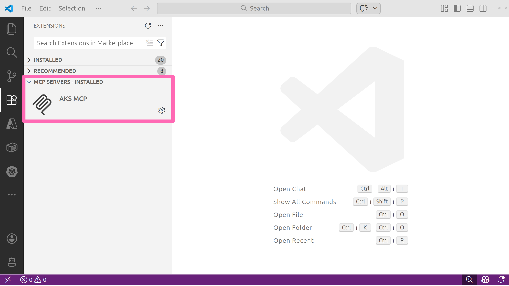

Select the settings icon, then select **Start Server** to ensure it is running. In the **OUTPUT** window, confirm the server is listening on STDIO and has discovered tools.

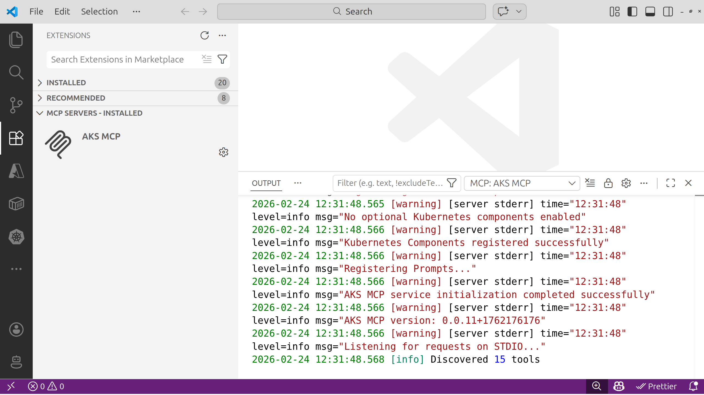

We'll explore these tools throughout the lab.

:::info[AKS MCP Server Configuration on WSL]

When running the AKS MCP server in VS Code with a remote connection to WSL, you must ensure the MCP server configuration is updated to [invoke the binary appropriately](https://github.com/Azure/aks-mcp?tab=readme-ov-file#wsl-configuration).

To view the configuration in VS Code, you can select the settings icon and select **Show Configuration (JSON)**.

You should see JSON that looks like the following:

```json
"servers": {
  "AKS MCP": {
    "command": "wsl",
    "args": [
      "--",
      "/home/your_user_account_here/.vs-kubernetes/tools/aks-mcp/v0.0.11/aks-mcp",
      "--transport",
      "stdio"
    ]
  }
}
```

Note the command to run is `wsl` with the path to the MCP server passed in as an argument along with `--transport stdio`.

:::

### Try the MCP tools with GitHub Copilot Agent

Now use GitHub Copilot Agent to discover and invoke tools exposed by the AKS MCP Server.

1. Open the GitHub Copilot Chat panel and start an Agent session.
2. Ask the agent to enumerate available MCP tools.
3. Run a safe, read-only diagnostic against your cluster.

:::tip

Use the model selector in the GitHub Copilot Chat panel to choose a recent model for best results and tool calling capabilities.

:::

Use this prompt:

```prompt
@aks-mcp List the AKS MCP tools you can access. Then check the AKS cluster version and show the node pool names.
```

:::tip

The `@aks-mcp` in the prompt forces the agent to use the AKS MCP server. You may also be presented with a button to allow tool use. To avoid being prompted for every tool call, you can click the arrow on the button to open the options, then select **Allow Tools from AKS-MCP in this Session** or **Allow Tools from AKS-MCP without Review in this Session**. This will allow the agent to call any tool from the AKS MCP server without prompting you each time for the duration of the session.

:::

**Expected results**

- The agent lists MCP tools (AKS cluster and node pool management, Azure Advisor, real-time observability, and kubectl just to name a few).
- The response includes the cluster version and node pool names.

This is the quickest and easiest way to use the AKS MCP server. It will use your existing kubectl context to connect to the cluster.

You've seen how the AKS MCP Server works through GitHub Copilot in VS Code. Now you'll use the same MCP tools from a dedicated terminal agent designed specifically for AKS troubleshooting.

---

## Agentic CLI for AKS

If you are comfortable working in a terminal, the Agentic CLI for AKS is a great way to interact with your cluster using natural language. It analyzes telemetry signals (logs, metrics, events), correlates them across infrastructure and workloads, and provides actionable insights through natural language queries.

The agent integrates with tools like kubectl, Azure CLI, Inspektor Gadget, and Azure Monitor, operating in read-only mode by default to ensure safe diagnostics. While the agent excels at surfacing likely causes and guiding investigation, human oversight is essential, particularly in complex or high-stakes environments.

:::warning

The Agentic CLI for AKS is currently in public preview and is still undergoing active development. Some features may change in future releases and your feedback is valuable to help improve the experience. Be sure to visit the [AKS docs](https://learn.microsoft.com/azure/aks/cli-agent-for-aks-overview) for the latest updates.

:::

### How it works

The agent is built on top of the open-source project [HolmesGPT](https://holmesgpt.dev/), a CNCF sandbox project, and is packaged as an Azure CLI extension (**aks-agent**). It connects to Azure AI Foundry models to power its natural language understanding and uses the AKS MCP tools to interact with your AKS cluster.

### Install the Agentic CLI

The Agentic CLI for AKS is available as an Azure CLI extension named **aks-agent**.

In your terminal, run the following command to install the extension.

```bash
az extension add --name aks-agent
```

The Agentic CLI for AKS takes a bring your own model (BYOM) approach, so in order to use it you'll need to have access to an OpenAI API compatible LLM endpoint to configure the agent. For this lab, you'll use the Azure AI Foundry service and model you provisioned earlier.

Run the following commands to get the API key and endpoint.

```bash
export AI_API_KEY=$(az cognitiveservices account keys list --name $AI_NAME --resource-group $RG_NAME --query key1 -o tsv)
export AI_API_BASE=$(az cognitiveservices account show --name $AI_NAME --resource-group $RG_NAME --query 'properties.endpoints."OpenAI Language Model Instance API"' -o tsv)
```

Run the following command to print the variable values which you will need to input in the next step.

```bash
# clear the screen
clear

# print the AI-related environment variables for easy reference
printenv | grep AI_API_
```

Now start the agent initialization process by running the following command:

```bash
az aks agent-init --resource-group $RG_NAME --name $AKS_NAME
```

This opens an interactive terminal UI (TUI) session and prompts you to input the model configuration.

Fill in the details as follows:

| Prompt                                      | Value                                                                     |
| ------------------------------------------- | ------------------------------------------------------------------------- |
| **Please select the mode you want to use:** | Enter `2` for **Client mode - Runs agent locally using Docker**           |
| \*\*Please choose the LLM provider (1-5).   | Enter `1` for **Azure OpenAI**                                            |
| **Enter value for deployment_name**         | Enter `gpt-5-mini` (the name of the model deployment you created earlier) |
| **Enter value for api_key**                 | Enter the value of `AI_API_KEY` from the previous step                    |
| **Enter value for api_base**                | Enter the value of `AI_API_BASE` from the previous step                   |
| **Enter value for api_version**             | Enter `2024-12-01-preview` (the API version for Azure OpenAI)             |

After entering the configuration, the agent initializes and will print a confirmation message that the LLM is configured successfully. The agent is now ready to use.

Run the following command to start the Agentic CLI for AKS terminal user interface (TUI).

```bash
az aks agent --resource-group $RG_NAME --name $AKS_NAME --mode client
```

### Try the Agentic CLI

Use a read-only diagnostic prompt to confirm the agent can access your cluster.

```text
What are the top five failing pods across all namespaces? Summarize the likely causes using events.
```

Depending on the state of your cluster, you may see different results. The agent will analyze pod status and events to identify common failure patterns such as CrashLoopBackOff, ImagePullBackOff, or OOMKilled, and provide a natural language summary of the likely causes.

Try a second prompt to explore the agent's resource-level capabilities.

```text
Show me the resource requests and limits for all containers in the pets namespace.
```

The agent will call the appropriate tools to retrieve the resource configurations for all pods in the `pets` namespace and summarize them in an easy-to-read format while also suggesting any potential misconfigurations or inconsistencies.

To exit the TUI, select **Ctrl+C** or type `/exit`.

So far, the agents you've used run on your local machine. Next, you'll run agents inside your Kubernetes cluster as native resources alongside your workloads.

---

## kagent on Azure

**kagent** is a [Cloud Native Computing Foundation (CNCF) Sandbox project](https://www.cncf.io/sandbox-projects/) that brings AI agents directly into your Kubernetes cluster. Unlike the CLI agent, kagent agents run as Kubernetes resources within your cluster and can interact with your workloads in real time. See the [kagent Architecture](https://kagent.dev/docs/kagent/concepts/architecture) for more details.

:::note

kagent is still in early development and is currently a CNCF Sandbox project. It is not yet production-ready and may have breaking changes in future releases. Follow the [kagent-dev/kagent](https://github.com/kagent-dev/kagent) repo for the latest development on the project.

:::

### Why kagent?

kagent stands out from other AI-assisted tools for several reasons:

- **Kubernetes-native** - Agents are defined as custom resources and managed with kubectl
- **Multi-agent architecture** - Create specialized agents that collaborate on complex tasks
- **CLI and Web UI** - Interact with agents through terminal or browser
- **Extensible** - Connect agents to MCP servers for additional capabilities

### Install kagent

kagent provides its own [CLI to install](https://kagent.dev/docs/kagent/getting-started/quickstart#installing-kagent) into your clusters. However, to set Azure AI Foundry as the default model provider, you need to install from the [kagent Helm chart](https://github.com/kagent-dev/kagent/tree/main/helm) for more control over the configuration.

In your terminal, run the following commands to install kagent into your AKS cluster.

```bash
helm install kagent-crds oci://ghcr.io/kagent-dev/kagent/helm/kagent-crds \
--namespace kagent \
--create-namespace \
--version 0.7.17
```

Next, run the following command to install the main kagent components with Azure OpenAI model configuration.

```bash
helm install kagent oci://ghcr.io/kagent-dev/kagent/helm/kagent \
--namespace kagent \
--version 0.7.17 \
--set providers.default=azureOpenAI \
--set providers.azureOpenAI.model="gpt-5-mini" \
--set providers.azureOpenAI.apiKey="$AI_API_KEY" \
--set providers.azureOpenAI.config.azureEndpoint="$AI_API_BASE" \
--set providers.azureOpenAI.config.azureDeployment="gpt-5-mini" \
--set providers.azureOpenAI.config.apiVersion="2024-12-01-preview"
```

:::warning

Note that the `AI_API_KEY` and `AI_API_BASE` environment variables you exported earlier are used to pass the Azure OpenAI configuration to the Helm chart. If you need to re-export them, here are the commands again:

```bash
export AI_API_KEY=$(az cognitiveservices account keys list --name $AI_NAME --resource-group $RG_NAME --query key1 -o tsv)
export AI_API_BASE=$(az cognitiveservices account show --name $AI_NAME --resource-group $RG_NAME --query 'properties.endpoints."OpenAI Language Model Instance API"' -o tsv)
```

:::

The installation includes:

- **kagent controller** - Manages agent lifecycles and reconciles custom resources
- **Dashboard UI** - A web interface to interact with agents
- **Default model configuration** - Azure OpenAI model config for powering agent responses
- **Pre-configured agents** - Specialized agents for Kubernetes, Istio, and Cilium operations

kagent uses Kubernetes Custom Resource Definitions (CRDs) to represent agents, models, and tools as native Kubernetes objects. CRDs extend the Kubernetes API, so you manage agents the same way you manage Deployments or Services - with kubectl commands and YAML manifests.

With the installation complete, you can now access the kagent dashboard.

Open a new terminal in VS Code and run the following command to port-forward the kagent UI service to your local machine.

```bash
kubectl port-forward -n kagent svc/kagent-ui 8080:8080 &
```

:::tip

The `&` at the end of the command runs the port-forwarding process in the background, allowing you to continue using the terminal for other commands. If you need to stop the port forwarding later, you can find the process using the `jobs` command and terminate it with `kill %1` (assuming it's the most recent background job).

:::

The kagent dashboard should now be accessible at [http://localhost:8080](http://localhost:8080).

Select the **Skip the wizard** link. You should be redirected to the kagent homepage, where you will see several pre-installed agents.

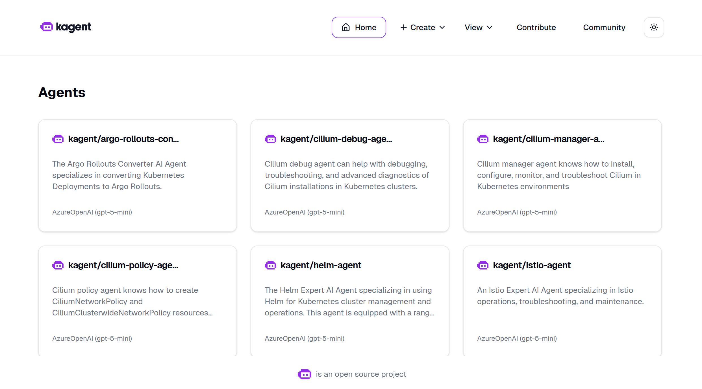

The dashboard provides a user-friendly interface for managing agents, models, and MCP servers. You can also manage everything using kubectl, but the UI makes exploration easier.

### Try kagent

Use the **k8s-agent** to quickly inspect cluster state.

```prompt
List all the deployments within the kagent namespace.
```

The agent calls a tool such as `k8s_get_resources` with arguments targeting the `deployment` resource type in the `kagent` namespace. The tool effectively executes `kubectl get deployments -n kagent` and returns the results to the agent, which then formats the response in natural language.

:::tip

The kagent UI has left and right panels that are collapsible. To move them aside and give more room for the agent's response, click the vertical line between the left panel and the main panel. This will toggle the visibility of both the left and right panels. To bring them back, click the same line again.

:::

Ask it some follow-up questions to get details for a specific deployment, such as the `kagent-ui` deployment.

```prompt
Give me some more details around the kagent-ui
```

The agent calls a tool such as `k8s_describe_resource` with arguments targeting the `deployment` resource type and the name `kagent-ui` in the `kagent` namespace and summarizes the results.

Finally, let's ask what the `k8s-agent` in particular does.

```prompt
What does the k8s-agent do? What tools does it have?
```

The agent now calls the `k8s_get_resource_yaml` tool to retrieve the YAML definition of its own agent resource, which includes a list of tools it has access to. You'll notice it does quite a lot!

Now let's give agents the ability to work more effectively with AKS clusters by connecting them to the AKS MCP server.

### AKS MCP with kagent

Earlier in the lab, you tested the AKS MCP server locally using GitHub Copilot. This same MCP server binary can be deployed into your cluster and run as a Kubernetes workload, providing AI agents with access to AKS-specific tools and diagnostics.

In your terminal, set up the managed identity and deploy the AKS MCP server.

First, create a user-assigned managed identity so the MCP server can authenticate with your Azure services.

:::info

We will speed run through the setup of workload identity here. For a more detailed walkthrough, refer to the [Azure Workload Identity documentation](https://learn.microsoft.com/azure/aks/workload-identity-overview) and the [Workload Identity lab](/docs/security/workload-identity-lab).

:::

```bash
# set the managed identity name
export MI_NAME=myidentity$RAND

# get the AKS OIDC issuer URL
read -r AKS_OIDC_ISSUER_URL <<< \
  "$(az aks show \
    --resource-group $RG_NAME \
    --name $AKS_NAME \
    --query '{oidcIssuerUrl:oidcIssuerProfile.issuerUrl}' -o tsv)"
export AKS_OIDC_ISSUER_URL

# create the managed identity and retrieve the principal ID, client ID, and tenant ID
read -r PRINCIPAL_ID CLIENT_ID TENANT_ID <<< \
  "$(az identity create \
    --resource-group $RG_NAME \
    --name $MI_NAME \
    --query '{principalId:principalId, clientId:clientId, tenantId:tenantId}' -o tsv)"
export PRINCIPAL_ID CLIENT_ID TENANT_ID

# create a federated credential to link the managed identity to a Kubernetes service account
az identity federated-credential create \
--name kagent-aks-mcp \
--identity-name $MI_NAME \
--resource-group $RG_NAME \
--issuer $AKS_OIDC_ISSUER_URL \
--subject system:serviceaccount:kagent:aks-mcp \
--audiences api://AzureADTokenExchange
```

Wait a few moments for the identity to be fully propagated, then run the following command to add a role assignment so the MCP server has permissions to query AKS and Azure resources.

```bash
az role assignment create \
--assignee $PRINCIPAL_ID \
--role "Contributor" \
--scope "/subscriptions/$(az account show --query id -o tsv)"
```

Clone the AKS MCP server repository.

```bash
git clone https://github.com/pauldotyu/aks-mcp.git
```

:::warning

Cloning and deploying aks-mcp from a fork is a workaround to an issue found in the original repo where the workload identity authentication fails due to a change in the AKS webhook token injection path for workload identity. See GitHub issue [#319](https://github.com/Azure/aks-mcp/issues/319) for more details.

These instructions will be updated once the issue is resolved in the original repo.

:::

:::info

The AKS MCP server is available as a Helm chart, but it is not published to a public registry yet. Cloning the repo and installing from the local path is the recommended approach for now. For future releases, check the [AKS MCP repo](https://github.com/azure/aks-mcp) for the latest installation instructions.

:::

Install the Helm chart.

```bash
helm install aks-mcp aks-mcp/chart \
--namespace kagent \
--set workloadIdentity.enabled=true \
--set azure.tenantId=$TENANT_ID \
--set azure.clientId=$CLIENT_ID \
--set azure.subscriptionId=$(az account show --query id -o tsv) \
--set app.accessLevel=admin
```

:::danger

The `app.accessLevel=admin` setting gives the MCP server full admin permissions to the cluster, which is necessary for it to perform diagnostics and management operations. In a production environment, you should follow the principle of least privilege and only grant the `readonly` access level to start.

:::

The deployment consists of four Kubernetes resources that were created in the **kagent** namespace:

1. **ServiceAccount (aks-mcp)** - Provides identity for the MCP server pod, linked to an Azure managed identity via annotations.
1. **ClusterRoleBinding (aks-mcp-cluster-admin)** - Grants the service account cluster-admin permissions to perform diagnostic and management operations.
1. **Deployment (aks-mcp)** - Runs the AKS MCP server container (ghcr.io/azure/aks-mcp:v0.0.9) with streamable HTTP transport.
1. **Service (aks-mcp)** - Exposes the MCP server internally on port 8000 so agents can connect to it.

:::info

**Azure Workload Identity** enables the MCP server to authenticate with Azure services without storing credentials. The service account has an annotation that links it to the Azure managed identity, which has the necessary permissions to manage AKS resources and query Azure APIs.

Additional remote deployment options can be found in the [AKS MCP repo](https://github.com/Azure/aks-mcp/blob/main/chart/README.md)

:::

Head back over to the kagent UI and use the k8s-agent to verify that the AKS MCP deployment is running successfully. Start a new chat and use the following prompt.

```prompt
Get the status of the aks-mcp deployment in the kagent namespace and tell me if it's ready for me to test.
```

This should result in several tool calls and an overall assessment of the deployment. If the setup went well, the agent reports that the MCP server is ready.

So far, you used the pre-defined **k8s-agent** to inspect basic cluster state. Now comes the exciting part - creating a new agent and connecting it to the AKS MCP server. This integration gives AI agents access to Azure-specific tools and diagnostics, enabling them to perform AKS operations, monitor resources, and troubleshoot issues using natural language.

### Why integrate agents with MCP servers?

By connecting agents to MCP servers, you create a **multi-tool AI system** where:

- Agents can leverage specialized tools without embedding tool logic directly into the agent
- MCP servers can be updated independently without changing agent configurations
- Multiple agents can share the same MCP server, promoting reusability
- New capabilities can be added by deploying new MCP servers

### Create a RemoteMCPServer resource

With kagent, a **RemoteMCPServer** is a Kubernetes custom resource that represents an external MCP server. By creating this resource, you make the AKS MCP server's tools available to all agents in your cluster.

Back in the kagent dashboard, select **+ Create** > **New MCP Server**.

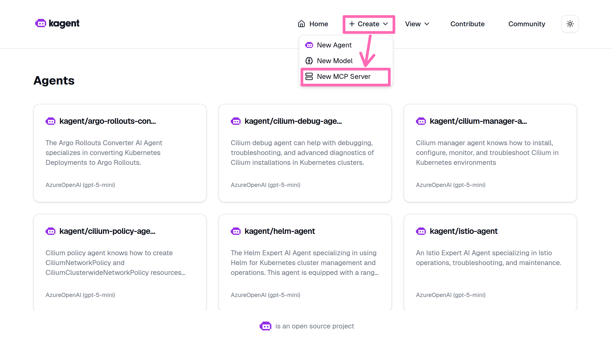

Select **Add MCP Server**.

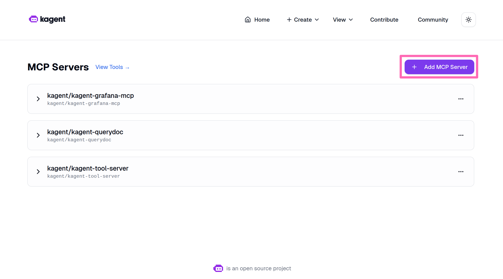

Fill in the following details:

| Field           | Value     |
| --------------- | --------- |
| **Server name** | `aks-mcp` |

Select the **URL** button, then in the **Server URL** box, enter the following URL:

| Field          | Value                                              |
| -------------- | -------------------------------------------------- |
| **Server URL** | `http://aks-mcp.kagent.svc.cluster.local:8000/mcp` |

:::info

Since the agent runs in cluster, it can leverage Kubernetes' internal DNS. The service name is **aks-mcp** and the port is **8000** as defined in the service you created earlier.

:::

Select **Use Streamable HTTP**.

:::note

Streamable HTTP allows the MCP server to send responses in chunks, which is useful for long-running operations or large datasets. This improves responsiveness when agents interact with the server.

:::

Select **Add Server** to create the resource.

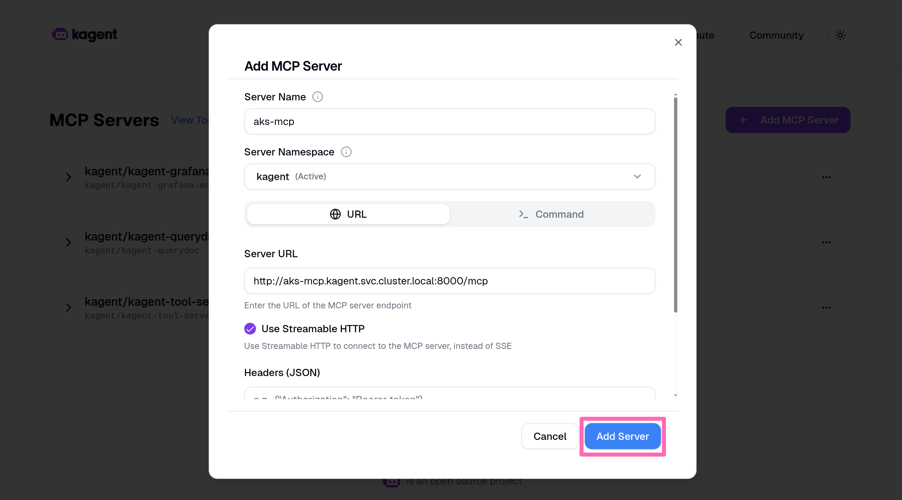

### Deploy a specialized AKS agent

Now you'll create a **specialized AKS agent** that has access to all the tools provided by the AKS MCP server. This agent is different from the general-purpose k8s-agent, it has been designed with a comprehensive system prompt that gives it deep expertise in Azure and Kubernetes troubleshooting.

#### What makes this agent special?

The AKS agent includes:

- **Expert system prompt** - Detailed instructions that guide the agent's behavior, troubleshooting methodology, and communication style
- **Azure-specific tools** - Access to AKS diagnostics, Azure Monitor, Fleet management, and Azure Advisor
- **Kubernetes tools** - kubectl operations, Inspektor Gadget observability, and cluster diagnostics
- **Safety protocols** - Built-in validation and confirmation for destructive operations

#### Deploy the agent

In the kagent dashboard, select **+ Create** > **New Agent**.

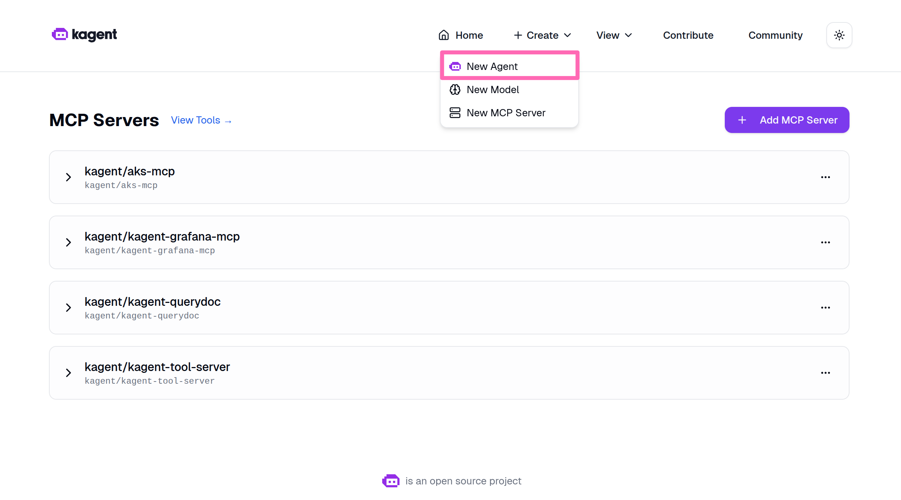

Fill in the following details for the new agent:

| Field                             | Value                                                                                                                                                                                                                                                                                                                                     |
| --------------------------------- | ----------------------------------------------------------------------------------------------------------------------------------------------------------------------------------------------------------------------------------------------------------------------------------------------------------------------------------------- |
| **Agent Name**                    | `aks-agent`                                                                                                                                                                                                                                                                                                                               |
| **Agent Namespace**               | Select `kagent`                                                                                                                                                                                                                                                                                                                           |
| **Agent Type**                    | Select `Declarative`                                                                                                                                                                                                                                                                                                                      |
| **Description**                   | `An AI agent specialized in Azure Kubernetes Service (AKS) operations and troubleshooting. Equipped with tools from the AKS MCP server for diagnostics, monitoring, and management.`                                                                                                                                                      |
| **Agent Instructions**            | Accept the default instructions provided, but insert an additional bullet at the top of the instruction section to `You have full permission to the Azure resource group <INSERT_YOUR_RESOURCE_GROUP_NAME> and all the resources within it. Use AKS MCP tools wherever possible and delegate tasks to appropriate agents when necessary.` |
| **Model**                         | Select **gpt-5-mini (kagent/default-model-config)**                                                                                                                                                                                                                                                                                       |
| **Enable LLM response streaming** | Check this box to allow the agent to stream responses for better user experience.                                                                                                                                                                                                                                                         |
| **Tools & Agents**                | Select **+ Add Tools & Agents**, then in the dialog, filter for `aks` and select all tools under **Kagent/Aks-Mcp**. Select the **Save Selection** button to confirm the tools.                                                                                                                                                           |

Confirm all the details are correct, then scroll to the bottom of the page and select **Create Agent** to deploy the agent.

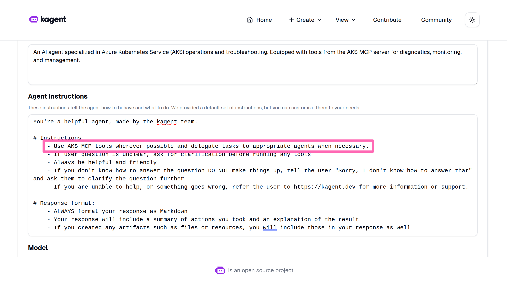

You may notice the agent status is "Agent not Ready". Wait a few minutes for the agent to be created, then refresh the page.

### Try the AKS agent

Let's make sure the AKS agent is working and can access the tools from the AKS MCP server. Start by asking it a simple question about your cluster.

```prompt
Give me a list of all the AKS clusters you have access to.
```

Use the new agent to pull Azure Advisor recommendations for the cluster.

```prompt
Are there any Azure Advisor recommendations for the AKS cluster where the name starts with "myakscluster"?
```

The agent should run `aks_advisor_recommendation` for the current cluster and return a summary list of Azure Advisor recommendations. You should see a report with "high severity" and "low severity" items with descriptions and status.

### Build a multi-agent system

A powerful feature of kagent is the ability to create **multi-agent systems** where agents collaborate by delegating tasks to specialized experts. You will now connect the AKS agent to other domain-specific agents, creating a collaborative network of AI assistants.

#### Connect specialized agents

1. Select **Home** in the kagent UI.
2. Find **kagent/aks-agent**, hover your mouse over it, and select **Edit**.
3. Scroll to **Tools & Agents**, then select **+ Add Tools & Agents**.

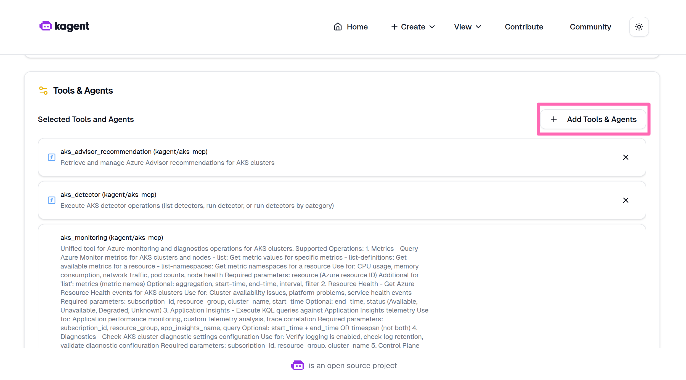

4. Add the following agents.
   - **kagent/k8s-agent** - General Kubernetes operations and resource management
   - **kagent/cilium-policy-agent** - Network policy and Cilium-specific configurations

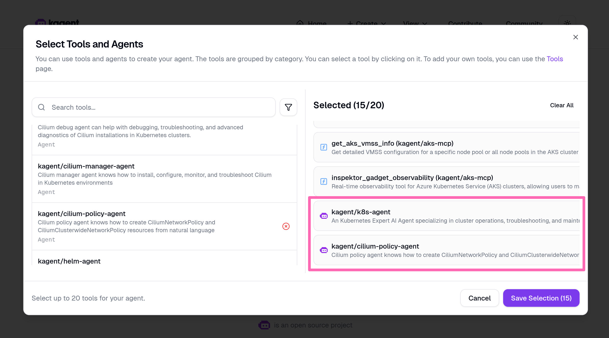

5. Select **Save Selection** then scroll to the bottom of the page and select **Update Agent** to save the changes.

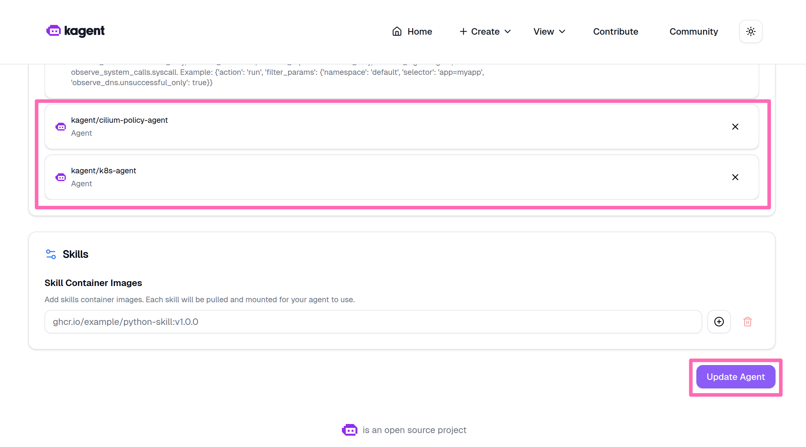

### Try the multi-agent system

Ask the aks-agent to perform a task that requires collaboration between agents.

```prompt
Can you please help me implement a CiliumNetworkPolicy to block all ingress traffic in the "pets" namespace?
```

The AKS agent should delegate the task to more specialized agents (in this case the cilium-policy-agent). This hierarchical architecture creates a more capable system where each agent contributes domain expertise.

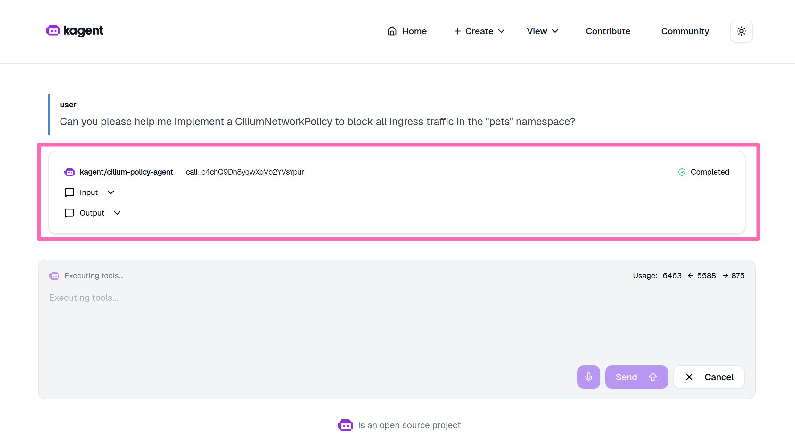

If you are prompted to confirm the action to apply the network policy, you can ignore it and move on.

---

## Troubleshooting Challenges

Now that you've learned to use all three agent approaches, it's time to put them into practice. The cluster has been intentionally broken in multiple ways - at the infrastructure, application, and authentication levels. Your task is to diagnose what went wrong and fix it using the agents you deployed.

:::info

**Your mission**: Use GitHub Copilot with the AKS MCP server, the Agentic CLI for AKS, or kagent to figure out what's broken and fix it.

Don't worry if you get stuck - there are hints in each challenge, and you can always inspect the setup script to see exactly what was broken.

:::

### Prepare the cluster for troubleshooting challenges

Before attempting the challenges, you need to intentionally break the cluster. A script does this for you, but it won't tell you what it's breaking - that's for you to figure out!

:::warning

Running this script will create multiple issues in your cluster across infrastructure, application, and authentication layers. You'll use agents to diagnose and fix all issues in the challenges section.

If you want to know exactly what will break, you can inspect the script at [setup-cluster-issues.sh](./assets/ai-assisted-operations/setup-cluster-issues.sh).

:::

Ensure your environment variables are still exported (including `AI_API_BASE` from earlier), then run:

```bash
curl -fsSL https://raw.githubusercontent.com/pauldotyu/aks-labs/refs/heads/ai_assisted_ops/docs/operations/assets/ai-assisted-operations/setup-cluster-issues.sh | bash
```

:::danger TODO: Replace temporary instructions

REPLACE `pauldotyu/aks-labs/refs/heads/ai_assisted_ops` WITH `azure-samples/aks-labs/refs/heads/main` ONCE PR REVIEW IS COMPLETED

:::

The script will use the `AI_API_BASE` environment variable if available to configure a service that relies on Azure AI Foundry.

**Expected output:**

```
🔧 Breaking cluster...

✓ Issue 1 setup completed
✓ Issue 2 setup completed
✓ Issue 3 setup completed

✅ Cluster is now broken. Use agents to figure out what's wrong!
   (Hint: Check the source of this script if you get stuck)
```

One more thing... for the AKS MCP server to have the necessary permissions to diagnose and fix the issues in the challenges, you need to grant the MCP server's service account (`aks-mcp` in the `kagent` namespace) the `cluster-admin` ClusterRole. This gives it full access to perform diagnostics and management operations on the cluster.

In the terminal, run the following command to apply the ClusterRoleBinding.

```sh
kubectl apply -f - <<EOF
apiVersion: rbac.authorization.k8s.io/v1
kind: ClusterRoleBinding
metadata:
  name: aks-mcp-cluster-admin
subjects:
- kind: ServiceAccount
  name: aks-mcp
  namespace: kagent
roleRef:
  kind: ClusterRole
  name: cluster-admin
  apiGroup: rbac.authorization.k8s.io
EOF
```

With the cluster broken, and AKS MCP granted additional permissions for troubleshooting, let's continue to the troubleshooting challenges.

:::tip Models matter

Remember when using Agentic CLI for AKS or kagent, the quality of the insights and recommendations you get will depend on the model you are using; which in this lab is `gpt-5-mini`. If you have access to a more powerful model, feel free to update the agent configurations to use that model for better results. You might have access to more powerful models through VS Code GitHub Copilot or through your Azure OpenAI service, so don't hesitate to experiment with different models to see how it impacts the agent's performance in diagnosing and fixing the cluster issues.

:::

### Challenge 1: Is the store closed for business?

**Scenario**: Users report that they can't access the store-admin application in the pets namespace. No services in the namespace are reachable, even though the pods appear to be running.

Use an agent to figure out what's wrong and fix it. Try one of these prompts to get started:

- **kagent:** _"Why can't users reach the store-admin service over http? The store-admin service is the pets namespace in the cluster named myakscluster\*"_
- **Agentic CLI for AKS:** _"Users can't access the store-admin service running in the pets namespace. Help me figure out why."_
- GitHub Copilot Agent in VS Code: _"@aks-mcp Help me investigate why no services are reachable in the pets namespace."_

<details>
<summary>Hint (expand if you're stuck)</summary>

A **NetworkPolicy** named `deny-all-ingress` is blocking all ingress traffic to every pod in the `pets` namespace. You can fix this by either removing the policy entirely or by adding a new ingress rule that allows traffic to the store-admin and store-front pods.

</details>

To test if your fix worked, run the following command to get the IP address of the `store-admin` service, then try to curl it.

```bash
IP_ADDRESS=$(kubectl get svc store-admin -n pets -o jsonpath='{.status.loadBalancer.ingress[0].ip}')
curl -IL http://$IP_ADDRESS
```

You should see a successful response with HTTP status code **200**.

---

### Challenge 2: Hello, AI... or not?

**Scenario**: With the store-admin site up and running again, users report that the AI-generated product descriptions feature isn't working.

To reproduce the issue:

1. Navigate to the store-admin site
2. Click on the **Products** tab in the navigation bar
3. Click the **Add Product** button
4. Enter a product name and related keywords (comma-separated)
5. Click the **Ask AI Assistant** button

You should see a "thinking..." message, but then nothing happens and no product description is generated.

The feature relies on the ai-service pod making inference calls to Azure AI Foundry. Investigate the issue and get the AI-generated product descriptions working again.

This challenge has multiple layers - fixing one problem may reveal another underneath. The challenge is complete when the AI-generated product description feature is working again in the store-admin application.

Use an agent to diagnose why the AI feature isn't working and fix it. Try one of these prompts to get started:

- **kagent:** _"The store-admin site is working now, but the ai-service doesn't seem to be working correctly. Users are reporting nothing happens when they click the 'Ask AI Assistant' button. Investigate and see if there are potential network or authentication issues."_
- **Agentic CLI for AKS:** _"The AI-generated product descriptions feature in store-admin isn't working. Help me investigate the ai-service pod in the pets namespace."_
- **GitHub Copilot with AKS MCP:** _"@aks-mcp Why isn't the ai-service working in the pets namespace? Check its logs and configuration."_

<details>
<summary>Hints (expand if you're stuck)</summary>

There are two issues blocking the ai-service. You need to fix both before it works.

**Issue A - Workload identity misconfiguration:**

- The **ai-service** is deployed with workload identity using the same managed identity used for the aks-mcp server, but is missing one thing:
  - The ai-service's ServiceAccount is not linked to the managed identity via a federated credential, so it can't authenticate to Azure AI Foundry and make inference calls
- To fix this, update the ServiceAccount annotation with the correct client ID of the managed identity, then restart the ai-service pod to pick up the changes

**Issue B - DNS is broken at the infrastructure level:**

- Even after fixing workload identity, the pod still can't reach Azure AI Foundry because DNS resolution is broken
- An NSG rule named `DenyAzureDNS` in the cluster's managed resource group is blocking outbound traffic to Azure DNS (168.63.129.16) - CoreDNS relies on this address to resolve external hostnames
- Remove the NSG rule, then restart the ai-service pod to verify connectivity

If you're still stuck, skim the source code of [setup-cluster-issues.sh](./assets/ai-assisted-operations/setup-cluster-issues.sh) to see what was applied.

</details>

---

### Challenge 3: Works on my cluster... but is it production-ready?

**Scenario**: The earlier issues are resolved and the application is working again. But the cluster was just "fixed," not hardened. Use the multi-agent system to audit the `pets` namespace and see what improvements are recommended.

Use the multi-agent system to audit the cluster across networking, security, and resiliency - then implement the recommendations.

Use the multi-agent system to audit the `pets` namespace and implement the top recommendations. Try this prompt to get started:

- In kagent, ask the aks-agent: _"Review the pets namespace for best practices across networking, security, and resiliency. Then implement the top recommendations."_

<details>
<summary>Hint (expand if you're stuck)</summary>

The aks-agent should delegate to multiple specialized agents:

- **cilium-policy-agent** - Analyze pod-to-pod communication and recommend network policies that allow only required traffic (store-front/store-admin to backend services, ai-service outbound to Azure AI Foundry)
- **k8s-agent** - Check resource requests/limits, replica counts, and probe configurations across Deployments
- **aks-agent** (via AKS MCP tools) - Pull Azure Advisor recommendations for security and operational excellence

After implementing changes, port-forward the store-front and verify the application loads and the AI-generated product descriptions feature in store-admin still works.

</details>

---

## Summary

In this lab, you explored three complementary approaches to AI-powered AKS operations:

- **AKS MCP Server with GitHub Copilot** - You installed the MCP server locally and used GitHub Copilot to discover available tools and run read-only diagnostics against your cluster.
- **Agentic CLI for AKS** - You configured and launched a terminal-based AI agent that analyzes telemetry signals and provides actionable insights through natural language queries.
- **kagent** - You deployed in-cluster AI agents, connected them to the AKS MCP Server, and built a multi-agent system where specialized agents collaborate on complex tasks.

Along the way, you practiced troubleshooting real cluster issues - from network policies blocking traffic, to misconfigured workload identity credentials and NSG rules breaking DNS - using AI agents to diagnose root causes and guide remediation.

## Learn more

To continue your learning journey with AI-powered operations and MCP agents, check out these resources:

- **AKS MCP Server** - [github.com/Azure/aks-mcp](https://github.com/Azure/aks-mcp)
- **Agentic CLI for AKS** - [github.com/Azure/cli-agent-for-aks](https://github.com/Azure/cli-agent-for-aks)
- **Azure AI Foundry** - [learn.microsoft.com/azure/ai-foundry](https://learn.microsoft.com/azure/ai-foundry/what-is-azure-ai-foundry)
- **Model Context Protocol documentation** - [modelcontextprotocol.io](https://modelcontextprotocol.io)
- **kagent project** - [kagent.dev](https://kagent.dev)

---

## Reset cluster state

To restore the cluster to normal state, run the cleanup script:

```bash
curl -fsSL https://raw.githubusercontent.com/pauldotyu/aks-labs/refs/heads/ai_assisted_ops/docs/operations/assets/ai-assisted-operations/cleanup-cluster-issues.sh | bash
```

:::danger TODO: Replace temporary instructions

REPLACE `pauldotyu/aks-labs/refs/heads/ai_assisted_ops` WITH `azure-samples/aks-labs/refs/heads/main` ONCE PR REVIEW IS COMPLETED

:::

This removes:

- The NetworkPolicy blocking ingress in the `pets` namespace
- The custom `ai-service` Deployment and ServiceAccount with workload identity annotations
- The NSG rule blocking Azure DNS (168.63.129.16)

<Cleanup />

:::note

Be sure to purge the Azure AI Foundry resource you created to free up any associated quota.

:::
