## Advanced Observability Concepts

### Overview

As a Kubernetes practitioner, you're probably familiar with managing your own Prometheus and Grafana stack for observability. With **Azure Managed Prometheus** and **Azure Managed Grafana**, you can now leverage those same cloud-native tools—without the operational burden of deploying, scaling, and securing them yourself. These managed services integrate natively with AKS and support standard Prometheus APIs and Grafana dashboards, making adoption seamless.

---

### Objectives

* Enable and Visualize Control Plane Metrics: Gain hands-on experience enabling AKS control plane metrics (e.g., kube-apiserver, etcd) and visualizing them using pre-built dashboards in **Azure Managed Grafana**.

* Customize Metric Collection: Learn how to extend observability by customizing metric collection through `ConfigMaps` and enabling additional Prometheus metrics.

* Implement Custom Scrape Jobs: Deploy and configure custom scrape jobs using `PodMonitor` and `ServiceMonitor` CRDs to collect application-specific metrics in **Azure Managed Prometheus**.

---

### Prerequisites

- An Azure Subscription
- [Azure CLI](https://learn.microsoft.com/en-us/cli/azure/) version 2.60.0 or later
- `aks-preview` - see note below
- [kubectl](https://kubernetes.io/docs/tasks/tools/) version 1.28.9 or later
- A terminal with `bash` (e.g.: [Windows Terminal](https://www.microsoft.com/p/windows-terminal/9n0dx20hk701) with [WSL](https://docs.microsoft.com/windows/wsl/install-win10) or [Azure Cloud Shell](https://shell.azure.com/)

:::note Note on aks-preview
To install or update the `aks-preview` extension you can use the following commands:

```bash
# Install the aks-preview extension
az extension add --name aks-preview

# Update the aks-preview extension
az extension update --name aks-preview
```
:::

---

### AKS control plane metrics

As you may know, Kubernetes control plane components are managed by Azure and there are metrics that Kubernetes administrators would like to monitor such as `kube-apiserver`, `kube-scheduler`, `kube-controller-manager`, and `etcd`. These are metrics that typically were not exposed to AKS users... until now. 

AKS now offers a **preview feature** that allows you to access these metrics and visualize them in **Azure Managed Grafana**. More on this preview feature can be found [here](https://learn.microsoft.com/azure/aks/monitor-aks#monitor-aks-control-plane-metrics-preview). 


:::info
Before enabling this preview, review the [prerequisites and limitations](https://learn.microsoft.com/azure/aks/monitor-aks#prerequisites-and-limitations) of this feature while it is in preview.
:::

To enable the feature:

1. Register the `AzureMonitorMetricsControlPlanePreview` feature flag using the az feature register command.

```bash
az feature register \
--namespace "Microsoft.ContainerService" \
--name "AzureMonitorMetricsControlPlanePreview"
```

2. Once the feature is registered, refresh resource provider.

```bash
az provider register --namespace Microsoft.ContainerService
```
Once registered, you’ll be able to surface these metrics using prebuilt Grafana dashboards or your own visualizations—without managing your own Prometheus stack.

### Setup your environment
### Step 1: Define your environment variables and placeholders

In these next steps, we will setup a new AKS cluster, an **Azure Managed Grafana** instance and a Azure Monitor Workspace.

1. Create a placeholder directory

Before we begin lets create a new directory that can be a placeholder for all of our files created during this lab:

```bash
mkdir -p aks-labs/operations/advanced-observability/
cd aks-labs/operations/advanced-observability/
```

2. Next, proceed by declaring the following environment variables:

```bash
cat <<EOF> .envrc
export RG_NAME="rg-advanced-observability"
export LOCATION="westus3"
export RG_NAME="rg-advanced-mon"

# Azure Kubernetes Service Cluster
export AKS_CLUSTER_NAME="advanced-mon"

# Azure Managed Grafana
export GRAFANA_NAME="aks-labs"

# Azure Monitor Workspace
export AZ_MONITOR_WORKSPACE_NAME="azmon-aks-labs"
EOF
```
Load the environment variables:

```bash
source .envrc
```

:::tip
Now that we have saved the environment variables, you can always reload these variables later if needed by running `source .envrc` on this directory.
:::

### Step 2: Create the Azure Monitor Workspace

1. Create the resource group

```bash
# Create resource group
az group create --name ${RG_NAME} --location ${LOCATION}
```

2. Create an Azure Monitor Workspace

```bash
az monitor account create \
  --resource-group ${RG_NAME} \
  --location ${LOCATION} \
  --name ${AZ_MONITOR_WORKSPACE_NAME}
```

Retrieve the Azure Monitor Workspace ID

```bash
AZ_MONITOR_WORKSPACE_ID=$(az monitor account show \
  --resource-group ${RG_NAME} \
  --name ${AZ_MONITOR_WORKSPACE_NAME} \
  --query id -o tsv)
```

### Step 3: Create an Azure Managed Grafana instance

In this step, we will do the following:

* Add the Azure Managed Grafana extension to `az cli`.

* Create an Azure Managed Grafana instance.

* Save the Azure Manage Grafana Resource identity which will later be attached to the AKS cluster.

:::info
The Azure CLI extension for Azure Managed Grafana (`amg`) allows us to create, edit, delete the Azure Managed Grafana instance from the cli. If you can't add this extension, you can still perform these actions using the Azure Portal.
:::

1. Add the Azure Manage Grafana extension to `az cli`:

```bash
az extension add --name amg
```

2. Create an Azure Managed Grafana instance:

You can now proceed with the creation of the Managed Grafana instance:

```bash
az grafana create \
  --name ${GRAFANA_NAME} \
  --resource-group $RG_NAME \
  --location $LOCATION
```

3. Once created, save the Grafana resource ID

```bash
GRAFANA_RESOURCE_ID=$(az grafana show \
  --name ${GRAFANA_NAME} \
  --resource-group ${RG_NAME} \
  --query id -o tsv)
```

### Step 4: Create a new AKS cluster

1. Create a new AKS cluster and attach the Grafana instance to it

```bash
az aks create \
  --name ${AKS_CLUSTER_NAME}  \
  --resource-group ${RG_NAME} \
  --node-count 2 \
  --enable-managed-identity  \
  --enable-azure-monitor-metrics \
  --enable-cost-analysis \
  --grafana-resource-id ${GRAFANA_RESOURCE_ID} \
  --azure-monitor-workspace-resource-id ${AZ_MONITOR_WORKSPACE_ID} \
  --tier Standard
```

2. Get the credentials to access the cluster:

```bash
az aks get-credentials \
  --name ${AKS_CLUSTER_NAME} \
  --resource-group ${RG_NAME} \
  --file aks-labs.config
```

3. Use the aks-labs.config file this as your `KUBECONFIG`

```bash
echo export KUBECONFIG=$PWD/aks-labs.config >> .envrc
source .envrc
```

4. Check that the credentials are working:

```bash
kubectl cluster-info
kubectl get nodes
```

### Working on Grafana

With Azure Managed Grafana integrated with Azure Managed Prometheus, you can import [kube-apiserver](https://grafana.com/grafana/dashboards/20331-kubernetes-api-server/) and [etcd](https://grafana.com/grafana/dashboards/20330-kubernetes-etcd/) metrics dashboards.

:::info
Out of the box, only the `etcd` and `kube-apiserver` metrics data is being collected as part of the [minimal ingestion profile](https://learn.microsoft.com/azure/aks/monitor-aks-reference#minimal-ingestion-profile-for-control-plane-metrics-in-managed-prometheus) for control plane metrics. This profile is designed to provide a balance between the cost of monitoring and the value of the data collected. 

More on the minimal ingestion profile can be found [here](https://learn.microsoft.com/azure/azure-monitor/containers/prometheus-metrics-scrape-configuration-minimal).
:::

1. Create a folder in Grafana to host our new dashboards:

```bash
az grafana folder create \
  --name ${GRAFANA_NAME} \
  --title AKS-Labs \
  --resource-group ${RG_NAME}
```

2. Import the `kube-apiserver` and `etcd` dashboards into the new Grafana folder:

```bash
# import kube-apiserver dashboard
az grafana dashboard import \
  --name ${GRAFANA_NAME} \
  --resource-group ${RG_NAME} \
  --folder 'AKS-Labs' \
  --definition 20331

# import etcd dashboard
az grafana dashboard import \
  --name ${GRAFANA_NAME} \
  --resource-group ${RG_NAME} \
  --folder 'AKS-Labs' \
  --definition 20330
```

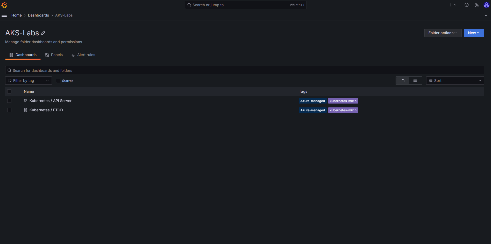
Now you, should be able to browse to your Azure Managed Grafana instance and see the `kube-apiserver` and `etcd` metrics dashboards in the AKS-Labs folder.

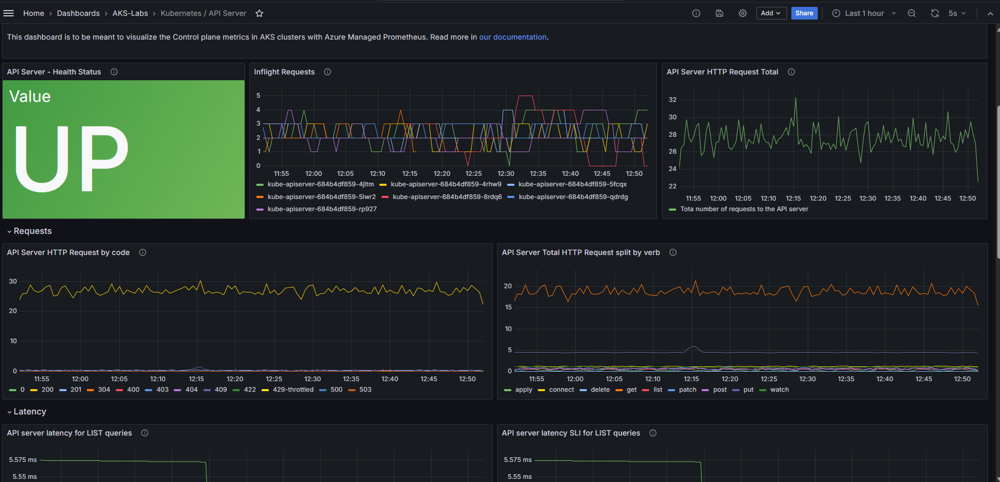
The new `kube-apiserver` metrics dashboard in Grafana.

###  Example: Customizing the collection of metrics

At this point we already have the `kube-apiserver` and the `etcd` metrics being collected by Prometheus and displayed on Grafana. If you want to collect a different set of metrics, you can do so by manually enabling them and this can be done by deploying a ConfigMap named [ama-metrics-settings-configmap](https://github.com/Azure/prometheus-collector/blob/main/otelcollector/configmaps/ama-metrics-settings-configmap.yaml) in the `kube-system` namespace.

Here are some options:

* [Ingest only minimal metrics from default targets](https://learn.microsoft.com/en-us/azure/aks/control-plane-metrics-monitor#ingest-only-minimal-metrics-from-default-targets)

* [Ingest all metrics from all targets
](https://learn.microsoft.com/en-us/azure/aks/control-plane-metrics-monitor#ingest-all-metrics-from-all-targets)
 
* [Ingest a few other metrics in addition to minimal metrics](https://learn.microsoft.com/en-us/azure/aks/control-plane-metrics-monitor#ingest-a-few-other-metrics-in-addition-to-minimal-metrics)

* [Ingest only specific metrics from some targets](https://learn.microsoft.com/en-us/azure/aks/control-plane-metrics-monitor#ingest-only-specific-metrics-from-some-targets) - we are covering this example in the next section


#### Ingesting a new metric: apiserver_longrunning_requests

To illustrate the ingestion of a specific metric from some targets, lets edit the `ama-metrics-settings-configmap` to include a metric that is not a part of the [minimal ingestion profile](https://learn.microsoft.com/azure/azure-monitor/containers/prometheus-metrics-scrape-configuration-minimal): `apiserver_longrunning_requests`. This metric will be collected from the `controlplane-apiserver` target.

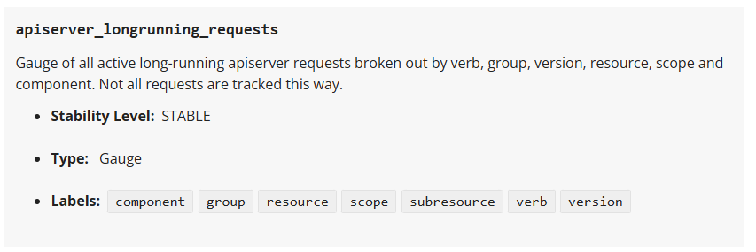
A description of the `apiserver_longrunning_requests` from the [Kubernetes Metrics Reference](https://kubernetes.io/docs/reference/instrumentation/metrics/)

:::tip
A full list of the available metrics is available at the [Kubernetes Metrics Reference](https://kubernetes.io/docs/reference/instrumentation/metrics/).
:::

Steps to customize the collection of a new metric:

1. Run the following command to deploy the **ama-metrics-settings-configmap** in the **kube-system** namespace.

```bash
kubectl apply -f https://raw.githubusercontent.com/Azure/prometheus-collector/refs/heads/main/otelcollector/configmaps/ama-metrics-settings-configmap.yaml
```

2. Edit the **ama-metrics-settings-configmap** to enable the metrics you want to collect. Run the following command to edit the **ama-metrics-settings-configmap**.

```bash
kubectl edit cm ama-metrics-settings-configmap -n kube-system
```

3. Under the `default-targets-metrics-keep-list`, add `apiserver_longrunning_requests` and then save the `ConfigMap`.

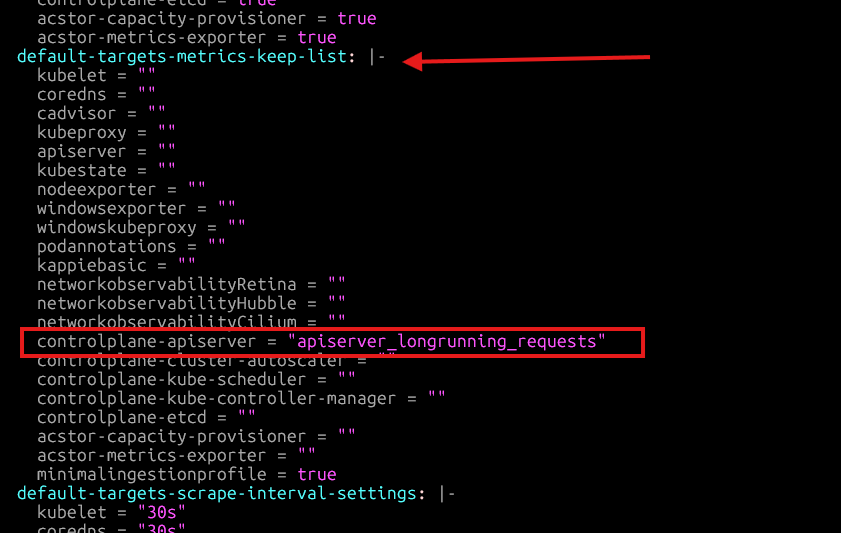

It might take 1 minute for the new metric to start showing up. We can check it in the Azure Monitor Workspace and then on Grafana. 

1. Navigate to the **Azure Monitor Workspace** attached to the AKS cluster. You can find that information in the Azure Portal by navigating to the AKS Cluster created for this lab, then to **Monitor**, **Monitor Settings**. The information for the `Azure Monitor workspace` will be showed on this page.

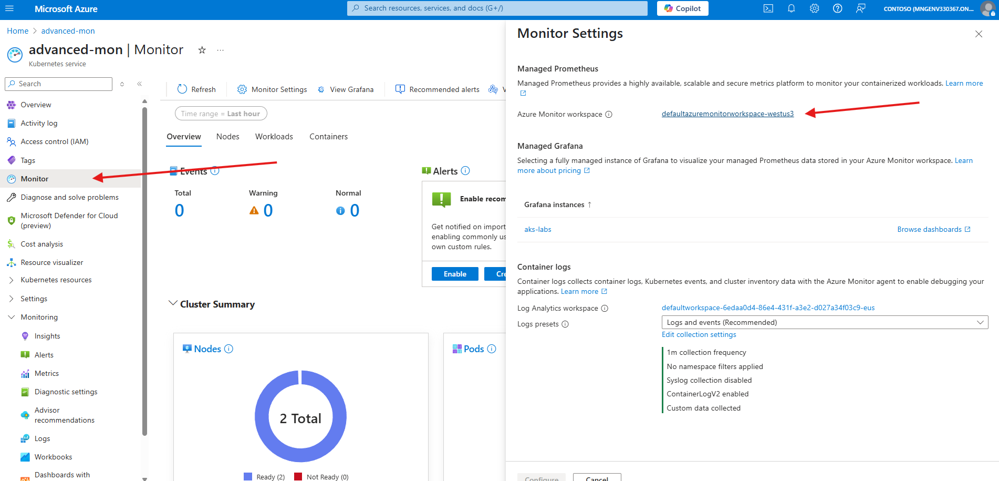

Once in the `Azure Monitor workspace`, navigate to the `Prometheus Explorer` and enter the `apiserver_longrunning_requests` in the `PromQL` searching box:

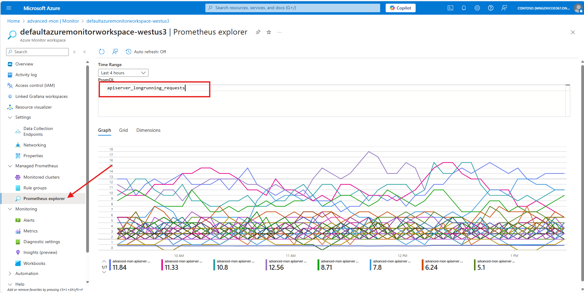

#### Create a dashboard in Grafana to visualize the new metric

Navigate to your Manage Grafana Instance, click on `Dashboards`->`AKS-Labs`->`API Server` 


Click on `Add`  and then `Visualization`

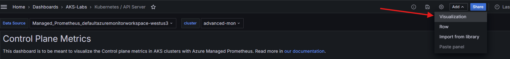

To customize the visualization, we need to first toggle the `Code` button in the `Query` part of the panel:

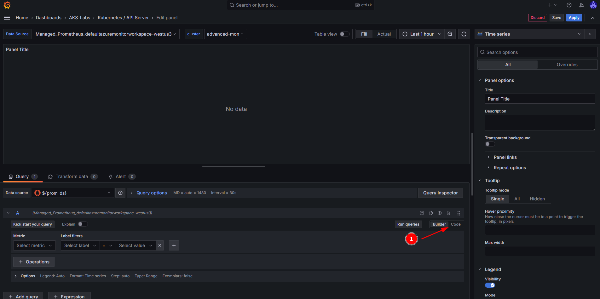

Next, we will do the following steps on this panel:

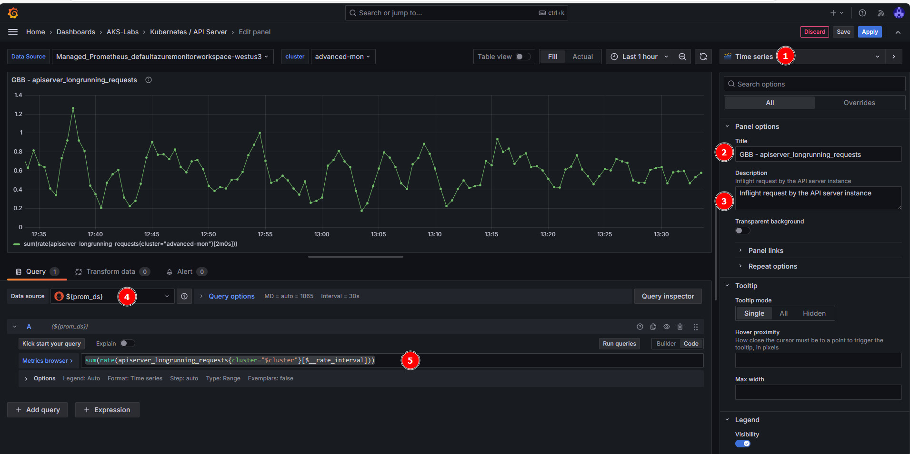

1. Create a new `Time series` dashboard (should be the default visualization).
2. Add a `Title` (e.g.: apiserver_longrunning_requests)
3. Add a `Description` (e.g.: Gauge of all active long-running apiserver requests broken out by verb, group, version, resource, scope and component.).
4. Make sure the Managed Prometheus (`${prom_ds}`) is selected in the Data source. 
5. In the metrics browser, add this query:

```
sum(rate(apiserver_longrunning_requests{cluster="$cluster"}[$__rate_interval]))
```
6. Apply and Save

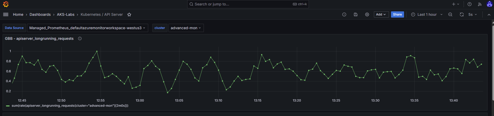

Congratulations, you have managed to add a specific metric from the `controlplane-apiserver`! 

:::note
The Azure team does not offer a [pre-built dashboard](https://grafana.com/orgs/azure/dashboards) for some of these metrics, but you can reference the doc on [supported metrics for Azure Managed Prometheus](https://learn.microsoft.com/azure/aks/monitor-aks-reference#supported-metrics-for-microsoftcontainerservicemanagedclusters) and create your own dashboards in Azure Managed Grafana or search for community dashboards on [Grafana.com](https://grafana.com/grafana/dashboards) and import them into Azure Managed Grafana. Just be sure to use the Azure Managed Prometheus data source.
:::

### Custom scrape jobs for Azure Managed Prometheus

Typically, when you want to scrape metrics from a target, you would create a scrape job in Prometheus. With **Azure Managed Prometheus**, you can define custom scrape jobs for your AKS cluster using the `PodMonitor` and `ServiceMonitor` **Custom Resource Definitions (CRDs)**, which are automatically created when you enable Azure Managed Prometheus.

These CRDs are nearly identical to their open-source Prometheus counterparts, with the main difference being the `apiVersion`.

:::note  
When using Azure Managed Prometheus, specify the `apiVersion` as:  
`azmonitoring.coreos.com/v1` instead of the OSS version: `monitoring.coreos.com/v1`
:::

---

### What are `PodMonitor` and `ServiceMonitor`?

| CRD Type         | Targets               | Use Case                                                      | Requires Service? |
|------------------|-----------------------|----------------------------------------------------------------|-------------------|
| `PodMonitor`     | Pods (via labels)     | Scrape metrics directly from pods (e.g., sidecar exporters)    | no                |
| `ServiceMonitor` | Services (via labels) | Scrape metrics through stable service endpoints (e.g., API svc)| yes                |

This separation allows you to control how Prometheus discovers and scrapes metrics based on how your application is exposed in the cluster.

---

### Deploying a `PodMonitor` and a Sample Application

Let’s walk through deploying a reference app and a `PodMonitor` to collect metrics.

#### 1. Deploy a reference app

```bash
kubectl apply -f https://raw.githubusercontent.com/Azure/prometheus-collector/refs/heads/main/internal/referenceapp/prometheus-reference-app.yaml
```

Verify it's running:

```bash
kubectl get pods,svc -l app=prometheus-reference-app
```

Expected output:

```bash
NAME                                            READY   STATUS    RESTARTS   AGE
pod/prometheus-reference-app-xxxxxxxxxx-xxxxx   2/2     Running   0          77s

NAME                                   TYPE        CLUSTER-IP    EXTERNAL-IP   PORT(S)                      AGE
service/prometheus-reference-service   ClusterIP   10.0.69.176   <none>        2112/TCP,2113/TCP,2114/TCP   77s
```

#### 2. Deploy a `PodMonitor`

```bash
kubectl apply -f https://raw.githubusercontent.com/Azure/prometheus-collector/refs/heads/main/otelcollector/deploy/example-custom-resources/pod-monitor/pod-monitor-reference-app.yaml
```

:::note
Custom metrics targets are scraped by pods with names like ama-metrics-*. The Prometheus Agent UI is exposed on port 9090, allowing inspection of scrape jobs.
:::

#### 3. Get the AMA Prometheus pod name

```bash
AMA_METRICS_POD_NAME="$(kubectl get po -n kube-system -lrsName=ama-metrics -o jsonpath='{.items[0].metadata.name}')"
```

#### 4. Port-forward Prometheus locally

```bash
kubectl port-forward ${AMA_METRICS_POD_NAME} -n kube-system 9090
```

Open your browser at: http://localhost:9090

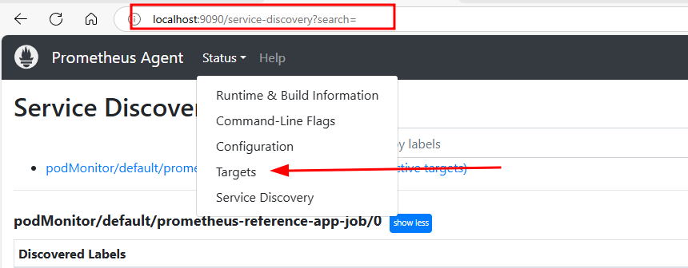

* Under **Status > Targets**, you'll find the target:
`podMonitor/default/prometheus-reference-app-job/0`

* Under **Status > Service Discovery**, you'll see label-discovered targets for the same.

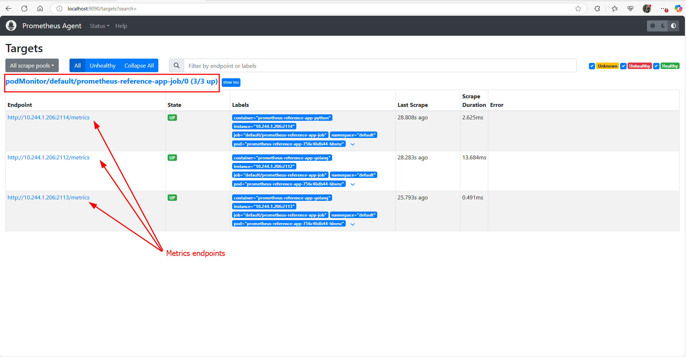

When you're done, stop port-forwarding by pressing `Ctrl+C`.

### Inspecting the Raw Metrics from the Reference Application

In addition to viewing metrics in Prometheus or Grafana, you can directly access the raw metrics exposed by the reference app on port **2112** using a simple port-forward.

#### 1. Port-forward to the reference app pod

```bash
kubectl port-forward svc/prometheus-reference-service 2112:2112
```

#### 2. Open your browser or use curl
Now you can navigate to http://localhost:2112/metrics in your browser, or run:

```bash
curl http://localhost:2112/metrics
```

Example output:

```
max_dimension_rainfall{city="chennai",location="midwest"} 0.24
max_dimension_rainfall{city="chicago",location="midwest"} 0.07
max_dimension_rainfall{city="dc",location="east"} 0.137
max_dimension_rainfall{city="dc",location="midwest"} 0.18700000000000003
max_dimension_rainfall{city="delhi",location="midwest"} 0.05
max_dimension_rainfall{city="hyderabad",location="midwest"} 0.09300000000000001
max_dimension_rainfall{city="indianapolis",location="midwest"} 0.10300000000000001
max_dimension_rainfall{city="indore",location="midwest"} 0.10700000000000001
max_dimension_rainfall{city="jaipur",location="midwest"} 0.11
max_dimension_rainfall{city="kanpur",location="midwest"} 0.19
max_dimension_rainfall{city="kolkata",location="midwest"} 0.23
max_dimension_rainfall{city="lucknow",location="midwest"} 0.147
max_dimension_rainfall{city="milwaukee",location="midwest"} 0.1
max_dimension_rainfall{city="minneapolis",location="midwest"} 0.11
max_dimension_rainfall{city="mumbai",location="midwest"} 0.14
max_dimension_rainfall{city="nagpur",location="midwest"} 0.183
max_dimension_rainfall{city="new york",location="east"} 0.18
max_dimension_rainfall{city="new york",location="midwest"} 0.11
max_dimension_rainfall{city="orlando",location="midwest"} 0.14
max_dimension_rainfall{city="orlando",location="south"} 0.16
max_dimension_rainfall{city="portland",location="midwest"} 0.21
```

These are standard Prometheus metrics types (counter, gauge, histogram, summary) designed for testing.

:::info 
This is helpful for verifying what metrics are exposed by your application before defining scrape jobs or visualizations.
:::

Once finished, press Ctrl+C to stop the port-forward session.

### Explore the Metrics in Grafana

Once metrics have been scraped for a few moments, open **Azure Managed Grafana**, go to the **Explore** tab, and query the metrics from the reference app. For example, we can try to query for the `max_dimension_rainfall_histogram_bucket` metric:

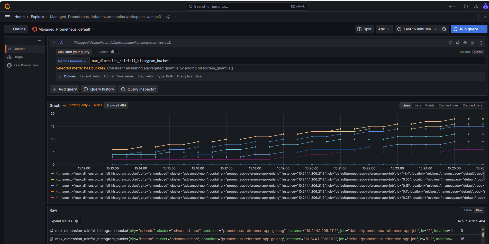

---

## Summary

In this lab, we accomplished the following:

- Enabled the preview feature for AKS control plane metrics using Azure CLI.

- Deployed a new AKS cluster integrated with Azure Managed Prometheus and Azure Managed Grafana.

- Imported pre-built dashboards to visualize control plane metrics (`kube-apiserver` and `etcd`) in Grafana.

- Customized metric ingestion by editing the `ama-metrics-settings-configmap` to include specific metrics like `apiserver_longrunning_requests`.

- Deployed a reference application and configured a custom PodMonitor to scrape application metrics using Azure Managed Prometheus.

- Verified custom metrics collection using both the Prometheus UI and Azure Managed Grafana.

### Additional Resources

* [Custom CRDs for scraping](https://learn.microsoft.com/azure/azure-monitor/containers/prometheus-metrics-scrape-crd)

* [Prometheus interface in AMA](https://learn.microsoft.com/azure/azure-monitor/containers/prometheus-metrics-troubleshoot#prometheus-interface)

---