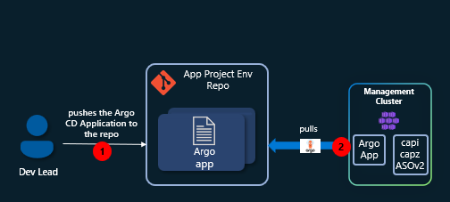
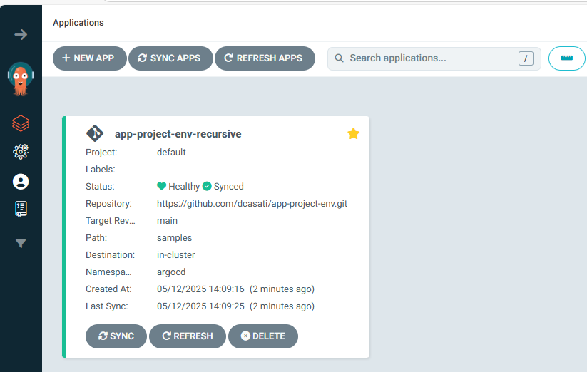
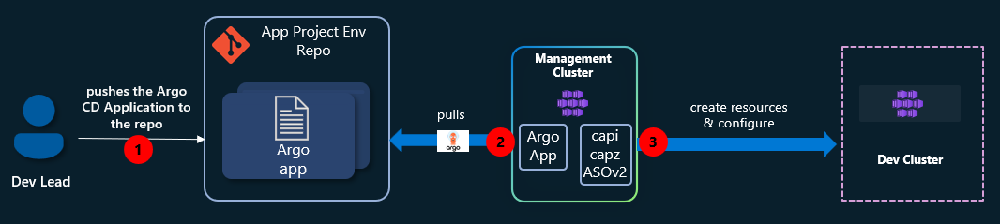
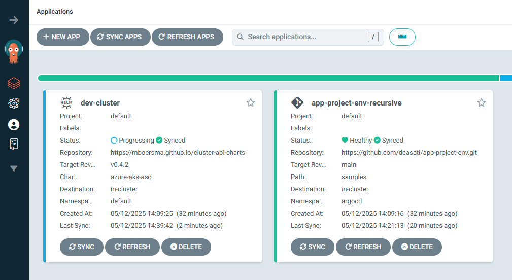
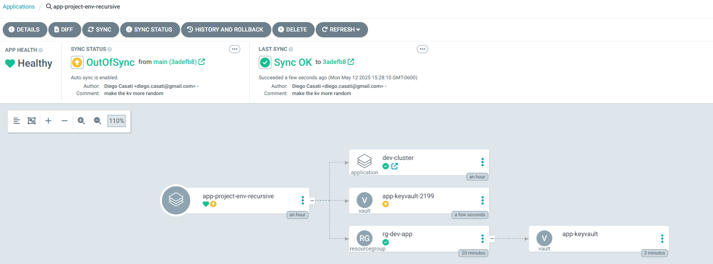

# Platform Engineering on AKS with GitOps, CAPZ, and ASO

Welcome to the **Platform Engineering on AKS** workshop. This hands-on workshop will guide you through implementing a robust platform engineering environment using the Cloud Native pattern on Azure Kubernetes Service (AKS). The environment leverages GitOps practices and integrates tools such as [ArgoCD](https://argo-cd.readthedocs.io/en/stable/), and the [Cluster API Provider for Azure (CAPZ)](https://github.com/kubernetes-sigs/cluster-api-provider-azure) along with [Azure Service Operator (ASO)](https://azure.github.io/azure-service-operator/). By the end of this workshop, participants will be able to deploy infrastructure and application environments using these tools.

---

## Objectives

- Provide a foundational understanding of key tools in the platform engineering space
- Build a control plane AKS cluster using Azure CLI
- Bootstrap GitOps with ArgoCD
- Demonstrate how CAPZ and ASO can provision infrastructure and Kubernetes clusters
- Show how to deploy new resources in Azure, using CAPI/CAPZ to generate a new AKS cluster,

:::tip
If you have used Infrastructure as Code tools like `terraform` to create resources in Azure, you can use the `asoctl` tool to convert these Azure resources into ASO deployments. To find out more about `asoctl` take a look [here](https://azure.github.io/azure-service-operator/tools/). You can download `asoctl` [here](https://github.com/Azure/azure-service-operator/releases/tag/v2.13.0)
:::
---

## Prerequisites

- Azure Subscription
- [Azure CLI](https://learn.microsoft.com/en-us/cli/azure/) version 2.60.0 or later
- [kubectl](https://kubernetes.io/docs/tasks/tools/) version 1.28.9 or later
- [helm](https://github.com/helm/helm/releases) version v.3.17.0 or later
- [GitHub CLI](https://cli.github.com/) version 2.45.0 or later

---

## Architecture Overview

XXX

This workshop uses the [GitOps Bridge Pattern](https://github.com/gitops-bridge-dev/gitops-bridge?tab=readme-ov-file) and the [Building a Platform Engineering Environment on Azure Kubernetes Service (AKS)](https://github.com/Azure-Samples/aks-platform-engineering) as a foundation:

- A control plane cluster is provisioned and bootstrapped with ArgoCD
- ArgoCD syncs platform addons via GitOps
- Cluster API Provider for Azure (CAPZ) is used for managing additional clusters

:::note

`CAPZ` or `Crossplane`? Before deploying this solution, take time to evaluate which control plane best fits your organization's needs. In this workshop, we’ll focus on `CAPZ` and `ASO`, but `Crossplane` is another viable option. To help you decide, we've outlined the key differences between them in this guide [how to choose your control plane provider](https://github.com/azure-samples/aks-platform-engineering/blob/main/docs/capz-or-crossplane.md).
:::

### Step 1: Create the AKS cluster

Before we begin lets create a new directory that can be a placeholder for all of our files created during this lab:

```bash
mkdir aks-labs
cd aks-labs
```

Next, proceed by declaring the following environment variables:

```bash
cat <<EOF> .envrc
# Environment variables
export AZURE_SUBSCRIPTION_ID=$(az account show --query id -o tsv)
export AZURE_TENANT_ID=$(az account show --query tenantId -o tsv)

# AKS
export AKS_CLUSTER_NAME="aks-labs"
export RESOURCE_GROUP="rg-aks-labs"
export LOCATION="westus3"
export MANAGED_IDENTITY_NAME="akspe"
EOF
```

Load the environment variables:

```bash
source .envrc
```

:::tip
Now that we have saved the environment variables, you can always reload these variables later if needed by running `source .envrc` on this directory.
:::

1. Create the resource group

```bash
# Create resource group
az group create --name ${RESOURCE_GROUP} --location ${LOCATION}
```

2. Create the AKS cluster:

```bash
az aks create \
  --name ${AKS_CLUSTER_NAME} \
  --resource-group ${RESOURCE_GROUP} \
  --enable-managed-identity \
  --node-count 3 \
  --generate-ssh-keys \
  --enable-oidc-issuer \
  --enable-workload-identity
```

3. Get the credentials to access the cluster:

```bash
az aks get-credentials \
  --name ${AKS_CLUSTER_NAME} \
  --resource-group ${RESOURCE_GROUP} \
  --file aks-labs.config
  ```
Use the `aks-labs.config` file this as your KUBECONFIG

```bash
export KUBECONFIG=$PWD/aks-labs.config
```

### Step 2: Create create an user-assigned managed identity for CAPZ

In this step, we will do the following:

* Create a user-assigned managed identity for CAPZ

* Assign it the `Contributor` role

* Create two federated identity credentials: `aks-labs-capz-manager-credential` and `serviceoperator`

1. Create a user-assigned identity:

  ```bash
  export AKS_OIDC_ISSUER_URL=$(az aks show \
    --resource-group ${RESOURCE_GROUP} \
    --name ${AKS_CLUSTER_NAME} \
    --query "oidcIssuerProfile.issuerUrl" \
    -o tsv)
  
  az identity create \
    --name "${MANAGED_IDENTITY_NAME}" \
    --resource-group "${RESOURCE_GROUP}" \
    --location "${LOCATION}"
  ```

2. Retrieve Azure Managed Identity Client and Principal IDs:

  ```bash
  export AZURE_CLIENT_ID=$(az identity show \
    --name "${MANAGED_IDENTITY_NAME}" \
    --resource-group "${RESOURCE_GROUP}" \
    --query "clientId" -o tsv)

  export PRINCIPAL_ID=$(az identity show \
    --name "${MANAGED_IDENTITY_NAME}" \
    --resource-group "${RESOURCE_GROUP}" \
    --query "principalId" -o tsv)
  ```

  Verify that these variables are not empty:

  ```bash
  echo "AZURE_SUBSCRIPTION_ID: $AZURE_SUBSCRIPTION_ID"
  echo "AZURE_TENANT_ID: $AZURE_TENANT_ID"
  echo "AZURE_CLIENT_ID: $AZURE_CLIENT_ID"
  echo "PRINCIPAL_ID: $PRINCIPAL_ID"  
  ```
  Add these new environment variables to your `.envrc`:

  ```bash
  echo export AKS_OIDC_ISSUER_URL=${AKS_OIDC_ISSUER_URL} >> .envrc
  echo export AZURE_CLIENT_ID=${AZURE_CLIENT_ID} >> .envrc
  echo export PRINCIPAL_ID=${PRINCIPAL_ID} >>  .envrc
  ```

3. Assigning `Contributor` and `Managed Identity Operator` roles to the identity:

  ```bash
  az role assignment create \
    --assignee "${PRINCIPAL_ID}" \
    --role "Contributor" \
    --scope "/subscriptions/${AZURE_SUBSCRIPTION_ID}"

  az role assignment create \
    --assignee "${PRINCIPAL_ID}" \
    --role "Managed Identity Operator" \
    --scope "/subscriptions/${AZURE_SUBSCRIPTION_ID}/resourceGroups/${IDENTITY_RG}/providers/Microsoft.ManagedIdentity/userAssignedIdentities/${IDENTITY_NAME}"
  ```

4. Creating federated identity credential: **aks-labs-capz-manager-credential**

  ```bash
  az identity federated-credential create \
    --name "aks-labs-capz-manager-credential" \
    --identity-name "${MANAGED_IDENTITY_NAME}" \
    --resource-group "${RESOURCE_GROUP}" \
    --issuer "${AKS_OIDC_ISSUER_URL}" \
    --subject "system:serviceaccount:azure-infrastructure-system:capz-manager" \
    --audiences "api://AzureADTokenExchange"
  ```

5. Creating federated identity credential: **serviceoperator**

  ```bash
  az identity federated-credential create \
    --name "serviceoperator" \
    --identity-name "${MANAGED_IDENTITY_NAME}" \
    --resource-group "${RESOURCE_GROUP}" \
    --issuer "${AKS_OIDC_ISSUER_URL}" \
    --subject "system:serviceaccount:azure-infrastructure-system:azureserviceoperator-default" \
    --audiences "api://AzureADTokenExchange"
  ```

### Step 3: Install ArgoCD

1. Create a namespace for Argo CD and install it on the cluster:

```bash
kubectl create namespace argocd
kubectl apply -n argocd -f https://raw.githubusercontent.com/argoproj/argo-cd/stable/manifests/install.yaml
```

2. Verify that the Argo CD pods are up and running:

  ```bash
  kubectl get pods -n argocd -w
  ```

  Expected output:

  ```bash
  NAME                                    READY   STATUS
  argocd-application-controller-0         1/1     Running
  argocd-applicationset-controller-xxxxx  1/1     Running
  argocd-dex-server-xxxxx                 1/1     Running
  argocd-notifications-controller-xxxxx   1/1     Running
  argocd-redis-xxxxx                      1/1     Running
  argocd-repo-server-xxxxx                1/1     Running
  argocd-server-xxxxx                     1/1     Running
  ```

### Step 4: Access ArgoCD UI

1. Retrieve ArgoCD admin password

  ```bash
  kubectl get secrets argocd-initial-admin-secret -n argocd --template="{{index .data.password | base64decode}}" ; echo
  ```

If no public IP is available:

  ```bash
  kubectl port-forward svc/argocd-server -n argocd 8080:443
  ```

Access the UI at [https://localhost:8080](https://localhost:8080). The default username is `admin`.


After you successfully login, you should see the Argo CD Applications - which at this point are empty.


### Step 5: Install Cluster API Provider for Azure (CAPZ)

This section walks you through installing **Cluster API Provider for Azure (CAPZ)** through the Cluster API Operator (capi-operator). This step is need in order to prepare your environment for provisioning AKS clusters using GitOps workflows.

#### Prerequisite: cert-manager

`cert-manager` is required for capi/capz/aso and it plays a critical role in automating the lifecycle of TLS certificates required for the communications between controllers, validating and mutating webhooks and the Kubernetes API server. Without cert-manager, a kubernetes operator would have to manually create, distribute and rotate these certificates, making for a very complex day-2 operations.

To install `cert-manager`:

```bash
# Add the Jetstack Helm repository
helm repo add jetstack https://charts.jetstack.io
helm repo update

# Install cert-manager with CRDs (adjust the namespace if needed)
helm install cert-manager jetstack/cert-manager \
  --namespace cert-manager \
  --create-namespace \
  --set crds.enabled=true \
  --version v1.15.3  # Use the latest stable version
```

Verify that cert-manager was installed:

```bash
kubectl get pods -n cert-manager
```

Expect:

```bash
NAME                                     READY   STATUS 
cert-manager-7b9875fbcc-n2754            1/1     Running
cert-manager-cainjector-948d47c6-5z5fz   1/1     Running
cert-manager-webhook-78bd84d46b-969lk    1/1     Running
```

You are now ready to install the `capi-operator`.

1. Generate a `values` file for the capi-operator:

```bash
cat <<EOF> capi-operator-values.yaml
core:
  cluster-api:
    version: v1.9.6
infrastructure:
  azure:
    version: v1.19.2
addon:
  helm:
    version: v0.3.1
manager:
  featureGates:
    core:
      ClusterTopology: true
      MachinePool: true
additionalDeployments:
  azureserviceoperator-controller-manager:
    deployment:
      containers:
        - name: manager
          args:
            --crd-pattern: "resources.azure.com/*;containerservice.azure.com/*;keyvault.azure.com/*;managedidentity.azure.com/*;eventhub.azure.com/*;storage.azure.com/*"
EOF
```

2. Install the Cluster API Operator

  ```bash
  helm repo add capi-operator https://kubernetes-sigs.github.io/cluster-api-operator
  helm repo update
  helm install capi-operator capi-operator/cluster-api-operator \
    --create-namespace -n capi-operator-system \
    --wait \
    --timeout=300s \
    -f capi-operator-values.yaml
  ```

:::info
If you need to modify or reinstall the cluster-api-operator, you can do it so by running this command:

to upgrade/update the chart (e.g.: after modifying the `capi-operator-values.yaml` file):

```bash
  helm upgrade --install install capi-operator capi-operator/cluster-api-operator \
  --create-namespace -n capi-operator-system \
  --wait \
  --timeout=300s \
  -f capi-operator-values.yaml
```

to uninstall the chart:

```bash
helm uninstall capi-operator -n capi-operator-system
```

Helm doesn't remove all of the CRDs from the cluster and those would have to be removed manually.
:::

3. Verify the `CAPZ` Installation

  ```bash
  kubectl get pods -n azure-infrastructure-system
  ```

  Expected output:

  ```
  azureserviceoperator-controller-manager-xxxxx   1/1   Running
  capz-controller-manager-xxxxx                   1/1   Running
  ```

4. Generating a CAPZ `AzureClusterIdentity`

```bash
cat <<EOF> identity.yaml
apiVersion: infrastructure.cluster.x-k8s.io/v1beta1
kind: AzureClusterIdentity
metadata:
  annotations:
    argocd.argoproj.io/hook: PostSync
    argocd.argoproj.io/sync-wave: "5"
    argocd.argoproj.io/sync-options: SkipDryRunOnMissingResource=true
  labels:
    clusterctl.cluster.x-k8s.io/move-hierarchy: "true"
  name: cluster-identity
  namespace: azure-infrastructure-system
spec:
  allowedNamespaces: {}
  clientID: ${AZURE_CLIENT_ID}
  tenantID: ${AZURE_TENANT_ID}
  type: WorkloadIdentity
EOF
```

5. Applying `identity.yaml` to the cluster

  ```bash
  kubectl apply -f identity.yaml
  ```

At this stage, the `Management Cluster` is fully prepared to provision new Azure resources. You can use CAPI/CAPZ to create AKS clusters or leverage Azure Service Operator (ASOv2) to manage other Azure resources.

---

#### Setting up your Dev environment

With the `Management Cluster` operational, we’ll act as a Dev Lead and create a new AKS cluster using a self-service approach. By defining the cluster as an Argo CD Application and storing it in a GitHub repository, Argo CD will automatically provision resources in Azure whenever new files are committed.

The final workflow will look like this:



##### Steps for setting up a new GitHub repo:

1. Create a new repository:

```bash
gh repo create "app-project-env" --public
```

:::note
Before you can use the GitHub CLI (`gh`), you might have to login using `gh auth login`.
:::


:::note
We will be using SSH authentication throughout this workshop. If you haven't already added your SSH key to GitHub, here's how you can do it:

Steps:

```bash
gh ssh-key add ~/.ssh/id_ed25519.pub --title "My Personal Laptop Key"
```

You can list your keys with:

```bash
gh ssh-key list
```

if you need a new key:

```bash
ssh-keygen
```

For more information take a look at [Connecting to GitHub with SSH
](https://docs.github.com/en/authentication/connecting-to-github-with-ssh)
:::

2. Clone the repository locally:

```bash
export GITHUB_USERNAME=$(gh api user --jq .login) # Retrieves the GitHub username
git clone git@github.com:$GITHUB_USERNAME/app-project-env.git
cd app-project-env
```
3. Create the necessary directories for these next samples

```bash
mkdir -p samples/sample-1
mkdir -p samples/sample-2
```

4. Create a new Argo CD application in the `Management Cluster` that watches this GitHub Repository for any changes.

```bash
cat <<EOF> github-app-project-argo-cd-app.yaml
apiVersion: argoproj.io/v1alpha1
kind: Application
metadata:
  name: app-project-env-recursive
  namespace: argocd
spec:
  project: default
  source:
    repoURL: 'https://github.com/${GITHUB_USERNAME}/app-project-env.git'
    targetRevision: main
    path: samples
    directory:
      recurse: true
  destination:
    server: 'https://kubernetes.default.svc'
    namespace: argocd
  syncPolicy:
    automated:
      prune: true
      selfHeal: true
    syncOptions:
      - CreateNamespace=true
EOF
```

Apply it:

```bash
kubectl apply -f github-app-project-argo-cd-app.yaml
```

In the Argo CD Web UI, you should now see the new Application:



With this new repo in place, and Argo CD in the `Management Cluster` watching it for any changes, you are now ready to proceed and to try the samples 1 and 2.

---

### Sample 1: Create a new AKS cluster as an Argo CD Application 

This first sample demonstrates how to declaratively provision a new Azure Kubernetes Service (AKS) cluster using Argo CD and Helm, integrating directly with Azure via the Cluster API for Azure.

By treating the AKS cluster itself as an Argo CD Application, we enable full GitOps-based lifecycle management for both infrastructure and applications. This approach simplifies cluster creation, standardizes configurations, and ensures changes are continuously reconciled from a Git repository.

This method allows platform teams to bootstrap new environments on demand, using Argo CD’s synchronization and automation capabilities to handle deployment, scaling, and governance seamlessly.



1. Setup the environment variables for the new AKS cluster:

```bash
export DEV_CLUSTER_NAME=dev-cluster
export DEV_CLUSTER_LOCATION=eastus
```

2. Create the Argo CD Application that declares the cluster:

:::info
Note that this Argo CD Application manifest references a Helm chart. The [Cluster API Provider Azure Managed Cluster Helm Chart](https://github.com/mboersma/cluster-api-charts/tree/main/charts/azure-managed-cluster) that manages the underlying Azure resources required to provision and configure the AKS cluster. This chart allows for the configuration of various AKS parameters such as the `kubernetesVersion`, `clusterNetwork` and node pool options like `vmSize` and `osSKU`.
:::

```bash
cat <<EOF> samples/sample-1/aks-argo-application.yaml
apiVersion: argoproj.io/v1alpha1
kind: Application
metadata:
  name: "${DEV_CLUSTER_NAME}"
  namespace: argocd
spec:
  project: default
  destination:
    namespace: default
    server: https://kubernetes.default.svc
  source:
    repoURL: 'https://mboersma.github.io/cluster-api-charts'
    chart: azure-aks-aso
    targetRevision: v0.4.2
    helm:
      valuesObject:
        clusterName: "${DEV_CLUSTER_NAME}"
        location: "${DEV_CLUSTER_LOCATION}"
        subscriptionID: "${AZURE_SUBSCRIPTION_ID}"
        clientID: "${AZURE_CLIENT_ID}"
        tenantID: "${AZURE_TENANT_ID}"
        authMode: "workloadidentity"
        kubernetesVersion: v1.30.10
        clusterNetwork: "overlay"
        managedMachinePoolSpecs:
          pool0:
            count: 1
            enableAutoScaling: true
            enableEncryptionAtHost: false
            enableFIPS: false
            enableNodePublicIP: false
            enableUltraSSD: false
            maxCount: 3
            minCount: 1
            mode: System
            osSKU: AzureLinux
            vmSize: Standard_DS2_v2
            type: VirtualMachineScaleSets
  syncPolicy:
    automated:
      prune: true
      selfHeal: true
    syncOptions:
      - CreateNamespace=true
    retry:
      limit: -1
      backoff:
        duration: 5s
        factor: 2
        maxDuration: 10m
EOF
```

Commit and push the changes back to GitHub:

```bash
git add .
git commit -m "Sample 1: Create a new AKS cluster as an Argo CD Application"
git push origin main
```

You can follow the deployment of the new dev cluster in the Argo CD UI



### Sample 2: Create new ASOv2 resources

In this second sample, we will look into how to use ASOv2 to create resources in Azure. For this example, we will create a single Resource Group but the concepts here apply for other resources in Azure too.

To create other resources using ASOv2, you can follow the structure of the Git repo for this sample:

```bash
samples/
└──> sample-2/
    └──> kv-argo-application.yaml  <-- contains your ASOv2 ResourceGroup and KeyVault manifest
```

:::note
From now on, when creating resources with ASOv2, we need to include the following annotation:

```bash 
  annotations:
    serviceoperator.azure.com/credential-from: aso-credentials
```

To illustrate this concept, lets create a new resource group:

1. Create a new `namespace`

```bash
kubectl create ns rg-dev-app
```

2. Create a new `secret` scoped to the namespace

```bash
cat <<EOF> rg-dev-app-aso-credentials.yaml
apiVersion: v1
kind: Secret
metadata:
 name: rg-dev-app-aso-credentials
 namespace: rg-dev-app
stringData:
 AZURE_SUBSCRIPTION_ID: "$AZURE_SUBSCRIPTION_ID"
 AZURE_TENANT_ID: "$AZURE_TENANT_ID"
 AZURE_CLIENT_ID: "$AZURE_CLIENT_ID"
 USE_WORKLOAD_IDENTITY_AUTH: "true"
EOF
```

Apply it:

```bash
kubectl apply -f rg-dev-app-aso-credentials.yaml
```

3. Create the resource

```bash
cat <<EOF> rg-dev-app.yaml
apiVersion: resources.azure.com/v1api20200601
kind: ResourceGroup
metadata:
  name: my-rg-dev-app
  namespace: rg-dev-app
  annotations:
    serviceoperator.azure.com/credential-from: rg-dev-app-aso-credentials
spec:
  location: westus3
EOF
```

Apply it:

```bash
kubectl apply -f rg-dev-app.yaml
```

Verify that it was created:

```bash
az group show -n my-rg-dev-app
```

Expect:

```bash
{
  "id": "/subscriptions/6edaa0d4-86e4-431f-a3e2-d027a34f03c9/resourceGroups/my-rg-dev-app",
  "location": "westus3",
  "managedBy": null,
  "name": "my-rg-dev-app",
  "properties": {
    "provisioningState": "Succeeded"
  },
  "tags": null,
  "type": "Microsoft.Resources/resourceGroups"
}
```

To remove this resource, you can do use kubectl as such:

```bash
kubectl delete resourcegroup/my-rg-dev-app -n rg-dev-app
```

```bash
cat <<EOF > samples/sample-2/kv-argo-application.yaml
apiVersion: resources.azure.com/v1api20200601
kind: ResourceGroup
metadata:
  name: rg-dev-app
  namespace: rg-dev-app
  annotations:
    serviceoperator.azure.com/credential-from: rg-dev-app-aso-credentials
spec:
  location: ${DEV_CLUSTER_LOCATION}
---
apiVersion: keyvault.azure.com/v1api20210401preview
kind: Vault
metadata:
  name: app-keyvault
  namespace: rg-dev-app
  annotations:
    serviceoperator.azure.com/credential-from: rg-dev-app-aso-credentials
spec:
  location: ${DEV_CLUSTER_LOCATION}
  owner:
    name: rg-dev-app
    kind: ResourceGroup
  properties:
    tenantId: ${AZURE_TENANT_ID}
    sku:
      family: "A"
      name: "standard"
    accessPolicies:
      - tenantId: ${AZURE_TENANT_ID}
        objectId: ${PRINCIPAL_ID}  # User or Service Principal Object ID
        permissions:
          secrets:
            - get
            - list
            - set
    enableSoftDelete: true
---
apiVersion: keyvault.azure.com/v1api20210401preview
kind: Secret
metadata:
  name: app-secret
  namespace: rg-dev-app
  annotations:
    serviceoperator.azure.com/credential-from: rg-dev-app-aso-credentials
spec:
  owner:
    name: app-keyvault
    kind: Vault
  properties:
    value: "c2VjcmV0LXZhbHVlLWJhc2U2NA=="  # Base64 for 'secret-value-base64'
EOF
```


```bash
git add samples/sample-2/kv-argo-application.yaml
git commit -m "Sample-2: Create new ASOv2 resources"
git push
```



---

## Summary

In this lab, we accomplished the following:

- Created the AKS control plane cluster using the Azure CLI.
- Installed Argo CD and accessed its web UI.
- Bootstrapped the environment using GitOps principles.
- Installed Cluster API Provider for Azure (CAPZ) and Azure Service Operator (ASO) to enable infrastructure provisioning.
- Provisioned a workload cluster using Argo CD.