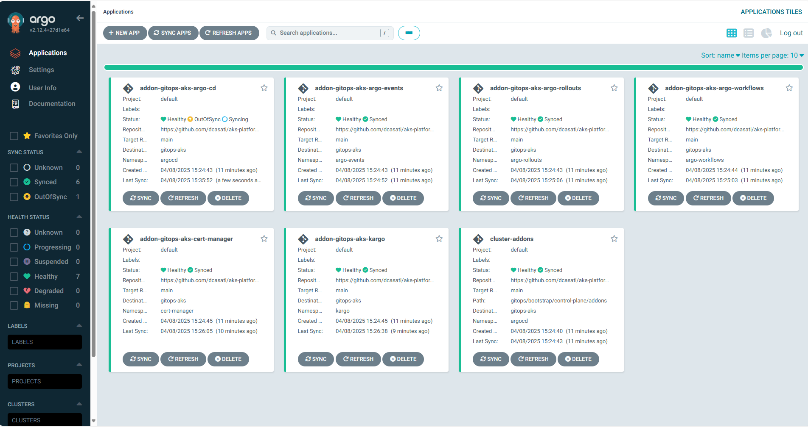
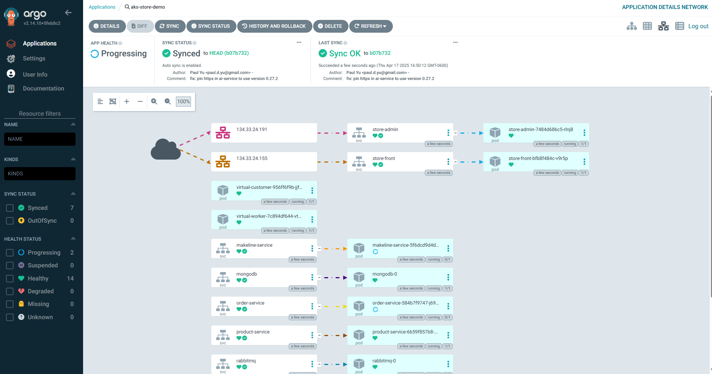

# Platform Engineering on AKS with GitOps, CAPZ, and ASO

Welcome to the **Platform Engineering on AKS** workshop. This hands-on workshop will guide you through implementing a robust platform engineering environment using the Cloud Native pattern on Azure Kubernetes Service (AKS). The environment leverages GitOps practices and integrates tools such as [ArgoCD](https://argo-cd.readthedocs.io/en/stable/), and the [Cluster API Provider for Azure (CAPZ)](https://github.com/kubernetes-sigs/cluster-api-provider-azure) along with [Azure Service Operator (ASO)](https://azure.github.io/azure-service-operator/). By the end of this workshop, participants will be able to deploy infrastructure and application environments using these tools.

---

## Objectives

- Provide a foundational understanding of key tools in the platform engineering space
- Build a control plane AKS cluster using Azure CLI
- Bootstrap GitOps with ArgoCD
- Demonstrate how CAPZ and ASO can provision infrastructure and Kubernetes clusters
- Show how to deploy application environments on both existing AKS clusters and newly created dedicated clusters

---

## Prerequisites

- Azure Subscription
- [Azure CLI](https://learn.microsoft.com/en-us/cli/azure/) version 2.60.0 or later
- [kubectl](https://kubernetes.io/docs/tasks/tools/) version 1.28.9 or later
- [helm](https://github.com/helm/helm/releases) version v.3.17.0 or later

---

## Architecture Overview

This workshop uses the [GitOps Bridge Pattern](https://github.com/gitops-bridge-dev/gitops-bridge?tab=readme-ov-file) and the [Building a Platform Engineering Environment on Azure Kubernetes Service (AKS)](https://github.com/Azure-Samples/aks-platform-engineering) as a foundation:

- A control plane cluster is provisioned and bootstrapped with ArgoCD
- ArgoCD syncs platform addons via GitOps
- Cluster API Provider for Azure (CAPZ) is used for managing additional clusters

:::note

`CAPZ` or `Crossplane`? Before deploying this solution, take time to evaluate which control plane best fits your organization's needs. In this workshop, we’ll focus on `CAPZ` and `ASO`, but `Crossplane` is another viable option. To help you decide, we've outlined the key differences between them in this guide [how to choose your control plane provider](https://github.com/azure-samples/aks-platform-engineering/blob/main/docs/capz-or-crossplane.md).

:::

## Step 1: Create the AKS cluster

  ```bash
  RESOURCE_GROUP="rg-aks-platform"
  LOCATION="westus3"
  AKS_CLUSTER_NAME="aks-platform"
  ```

1. Create the resource group

  ```bash
  # Create resource group
  az group create --name ${RESOURCE_GROUP} --location ${LOCATION}
  ```

2. Create the AKS cluster:

  ```bash
  az aks create \
    --name ${AKS_CLUSTER_NAME} \
    --resource-group ${RESOURCE_GROUP} \
    --enable-managed-identity \
    --node-count 3 \
    --generate-ssh-keys \
    --enable-oidc-issuer \
    --enable-workload-identity
  ```

3. Get the credentials to access the cluster:

  ```bash
  az aks get-credentials \
    --name ${AKS_CLUSTER_NAME} \
    --resource-group ${RESOURCE_GROUP} \
    --file aks-platform.config
  ```

### Step 2: Install ArgoCD

1. Create a namespace for Argo CD and install it on the cluster:

  ```bash
  kubectl create namespace argocd
  kubectl apply -n argocd -f https://raw.githubusercontent.com/argoproj/argo-cd/stable/manifests/install.yaml
  ```

2. Verify that the Argo CD pods are up and running:

  ```bash
  kubectl get pods -n argocd -w
  ```

  Expected output:

  ```bash
  NAME                                    READY   STATUS
  argocd-application-controller-0         1/1     Running
  argocd-applicationset-controller-xxxxx  1/1     Running
  argocd-dex-server-xxxxx                 1/1     Running
  argocd-notifications-controller-xxxxx   1/1     Running
  argocd-redis-xxxxx                      1/1     Running
  argocd-repo-server-xxxxx                1/1     Running
  argocd-server-xxxxx                     1/1     Running
  ```

## Step 2: Access ArgoCD UI

1. Retrieve ArgoCD admin password and server IP

  ```bash
  kubectl get secrets argocd-initial-admin-secret -n argocd --template="{{index .data.password | base64decode}}" ; echo
  kubectl get svc -n argocd argocd-server
  ```

If no public IP is available:

  ```bash
  kubectl port-forward svc/argocd-server -n argocd 8080:443
  ```

Access the UI at [https://localhost:8080](https://localhost:8080). The default username is `admin`.


After you successfully login, you should see the Argo CD Applications - which at this point are empty.


## Step 3: Bootstrap the cluster addons using Argo CD

1. Export the environment variables for your environment: 

```bash
# Environment variables
export GITOPS_ADDONS_ORG="https://github.com/dcasati"
export GITOPS_ADDONS_REPO="aks-platform-engineering"
export GITOPS_ADDONS_BASEPATH="gitops/"
export GITOPS_ADDONS_PATH="bootstrap/control-plane/addons"
export GITOPS_ADDONS_REVISION="main"
export AKS_CLUSTER_NAME="aks-platform"

# Create the secret manifest
cat <<EOF > aks-labs-gitops.yaml
apiVersion: v1
kind: Secret
metadata:
  name: aks-labs-gitops
  namespace: argocd
  labels:
    argocd.argoproj.io/secret-type: cluster
    akuity.io/argo-cd-cluster-name: ${AKS_CLUSTER_NAME}
    argo_rollouts_chart_version: 2.37.7
    argocd_chart_version: 7.6.10
    cluster_name: ${AKS_CLUSTER_NAME}
    enable_argo_events: "true"
    enable_argo_rollouts: "true"
    enable_argo_workflows: "true"
    enable_argocd: "true"
    enable_azure_crossplane_upbound_provider: "false"
    enable_cert_manager: "true"
    enable_cluster_api_operator: "true"
    enable_cluster_proportional_autoscaler: "false"
    enable_crossplane: "false"
    enable_crossplane_helm_provider: "false"
    enable_crossplane_kubernetes_provider: "false"
    enable_gatekeeper: "false"
    enable_gpu_operator: "false"
    enable_ingress_nginx: "false"
    enable_kargo: "true"
    enable_kube_prometheus_stack: "false"
    enable_kyverno: "false"
    enable_metrics_server: "false"
    enable_prometheus_adapter: "false"
    enable_secrets_store_csi_driver: "false"
    enable_vpa: "false"
    environment: control-plane
    kargo_chart_version: 0.9.1
  annotations:
    addons_repo_url: "${GITOPS_ADDONS_ORG}/${GITOPS_ADDONS_REPO}"
    addons_repo_basepath: "${GITOPS_ADDONS_BASEPATH}"
    addons_repo_path: "${GITOPS_ADDONS_PATH}"
    addons_repo_revision: "${GITOPS_ADDONS_REVISION}"
    cluster_name: ${AKS_CLUSTER_NAME}
    environment: control-plane
    infrastructure_provider: capz
type: Opaque
stringData:
  name: aks-labs-gitops
  server: https://kubernetes.default.svc
  config: |
    {
      "tlsClientConfig": {
        "insecure": false
      }
    }
EOF
```

2. Create the `aks-labs-gitops` secret:

  ```bash
  kubectl apply -f aks-labs-gitops.yaml
  ```

3. Bootstrap the Argo CD applications in the cluster:

 ```bash
  kubectl apply -f https://raw.githubusercontent.com/dcasati/aks-platform-engineering/refs/heads/main/terraform/bootstrap/addons.yaml
  ```

  Here is a summary of the applications installed by Argo CD in the cluster:

  Application Name | Purpose
  | -| - 
  cluster-addons | A general-purpose application for deploying shared or foundational cluster components (e.g., networking, storage, observability, etc.). Often used as a parent or umbrella app.
  addon-aks-labs-gitops-argo-cd | Installs and manages the Argo CD GitOps controller that syncs desired state from Git repositories to Kubernetes clusters.
  addon-aks-labs-gitops-argo-events | Argo Events, used to trigger workflows based on external events (webhooks, schedules, etc.). Useful for event-driven automation.
  addon-aks-labs-gitops-argo-rollouts | Argo Rollouts, a Kubernetes controller for progressive delivery strategies like blue/green, canary, and experimentation.
  addon-aks-labs-gitops-argo-workflows | Argo Workflows, a Kubernetes-native workflow engine for orchestrating  CI/CD pipelines.
  addon-aks-labs-gitops-cert-manager | Installs cert-manager, a controller that automatically provisions and renews TLS certificates (e.g., from Let’s Encrypt).
  addon-aks-labs-gitops-kargo | Deploys Kargo, an Argo ecosystem project for automating promotion of container images across environments based on predefined policies.
  

4. Verify cert-manager

In the next step we will install the `Cluster API Provider for Azure (CAPZ)`, that requires `cert-manager`. Argo CD should've have installed `cert-manager` during the previous step so we are just confirming it's running:

  ```bash
  kubectl get pods -n cert-manager
  ```
  Expect:

  ```bash
  NAME                                       READY   STATUS
  cert-manager-xxxxxxxxx-xxxxx               1/1     Running
  cert-manager-cainjector-xxxxxxxxxx-xxxxx   1/1     Running
  cert-manager-webhook-xxxxxxxxx-xxxxx       1/1     Running
  ```
---

5. You should now have all of the bootstrap applications deployed.

Click on `Applications` and verify that the statuses of the Argo CD applications are `Healthy`.



## Step 3: Install Cluster API Provider for Azure (CAPZ)

This section walks you through installing **Cluster API Provider for Azure (CAPZ)** and preparing your environment for provisioning AKS clusters using GitOps workflows.

2. Install the Cluster API Operator

  ```bash
  helm repo add capi-operator https://kubernetes-sigs.github.io/cluster-api-operator
  helm repo update
  helm install capi-operator capi-operator/cluster-api-operator \
    --create-namespace -n capi-operator-system \
    --wait --timeout 300s \
    -f https://raw.githubusercontent.com/dcasati/aks-platform-engineering/refs/heads/main/gitops/environments/default/addons/cluster-api-provider-azure/values.yaml
  ```

3. Verify the `CAPZ` Installation

  ```bash
  kubectl get pods -n azure-infrastructure-system
  ```

  Expected output:

  ```
  azureserviceoperator-controller-manager-xxxxx   1/1   Running
  capz-controller-manager-xxxxx                   1/1   Running
  ```

### Apply Workload Identity Credentials for CAPZ

We now need to create an user-assigned managed identity for CAPZ. Here we will do the following:

* Creates a user-assigned managed identity for CAPZ

* Assigns it the `Owner` role

* Creates two federated identity credentials

* Generates a identity.yaml manifest with `${AZURE_CLIENT_ID}` and `${AZURE_TENANT_ID}` references

* Applies the manifest via `kubectl`

1. Create a user-assigned identity:

  ```bash
  export AKS_OIDC_ISSUER_URL=$(az aks show \
    --resource-group ${RESOURCE_GROUP} \
    --name ${AKS_CLUSTER_NAME} \
    --query "oidcIssuerProfile.issuerUrl" \
    -o tsv)
  export MANAGED_IDENTITY_NAME="akspe"

  az identity create \
    --name "${MANAGED_IDENTITY_NAME}" \
    --resource-group "${RESOURCE_GROUP}" \
    --location "${LOCATION}"
  ```

2. Fetch the identity and subscription

  ```bash
  export AZURE_CLIENT_ID=$(az identity show \
    --name "${MANAGED_IDENTITY_NAME}" \
    --resource-group "${RESOURCE_GROUP}" \
    --query "clientId" -o tsv)

  export PRINCIPAL_ID=$(az identity show \
    --name "${MANAGED_IDENTITY_NAME}" \
    --resource-group "${RESOURCE_GROUP}" \
    --query "principalId" -o tsv)

  export AZURE_SUBSCRIPTION_ID=$(az account show --query id -o tsv)
  export AZURE_TENANT_ID=$(az account show --query tenantId -o tsv)
  ```

3. Patch the `aks-labs-gitops` secret:

  ```bash
  kubectl -n argocd annotate secret aks-labs-gitops \
    akspe_identity_id="${AZURE_CLIENT_ID}" \
    tenant_id="${AZURE_TENANT_ID}" \
    subscription_id="${AZURE_SUBSCRIPTION_ID}" \
    --overwrite
  ```

4. Assigning 'Owner' role to the identity

  ```bash
  az role assignment create \
    --assignee "${PRINCIPAL_ID}" \
    --role "Owner" \
    --scope "/subscriptions/${AZURE_SUBSCRIPTION_ID}"
  ```

5. Creating federated identity credential: aks-labs-capz-manager-credential

  ```bash
  az identity federated-credential create \
    --name "aks-labs-capz-manager-credential" \
    --identity-name "${MANAGED_IDENTITY_NAME}" \
    --resource-group "${RESOURCE_GROUP}" \
    --issuer "${AKS_OIDC_ISSUER_URL}" \
    --subject "system:serviceaccount:azure-infrastructure-system:capz-manager" \
    --audiences "api://AzureADTokenExchange"
  ```

6. Creating federated identity credential: serviceoperator

  ```bash
  az identity federated-credential create \
    --name "serviceoperator" \
    --identity-name "${MANAGED_IDENTITY_NAME}" \
    --resource-group "${RESOURCE_GROUP}" \
    --issuer "${AKS_OIDC_ISSUER_URL}" \
    --subject "system:serviceaccount:azure-infrastructure-system:azureserviceoperator-default" \
    --audiences "api://AzureADTokenExchange"
  ```

7. Generating identity.yaml

```bash
cat <<EOF > identity.yaml
apiVersion: infrastructure.cluster.x-k8s.io/v1beta1
kind: AzureClusterIdentity
metadata:
  annotations:
    argocd.argoproj.io/hook: PostSync
    argocd.argoproj.io/sync-wave: "5"
    argocd.argoproj.io/sync-options: SkipDryRunOnMissingResource=true
  labels:
    clusterctl.cluster.x-k8s.io/move-hierarchy: "true"
  name: cluster-identity
  namespace: azure-infrastructure-system
spec:
  allowedNamespaces: {}
  clientID: ${AZURE_CLIENT_ID}
  tenantID: ${AZURE_TENANT_ID}
  type: WorkloadIdentity
EOF
```

8. Applying identity.yaml to the cluster

  ```bash
  kubectl apply -f identity.yaml
  ```


**TODO:**

It looks like the CAPI operator might need some feature flags enabled. I need to look into that. I had to patch the deployment which isn't ideal:

```bash 
 kubectl -n azure-infrastructure-system patch deployment capz-controller-manager   --type=json   -p='[{
    "op": "replace",
    "path": "/spec/template/spec/containers/0/args",
    "value": [
      "--leader-elect",
      "--diagnostics-address=:8443",
      "--insecure-diagnostics=false",
      "--feature-gates=MachinePool=true,AKSResourceHealth=false,EdgeZone=false,ASOAPI=true",
      "--v=0"
    ]
  }]'
 
 kubectl -n azure-infrastructure-system rollout restart deployment capz-controller-manager
 kubectl -n capi-system  rollout restart deployment capi-controller-manager
```

**TODO**

---

## Creating a new cluster and using the App of Apps pattern

[The App of Apps Pattern](https://argo-cd.readthedocs.io/en/stable/operator-manual/cluster-bootstrapping/#app-of-apps-pattern) an approach where you use one parent Argo CD Application to declaratively manage many child Argo CD Applications.

This parent application acts as the single source of truth that bootstraps other apps by pointing to a directory (or chart) that contains YAML definitions of additional Argo CD Applications.

Think of it as a recursive GitOps pattern: your Argo CD app deploys other Argo CD apps.

1. Create a new cluster using Argo CD

```bash
kubectl apply -f https://raw.githubusercontent.com/dcasati/aks-platform-engineering/refs/heads/main/gitops/clusters/clusters-argo-applicationset.yaml
```

2. Get the credentials for the new cluster
```bash
az aks get-credentials -n aks1 -g aks1
```

3. Deploy an application using Argo CD

On the newly created `aks1` cluster, we can now deploy an application. The `aks1` cluster comes with its own instance of `Argo CD` on the `default` namespace and we can, as a member of the dev team, deploy our application into the cluster:

```bash
kubectl apply -f - <<EOF
apiVersion: argoproj.io/v1alpha1
kind: Application
metadata:
  name: aks-store-demo
  namespace: default
spec:
  project: default
  source:
      repoURL: https://github.com/Azure-Samples/aks-store-demo.git
      targetRevision: HEAD
      path: kustomize/overlays/dev
  syncPolicy:
      automated: {}
  destination:
      namespace: argocd
      server: https://kubernetes.default.svc
EOF
```

Once deployed, you should now see a new application in your `aks1` cluster:



---

## Summary

In this lab, we accomplished the following:

- Created the AKS control plane cluster and Azure Container Registry (ACR) using the Azure CLI.
- Installed Argo CD and accessed its web UI.
- Bootstrapped the environment using GitOps principles.
- Installed Cluster API Provider for Azure (CAPZ) and Azure Service Operator (ASO) to enable infrastructure provisioning.
- Provisioned a workload cluster using Argo CD.
- Deployed the `AKS Store Demo` application to the workload cluster via Argo CD, using the _App of Apps_ pattern.