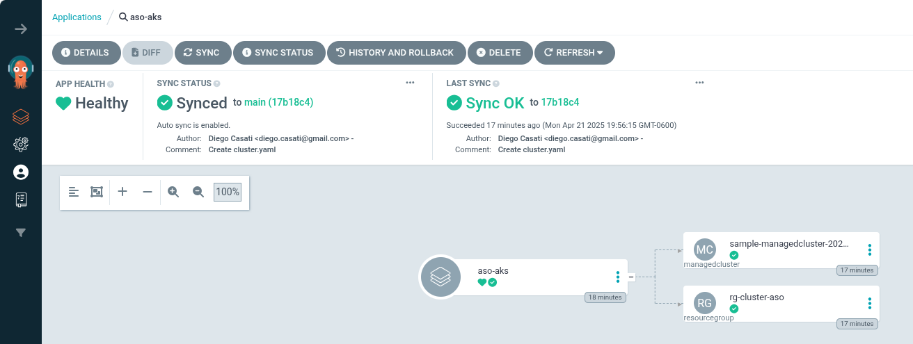
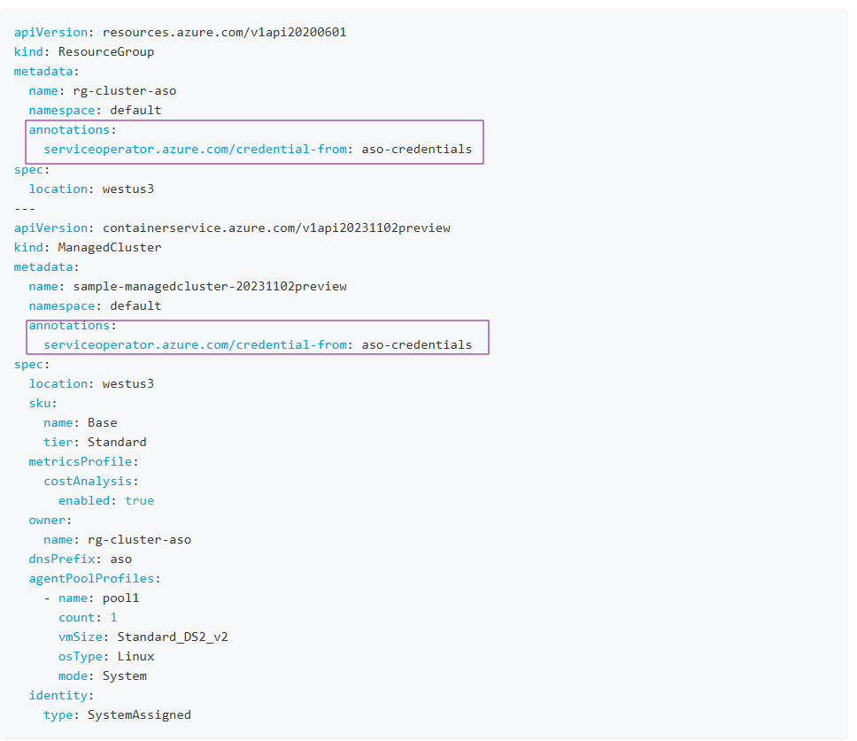

# Platform Engineering on AKS with GitOps, CAPZ, and ASO

Welcome to the **Platform Engineering on AKS** workshop. This hands-on workshop will guide you through implementing a robust platform engineering environment using the Cloud Native pattern on Azure Kubernetes Service (AKS). The environment leverages GitOps practices and integrates tools such as [ArgoCD](https://argo-cd.readthedocs.io/en/stable/), and the [Cluster API Provider for Azure (CAPZ)](https://github.com/kubernetes-sigs/cluster-api-provider-azure) along with [Azure Service Operator (ASO)](https://azure.github.io/azure-service-operator/). By the end of this workshop, participants will be able to deploy infrastructure and application environments using these tools.

---

## Objectives

- Provide a foundational understanding of key tools in the platform engineering space
- Build a control plane AKS cluster using Azure CLI
- Bootstrap GitOps with ArgoCD
- Demonstrate how CAPZ and ASO can provision infrastructure and Kubernetes clusters
- Show how to deploy application environments on both existing AKS clusters and newly created dedicated clusters

---

## Prerequisites

- Azure Subscription
- [Azure CLI](https://learn.microsoft.com/en-us/cli/azure/) version 2.60.0 or later
- [kubectl](https://kubernetes.io/docs/tasks/tools/) version 1.28.9 or later
- [helm](https://github.com/helm/helm/releases) version v.3.17.0 or later

---

## Architecture Overview

This workshop uses the [GitOps Bridge Pattern](https://github.com/gitops-bridge-dev/gitops-bridge?tab=readme-ov-file) and the [Building a Platform Engineering Environment on Azure Kubernetes Service (AKS)](https://github.com/Azure-Samples/aks-platform-engineering) as a foundation:

- A control plane cluster is provisioned and bootstrapped with ArgoCD
- ArgoCD syncs platform addons via GitOps
- Cluster API Provider for Azure (CAPZ) is used for managing additional clusters

:::note

`CAPZ` or `Crossplane`? Before deploying this solution, take time to evaluate which control plane best fits your organization's needs. In this workshop, we’ll focus on `CAPZ` and `ASO`, but `Crossplane` is another viable option. To help you decide, we've outlined the key differences between them in this guide [how to choose your control plane provider](https://github.com/azure-samples/aks-platform-engineering/blob/main/docs/capz-or-crossplane.md).

:::

### Step 1: Create the AKS cluster

```bash
# Environment variables
export AZURE_SUBSCRIPTION_ID=$(az account show --query id -o tsv)
export AZURE_TENANT_ID=$(az account show --query tenantId -o tsv)

# AKS
export AKS_CLUSTER_NAME="aks-labs"
export RESOURCE_GROUP="rg-aks-labs"
export LOCATION="westus3"
export MANAGED_IDENTITY_NAME="akspe"

# Argo CD
export GITOPS_ADDONS_ORG="https://github.com/dcasati"
export GITOPS_ADDONS_REPO="gitops"
export GITOPS_ADDONS_BASEPATH="base/"
export GITOPS_ADDONS_PATH="bootstrap/control-plane/addons"
export GITOPS_ADDONS_REVISION="main"
```

1. Create the resource group

```bash
# Create resource group
az group create --name ${RESOURCE_GROUP} --location ${LOCATION}
```

2. Create the AKS cluster:

```bash
az aks create \
  --name ${AKS_CLUSTER_NAME} \
  --resource-group ${RESOURCE_GROUP} \
  --enable-managed-identity \
  --node-count 3 \
  --generate-ssh-keys \
  --enable-oidc-issuer \
  --enable-workload-identity
```

3. Get the credentials to access the cluster:

```bash
az aks get-credentials \
  --name ${AKS_CLUSTER_NAME} \
  --resource-group ${RESOURCE_GROUP} \
  --file aks-platform.config
  ```

### Step 2: Create create an user-assigned managed identity for CAPZ

In this step, we will do the following:

* Create a user-assigned managed identity for CAPZ

* Assign it the `Owner` role

* Create two federated identity credentials: `aks-labs-capz-manager-credential` and serviceoperator`

1. Create a user-assigned identity:

  ```bash
  export AKS_OIDC_ISSUER_URL=$(az aks show \
    --resource-group ${RESOURCE_GROUP} \
    --name ${AKS_CLUSTER_NAME} \
    --query "oidcIssuerProfile.issuerUrl" \
    -o tsv)
  
  az identity create \
    --name "${MANAGED_IDENTITY_NAME}" \
    --resource-group "${RESOURCE_GROUP}" \
    --location "${LOCATION}"
  ```

2. Fetch the identity and subscription

  ```bash
  export AZURE_CLIENT_ID=$(az identity show \
    --name "${MANAGED_IDENTITY_NAME}" \
    --resource-group "${RESOURCE_GROUP}" \
    --query "clientId" -o tsv)

  export PRINCIPAL_ID=$(az identity show \
    --name "${MANAGED_IDENTITY_NAME}" \
    --resource-group "${RESOURCE_GROUP}" \
    --query "principalId" -o tsv)
  ```

3. Assigning 'Owner' role to the identity

  ```bash
  az role assignment create \
    --assignee "${PRINCIPAL_ID}" \
    --role "Owner" \
    --scope "/subscriptions/${AZURE_SUBSCRIPTION_ID}"
  ```

4. Creating federated identity credential: aks-labs-capz-manager-credential

  ```bash
  az identity federated-credential create \
    --name "aks-labs-capz-manager-credential" \
    --identity-name "${MANAGED_IDENTITY_NAME}" \
    --resource-group "${RESOURCE_GROUP}" \
    --issuer "${AKS_OIDC_ISSUER_URL}" \
    --subject "system:serviceaccount:azure-infrastructure-system:capz-manager" \
    --audiences "api://AzureADTokenExchange"
  ```

5. Creating federated identity credential: serviceoperator

  ```bash
  az identity federated-credential create \
    --name "serviceoperator" \
    --identity-name "${MANAGED_IDENTITY_NAME}" \
    --resource-group "${RESOURCE_GROUP}" \
    --issuer "${AKS_OIDC_ISSUER_URL}" \
    --subject "system:serviceaccount:azure-infrastructure-system:azureserviceoperator-default" \
    --audiences "api://AzureADTokenExchange"
  ```

### Step 3: Install ArgoCD

1. Create a namespace for Argo CD and install it on the cluster:

```bash
kubectl create namespace argocd
kubectl apply -n argocd -f https://raw.githubusercontent.com/argoproj/argo-cd/stable/manifests/install.yaml
```

2. Verify that the Argo CD pods are up and running:

  ```bash
  kubectl get pods -n argocd -w
  ```

  Expected output:

  ```bash
  NAME                                    READY   STATUS
  argocd-application-controller-0         1/1     Running
  argocd-applicationset-controller-xxxxx  1/1     Running
  argocd-dex-server-xxxxx                 1/1     Running
  argocd-notifications-controller-xxxxx   1/1     Running
  argocd-redis-xxxxx                      1/1     Running
  argocd-repo-server-xxxxx                1/1     Running
  argocd-server-xxxxx                     1/1     Running
  ```

### Step 4: Access ArgoCD UI

1. Retrieve ArgoCD admin password and server IP

  ```bash
  kubectl get secrets argocd-initial-admin-secret -n argocd --template="{{index .data.password | base64decode}}" ; echo
  kubectl get svc -n argocd argocd-server
  ```

If no public IP is available:

  ```bash
  kubectl port-forward svc/argocd-server -n argocd 8080:443
  ```

Access the UI at [https://localhost:8080](https://localhost:8080). The default username is `admin`.


After you successfully login, you should see the Argo CD Applications - which at this point are empty.


### Step 5: Bootstrap the cluster addons using Argo CD

1. Export the environment variables for your environment: 

```bash
# Create the secret manifest
cat <<EOF > aks-labs-gitops.yaml
apiVersion: v1
kind: Secret
metadata:
  name: aks-labs-gitops
  namespace: argocd
  labels:
    argocd.argoproj.io/secret-type: cluster
    akuity.io/argo-cd-cluster-name: ${AKS_CLUSTER_NAME}
    argo_rollouts_chart_version: 2.37.7
    argocd_chart_version: 7.6.10
    cluster_name: ${AKS_CLUSTER_NAME}
    enable_argo_events: "true"
    enable_argo_rollouts: "true"
    enable_argo_workflows: "true"
    enable_argocd: "true"
    enable_azure_crossplane_upbound_provider: "false"
    enable_cert_manager: "true"
    enable_cluster_api_operator: "false"
    enable_cluster_proportional_autoscaler: "false"
    enable_crossplane: "false"
    enable_crossplane_helm_provider: "false"
    enable_crossplane_kubernetes_provider: "false"
    enable_gatekeeper: "false"
    enable_gpu_operator: "false"
    enable_ingress_nginx: "false"
    enable_kargo: "true"
    enable_kube_prometheus_stack: "false"
    enable_kyverno: "false"
    enable_metrics_server: "false"
    enable_prometheus_adapter: "false"
    enable_secrets_store_csi_driver: "false"
    enable_vpa: "false"
    environment: control-plane
    kargo_chart_version: 0.9.1
  annotations:
    addons_repo_url: "${GITOPS_ADDONS_ORG}/${GITOPS_ADDONS_REPO}"
    addons_repo_basepath: "${GITOPS_ADDONS_BASEPATH}"
    addons_repo_path: "${GITOPS_ADDONS_PATH}"
    addons_repo_revision: "${GITOPS_ADDONS_REVISION}"
    cluster_name: ${AKS_CLUSTER_NAME}
    environment: control-plane
    infrastructure_provider: capz
    akspe_identity_id: "${AZURE_CLIENT_ID}"
    tenant_id: "${AZURE_TENANT_ID}"
    subscription_id: "${AZURE_SUBSCRIPTION_ID}"
type: Opaque
stringData:
  name: aks-labs-gitops
  server: https://kubernetes.default.svc
  config: |
    {
      "tlsClientConfig": {
        "insecure": false
      }
    }
EOF
```

2. Create the `aks-labs-gitops` secret:

  ```bash
  kubectl apply -f aks-labs-gitops.yaml
  ```

3. Bootstrap the Argo CD applications in the cluster:

```bash
cat <<EOF > bootstrap-addons.yaml
apiVersion: argoproj.io/v1alpha1
kind: ApplicationSet
metadata:
  name: cluster-addons
  namespace: argocd
spec:
  syncPolicy:
    preserveResourcesOnDeletion: true
  generators:
    - clusters:
        selector:
          matchExpressions:
            - key: akuity.io/argo-cd-cluster-name
              operator: NotIn
              values: [in-cluster]
  template:
    metadata:
      name: cluster-addons
    spec:
      project: default
      source:
        repoURL: '{{metadata.annotations.addons_repo_url}}'
        path: '{{metadata.annotations.addons_repo_basepath}}{{metadata.annotations.addons_repo_path}}'
        targetRevision: '{{metadata.annotations.addons_repo_revision}}'
        directory:
          recurse: true
          exclude: exclude/*
      destination:
        namespace: 'argocd'
        name: '{{name}}'
      syncPolicy:
        automated: {}
EOF
  ```

  Apply it:
  ```bash
  kubectl apply -f bootstrap-addons.yaml
  ```

  Here is a summary of the applications installed by Argo CD in the cluster:

  Application Name | Purpose
  | -| - 
  cluster-addons | A general-purpose application for deploying shared or foundational cluster components (e.g., networking, storage, observability, etc.). Often used as a parent or umbrella app.
  addon-aks-labs-gitops-argo-cd | Installs and manages the Argo CD GitOps controller that syncs desired state from Git repositories to Kubernetes clusters.
  addon-aks-labs-gitops-argo-events | Argo Events, used to trigger workflows based on external events (webhooks, schedules, etc.). Useful for event-driven automation.
  addon-aks-labs-gitops-argo-rollouts | Argo Rollouts, a Kubernetes controller for progressive delivery strategies like blue/green, canary, and experimentation.
  addon-aks-labs-gitops-argo-workflows | Argo Workflows, a Kubernetes-native workflow engine for orchestrating  CI/CD pipelines.
  addon-aks-labs-gitops-cert-manager | Installs cert-manager, a controller that automatically provisions and renews TLS certificates (e.g., from Let’s Encrypt).
  addon-aks-labs-gitops-kargo | Deploys Kargo, an Argo ecosystem project for automating promotion of container images across environments based on predefined policies.
  

4. Verify cert-manager

In the next step we will install the `Cluster API Provider for Azure (CAPZ)`, that requires `cert-manager`. Argo CD should've have installed `cert-manager` during the previous step so we are just confirming it's running:

  ```bash
kubectl wait --for=condition=Ready pod --all -n cert-manager --timeout=300s
  ```
  Expect:

  ```bash
  NAME                                       READY   STATUS
  cert-manager-xxxxxxxxx-xxxxx               1/1     Running
  cert-manager-cainjector-xxxxxxxxxx-xxxxx   1/1     Running
  cert-manager-webhook-xxxxxxxxx-xxxxx       1/1     Running
  ```

5. You should now have all of the bootstrap applications deployed.

Click on `Applications` and verify that the statuses of the Argo CD applications are `Healthy`.


### Step 6: Install Cluster API Provider for Azure (CAPZ)

This section walks you through installing **Cluster API Provider for Azure (CAPZ)** and preparing your environment for provisioning AKS clusters using GitOps workflows.

1. Generate a `values` file for the capi-operator:

```bash
cat <<EOF > capi-operator-values.yaml
core:
  cluster-api:
    version: v1.8.4
infrastructure:
  azure:
    version: v1.17.0
addon:
  helm:
    version: v0.2.5
manager:
  featureGates:
    core:
      ClusterTopology: true
      MachinePool: true
additionalDeployments:
  azureserviceoperator-controller-manager:
    deployment:
      containers:
        - name: manager
          args:
            --crd-pattern: "resources.azure.com/*;containerservice.azure.com/*;keyvault.azure.com/*;managedidentity.azure.com/*;eventhub.azure.com/*;storage.azure.com/*"
EOF
```

2. Install the Cluster API Operator

  ```bash
  helm repo add capi-operator https://kubernetes-sigs.github.io/cluster-api-operator
  helm repo update
  helm install capi-operator capi-operator/cluster-api-operator \
    --create-namespace -n capi-operator-system \
    -f capi-operator-values.yaml
  ```

3. Verify the `CAPZ` Installation

  ```bash
  kubectl get pods -n azure-infrastructure-system
  ```

  Expected output:

  ```
  azureserviceoperator-controller-manager-xxxxx   1/1   Running
  capz-controller-manager-xxxxx                   1/1   Running
  ```

4. Generating `identity.yaml`

```bash
cat <<EOF > identity.yaml
apiVersion: infrastructure.cluster.x-k8s.io/v1beta1
kind: AzureClusterIdentity
metadata:
  annotations:
    argocd.argoproj.io/hook: PostSync
    argocd.argoproj.io/sync-wave: "5"
    argocd.argoproj.io/sync-options: SkipDryRunOnMissingResource=true
  labels:
    clusterctl.cluster.x-k8s.io/move-hierarchy: "true"
  name: cluster-identity
  namespace: azure-infrastructure-system
spec:
  allowedNamespaces: {}
  clientID: ${AZURE_CLIENT_ID}
  tenantID: ${AZURE_TENANT_ID}
  type: WorkloadIdentity
EOF
```
:::note
As per the ASOv2 [best practices](https://azure.github.io/azure-service-operator/guide/authentication/), using a `Global` scoped credential isn't recommended. The following examples will use `Namespaced` scoped credentials.

Please refer to this [link](https://azure.github.io/azure-service-operator/guide/authentication/) for more information.
:::

5. Applying `identity.yaml` to the cluster

  ```bash
  kubectl apply -f identity.yaml
  ```

---

### Step 7: Create a new cluster and using the App of Apps pattern

[The App of Apps Pattern](https://argo-cd.readthedocs.io/en/stable/operator-manual/cluster-bootstrapping/#app-of-apps-pattern) an approach where you use one parent Argo CD Application to declaratively manage many child Argo CD Applications.

This parent application acts as the single source of truth that bootstraps other apps by pointing to a directory (or chart) that contains YAML definitions of additional Argo CD Applications.

Think of it as a recursive GitOps pattern: your Argo CD app deploys other Argo CD apps.

### Sample 1: Create a new cluster as an Argo CD Application Set

1. Create the cluster:

```bash
cat <<EOF > clusters-argo-applicationset.yaml
apiVersion: argoproj.io/v1alpha1
kind: ApplicationSet
metadata:
  name: clusters
  namespace: argocd
spec:
  syncPolicy:
    preserveResourcesOnDeletion: true
  generators:
  - clusters:
      selector:
        matchLabels:
          environment: control-plane
  template:
    metadata:
      name: clusters
    spec:
      project: default
      source:
        repoURL: '{{metadata.annotations.addons_repo_url}}'
        targetRevision: '{{metadata.annotations.addons_repo_revision}}'
        path: 'gitops/clusters/{{metadata.annotations.infrastructure_provider}}'
      destination:
        name: '{{name}}'
        namespace: workload
      syncPolicy:
        retry:
          limit: 10
        automated: {}
        syncOptions:
          - CreateNamespace=true
EOF
```
Apply it:

```bash
kubectl apply -f clusters-argo-applicationset.yaml
```

2. Get the credentials for the new cluster named `aks1`

```bash
az aks get-credentials -n aks1 -g aks1
```

3. Deploy an application using Argo CD

On the newly created `aks1` cluster, we can now deploy an application. The `aks1` cluster comes with its own instance of `Argo CD` on the `default` namespace and we can, as a member of the dev team, deploy our application into the cluster:

```bash
kubectl apply -f - <<EOF
apiVersion: argoproj.io/v1alpha1
kind: Application
metadata:
  name: aks-store-demo
  namespace: default
spec:
  project: default
  source:
      repoURL: https://github.com/Azure-Samples/aks-store-demo.git
      targetRevision: HEAD
      path: kustomize/overlays/dev
  syncPolicy:
      automated: {}
  destination:
      namespace: argocd
      server: https://kubernetes.default.svc
EOF
```

Once deployed, you should now see a new application in your `aks1` cluster:


### Sample 2: Create a new cluster using ASOv2 (Azure Service Operator)

In this sample, we will create an AKS cluster based on an Azure Service Operator definition.  Before we can use ASO for this, we have to create a secret in our cluster for the operator to use later on when performing tasks on Azure. We will be using our previously created workload identity for this. 

1. Create the aso-credentials secret:

```bash
cat <<EOF  > aso-credentials.yaml
apiVersion: v1
kind: Secret
metadata:
 name: aso-credentials
 namespace: default
stringData:
 AZURE_SUBSCRIPTION_ID: "$AZURE_SUBSCRIPTION_ID"
 AZURE_TENANT_ID: "$AZURE_TENANT_ID"
 AZURE_CLIENT_ID: "$AZURE_CLIENT_ID"
 USE_WORKLOAD_IDENTITY_AUTH: "true"
EOF
```

2. Apply it:

```bash
kubectl apply -f aso-credentials.yaml
```

3. Create the new ManagedCluster

```bash
kubectl apply -f - <<EOF
apiVersion: argoproj.io/v1alpha1
kind: Application
metadata:
  name: aso-aks
  namespace: argocd
spec:
  project: default
  destination:
    server: https://kubernetes.default.svc
    namespace: default
  source:
    repoURL: https://github.com/dcasati/capz-aso-samples.git
    targetRevision: main
    path: samples/aks/
  syncPolicy:
    automated:
      prune: true
      selfHeal: true
    syncOptions:
      - CreateNamespace=true
EOF
```

4. Verify the creation of the cluster



### Sample 3: Create new ASOv2 resources

To create other resources using ASOv2, you can follow the structure of the Git repo for this sample:

```bash
samples/
└──> resourcegroup/
    └──> rg.yaml  <-- contains your ResourceGroup manifest
    clusters/
    └──> cluster.yaml <-- contains the ManagedCluster manifest
```

:::note
From now on, when creating resources with ASOv2, we need to include the following annotation:

```bash 
  annotations:
    serviceoperator.azure.com/credential-from: aso-credentials
```
:::

Here is how the `rg.yaml` looks like:

```yaml
resourcegroup.resources.azure.com/rg-cluster-aso
apiVersion: resources.azure.com/v1api20200601
kind: ResourceGroup
metadata:
  name: rg-cluster-aso
  namespace: default
  annotations:
    serviceoperator.azure.com/credential-from: aso-credentials
spec:
  location: westus3
```

And here is how the `cluster.yaml` manifest. Notice the inclusion of the `serviceoperator.azure.com/credential-from: aso-credentials` annotation:



---

### Expanding the solution with kro

kro — [Kube Resource Orchestrator](https://kro.run/docs/overview) — is an open-source project that makes it easy to build a Kubernetes-native abstraction layer for full-stack deployments.

In typical Kubernetes environments, provisioning external resources often means dealing with a variety of custom APIs and operator-specific definitions. kro addresses this by letting you onboard those external resources and expose them through a consistent, native Kubernetes API layer.

**Why it matters:**

kro introduces a clean abstraction model that simplifies how infrastructure is managed, enabling better separation of concerns between platform and application layers.

Combined with tools we already used here, like CAPZ and ASO, kro becomes a powerful component for building and managing infrastructure declaratively within Kubernetes, bringing external resource provisioning into the same GitOps-driven workflows as native Kubernetes resources.

**Core concepts**

Here is a brief overview of `kro`'s core concepts. Of immediate interested is the `ResourceGraphDefinition` (RDG) as it is our main building block.


| Concept                 | Description                                                                 |
|--------------------------|-----------------------------------------------------------------------------|
| ResourceGraphDefinition  | Blueprint defining resources and their relationships.                      |
| Schema                   | Input parameters users must supply and validate.                           |
| Resources                | External services or components represented as nodes in the graph.         |
| Directed Acyclic Graph   | Execution order built from resource dependencies (create/update/delete).    |
| Controller               | Watches definitions, builds the graph, and reconciles resource states.     |


#### Step 1: Deploy kro

1. Install kro

```bash 
export KRO_VERSION=$(curl -sL \
  https://api.github.com/repos/kro-run/kro/releases/latest | \
  jq -r '.tag_name | ltrimstr("v")'
  )

helm install kro oci://ghcr.io/kro-run/kro/kro \
  --namespace kro \
  --create-namespace \
  --version=${KRO_VERSION}
```
2. Wait for the kro pod to be `Ready`

```bash
kubectl wait --for=condition=Ready pod --all -n kro --timeout=300s
```

Once kro is up and running, we should now be able to create out first Azure Resource.

#### Step 2: Prepare the cluster

For this first example, we will simply create a new Azure Resource Group. For this, we have to do the following:

a) Create a namespace in AKS for the resource group.
b) Create an ASO identity on this new namespace - As before with the ASO example, this will be used by ASOv2 to perform actions against our Subscription in Azure.
c) Create a new `ResourceGraphDefinition` with the `serviceoperator.azure.com/credential-from: aso-credentials` annotation.
d) Deploy a new instance of our resource group (defined in the `ResourceGraphDefinition` on step c)

1. Create a namespace

```bash
# create a resource group namespace
kubectl create ns rg-kro-aks-labs
```

2. Create the ASO identity in the `rg-aks-labs` namespace

```bash
cat <<EOF > kro-aso-credentials.yaml
apiVersion: v1
kind: Secret
metadata:
 name: aso-credentials
 namespace: rg-kro-aks-labs
stringData:
 AZURE_SUBSCRIPTION_ID: "$AZURE_SUBSCRIPTION_ID"
 AZURE_TENANT_ID: "$AZURE_TENANT_ID"
 AZURE_CLIENT_ID: "$AZURE_CLIENT_ID"
 USE_WORKLOAD_IDENTITY_AUTH: "true"
EOF
```
3. Apply the `kro-aso-credentials.yaml`

```bash
kubectl apply -f kro-aso-credentials.yaml
```

4. Create the new `ResourceGraphDefinition`

```bash
cat <<'EOF' > rgd.yaml
apiVersion: kro.run/v1alpha1
kind: ResourceGraphDefinition
metadata:
  name: azurecontainer.kro.run
spec:
  schema:
    apiVersion: v1alpha1
    kind: AzureResourceGroup
    spec:
      name: string | default=rg-kro-aks-labs
      namespace: string | default=default
      location: string | required=true
  resources:
  - id: resourcegroup
    template:
      apiVersion: resources.azure.com/v1api20200601
      kind: ResourceGroup
      metadata:
        name: ${schema.spec.name}
        namespace: ${schema.spec.namespace}
        annotations:
          serviceoperator.azure.com/credential-from: aso-credentials
      spec:
        location: ${schema.spec.location}
EOF
```

:::note
Note that this `ResourceGraphDefinition` includes an annotation for the aso-credentials. We are scoping the ASO permissions on this namespace and not globally. 
:::

5. Apply it:

```bash
kubectl apply -f rgd.yaml
```

You can check if the new `ResourceGraphDefinition` was deployed successfully and that is is now `Active` by running this command:

```bash
kubectl get resourcegraphdefinition.kro.run/azurecontainer.kro.run
```

Expect:

```bash
NAME                     APIVERSION   KIND                       STATE    AGE
azurecontainer.kro.run   v1alpha1     AzureContainerDeployment   Active   3m
```

:::info
`ResourceGraphDefinition` will create resources based on the CRDs presented in the AKS clusters. These CRDs were previously defined when we installed the capi-operator. For this lab, we have defined the following under the `--crd-pattern` flag: "resources.azure.com/*;containerservice.azure.com/*;keyvault.azure.com/*;managedidentity.azure.com/*;eventhub.azure.com/*;storage.azure.com/*"). If the `ResourceGraphDefinition` state is Not Active, make sure you have defined the CRDs that it expects when the capi-operator/ASO was installed. You can also add more CRDs by modify the `azureserviceoperator-controller-manager` deployment on the `azure-infrastructure-system` namespace.
:::

6. Create an instance of the Azure Resource Group as specified by the `ResourceGroupDefinition`

```bash
cat <<EOF > instance.yaml
apiVersion: kro.run/v1alpha1
kind: AzureResourceGroup
metadata:
  name: rg-kro-aks-labs
  annotations:
    serviceoperator.azure.com/credential-from: aso-credentials
spec:
  name: rg-kro-aks-labs
  namespace: rg-kro-aks-labs
  location: westus2
EOF
```

7. Apply it:

```bash
kubectl apply -f instance.yaml
```

8. Verify that the resource was created:

```bash
kubectl get resourcegroups -n rg-kro-aks-labs
```

Expect:

```bash
NAME              READY   SEVERITY   REASON      MESSAGE
rg-kro-aks-labs   True               Succeeded
```

You can also verify it using `az cli`:

```bash
 az group show -n rg-kro-aks-labs
{
  "id": "/subscriptions/XXXXXX-XXXXXX-XXXX-XXXX-XXXXXXXXX/resourceGroups/rg-kro-aks-labs",
  "location": "westus2",
  "managedBy": null,
  "name": "rg-kro-aks-labs",
  "properties": {
    "provisioningState": "Succeeded"
  },
  "tags": null,
  "type": "Microsoft.Resources/resourceGroups"
}
```
---

#### Bonus: End to end example using kro + ASO 

As a final example, lets look at a scenario where a developer asks for an new AKS cluster using a new `ResourceGraphDefinition` named `AzureStoreDemoDeployment`. This will be deployed on a new namespace called `store-demo`. As before, we will create a new namespace as well as the `aso-credentials` scoped to the namespace:

1. Create the namespace

```bash
kubectl create ns store-demo
```

2. Create the `aso-credentials` secret on the namespace

```bash
cat <<EOF  > kro-aks-store-demo.yaml
apiVersion: v1
kind: Secret
metadata:
 name: kro-aks-store-demo
 namespace: store-demo
stringData:
 AZURE_SUBSCRIPTION_ID: "$AZURE_SUBSCRIPTION_ID"
 AZURE_TENANT_ID: "$AZURE_TENANT_ID"
 AZURE_CLIENT_ID: "$AZURE_CLIENT_ID"
 USE_WORKLOAD_IDENTITY_AUTH: "true"
EOF
```

3. Create a new `ResourceGraphDefinition`

```bash
cat << 'EOF' > rgd-aks-store.yaml
apiVersion: kro.run/v1alpha1
kind: ResourceGraphDefinition
metadata:
  name: azurestore.kro.run
spec:
  schema:
    apiVersion: v1alpha1
    kind: AzureStoreDemoDeployment
    spec:
      name: string | default=store-demo
      namespace: string | default=default
      location: string | required=true
  resources:
  # Resource Group
  - id: resourceGroup
    template:
      apiVersion: resources.azure.com/v1api20200601
      kind: ResourceGroup
      metadata:
        name: ${schema.spec.name}-rg
        namespace: ${schema.spec.namespace}
        annotations:
          serviceoperator.azure.com/credential-from: kro-aks-store-demo
      spec:
        location: ${schema.spec.location}

  # AKS Cluster
  - id: managedCluster
    template:
      apiVersion: containerservice.azure.com/v1api20231102preview
      kind: ManagedCluster
      metadata:
        name: ${schema.spec.name}-aks
        namespace: ${schema.spec.namespace}
        annotations:
          serviceoperator.azure.com/credential-from: kro-aks-store-demo
      spec:
        location: ${schema.spec.location}
        dnsPrefix: ${schema.spec.name}-dns
        agentPoolProfiles:
          - name: nodepool1
            count: 1
            vmSize: Standard_DS2_v2
            mode: System
        identity:
          type: SystemAssigned
        owner:
          name: ${resourceGroup.metadata.name}
EOF
```

2. Apply it

```bash
kubectl apply -f rgd-aks-store.yaml
```

Check is the cluster is now running:

```bash
kubectl get managedclusters
```

Expect:

```bash
NAME             READY   SEVERITY   REASON      MESSAGE
store-demo-aks   True               Succeeded
```

:::info
While the resources are being created in Azure, you would see the following mesage when running `kubectl get managedclusters`:

```bash
NAME             READY   SEVERITY   REASON        MESSAGE
store-demo-aks   False   Info       Reconciling   The resource is in the process of being reconciled by the operator
```
:::

With the cluste now up and running, we can then 1) add Argo CD to the cluster, which once operational, will b) pull the AKS Store Demo and install it on the cluster.

Here are the consolidated steps:

1. Get the credentials to access the cluster
2. Install Argo CD

```bash
az aks get-credentials -n store-demo-aks  -g store-demo-rg
kubectl create namespace argocd
kubectl apply -n argocd -f https://raw.githubusercontent.com/argoproj/argo-cd/stable/manifests/install.yaml
```

Once Argo CD is installed, we will create an Argo CD Application:

```bash
apiVersion: argoproj.io/v1alpha1
kind: Application
metadata:
  name: aks-store-demo
  namespace: argocd
spec:
  project: default
  destination:
    server: https://kubernetes.default.svc
    namespace: aks-store
  source:
    repoURL: https://github.com/Azure-Samples/aks-store-demo.git
    targetRevision: main
    path: kustomize/base
    directory:
      recurse: false
  syncPolicy:
    automated:
      prune: true
      selfHeal: true
    syncOptions:
      - CreateNamespace=true
```

You should now be able to see your deployment:

```bash
kubectl get pod,svc -n aks-store
```

Expect:

```bash
 kubectl get pod,svc -n aks-store
NAME                                    READY   STATUS    RESTARTS        AGE
pod/makeline-service-586bb769df-p45w7   1/1     Running   1 (2m20s ago)   3m
pod/mongodb-0                           1/1     Running   0               2m59s
pod/order-service-6f6d8ff4f6-pkb5m      1/1     Running   0               2m59s
pod/product-service-65c7fc7bf-pmws5     1/1     Running   0               3m
pod/rabbitmq-0                          1/1     Running   0               2m59s
pod/store-admin-5845d94fdd-xm47d        1/1     Running   0               3m
pod/store-front-66ccf8d74d-v927p        1/1     Running   0               3m
pod/virtual-customer-7dbb957677-4cjsb   1/1     Running   0               3m
pod/virtual-worker-796f69dcfc-dn5t5     1/1     Running   0               3m

NAME                       TYPE           CLUSTER-IP     EXTERNAL-IP    PORT(S)              AGE
service/makeline-service   ClusterIP      10.0.89.191    <none>         3001/TCP             3m
service/mongodb            ClusterIP      10.0.99.100    <none>         27017/TCP            3m
service/order-service      ClusterIP      10.0.187.197   <none>         3000/TCP             3m
service/product-service    ClusterIP      10.0.137.192   <none>         3002/TCP             3m
service/rabbitmq           ClusterIP      10.0.61.234    <none>         5672/TCP,15672/TCP   3m
service/store-admin        LoadBalancer   10.0.240.33    4.149.69.122   80:30725/TCP         3m
service/store-front        LoadBalancer   10.0.199.251   4.149.88.160   80:32556/TCP         3m
```

The AKS Store Demo should now be accessible through its public IP


---

## Clean up

To clean up the resources for this lab, you can run the following commands:

```bash
# remove the store-demo-rg
az group delete -n store-demo-rg --no-wait

# remove the aks1 resource group 
az group delete -n aks1 --no-wait

# finnaly, remove the aks-labs resource group
az group delete -n rg-aks-labs --no-wait
```

---

## Summary

In this lab, we accomplished the following:

- Created the AKS control plane cluster using the Azure CLI.
- Installed Argo CD and accessed its web UI.
- Bootstrapped the environment using GitOps principles.
- Installed Cluster API Provider for Azure (CAPZ) and Azure Service Operator (ASO) to enable infrastructure provisioning.
- Provisioned a workload cluster using Argo CD.
- Deployed the `AKS Store Demo` application to the workload cluster via Argo CD, using the _App of Apps_ pattern.
- Created an AKS cluster using a manifest based on ASOv2.
- Using kro (Kube Resource Orchestrator), you have created a new AKS cluster, added Argo CD to this cluster and deployed the AKS Store Demo as an Argo CD Application.