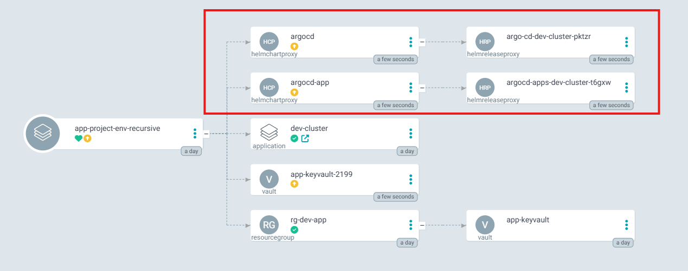
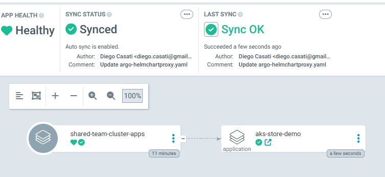
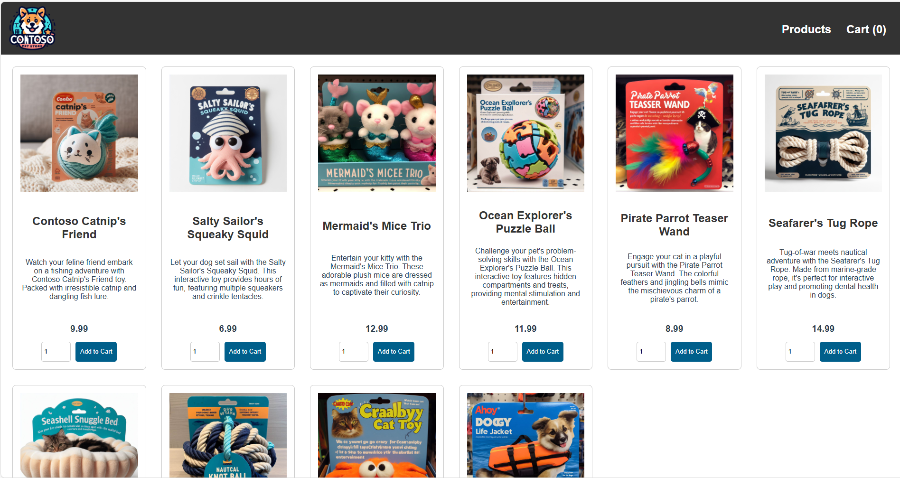

# Build a GitOps-Driven Platform on AKS with the App of Apps Pattern

This hands-on lab builds on the previous module, [Platform Engineering on AKS with GitOps, CAPZ, and ASO](./aks-capz-aso.md), where you learned:

* Key tools and foundational concepts in platform engineering
* How to build a control plane AKS cluster using Azure CLI
* How to use CAPZ and ASO to provision infrastructure and Kubernetes clusters

In this module, you'll take those concepts further by implementing a modern, production-grade platform engineering environment on Azure Kubernetes Service (AKS). You'll use **GitOps** to manage both infrastructure and application lifecycles declaratively via Argo CD, enabling a fully automated and auditable workflow.

---

## Objectives

* Bootstrap GitOps with Argo CD using the App of Apps pattern and ApplicationSets
* Deploy application environments across both existing and newly provisioned AKS clusters

---

## Core Concepts

### App of Apps Pattern

The **App of Apps** pattern in Argo CD is critical for scalable platform operations. It allows you to declaratively manage complex environments using a *parent application* that orchestrates multiple *child applications*, each responsible for a specific platform or workload layer.

**Why adopt this pattern?**

* Centralizes control without creating monolithic repositories
* Enables modular, reusable GitOps pipelines with clear environment boundaries
* Simplifies team onboarding and environment provisioning
* Improves governance and consistency across clusters
* Enforces a clean separation of concerns between platform and application teams

### GitOps Bridge

The [**GitOps Bridge**](https://github.com/gitops-bridge-dev/gitops-bridge?tab=readme-ov-file) is a design pattern that links **infrastructure provisioning** (e.g., AKS clusters via CAPZ or ASO) with **application delivery workflows** (e.g., Argo CD).

It ensures that once infrastructure is provisioned, GitOps agents like Argo CD are automatically bootstrapped and begin synchronizing workloads from Git repositories.

**Benefits:**

* Automates the transition from infrastructure to workload readiness
* Establishes Git as the single source of truth for Day-1 and Day-2 operations
* Enables repeatable, scalable platform rollouts

---

## Prerequisites

This lab builds on the [Platform Engineering lab using AKS, GitOps, CAPZ, and ASOv2](./aks-capz-aso.md). Before proceeding:

1. Complete that module.
2. Load the required environment variables:

```bash
source ~/aks-labs/platform-engineering/aks-capz-aso/.envrc
export KUBECONFIG=~/aks-labs/platform-engineering/aks-capz-aso/aks-labs.config 
```

3. Create a directory to store the artifacts for this lab:

```bash
mkdir -p ~/aks-labs/platform-engineering/app-of-apps
cd ~/aks-labs/platform-engineering/app-of-apps
```

---
## Management Cluster Add-Ons

Next, we will create an **Argo CD Cluster Secret** that defines how Argo CD interacts with the `Management Cluster` (the control plane cluster you’ve bootstrapped on the [Platform Engineering on AKS with GitOps, CAPZ, and ASO](./aks-capz-aso.md) lab). It also provides metadata and flags used by **ApplicationSets** and **GitOps automation controllers** to selectively deploy platform add-ons.

The bootstrapping process leverages the [**Building a Platform Engineering Environment on Azure Kubernetes Service (AKS)** repository](https://github.com/Azure-Samples/aks-platform-engineering#).

* This repository provides pre-defined GitOps configurations and Argo CD Applications.
* Specifically, Argo CD is configured to install applications from the `gitops/bootstrap/control-plane/addons` directory in this repository, automating the installation of core platform components such as Argo CD itself, Kargo, and others.

### Key Purposes of the Argo CD Cluster Secret

1. **Registers the Management Cluster with Argo CD**

   * `argocd.argoproj.io/secret-type: cluster` tells Argo CD that this secret defines a Kubernetes cluster connection.
   * Even though this is the *in-cluster* connection (`server: https://kubernetes.default.svc`), explicitly registering it allows Argo CD to associate metadata and configuration with the cluster.

2. **Bootstraps the Management Cluster with Platform Add-Ons**

   * The `enable_*` labels act as deployment toggles, controlling which platform components Argo CD should deploy to this cluster.

   * Examples:

     * `enable_kargo: "true"` → Argo CD will deploy Kargo (used for container image promotions).
     * `enable_cert_manager: "false"` → Argo CD will skip deploying cert-manager.
     * `enable_argocd: "true"` → Ensures Argo CD’s own management components remain installed.

3. **Allows ApplicationSets to Filter and Target Clusters Dynamically**

   * These labels and annotations are used by Argo CD’s `ApplicationSet` generators to dynamically select which clusters receive specific add-ons.

    Example:

      ```yaml
      generators:
        - clusters:
            selector:
              matchLabels:
                enable_kargo: "true"
      ```

     This ensures only clusters that explicitly enable Kargo will have it deployed.

4. **Why Bootstrap the Management Cluster?**

   * The Management Cluster acts as the **central control plane** for your platform:

     * Hosts Argo CD and GitOps automation tooling.
     * Manages cluster lifecycle using CAPZ.
     * Manages Azure resources via ASOv2.
   * Bootstrapping ensures that essential platform engineering tools are deployed **before** any workload or development clusters are created.
   * This cluster remains focused on **platform operations**, while other clusters are dedicated to running application workloads.

---

### Summary

| Field                 | Purpose                                                   |
| --------------------- | --------------------------------------------------------- |
| `enable_argocd`       | Deploy or manage Argo CD components                       |
| `enable_cert_manager` | Deploy cert-manager if `true`                             |
| `enable_kargo`        | Deploy Kargo for GitOps promotions                        |
| `environment`         | Labels the environment type (e.g., control-plane)         |
| Annotations           | Used by ApplicationSets for repository and path targeting |

This makes the entire GitOps process **dynamic and declarative**. By adjusting these flags, you can control what each cluster receives—without modifying the underlying ApplicationSet definitions. Bootstrap automation, repository structure, and Argo CD ApplicationSets work together to provide a scalable and repeatable platform delivery model.

The following applications will be installed to the cluster:

| Application Name                       | Purpose                                                           |
| -------------------------------------- | ----------------------------------------------------------------- |
| `cluster-addons`                       | Deploys shared platform components (e.g., networking, monitoring) |
| `addon-aks-labs-gitops-argo-cd`        | Installs and manages Argo CD                                      |
| `addon-aks-labs-gitops-argo-events`    | Installs Argo Events for webhook/schedule-based automation        |
| `addon-aks-labs-gitops-argo-rollouts`  | Installs progressive delivery tools like canary/blue-green        |
| `addon-aks-labs-gitops-argo-workflows` | Installs CI/CD pipelines via Argo Workflows                       |
| `addon-aks-labs-gitops-cert-manager`   | Installs cert-manager for TLS cert automation                     |
| `addon-aks-labs-gitops-kargo`          | Installs Kargo for image promotion workflows                      |

:::info
Since we have already installed `cert-manager` on the [Platform Engineering on AKS with GitOps, CAPZ, and ASO](./aks-capz-aso.md) lab, we will skip that installation here by changing the `enable_cert_manager` to `false`
:::

### Configure Environment Variables

Lets start by creating some environment variables that will be used in the Argo CD secret:

```bash
cd ~/aks-labs/platform-engineering/app-of-apps
cat <<EOF > gitops.env
export GITOPS_ADDONS_ORG="https://github.com/Azure-Samples"
export GITOPS_ADDONS_REPO="aks-platform-engineering"
export GITOPS_ADDONS_BASEPATH="gitops/"
export GITOPS_ADDONS_PATH="bootstrap/control-plane/addons"
export GITOPS_ADDONS_REVISION="main"
EOF
```

Load these environment variables:

```bash
source gitops.env
```

**Variable reference:**

| Variable                 | Description                                          |
| ------------------------ | ---------------------------------------------------- |
| `GITOPS_ADDONS_ORG`      | GitHub user/org URL                                  |
| `GITOPS_ADDONS_REPO`     | Repository name                                      |
| `GITOPS_ADDONS_BASEPATH` | Base directory in the repo for GitOps content        |
| `GITOPS_ADDONS_PATH`     | Full path to add-ons directory                       |
| `GITOPS_ADDONS_REVISION` | Git branch or revision to sync (e.g., `main`, `dev`) |

---

## Bootstrapping the Add-Ons

### Step 1: Create the Argo CD Cluster Secret

```bash
cat <<EOF > aks-labs-gitops.yaml
apiVersion: v1
kind: Secret
metadata:
  name: aks-labs-gitops
  namespace: argocd
  labels:
    argocd.argoproj.io/secret-type: cluster
    akuity.io/argo-cd-cluster-name: ${AKS_CLUSTER_NAME}
    enable_argocd: "true"
    enable_cert_manager: "false"
    enable_kargo: "true"
    environment: control-plane
    kargo_chart_version: "1.8.3"
  annotations:
    addons_repo_url: "${GITOPS_ADDONS_ORG}/${GITOPS_ADDONS_REPO}"
    addons_repo_basepath: "${GITOPS_ADDONS_BASEPATH}"
    addons_repo_path: "${GITOPS_ADDONS_PATH}"
    addons_repo_revision: "${GITOPS_ADDONS_REVISION}"
    cluster_name: ${AKS_CLUSTER_NAME}
    infrastructure_provider: capz
    akspe_identity_id: "${AZURE_CLIENT_ID}"
    tenant_id: "${AZURE_TENANT_ID}"
    subscription_id: "${AZURE_SUBSCRIPTION_ID}"
type: Opaque
stringData:
  name: aks-labs-gitops
  server: https://kubernetes.default.svc
  config: |
    {
      "tlsClientConfig": {
        "insecure": false
      }
    }
EOF
```

```bash
kubectl apply -f aks-labs-gitops.yaml
```

### Step 2: Apply the ApplicationSet to Bootstrap Add-Ons

```bash
cat <<EOF > bootstrap-addons.yaml
apiVersion: argoproj.io/v1alpha1
kind: ApplicationSet
metadata:
  name: cluster-addons
  namespace: argocd
spec:
  syncPolicy:
    preserveResourcesOnDeletion: true
  generators:
    - clusters:
        selector:
          matchExpressions:
            - key: akuity.io/argo-cd-cluster-name
              operator: NotIn
              values: [in-cluster]
  template:
    metadata:
      name: cluster-addons
    spec:
      project: default
      source:
        repoURL: '{{metadata.annotations.addons_repo_url}}'
        path: '{{metadata.annotations.addons_repo_basepath}}{{metadata.annotations.addons_repo_path}}'
        targetRevision: '{{metadata.annotations.addons_repo_revision}}'
        directory:
          recurse: true
          exclude: exclude/*
      destination:
        namespace: argocd
        name: '{{name}}'
      syncPolicy:
        automated: {}
EOF
```

```bash
kubectl apply -f bootstrap-addons.yaml
```

You can now connect to the Argo CD instance in the `Management Cluster` and verify that the new apps were added:

1. Retrieve the Argo CD UI secret

```bash
kubectl get secrets argocd-initial-admin-secret -n argocd --template="{{index .data.password | base64decode}}" ; echo
```

2. Create the port forward to the Argo CD service

```bash
kubectl port-forward svc/argocd-server -n argocd 8080:443
```

3. Open your browser at: [https://localhost:8080/](https://localhost:8080/)


This implements the **App of Apps** pattern by using a parent (an _Argo CD ApplicationSet_) to dynamically generate and manage multiple _child Argo CD Applications_ based on cluster metadata. The parent application references the Git repository and controls which add-ons are installed by reading labels and annotations defined in this secret. 

This creates a modular, scalable, and declarative way to manage both platform and workload environments through GitOps.

---

### Sample 1: Expanding our AKS Cluster with the App of Apps Pattern

Now that we have seen how to deploy a cluster using the App of Apps pattern, let's try a more complex scenario. In this example, you'll create a new resource, the HelmProxyChart, that will be attached to the cluster created earlier on [Platform Engineering on AKS with GitOps, CAPZ, and ASO](./aks-capz-aso.md) lab.

Using your GitHub repo created on the [Platform Engineering on AKS with GitOps, CAPZ, and ASO](./aks-capz-aso.md#setting-up-your-dev-environment) lab, let's expand our Sample-1 AKS Cluster. We will also create a new Application and deploy that to our dev cluster.

At the end, you will have built this:


:::important
Before you proceed, verify that you are running these commands from your local GitHub repo. If you have started this lab at the `$HOME` directory of your user, that should be at `~/aks-labs/platform-engineering/aks-capz-aso/app-project-env`. If not, look at where you have cloned the `app-project-env` directory.
::::

#### Adding the HelmChartProxy and AKS Store Application

1. Go back to the `~/aks-labs/platform-engineering/aks-capz-aso/app-project-env` directory:

```bash
cd ~/aks-labs/platform-engineering/aks-capz-aso/app-project-env
```

**Important: Label the Dev Cluster for HelmChartProxy Discovery**

Before creating the HelmChartProxy, you must label your dev cluster so that the HelmChartProxy can discover and target it. The HelmChartProxy uses a `clusterSelector` with label matching to find clusters.

```bash
kubectl label cluster dev-cluster deploy-argocd="true"
```

This label must match the `clusterSelector.matchLabels` in the HelmChartProxy spec (see step 2 below). Additionally, **the HelmChartProxy must be created in the same namespace as your clusters** (typically the `default` namespace where clusters are registered). Before we can continue, we need to retrieve the GITHUB_USERNAME for the `app-project-env` repository:

```bash
 export GITHUB_USERNAME=$(gh api user --jq .login) # Retrieves the GitHub username
```

2. Create the `HelmChartProxy`:

```bash
cat <<EOF> samples/sample-1/argo-helmchartproxy.yaml
apiVersion: addons.cluster.x-k8s.io/v1alpha1
kind: HelmChartProxy
metadata:
  name: argocd
  namespace: default
spec:
  clusterSelector:
    matchLabels:
      deploy-argocd: "true"
  repoURL: https://argoproj.github.io/argo-helm
  chartName: argo-cd
  releaseName: argocd
  namespace: argocd
  options:
    waitForJobs: true
    wait: true
    timeout: 5m
    install:
      createNamespace: true
---
apiVersion: addons.cluster.x-k8s.io/v1alpha1
kind: HelmChartProxy
metadata:
  name: argocd-app
  namespace: default
spec:
  clusterSelector:
    matchLabels:
      deploy-argocd: "true"
  repoURL: https://argoproj.github.io/argo-helm
  chartName: argocd-apps
  releaseName: argocd-apps
  namespace: argocd
  options:
    waitForJobs: true
    wait: true
    timeout: 5m
    install:
      createNamespace: true
  valuesTemplate: |
    applications:
      shared-team-cluster-apps:
        namespace: argocd
        finalizers:
          - resources-finalizer.argocd.argoproj.io
        project: default
        sources:
          - repoURL: https://github.com/${GITHUB_USERNAME}/app-project-env.git
            path: argocd-apps
            targetRevision: HEAD
            directory:
              recurse: true
              exclude: namespaces/**
        destination:
          server: https://kubernetes.default.svc
          namespace: argocd
      cluster-namespaces:
        namespace: argocd
        project: default
        source:
          repoURL: https://github.com/${GITHUB_USERNAME}/app-project-env.git
          path: argocd-apps/namespaces
          targetRevision: HEAD
        destination:
          server: https://kubernetes.default.svc
          namespace: default
        syncPolicy:
          automated:
            prune: true
            selfHeal: true
        syncOptions:
          - CreateNamespace=true
EOF
```

3. Create an ArgoCD Application directory:

```bash
mkdir -p argocd-apps/{aks-store,namespaces}
```

4. Create the ArgoCD namespace

```bash
cat <<EOF> argocd-apps/namespaces/namespaces.yaml
apiVersion: v1
kind: Namespace
metadata:
  name: pets
EOF
```

5. Create the ArgoCD Application for the namespaces

```bash
cat <<EOF> argocd-apps/namespaces/cluster-namespaces-app.yaml
apiVersion: argoproj.io/v1alpha1
kind: Application
metadata:
  name: cluster-namespaces
  namespace: argocd
spec:
  project: default
  source:
    repoURL: https://github.com/${GITHUB_USERNAME}/app-project-env.git
    targetRevision: HEAD
    path: argocd-apps/namespaces
  destination:
    server: https://kubernetes.default.svc
    namespace: default
  syncPolicy:
    automated:
      prune: true
      selfHeal: true
  syncOptions:
    - CreateNamespace=true
EOF
```

6. Create an ArgoCD Application to be deployed to our Dev cluster:

```bash
cat <<EOF> argocd-apps/aks-store/aks-store-argocd-app.yaml
apiVersion: argoproj.io/v1alpha1
kind: Application
metadata:
  name: aks-store-demo
  namespace: argocd
spec:
  project: default
  source:
    repoURL: https://github.com/Azure-Samples/aks-store-demo.git
    targetRevision: HEAD
    path: kustomize/overlays/dev
  destination:
    server: https://kubernetes.default.svc
    namespace: pets
  syncPolicy:
    automated:
      prune: true
      selfHeal: true
  syncOptions:
    - CreateNamespace=true
EOF
```

7. Commit the files to GitHub

```bash
git add .
git commit -m 'Sample-1: Expanding our AKS Cluster with the App of Apps Pattern'
```

Expect:

```bash
[main 5b8f70c] Sample-1: Expanding our AKS Cluster with the App of Apps Pattern
 4 files changed, 110 insertions(+)
 create mode 100644 argocd-apps/aks-store/aks-store-argocd-app.yaml
 create mode 100644 github-app-project-argo-cd-app.yaml
 create mode 100644 rg-dev-app-aso-credentials.yaml
 create mode 100644 samples/sample-1/argo-helmchartproxy.yaml
```

8. Push them to GitHub

```bash
git push
```

Expect:

```bash
Enumerating objects: 13, done.
Counting objects: 100% (13/13), done.
Delta compression using up to 12 threads
Compressing objects: 100% (9/9), done.
Writing objects: 10/10, 1.96 KiB | 501.00 KiB/s, done.
Total 10 (delta 0), reused 0 (delta 0)
To github.com:dcasati/app-project-env.git
   3adefb8..5b8f70c  main -> main
```

#### Verifying ArgoCD Deployment and Self-Healing

After pushing to GitHub, the HelmChartProxy controller will detect your changes and deploy Argo CD to the dev cluster. This process includes:

1. **HelmChartProxy finds the dev cluster** using the `deploy-argocd: "true"` label
2. **Deploys Argo CD** via the `argo-cd` Helm chart to the `argocd` namespace
3. **Creates Argo CD Applications** via the `argocd-apps` Helm chart, which includes:
   - `cluster-namespaces`: Creates the `pets` namespace
   - `shared-team-cluster-apps`: Parent application that discovers child apps from Git
   - `aks-store-demo`: Deploys aks-store to the `pets` namespace

---

In the `Management Cluster`, you should now see the new `HelmChartProxy` objects. The `HelmChartProxy` will deploy `Argo CD` _and_ the `AKS-Store` demo directly to the `Dev Cluster`:



Now, assuming the role of the Dev Lead, you should be able to connect to the Dev Cluster and see the new application deployed to that cluster. 

:::tip
**Tracking Multiple Clusters**

Since you're switching between the `Dev Lead` and `Platform Engineer` roles, it's easy to lose track of which cluster you're currently working with. To avoid accidental operations on the wrong cluster, add your current Kubernetes context to your bash prompt.

Add this to the bottom of your `~/.bashrc` file:

```bash
# Add kubectl current context to prompt
export PS1='\[\033[01;34m\]\w\[\033[00m\] \[\033[01;36m\][$(kubectl config current-context 2>/dev/null || echo "no-cluster")]\[\033[00m\]\n\$ '
```

Then reload your shell:

```bash
source ~/.bashrc
```

Your prompt will now display the current cluster name, like this:

```bash
~/aks-labs/platform-engineering/aks-capz-aso [aks-labs]
```
:::

#### Accessing the Dev Cluster

1. Switch to the `app-of-apps` directory:

```bash
cd ~/aks-labs/platform-engineering/app-of-apps
```

2. Create a `.envrc` file to manage the dev cluster context. This separates your dev cluster configuration from the management cluster:

```bash
cp ~/aks-labs/platform-engineering/aks-capz-aso/dev-cluster.config .envrc
echo export KUBECONFIG=${HOME}/aks-labs/platform-engineering/app-of-apps/dev-cluster.config >> .envrc
source .envrc
```

Your `.envrc` file should now contain:

```bash
export DEV_CLUSTER_NAME=dev-cluster
export DEV_CLUSTER_LOCATION=eastus
export CHART_REVISION="0.4.3"
export KUBERNETES_VERSION="1.32.7"
export KUBECONFIG=${HOME}/aks-labs/platform-engineering/app-of-apps/dev-cluster.config
```

3. Get the credentials for the Dev Cluster:

```bash
az aks get-credentials -n ${DEV_CLUSTER_NAME} -g ${DEV_CLUSTER_NAME} --file dev-cluster.config
```

4. Your prompt should now show that you are using the `[dev-cluster]`. If that is not the case, reload your `.envrc` file with `source .envrc` and your prompt should look like this:

```bash
~/aks-labs/platform-engineering/app-of-apps [dev-cluster]
```

5. Retrieve the Argo CD admin password:

```bash
kubectl get secrets argocd-initial-admin-secret -n argocd --template="{{index .data.password | base64decode}}" ; echo
```

6. Create a port-forward to access Argo CD:

```bash
kubectl port-forward svc/argocd-server -n argocd 18080:443
```

7. Open your browser and navigate to **https://localhost:18080/**. Log in with username `admin` and the password from step 5.

You should see Argo CD running with the deployed applications:


You should also see the AKS Store application deployed to the `pets` namespace:



#### Accessing the AKS Store Application

8. Retrieve the public IP of the AKS Store LoadBalancer service:

```bash
kubectl get svc -n pets store-front
```

9. Open your browser and navigate to the public IP address. You should see the AKS Store frontend:



## Next Steps

If you’re familiar with Infrastructure as Code tools like **Terraform**, explore how you can streamline your Azure resource management by converting existing resources into ASO manifests using the [`asoctl`](https://azure.github.io/azure-service-operator/tools/) tool.

* [Learn more about `asoctl` here](https://azure.github.io/azure-service-operator/tools/)
* [Download `asoctl` directly from GitHub](https://github.com/Azure/azure-service-operator/releases/tag/v2.13.0)

To learn how to extend your platform engineering capabilities even further by using **Kube Resource Orchestrator (kro)** for advanced resource composition and automation take a look at the [Expanding the platform capabilities with Kube Resource Orchestrator (kro)](./using-kro.md) lab.

---

## Summary

In this module, you:

- Applied the **App of Apps** and **GitOps Bridge** patterns for scalable platform operations.
- Bootstrapped a **GitOps** management plane using Argo CD and **ApplicationSets**.
- Provisioned AKS clusters declaratively with **CAPZ**.
- Deployed workloads to managed clusters via GitOps.

---

## Troubleshooting Guide

### HelmChartProxy not finding clusters

**Symptom**: HelmReleaseProxy shows "No matching clusters" or remains in `Ready: False` state.

**Causes & Solutions**:

1. **Cluster label missing**: The HelmChartProxy uses `clusterSelector.matchLabels` to find clusters. Verify your cluster has the required label:
   ```bash
   kubectl get cluster dev-cluster -o jsonpath='{.metadata.labels}'
   # Should show: deploy-argocd: "true"
   ```

   If missing, add it:
   ```bash
   kubectl label cluster dev-cluster deploy-argocd="true"
   ```

2. **HelmChartProxy in wrong namespace**: The HelmChartProxy must be in the same namespace as the clusters it's trying to target (typically `default`). Verify:
   ```bash
   kubectl get helmchartproxy -A
   # Should show HelmChartProxy in the same namespace as your clusters
   ```

3. **Addon provider not installed**: The HelmChartProxy CRD is provided by the CAPI Addon Provider (Helm). Verify it's installed:
   ```bash
   kubectl get crd helmchartproxies.addons.cluster.x-k8s.io
   ```

### Argo CD CRD Ownership Conflicts

**Symptom**: HelmReleaseProxy shows error: `meta.helm.sh/release-namespace must equal "argocd": current value is "default"`

**Cause**: This occurs when moving an Argo CD installation from one namespace to another. Old CRD annotations claim a different namespace as the owner.

**Solution**: Clean the Helm annotations from affected CRDs on the target cluster:

```bash
# On the dev cluster
kubectl annotate crd applications.argoproj.io \
  helm.sh/resource-policy- \
  meta.helm.sh/release-name- \
  meta.helm.sh/release-namespace- \
  --overwrite

# Delete any stuck HelmReleaseProxy resources
kubectl delete helmreleaseproxy -n default --all
```

Then trigger the HelmChartProxy to retry:
```bash
# On management cluster
kubectl patch helmchartproxy argocd -n default --type merge \
  -p '{"spec":{"releaseName":"argocd"}}'
```

### Applications not syncing to correct namespace

**Symptom**: Applications deployed to `default` namespace instead of target namespace (e.g., `pets`).

**Cause**: The Application's `destination.namespace` field might not match the HelmChartProxy's `namespace` field.

**Solution**: Ensure the Application definition has the correct namespace:

```yaml
spec:
  destination:
    server: https://kubernetes.default.svc
    namespace: pets  # This must match your target namespace
```

### CreateNamespace=true not working

**Symptom**: Application stays in "Missing" state because destination namespace doesn't exist.

**Cause**: When an Application is created before its destination namespace exists, there can be timing issues with automatic namespace creation.

**Solution**: Use the namespace management pattern by creating a dedicated `cluster-namespaces` Application that runs first:

1. Create `argocd-apps/namespaces/namespaces.yaml` with all required namespaces
2. Create `cluster-namespaces` Application that syncs those namespaces
3. Ensure other applications sync AFTER namespace creation completes

This eliminates race conditions and provides explicit namespace management as code.
